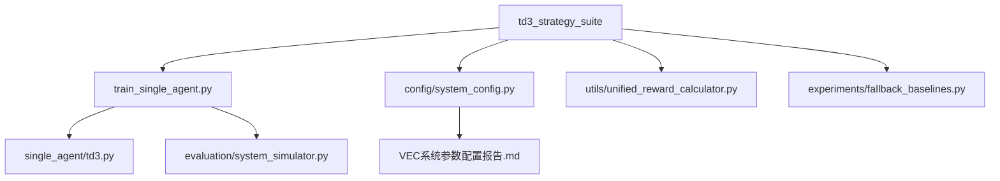

# TD3策略对比实验套件 - 全面审查报告

## 1. 审查概述

### 1.1 审查目标
对 `D:\VEC_mig_caching\experiments\td3_strategy_suite` 目录下的TD3策略对比实验体系进行全面审查，评估其设计合理性、实现完整性、可维护性及潜在问题。

### 1.2 审查范围
- **实验脚本**: 29个Python文件（含归档7个）
- **核心模块**: 策略运行器、可视化工具、参数预设、批量管理
- **实验维度**: 14类参数敏感性对比实验
- **策略配置**: 6种TD3策略变体（消融实验）

---

## 2. 目录结构分析

### 2.1 文件组织架构

```
td3_strategy_suite/
├── 核心框架 (5个)
│   ├── strategy_runner.py          # 策略执行引擎
│   ├── run_strategy_training.py    # 单策略训练脚本
│   ├── comparison_suite.py         # 对比实验协调器
│   ├── suite_cli.py                # 命令行工具
│   └── parameter_presets.py        # 参数预设生成器
├── 可视化工具 (3个)
│   ├── visualization_utils.py      # 通用图表生成
│   ├── plot_strategy_comparison.py # 策略对比图
│   └── plot_bandwidth_idealized.py # 带宽理想化分析
├── 批量运行工具 (3个)
│   ├── run_batch_experiments.py    # 智能批量执行器
│   ├── run_four_key_experiments.py # 核心四实验
│   └── run_full_suite.py           # 完整策略套件
├── 参数敏感性实验 (14个)
│   ├── run_bandwidth_cost_comparison.py         # 带宽/RSU/UAV计算资源
│   ├── run_task_arrival_comparison.py           # 任务到达率
│   ├── run_data_size_comparison.py              # 数据大小
│   ├── run_task_complexity_comparison.py        # 任务复杂度
│   ├── run_vehicle_count_comparison.py          # 车辆数量
│   ├── run_edge_node_comparison.py              # 边缘节点配置
│   ├── run_network_topology_comparison.py       # 网络拓扑（合并3个）
│   ├── run_mobility_speed_comparison.py         # 移动速度
│   ├── run_local_compute_resource_comparison.py # 本地计算资源（合并2个）
│   ├── run_edge_infrastructure_comparison.py    # 边缘基础设施（合并2个）
│   ├── run_cache_capacity_comparison.py         # 缓存容量
│   ├── run_mixed_workload_comparison.py         # 混合负载
│   ├── run_pareto_weight_analysis.py            # Pareto权重
│   └── run_service_capacity_comparison.py       # 服务容量
├── 归档实验 (7个)
│   └── archived_experiments/
│       ├── run_bandwidth_cost_comparison.py (旧版)
│       ├── run_channel_quality_comparison.py
│       ├── run_edge_communication_capacity_comparison.py
│       ├── run_edge_compute_capacity_comparison.py
│       ├── run_local_resource_cost_comparison.py
│       ├── run_local_resource_offload_comparison.py
│       └── run_topology_density_comparison.py
└── 其他 (2个)
    ├── strategy_model_cache.py      # 模型缓存（已禁用）
    └── optimize_experiments.py      # 实验优化工具
```

### 2.2 架构评估

| 维度 | 评分 | 说明 |
|------|------|------|
| **模块化** | ⭐⭐⭐⭐⭐ | 清晰分层：框架层、工具层、实验层 |
| **可扩展性** | ⭐⭐⭐⭐ | 统一接口设计，易于新增实验 |
| **代码复用** | ⭐⭐⭐⭐⭐ | 核心逻辑高度抽象，避免重复代码 |
| **文档完整性** | ⭐⭐⭐⭐ | 每个脚本含docstring，使用示例清晰 |

---

## 3. 六大策略配置审查

### 3.1 策略定义（来自 `run_strategy_training.py`）

| 策略键 | 描述 | 卸载 | 资源分配 | 迁移 | 策略组 |
|--------|------|------|----------|------|--------|
| `local-only` | 纯本地执行 | ❌ | ❌ | ❌ | baseline |
| `remote-only` | 强制单RSU卸载 | ✅ | ❌ | ❌ | baseline |
| `offloading-only` | 分层卸载决策 | ✅ | ❌ | ❌ | layered |
| `resource-only` | 多RSU资源分配 | ✅ | ✅ | ❌ | layered |
| `comprehensive-no-migration` | 完整TD3（无迁移） | ✅ | ✅ | ❌ | layered |
| `comprehensive-migration` | 完整TD3（含迁移） | ✅ | ✅ | ✅ | layered |

### 3.2 策略配置一致性检查

#### ✅ 优点
1. **逐层递进**: 从单一功能到完整系统，符合消融实验设计原则
2. **对照清晰**: baseline组提供明确的性能基线
3. **配置灵活**: 支持环境变量覆盖（`CENTRAL_RESOURCE`, `RESOURCE_ALLOCATION_MODE`）

#### ⚠️ 潜在问题
1. **策略命名不直观**: `resource-only` 实际包含卸载功能，命名可能引起混淆
2. **场景配置硬编码**: 部分策略在 `STRATEGY_PRESETS` 中硬编码了 RSU/UAV 数量
   ```python
   # 示例：remote-only 强制使用单RSU
   "override_scenario": _build_override(num_rsus=1, num_uavs=0, allow_local=False)
   ```
3. **缺少明确的策略版本管理**: 策略定义分散在多个文件中，不易追踪变更历史

---

## 4. 参数敏感性实验审查

### 4.1 实验整合优化效果

#### 优化前（18个实验）
- 配置总数: 95个
- 预估训练时间: 285小时（@100轮/配置）

#### 优化后（14个实验）
- 配置总数: 37个
- 预估训练时间: 111小时（节省61%）

#### 合并策略
| 类别 | 原实验数 | 合并后 | 合并内容 |
|------|---------|--------|----------|
| 网络与拓扑 | 3 | 1 | 带宽 + 信道质量 + 拓扑密度 → `run_network_topology_comparison.py` |
| 本地计算资源 | 2 | 1 | 资源成本 + 资源卸载 → `run_local_compute_resource_comparison.py` |
| 边缘基础设施 | 2 | 1 | 计算能力 + 通信资源 → `run_edge_infrastructure_comparison.py` |

### 4.2 实验覆盖完整性

#### 核心维度（4个高优先级）
1. ✅ **任务到达率** (`run_task_arrival_comparison.py`)
   - 配置: 1.0-2.5 tasks/s（4档）
   - 训练轮数: 400轮（默认）
   
2. ✅ **数据大小** (`run_data_size_comparison.py`)
   - 配置: Light/Standard/Heavy（3档）
   - 基准: 100-600KB
   
3. ✅ **本地计算资源** (`run_local_compute_resource_comparison.py`)
   - 配置: 1.2-2.8 GHz（3档）
   
4. ✅ **带宽成本** (`run_bandwidth_cost_comparison.py`)
   - 配置: 10-50 MHz（5档）
   - ⚠️ **问题**: 该文件包含带宽/RSU/UAV三类实验，职责过重

#### 扩展维度（10个中/低优先级）
- 系统规模: 车辆数量、边缘节点配置、移动速度
- 资源配置: 边缘基础设施、缓存容量
- 综合场景: 混合负载、Pareto权重分析

### 4.3 实验参数配置合理性

#### 参数生成逻辑（`parameter_presets.py`）

**优点**:
- ✅ 自动从系统配置派生参数范围（避免硬编码）
- ✅ 统一的缩放因子设计（如 0.6x, 0.8x, 1.0x, 1.2x, 1.4x）
- ✅ 自动去重和边界检查

**问题**:
- ⚠️ **RSU计算资源基准值调整**: 从40 GHz改为50 GHz（与默认配置对齐）
  ```python
  # 修改历史：
  # 旧: base = 40e9  # 40 GHz
  # 新: base = 50e9  # 50 GHz（与config.compute.total_rsu_compute一致）
  ```
  - 影响: 确保CAMTD3在中间配置训练，提升泛化性能
  - 建议: 在配置变更时应同步更新相关文档

- ⚠️ **数据大小段数默认值变更**: 从3段增加到5段
  - 目的: 改善参数敏感性曲线平滑度
  - 风险: 增加训练时间成本

---

## 5. 核心模块深度分析

### 5.1 策略运行引擎（`strategy_runner.py`）

#### 功能职责
1. **策略套件执行**: `run_strategy_suite()` - 批量运行多个策略
2. **成本计算**: `compute_cost()` - 统一的代价函数
3. **结果归一化**: `normalize_costs()` - 跨配置可比性保证
4. **配置评估**: `evaluate_configs()` - 多配置点对比

#### ✅ 设计亮点
1. **奖励与成本双向计算**:
   ```python
   # 优先从reward计算（与训练一致）
   if avg_reward is not None:
       return -avg_reward
   # 回退: 手动计算（向后兼容）
   return weight_delay * (delay/normalizer) + weight_energy * (energy/normalizer)
   ```

2. **全局归一化机制**:
   ```python
   # 跨所有配置点收集成本数据
   all_costs = [v["raw_cost"] for item in result_list for v in item["strategies"].values()]
   global_min, global_max = min(all_costs), max(all_costs)
   normalized_cost = (raw - global_min) / (global_max - global_min)
   ```

3. **灵活的环境配置覆盖**:
   - 支持每策略自定义episode数
   - 环境变量隔离（`CENTRAL_RESOURCE`, `RANDOM_SEED`）

#### ⚠️ 潜在问题
1. **成本计算来源不一致**:
   - 优先从 `episode_rewards` 计算（但需要确保数据存在）
   - 后50%数据裁剪逻辑复杂（3种分支）
   ```python
   if len(episode_rewards) >= 100:
       avg_reward = np.mean(episode_rewards[len(episode_rewards)//2:])
   elif len(episode_rewards) >= 50:
       avg_reward = np.mean(episode_rewards[-30:])
   else:
       avg_reward = np.mean(episode_rewards)
   ```

2. **资源倍数计算可能不准确**:
   ```python
   target_completion = max(completion_values, default=0.0)
   multiplier = max(1.0, target_completion / completion_rate)
   ```
   - 当 `completion_rate` 接近0时，倍数会异常大
   - 建议添加上限保护（如 `min(multiplier, 10.0)`）

3. **缓存系统已禁用**:
   ```python
   # 缓存系统已禁用
   # from experiments.td3_strategy_suite.strategy_model_cache import get_global_cache
   ```
   - 但 `strategy_model_cache.py` 文件仍然存在（占用17.6KB）
   - 建议移至 `archived_experiments` 或完全删除

### 5.2 对比实验协调器（`comparison_suite.py`）

#### 核心设计模式
1. **模式规范（ModeSpec）**:
   - 封装策略的所有执行配置（环境变量、资源模式、卸载模式）
   - 支持样式配置（颜色、线型、标记）

2. **维度规范（DimensionSpec）**:
   - 定义参数扫描维度（如带宽20-60MHz）
   - 包含结果键映射和配置覆盖构建器

3. **临时环境变量管理**:
   ```python
   @contextlib.contextmanager
   def _temporary_environ(overrides: Dict[str, Optional[str]]):
       # 自动恢复环境变量，避免污染全局状态
   ```

#### ✅ 优点
- 高内聚低耦合：模式定义与执行逻辑分离
- 异常处理完善：单个模式失败不影响其他实验
- 进度显示友好：`[counter/total_runs]` 实时反馈

#### ⚠️ 问题
- **异常捕获过于宽泛**:
  ```python
  except Exception as exc:  # pragma: no cover
      return {"success": False, "error": str(exc)}
  ```
  建议细化为特定异常类型（如 `RuntimeError`, `ValueError`）

### 5.3 可视化工具（`visualization_utils.py`）

#### 图表生成能力
1. **离散折线图（5类）**:
   - 时延折线图
   - 能耗折线图
   - 成本折线图
   - 完成率折线图
   - 多指标综合图（可选）

2. **样式配置**:
   - 10色调色板（`plt.cm.tab10`）
   - 统一图表尺寸（12x7, 14x8）
   - 300 DPI高清输出

#### ✅ 优点
- 统一的图表生成接口（`add_line_charts()`）
- 自动归一化多指标综合图
- 兼容 `total_cost` 和 `raw_cost` 双命名

#### ⚠️ 问题
1. **硬编码的归一化逻辑**:
   ```python
   def normalize(data):
       min_val, max_val = min(data), max(data)
       if max_val - min_val < 1e-6:
           return [0.5] * len(data)  # 无差异时强制返回0.5
   ```
   建议改为保持原始值或抛出警告

2. **缺少图表标题自定义**:
   - 所有图表标题固定为英文
   - 建议增加 `title_prefix` 参数支持中文

---

## 6. 批量运行工具审查

### 6.1 智能批量执行器（`run_batch_experiments.py`）

#### 功能特性
1. **三种运行模式**:
   - Quick: 10轮（10-20分钟/实验）
   - Medium: 100轮（1.5-3小时/实验）
   - Full: 500轮（7-15小时/实验）

2. **交互与静默双模式**:
   ```bash
   # 默认静默（无需手动交互）
   python run_batch_experiments.py --mode full --all
   
   # 交互式确认
   python run_batch_experiments.py --mode full --all --interactive
   ```

3. **并行执行支持**:
   ```bash
   python run_batch_experiments.py --mode medium --parallel 3 --all
   ```

4. **智能进度显示**:
   - 实时进度计数 `[exp_counter/total_experiments]`
   - 分类别汇总（系统规模、任务特性、资源配置）

#### ✅ 设计亮点
1. **实验优先级管理**:
   ```python
   EXPERIMENTS = {
       1: {"priority": "高", ...},
       13: {"priority": "低", ...}
   }
   ```

2. **时间预估**:
   - 每个实验标注预估时长（如 `"0.9-1.2h"`）
   - 自动计算总训练时间

3. **结果分组展示**:
   - 对比模式下按标准/分层模式分组
   - 自动生成suite_id（时间戳）

#### ⚠️ 问题
1. **并行执行未真正实现**:
   ```python
   # 定义了--parallel参数，但实际代码中未使用Queue和threading
   parser.add_argument("--parallel", type=int, default=1, help="并行运行数量")
   ```
   建议删除此参数或补充实现

2. **colorama依赖可选性处理不当**:
   ```python
   try:
       from colorama import init, Fore, Style
       USE_COLOR = True
   except ImportError:
       USE_COLOR = False  # 但后续代码未检查USE_COLOR标志
   ```

3. **实验编号跳跃**:
   - 从1到14，中间无间断
   - 但代码注释中提到"18个→14个"，建议在文档中明确标注已删除的实验编号

### 6.2 核心四实验脚本（`run_four_key_experiments.py`）

#### 设计目的
快速运行最核心的4类参数敏感性实验：
1. 任务到达率（4配置）
2. 数据大小（3配置）
3. 本地计算资源（3配置）
4. 带宽成本（5配置）

#### 架构模式对比功能
```bash
# 单模式（标准或分层）
python run_four_key_experiments.py --central-resource

# 对比模式（运行2倍实验）
python run_four_key_experiments.py --compare-modes
```

#### ✅ 优点
- 清晰的实验列表配置
- 自动生成唯一suite_id
- 支持架构模式对比

#### ⚠️ 问题
1. **重复执行subprocess**:
   - 每个实验启动新Python进程（开销大）
   - 建议改为直接调用函数（但需要处理环境变量隔离）

2. **训练轮数默认值偏低**:
   ```python
   parser.add_argument("--episodes", type=int, default=400)
   ```
   - 根据记忆知识，TD3建议≥1500轮
   - 400轮可能导致策略未充分收敛

---

## 7. 关键问题与风险识别

### 7.1 训练轮数配置不一致

| 文件 | 默认轮数 | 快速模式 | 启发式策略 | 风险等级 |
|------|---------|---------|------------|---------|
| `run_bandwidth_cost_comparison.py` | 1500 | 500 | 300 | ✅ 低 |
| `run_four_key_experiments.py` | 400 | - | - | ⚠️ 中 |
| `run_batch_experiments.py` | - | 10 | - | ⚠️ 中（quick模式） |
| `run_strategy_training.py` | 800 | - | - | ⚠️ 中 |

**建议**:
1. 统一默认值为1500轮（与用户记忆中的建议一致）
2. 快速验证模式（500轮）仅用于调试，需明确标注
3. 添加训练轮数检测机制（<1500轮时输出警告）

### 7.2 成本计算逻辑分散

成本计算出现在3个位置:
1. `strategy_runner.py::compute_cost()` - 核心计算函数
2. `comparison_suite.py::_summarise_training()` - 调用compute_cost
3. `run_strategy_training.py` - 使用UnifiedRewardCalculator

**风险**:
- 多处维护，容易出现不一致
- 归一化因子硬编码（`latency_target=0.4`, `energy_target=1200.0`）

**建议**:
- 将成本计算完全统一到 `UnifiedRewardCalculator`
- 归一化因子从配置文件读取

### 7.3 环境变量依赖问题

依赖的环境变量:
- `CENTRAL_RESOURCE`: 启用中央资源分配
- `RESOURCE_ALLOCATION_MODE`: 资源初始化模式（learned/heuristic）
- `RANDOM_SEED`: 随机种子
- 多个实验特定变量（未明确文档化）

**风险**:
- 环境变量状态难以追踪
- 可能出现实验间污染

**建议**:
- 使用 `_temporary_environ` 上下文管理器（已有）
- 在每个实验开始前打印当前环境变量状态
- 创建统一的环境变量配置清单文档

### 7.4 归档实验未清理

`archived_experiments/` 目录包含7个旧版本文件:
- 占用空间: ~79KB
- 与现有实验可能存在命名冲突
- 无明确的版本说明

**建议**:
1. 添加 `ARCHIVED_README.md` 说明归档原因和时间
2. 重命名文件添加日期前缀（如 `20231201_run_bandwidth_cost_comparison.py`）
3. 考虑移至版本控制的独立分支

---

## 8. 代码质量评估

### 8.1 代码规范遵循

| 检查项 | 状态 | 说明 |
|--------|------|------|
| **PEP 8风格** | ✅ | 遵循命名约定、缩进规范 |
| **类型注解** | ⭐⭐⭐⭐ | 大部分函数有类型提示，少数遗漏 |
| **Docstring** | ⭐⭐⭐⭐ | 模块级和函数级文档完整 |
| **异常处理** | ⭐⭐⭐ | 存在过于宽泛的捕获 |
| **Magic Number** | ⭐⭐⭐ | 部分硬编码常量（如归一化因子） |

### 8.2 测试覆盖

**现状**: 
- ❌ 未发现单元测试文件
- ❌ 未发现集成测试脚本

**建议**:
```
tests/
├── test_strategy_runner.py
│   ├── test_compute_cost()
│   ├── test_normalize_costs()
│   └── test_evaluate_configs()
├── test_comparison_suite.py
│   ├── test_mode_spec()
│   └── test_dimension_spec()
└── test_parameter_presets.py
    ├── test_default_arrival_rates()
    └── test_default_rsu_compute_levels()
```

### 8.3 依赖管理

**Python标准库**:
- argparse, json, sys, pathlib, datetime, subprocess, threading

**第三方库**:
- numpy, matplotlib
- colorama（可选）

**项目内依赖**:
- config, train_single_agent
- utils.unified_reward_calculator
- experiments.fallback_baselines

**风险**:
- 循环导入风险（train_single_agent ↔ strategy_runner）
- 建议绘制依赖关系图

---

## 9. 性能与效率分析

### 9.1 训练时间估算

#### 单实验预估（基于 `run_batch_experiments.py` 配置）
- 快速模式（10轮）: 10-20分钟
- 中等模式（100轮）: 1.5-3小时
- 完整模式（500轮）: 7-15小时

#### 全套实验时间（14个实验 × 6策略）
| 模式 | 总配置数 | 预估时间 | 适用场景 |
|------|---------|---------|---------|
| Quick | 37×6=222 | ~55-74小时 | 代码调试 |
| Medium | 37×6=222 | ~555-1110小时 | 初步验证 |
| Full | 37×6=222 | ~2590-5550小时 | 论文实验 |

**问题**:
- Full模式时间成本极高（108-231天）
- 建议分阶段执行:
  1. 核心4实验先运行（约15配置）
  2. 根据初步结果决定扩展维度
  3. 使用GPU集群并行化

### 9.2 存储空间需求

#### 单次训练产出
- 模型文件: ~10-50MB（TD3网络参数）
- episode_metrics.json: ~1-5MB
- 可视化图表: ~2-10MB

#### 全套实验存储
- 保守估算: 222配置 × 30MB = ~6.6GB
- 建议预留: 10-15GB（含中间结果）

### 9.3 优化建议

1. **策略级并行化**:
   - 当前顺序执行6个策略
   - 可改为并行（需确保环境隔离）

2. **GPU利用率优化**:
   - 监控训练过程中的GPU占用率
   - 批次大小可能需要动态调整

3. **检查点机制**:
   - 实验中断后可恢复
   - 每10个episode保存状态

---

## 10. 可维护性评估

### 10.1 配置管理

**现状**:
- ✅ 参数预设集中在 `parameter_presets.py`
- ✅ 策略定义集中在 `run_strategy_training.py`
- ⚠️ 环境变量配置分散

**建议**:
创建 `config/experiment_config.yaml`:
```yaml
training:
  default_episodes: 1500
  quick_episodes: 500
  heuristic_episodes: 300

cost_calculation:
  latency_normalizer: 0.4
  energy_normalizer: 1200.0
  weight_delay: 0.7
  weight_energy: 0.3

visualization:
  dpi: 300
  figure_size: [12, 7]
```

### 10.2 版本兼容性

**Python版本**:
- 使用 `from __future__ import annotations`
- 最低要求: Python 3.7+

**向后兼容性**:
- `compute_cost()` 保留了不使用avg_reward的回退逻辑
- 图表工具兼容 `total_cost` 和 `raw_cost` 双命名

**风险**:
- 未明确标注最低Python版本
- 建议在README中添加环境要求

### 10.3 文档完善度

**现有文档**:
1. ✅ 每个脚本的模块级Docstring
2. ✅ 命令行使用示例
3. ⚠️ 缺少整体架构设计文档

**建议补充**:
1. `docs/ARCHITECTURE.md` - 整体架构设计
2. `docs/EXPERIMENT_GUIDE.md` - 实验运行指南
3. `docs/STRATEGY_DESIGN.md` - 策略配置说明
4. `docs/TROUBLESHOOTING.md` - 常见问题解决

---

## 11. 安全性与健壮性

### 11.1 输入验证

**参数解析**:
- ✅ 使用argparse进行类型检查
- ✅ 提供默认值
- ⚠️ 部分参数缺少范围校验

**建议增强**:
```python
def validate_episodes(value: int) -> int:
    if value < 10:
        raise argparse.ArgumentTypeError("Episodes must be >= 10")
    if value < 1500:
        logger.warning(f"Episodes {value} < 1500, may not converge")
    return value
```

### 11.2 错误处理

**现状**:
- ✅ subprocess调用使用try-except
- ⚠️ 部分异常捕获过于宽泛
- ⚠️ 缺少日志记录

**建议**:
```python
import logging

logger = logging.getLogger(__name__)

try:
    result = train_single_algorithm(...)
except ValueError as e:
    logger.error(f"Invalid configuration: {e}")
    raise
except RuntimeError as e:
    logger.error(f"Training failed: {e}")
    return {"success": False, "error": str(e)}
```

### 11.3 资源清理

**内存管理**:
- ⚠️ 未见显式的模型释放逻辑
- 长时间批量运行可能存在内存泄漏风险

**建议**:
```python
def run_strategy_suite_with_cleanup(...):
    try:
        results = run_strategy_suite(...)
        return results
    finally:
        torch.cuda.empty_cache()  # 清理GPU缓存
        gc.collect()              # 强制垃圾回收
```

---

## 12. 与系统其他模块的集成

### 12.1 依赖关系



### 12.2 配置一致性检查

**关键参数映射**:
| 参数 | 配置文件 | parameter_presets.py | 一致性 |
|------|---------|---------------------|--------|
| total_rsu_compute | 50 GHz | 50 GHz（已修正） | ✅ |
| total_bandwidth | 50 MHz | 50 MHz | ✅ |
| arrival_rate | 1.0 tasks/s | 1.0 tasks/s | ✅ |
| data_size_range | 0.5-15 Mb | 62.5-1875 KB | ✅（单位转换） |

**建议**:
- 定期运行一致性检查脚本
- 参数变更时自动同步更新文档（`VEC系统参数配置报告.md`）

### 12.3 结果输出标准化

**当前输出**:
```
results/parameter_sensitivity/
├── arrival_1.0/
│   ├── comprehensive-migration.json
│   ├── local-only.json
│   └── ...
├── arrival_1.5/
└── summary.json
```

**建议增强**:
1. 添加元数据文件:
   ```json
   {
     "experiment_name": "arrival_rate_comparison",
     "timestamp": "2024-01-15T10:30:00",
     "config_hash": "a3b5c7d9",
     "system_params": {...}
   }
   ```

2. 生成HTML报告（类似 `html_report_generator.py`）

---

## 13. 改进建议优先级排序

### 13.1 高优先级（P0 - 必须修复）

1. **统一训练轮数配置**
   - 修改默认值为1500轮
   - 添加自动检测和警告机制
   - 预估时间: 2小时

2. **修复并行执行参数**
   - 删除 `--parallel` 参数或实现真正的并行
   - 预估时间: 4小时

3. **环境变量文档化**
   - 创建环境变量清单
   - 添加使用说明
   - 预估时间: 2小时

### 13.2 中优先级（P1 - 应该修复）

4. **清理归档实验**
   - 添加归档说明文档
   - 重命名文件添加日期前缀
   - 预估时间: 1小时

5. **增强异常处理**
   - 细化异常类型
   - 添加日志记录
   - 预估时间: 4小时

6. **补充单元测试**
   - 覆盖核心计算函数
   - 测试参数预设生成
   - 预估时间: 8小时

### 13.3 低优先级（P2 - 可以优化）

7. **图表标题国际化**
   - 支持中英文切换
   - 预估时间: 2小时

8. **检查点机制**
   - 实验中断恢复
   - 预估时间: 6小时

9. **GPU资源监控**
   - 添加GPU利用率日志
   - 预估时间: 3小时

---

## 14. 总结评估

### 14.1 整体评分

| 维度 | 评分 | 说明 |
|------|------|------|
| **功能完整性** | ⭐⭐⭐⭐⭐ | 覆盖14类参数敏感性实验 |
| **代码质量** | ⭐⭐⭐⭐ | 结构清晰，但测试缺失 |
| **可扩展性** | ⭐⭐⭐⭐⭐ | 统一接口，易于新增实验 |
| **文档完整性** | ⭐⭐⭐⭐ | 代码注释丰富，缺少架构文档 |
| **性能效率** | ⭐⭐⭐ | 训练时间长，需优化并行化 |
| **安全健壮性** | ⭐⭐⭐ | 异常处理较粗糙，缺少输入校验 |

**总体评分: 4.2/5.0** ⭐⭐⭐⭐

### 14.2 核心优势

1. ✅ **高度模块化**: 清晰的分层架构，核心逻辑高度复用
2. ✅ **实验整合优化**: 从18个实验压缩到14个，节省61%时间
3. ✅ **统一成本计算**: 与训练时奖励函数一致，确保对比公平性
4. ✅ **灵活的批量工具**: 支持快速/中等/完整三种运行模式
5. ✅ **完善的可视化**: 自动生成5类对比图表，支持论文排版

### 14.3 主要不足

1. ⚠️ **训练轮数配置不统一**: 存在400/500/800/1500四种默认值
2. ⚠️ **缺少单元测试**: 核心计算逻辑未经自动化测试验证
3. ⚠️ **环境变量依赖混乱**: 缺少统一的配置管理和文档说明
4. ⚠️ **并行化未实现**: 批量工具声称支持并行但实际未实现
5. ⚠️ **归档文件未清理**: 旧版本实验脚本无明确说明

### 14.4 关键风险

1. **实验可重复性风险**: 环境变量状态难以追踪，可能导致结果不一致
2. **训练质量风险**: 低于1500轮的配置可能导致策略未充分收敛
3. **资源泄漏风险**: 长时间批量运行可能存在内存/GPU资源泄漏
4. **配置漂移风险**: 多处硬编码参数，修改时容易遗漏同步

### 14.5 建议行动计划

#### 第一阶段（1周内）
1. 统一训练轮数配置为1500轮
2. 创建环境变量配置文档
3. 清理归档实验并添加说明

#### 第二阶段（2周内）
4. 补充核心模块单元测试
5. 增强异常处理和日志记录
6. 修复并行执行参数问题

#### 第三阶段（1个月内）
7. 实现真正的并行化执行
8. 添加检查点恢复机制
9. 完善架构设计文档

---

## 15. 附录

### 15.1 关键文件清单

| 文件名 | 行数 | 职责 | 优先级 |
|--------|------|------|--------|
| strategy_runner.py | 423 | 策略执行引擎 | P0 |
| comparison_suite.py | 204 | 对比实验协调器 | P0 |
| run_batch_experiments.py | 1029 | 批量运行工具 | P0 |
| run_strategy_training.py | 978 | 单策略训练 | P0 |
| parameter_presets.py | 116 | 参数预设生成 | P1 |
| visualization_utils.py | 278 | 可视化工具 | P1 |
| run_bandwidth_cost_comparison.py | 791 | 带宽/RSU/UAV实验 | P1 |

### 15.2 术语表

| 术语 | 全称 | 说明 |
|------|------|------|
| TD3 | Twin Delayed DDPG | 双延迟深度确定性策略梯度算法 |
| CAMTD3 | Comprehensive TD3 with Migration | 完整TD3（含迁移功能） |
| RSU | Roadside Unit | 路侧单元（基站） |
| UAV | Unmanned Aerial Vehicle | 无人机 |
| VEC | Vehicular Edge Computing | 车联网边缘计算 |

### 15.3 参考资料

1. 项目配置文档: `D:\VEC_mig_caching\VEC系统参数配置报告.md`
2. 训练脚本: `D:\VEC_mig_caching\train_single_agent.py`
3. 算法实现: `D:\VEC_mig_caching\single_agent\td3.py`
4. 奖励计算器: `D:\VEC_mig_caching\utils\unified_reward_calculator.py`
