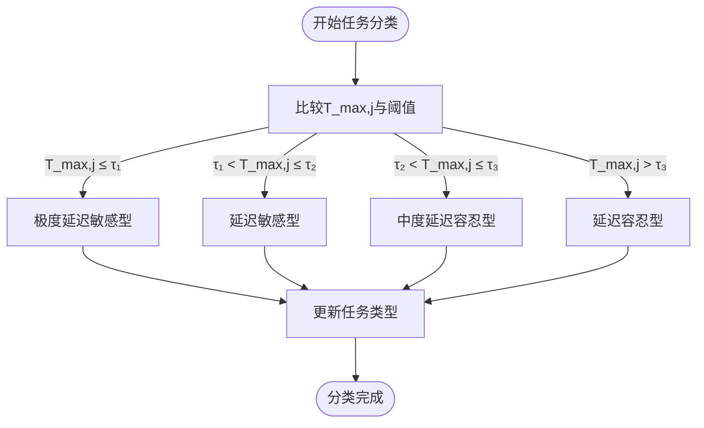
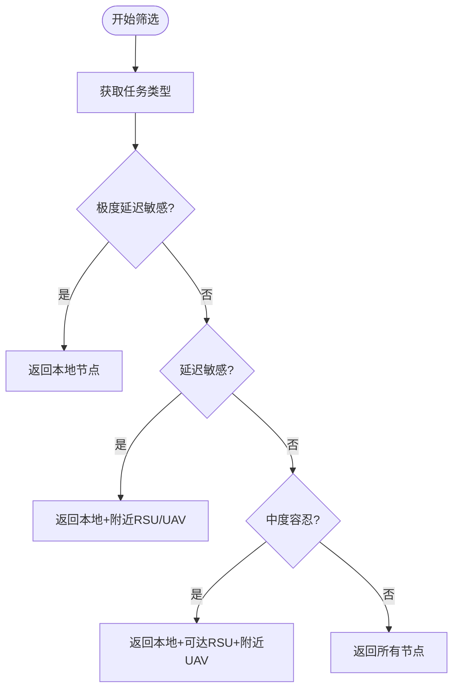
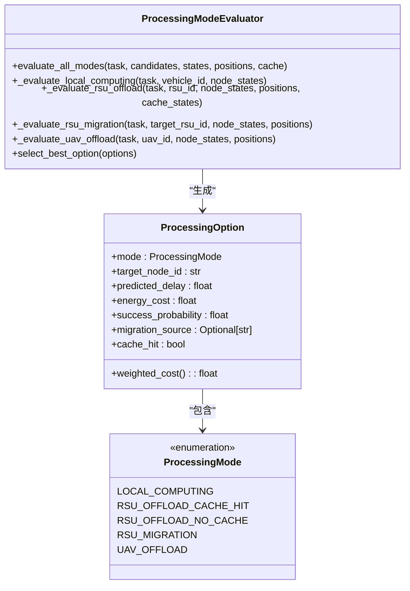
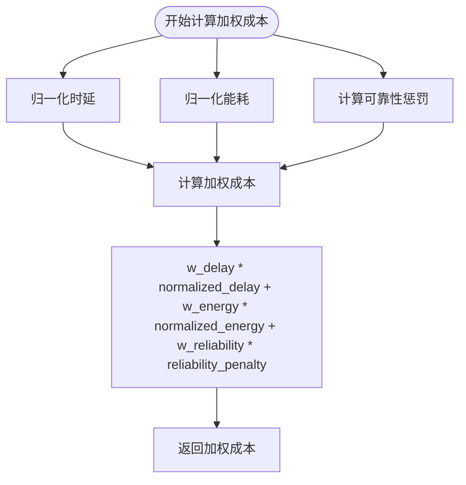
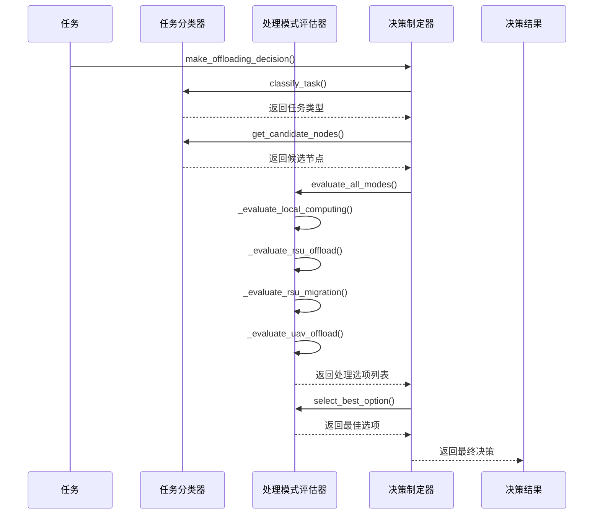

# 任务卸载决策

<cite>
**本文档引用的文件**
- [offloading_manager.py](file://decision/offloading_manager.py)
- [data_structures.py](file://models/data_structures.py)
- [matd3.py](file://algorithms/matd3.py)
- [standardized_reward.py](file://utils/standardized_reward.py)
</cite>

## 目录
1. [简介](#简介)
2. [任务分类机制](#任务分类机制)
3. [候选节点筛选流程](#候选节点筛选流程)
4. [处理模式评估](#处理模式评估)
5. [多目标优化函数](#多目标优化函数)
6. [决策调用链路](#决策调用链路)
7. [与强化学习算法的接口](#与强化学习算法的接口)
8. [常见决策失败场景排查](#常见决策失败场景排查)
9. [性能调优建议](#性能调优建议)

## 简介
本模块实现了基于延迟容忍度的任务分类与卸载决策框架，对应论文第3-4节的核心内容。系统通过四级任务分类策略，结合车辆节点、RSU和UAV的实时状态（计算负载、通信延迟、能耗等），采用多目标优化方法选择最优卸载目标。决策过程与MATD3等强化学习算法紧密集成，形成闭环优化系统。

**Section sources**
- [offloading_manager.py](file://decision/offloading_manager.py#L1-L50)

## 任务分类机制
任务分类器根据任务的最大可容忍延迟（T_max,j）将任务分为四类：

1. **极度延迟敏感型**：T_max,j ≤ τ₁
2. **延迟敏感型**：τ₁ < T_max,j ≤ τ₂
3. **中度延迟容忍型**：τ₂ < T_max,j ≤ τ₃
4. **延迟容忍型**：T_max,j > τ₃

分类过程直接影响候选节点集合的大小和类型，为后续的卸载决策提供基础。



**Diagram sources**
- [offloading_manager.py](file://decision/offloading_manager.py#L75-L95)
- [data_structures.py](file://models/data_structures.py#L42-L42)

**Section sources**
- [offloading_manager.py](file://decision/offloading_manager.py#L54-L95)

## 候选节点筛选流程
根据任务类型，采用不同的候选节点筛选策略：

- **极度延迟敏感型**：仅限本地处理
- **延迟敏感型**：本地 + 近距离RSU（≤800m）+ UAV（≤500m）
- **中度延迟容忍型**：本地 + 可达RSU（≤800m）+ 近距离UAV（≤600m）
- **延迟容忍型**：所有节点

该策略确保了不同延迟要求的任务能够获得适当的处理资源。



**Diagram sources**
- [offloading_manager.py](file://decision/offloading_manager.py#L97-L198)

**Section sources**
- [offloading_manager.py](file://decision/offloading_manager.py#L97-L198)

## 处理模式评估
系统评估四种主要处理模式的性能：



**Diagram sources**
- [offloading_manager.py](file://decision/offloading_manager.py#L225-L267)
- [offloading_manager.py](file://decision/offloading_manager.py#L269-L462)

**Section sources**
- [offloading_manager.py](file://decision/offloading_manager.py#L199-L462)

## 多目标优化函数
采用加权成本函数进行决策，综合考虑延迟、能耗和可靠性：



权重配置：
- 时延权重：0.15
- 能耗权重：0.7
- 可靠性权重：0.15

**Diagram sources**
- [offloading_manager.py](file://decision/offloading_manager.py#L35-L52)

**Section sources**
- [offloading_manager.py](file://decision/offloading_manager.py#L35-L52)

## 决策调用链路
完整的卸载决策调用链路如下：



**Diagram sources**
- [offloading_manager.py](file://decision/offloading_manager.py#L576-L610)

**Section sources**
- [offloading_manager.py](file://decision/offloading_manager.py#L576-L610)

## 与强化学习算法的接口
本模块与MATD3等强化学习算法通过以下方式交互：

1. **状态获取**：从模型层获取节点状态（NodeState）
2. **决策输出**：将最优处理选项反馈给强化学习代理
3. **奖励计算**：通过标准化奖励函数优化策略训练

```mermaid
graph TB
subgraph "决策模块"
DM[OffloadingDecisionMaker]
TE[TaskClassifier]
PVE[ProcessingModeEvaluator]
end
subgraph "强化学习"
MATD3[MATD3Agent]
Buffer[经验回放缓冲区]
end
subgraph "模型层"
MS[Model Layer]
NS[NodeState]
end
subgraph "奖励模块"
SR[StandardizedReward]
SM[SystemMetrics]
end
MS --> DM: 提供节点状态
DM --> MATD3: 提供决策结果
MATD3 --> Buffer: 存储经验
Buffer --> MATD3: 训练网络
SM --> SR: 提供系统指标
SR --> MATD3: 提供奖励信号
```

**Diagram sources**
- [matd3.py](file://algorithms/matd3.py#L83-L121)
- [standardized_reward.py](file://utils/standardized_reward.py#L120-L148)

**Section sources**
- [matd3.py](file://algorithms/matd3.py#L83-L121)
- [standardized_reward.py](file://utils/standardized_reward.py#L120-L148)

## 常见决策失败场景排查
### 网络拥塞误判
当系统误判网络拥塞时，可能导致不必要的本地处理或错误的卸载决策。

**排查方法**：
1. 检查通信时延计算是否准确
2. 验证信道增益和路径损耗模型
3. 确认带宽分配策略

**Section sources**
- [offloading_manager.py](file://decision/offloading_manager.py#L473-L485)

### 节点过载检测
RSU过载阈值设置不当可能导致迁移决策频繁或不足。

**检查点**：
- `config.migration.rsu_overload_threshold` 配置值
- 节点负载因子计算准确性
- 迁移决策的触发条件

**Section sources**
- [offloading_manager.py](file://decision/offloading_manager.py#L372-L410)

## 性能调优建议
1. **调整权重参数**：根据实际需求调整时延、能耗和可靠性的权重
2. **优化候选节点范围**：根据网络拓扑调整RSU和UAV的搜索半径
3. **改进等待时间估算**：使用更精确的排队模型替代简化估算
4. **缓存策略优化**：改进缓存命中检测算法，提高缓存利用率
5. **能耗模型精细化**：考虑更多能耗影响因素，如温度、设备老化等

**Section sources**
- [offloading_manager.py](file://decision/offloading_manager.py#L35-L52)
- [offloading_manager.py](file://decision/offloading_manager.py#L529-L540)