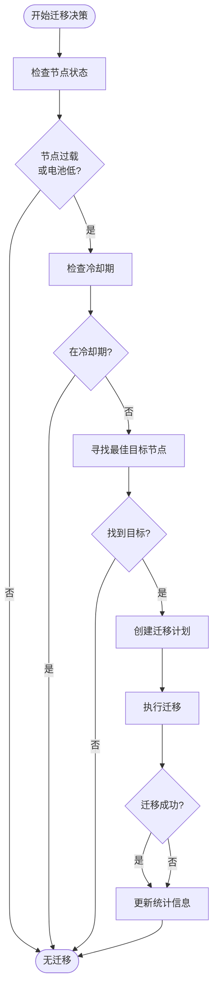
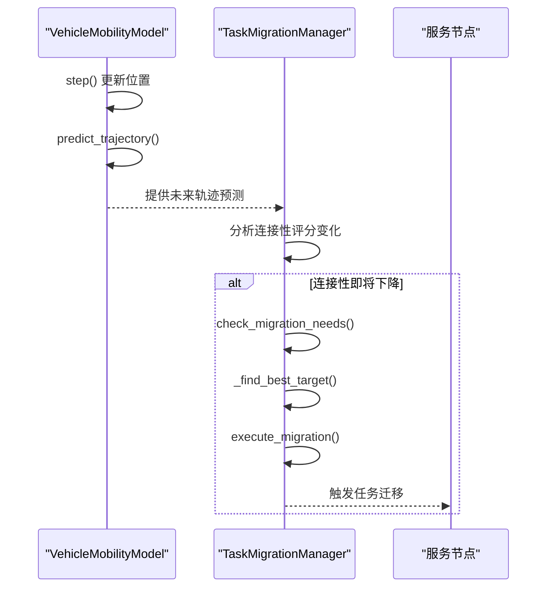

# 任务迁移管理

<cite>
**本文档引用的文件**  
- [migration_manager.py](file://migration/migration_manager.py)
- [enhanced_vehicle_mobility.py](file://models/enhanced_vehicle_mobility.py)
- [models.py](file://communication/models.py)
- [queue_manager.py](file://core/queue_manager.py)
- [data_structures.py](file://models/data_structures.py)
</cite>

## 目录
1. [引言](#引言)
2. [任务迁移机制概述](#任务迁移机制概述)
3. [迁移决策流程](#迁移决策流程)
4. [移动性预测与迁移辅助](#移动性预测与迁移辅助)
5. [通信模型集成](#通信模型集成)
6. [队列状态保持与恢复](#队列状态保持与恢复)
7. [迁移延迟测量与故障排查](#迁移延迟测量与故障排查)

## 引言
本文档系统化说明`migration_manager.py`实现的动态任务迁移机制。重点描述在UAV移动或车辆高速移动场景下，如何检测连接中断风险并触发任务迁移。解释迁移决策流程，包括目标节点选择标准、迁移时机判断和状态同步协议。结合`enhanced_vehicle_mobility.py`说明移动性预测如何辅助迁移决策。阐述与通信模型（`models.py`）的集成方式，确保迁移过程中的数据包可靠传输。说明任务队列（`queue_manager.py`）在迁移过程中的状态保持与恢复机制。提供迁移延迟测量方法和跨节点上下文同步的故障排查指南。

## 任务迁移机制概述

`TaskMigrationManager` 实现了基于 **Keep-Before-Break** 的任务迁移机制，旨在在UAV移动或车辆高速移动等动态场景下，提前检测连接中断风险并触发任务迁移，以最小化服务中断时间。

该机制通过周期性检查节点状态（如负载、电池电量）来触发迁移。当RSU负载超过阈值或UAV电池电量低于安全水平时，系统将启动迁移流程。迁移过程分为三个阶段：
1. **准备阶段**（占总迁移时延的70%）：建立与目标节点的连接并准备迁移环境。
2. **同步阶段**（占25%）：将任务上下文和状态同步到目标节点。
3. **静默切换阶段**（占5%）：短暂中断服务，完成最终切换。

这种分阶段的迁移策略确保了高可靠性，同时将实际中断时间（downtime）控制在极低水平。

**Section sources**
- [migration_manager.py](file://migration/migration_manager.py#L1-L251)

## 迁移决策流程

迁移决策流程由 `check_migration_needs` 方法驱动，该方法在每个仿真时隙被调用，评估所有节点的迁移需求。

### 迁移触发条件
迁移触发主要基于以下条件：
- **RSU过载**：当RSU的负载因子超过配置的 `rsu_overload_threshold`（默认0.8）时。
- **UAV资源不足**：当UAV的负载因子超过 `uav_overload_threshold` 或电池电量低于 `uav_min_battery`（默认20%）时。

此外，系统还实现了**冷却期机制**（cooldown period），防止同一节点在短时间内频繁发起迁移，避免系统震荡。

### 目标节点选择
`_find_best_target` 方法负责选择最佳迁移目标。选择标准综合考虑了**信号强度**（通过节点间距离间接反映）和**剩余资源**（通过目标节点的负载因子评估）。

- 对于RSU迁移，候选目标包括其他负载较低的RSU或电量充足、负载较低的UAV。
- 对于UAV迁移，主要目标是负载较低的RSU，因为RSU通常具有更稳定的能源和更大的计算资源。

最终，系统会选择距离源节点最近且满足资源条件的候选节点作为目标。

### 迁移计划创建与执行
`_create_migration_plan` 方法创建 `MigrationPlan` 对象，其中包含迁移成本、时延和成功概率等关键信息。迁移成本由一个加权公式计算：
`总成本 = alpha_comp * 计算成本 + alpha_tx * 传输成本 + alpha_lat * 时延成本`
这些权重参数（`alpha_comp`, `alpha_tx`, `alpha_lat`）可在配置中调整，以适应不同场景的优化目标。

`execute_migration` 方法模拟了Keep-Before-Break的执行过程，并根据预估的成功概率（与距离成反比）决定迁移是否成功。

**Diagram sources**
- [migration_manager.py](file://migration/migration_manager.py#L66-L188)

**Section sources**
- [migration_manager.py](file://migration/migration_manager.py#L47-L188)

## 移动性预测与迁移辅助

`enhanced_vehicle_mobility.py` 中的 `VehicleMobilityModel` 类通过预测车辆的未来轨迹来辅助迁移决策。

该模型实现了多种移动策略，如**连接性寻求**（Connectivity Seeking）和**覆盖优化**（Coverage Optimization）。在连接性寻求策略下，车辆会主动向信号更强的区域移动，以维持与RSU或UAV的稳定连接。

`predict_trajectory` 方法基于当前速度、加速度和移动策略，预测未来3秒内的车辆轨迹。迁移管理器可以利用这些预测信息，在车辆即将驶出当前服务节点覆盖范围之前，提前规划任务迁移，实现**主动式迁移**（Proactive Migration），从而避免因连接中断导致的任务失败。

**Diagram sources**
- [enhanced_vehicle_mobility.py](file://models/enhanced_vehicle_mobility.py#L200-L300)
- [migration_manager.py](file://migration/migration_manager.py#L66-L188)

**Section sources**
- [enhanced_vehicle_mobility.py](file://models/enhanced_vehicle_mobility.py#L1-L399)

## 通信模型集成

任务迁移过程与 `communication/models.py` 中的通信模型紧密集成，以确保迁移期间的数据包可靠传输。

`WirelessCommunicationModel` 负责计算节点间的信道状态，包括路径损耗、阴影衰落和SINR（信噪干扰比）。在创建迁移计划时，`_create_migration_plan` 方法会利用节点位置信息计算迁移距离，而距离是影响路径损耗和信号质量的关键因素。

`IntegratedCommunicationComputeModel` 则提供了对整个迁移过程的端到端评估。它能计算从源节点到目标节点的**通信时延**和**通信能耗**，这些信息对于评估迁移的总成本和可行性至关重要。例如，一个距离过远的迁移目标，虽然计算资源充足，但可能因通信链路质量差而导致迁移时延过长或成功率过低。

这种集成确保了迁移决策不仅考虑了目标节点的计算能力，也充分考虑了通信链路的可靠性和效率。

**Section sources**
- [models.py](file://communication/models.py#L1-L613)

## 队列状态保持与恢复

`core/queue_manager.py` 中的 `PriorityQueueManager` 负责在迁移过程中保持和恢复任务队列的状态。

该队列管理器实现了**多优先级生命周期队列模型**。每个任务根据其优先级和剩余生命周期被分配到特定的队列槽位（`QueueSlot`）。

在迁移过程中，当一个任务从源节点迁移到目标节点时，其在源节点队列中的状态（如等待时间、剩余生命周期）会被完整地同步到目标节点的相应队列槽位中。`add_task` 和 `get_next_task` 方法确保了任务在目标节点能够按照原有的优先级和生命周期规则继续被处理。

`update_lifetime` 方法在每个时隙更新所有任务的生命周期。迁移成功后，任务在目标节点的生命周期会从迁移前的剩余值继续递减，保证了服务的连续性。`QueueStatistics` 类则跟踪了队列的到达、离开和丢弃情况，为系统性能评估提供了数据支持。

**Section sources**
- [queue_manager.py](file://core/queue_manager.py#L1-L494)

## 迁移延迟测量与故障排查

### 迁移延迟测量
迁移延迟主要由 `migration_delay` 属性表示，其计算公式为 `distance / migration_bandwidth`。`execute_migration` 方法进一步将总迁移时延分解为准备、同步和切换三个阶段，其中切换阶段的时长即为实际的 `downtime`。

系统通过 `get_migration_statistics` 方法提供详细的迁移统计信息，包括：
- `total_attempts`：总迁移尝试次数
- `successful_migrations`：成功迁移次数
- `success_rate`：迁移成功率
- `avg_downtime_per_migration`：平均每次迁移的中断时间

这些指标可用于量化迁移机制的性能。

### 故障排查指南
当出现迁移失败或服务中断时，可按以下步骤排查：

1.  **检查迁移触发条件**：确认 `node_states` 中的 `load_factor` 或 `battery_level` 是否确实达到了触发阈值。
2.  **验证目标节点选择**：检查 `_find_best_target` 是否能找到合适的候选节点。可能的原因包括所有候选节点都过载或距离过远。
3.  **分析通信链路**：利用 `WirelessCommunicationModel` 检查源节点与目标节点间的 `ChannelState`。低SINR或高路径损耗是导致迁移失败的常见原因。
4.  **审查冷却期**：确认源节点是否处于 `cooldown_period` 内，这会阻止新的迁移计划。
5.  **监控队列状态**：检查 `PriorityQueueManager` 的 `get_queue_statistics`，确认任务是否在源节点或目标节点的队列中被正确添加或移除。
6.  **验证状态同步**：确保任务的 `remaining_lifetime_slots` 和 `priority` 等关键属性在迁移后保持一致。

通过结合这些组件的输出日志和统计信息，可以有效地诊断和解决迁移过程中的问题。

**Section sources**
- [migration_manager.py](file://migration/migration_manager.py#L218-L251)
- [queue_manager.py](file://core/queue_manager.py#L400-L494)
- [models.py](file://communication/models.py#L1-L613)