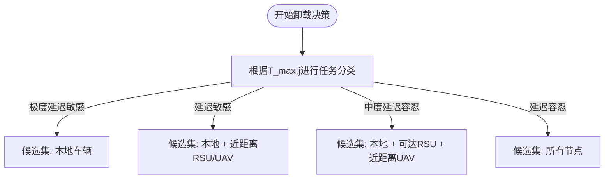
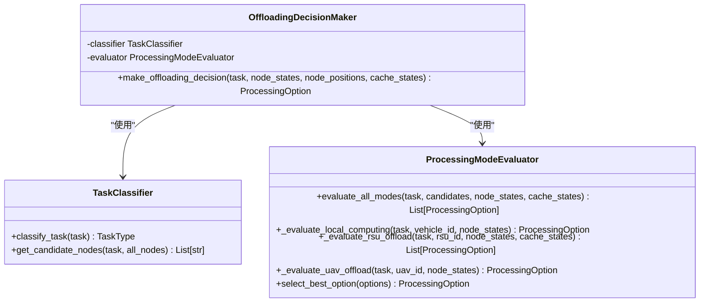
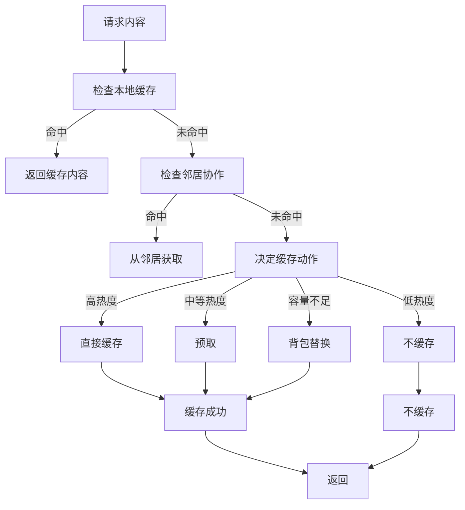
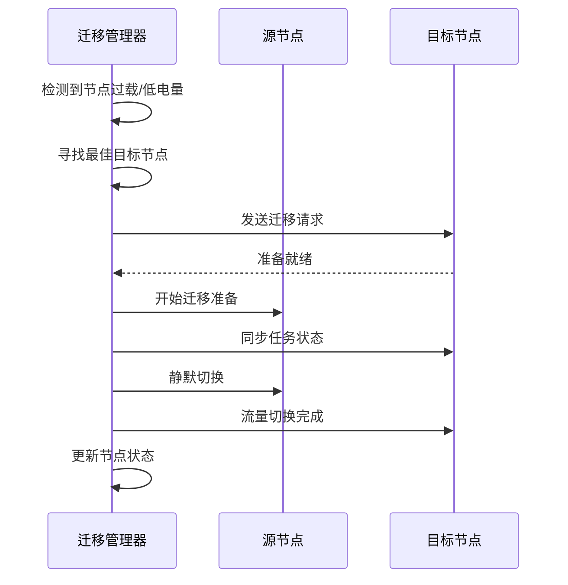
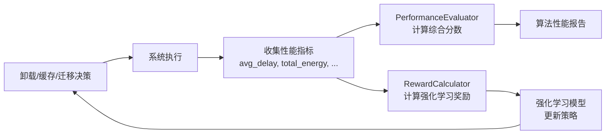

# 决策机制

<cite>
**本文档中引用的文件**   
- [offloading_manager.py](file://decision/offloading_manager.py)
- [cache_manager.py](file://caching/cache_manager.py)
- [cache_policy.py](file://caching/cache_policy.py)
- [migration_manager.py](file://migration/migration_manager.py)
- [performance_evaluator.py](file://evaluation/performance_evaluator.py)
- [data_structures.py](file://models/data_structures.py)
- [system_config.py](file://config/system_config.py)
- [reward_calculator.py](file://utils/reward_calculator.py)
- [standardized_reward.py](file://utils/standardized_reward.py)
</cite>

## 目录
1. [引言](#引言)
2. [任务卸载决策机制](#任务卸载决策机制)
3. [缓存管理策略](#缓存管理策略)
4. [任务迁移机制](#任务迁移机制)
5. [性能评估与反馈](#性能评估与反馈)
6. [结论](#结论)

## 引言
本文档详细阐述了边缘计算系统中的三大核心决策机制：任务卸载、缓存管理和任务迁移。系统通过`offloading_manager.py`基于网络状态和算法输出进行智能卸载决策，利用`cache_manager.py`和`cache_policy.py`实现基于内容热度的缓存策略，并通过`migration_manager.py`处理任务在不同边缘节点间的动态迁移，特别是在无人机（UAV）移动场景下的无缝切换。`performance_evaluator.py`则负责量化评估决策效果，并将结果反馈至强化学习的奖励函数中，形成闭环优化。

## 任务卸载决策机制

任务卸载决策由`offloading_manager.py`模块实现，其核心流程遵循论文第3-4节的设计，通过任务分类、候选节点选择、多模式评估和最优决策四个步骤完成。

### 任务分类与候选节点选择
系统首先根据任务的最大容忍延迟（`max_delay_slots`）对任务进行四级分类，对应`TaskType`枚举类型：
- **极度延迟敏感型**：延迟阈值 `τ₁`（配置为2个时隙）
- **延迟敏感型**：延迟阈值 `τ₂`（配置为5个时隙）
- **中度延迟容忍型**：延迟阈值 `τ₃`（配置为10个时隙）
- **延迟容忍型**：超过 `τ₃`

分类由`TaskClassifier`类完成，其`classify_task`方法根据配置的阈值确定任务类型。随后，`get_candidate_nodes`方法根据任务类型动态确定候选节点集合：
- **极度延迟敏感型**：仅限本地车辆处理。
- **延迟敏感型**：本地车辆、近距离RSU（800米内）和UAV（500米内）。
- **中度延迟容忍型**：本地车辆、可达RSU（800米内）和近距离UAV（600米内）。
- **延迟容忍型**：所有节点。

**图源**
- [offloading_manager.py](file://decision/offloading_manager.py#L150-L250)

**节源**
- [offloading_manager.py](file://decision/offloading_manager.py#L150-L250)
- [system_config.py](file://config/system_config.py#L70-L75)

### 多模式评估与最优决策
在确定候选节点后，`ProcessingModeEvaluator`类对每个节点评估四种处理模式：
1.  **本地计算** (`LOCAL_COMPUTING`)：评估车辆本地处理的时延、能耗和成功率。
2.  **RSU卸载** (`RSU_OFFLOAD_CACHE_HIT`/`RSU_OFFLOAD_NO_CACHE`)：区分缓存命中与未命中，计算通信、处理时延和能耗。
3.  **RSU间迁移** (`RSU_MIGRATION`)：当源RSU过载时，评估将任务迁移到目标RSU的成本。
4.  **UAV卸载** (`UAV_OFFLOAD`)：评估向UAV卸载的通信、处理时延和能耗，考虑UAV电池电量。

评估的核心是`ProcessingOption`类，它计算每个选项的加权成本（`weighted_cost`），该成本是归一化后的时延、能耗和可靠性惩罚的加权和。权重（`w_delay`, `w_energy`, `w_reliability`）可配置，以平衡不同目标。最终，`select_best_option`方法选择加权成本最小的可行选项。

**图源**
- [offloading_manager.py](file://decision/offloading_manager.py#L250-L600)

**节源**
- [offloading_manager.py](file://decision/offloading_manager.py#L250-L600)

## 缓存管理策略

缓存管理由`caching`目录下的`cache_manager.py`和`cache_policy.py`模块实现，支持基于内容热度的智能缓存和多种替换算法。

### 缓存策略基类
`cache_policy.py`定义了`CachePolicy`抽象基类，为所有缓存策略提供了统一接口，包括`get`、`put`和`evict`方法。这确保了策略的可扩展性。

### 基于热度的缓存与协作
`cache_manager.py`中的`HeatBasedCacheStrategy`类实现了基于热度的缓存策略。它结合了三种热度：
- **历史热度** (`historical_heat`)：通过指数衰减模型（衰减因子 `ρ=0.9`）累积历史访问。
- **时间槽热度** (`slot_heat`)：记录在特定时间槽（如小时）内的访问频率。
- **Zipf流行度**：根据内容访问排名预测未来流行度。

综合热度 `Heat(c)` 由历史热度和时间槽热度的加权和计算得出（混合系数 `η=0.7`）。

### 缓存动作与替换算法
`CollaborativeCacheManager`类负责具体的缓存操作。当请求内容时，它按以下逻辑决定动作：
1.  **缓存命中**：直接返回。
2.  **邻居协作**：检查邻居节点是否缓存了该内容。
3.  **缓存动作决策**：根据内容热度和可用容量，决定四种动作：
    - **直接缓存**：高热度内容。
    - **预取**：中等热度内容。
    - **背包替换**：容量不足时，使用贪心背包算法替换价值较低的内容。
    - **不缓存**：低热度内容。

对于替换算法，系统支持LRU、LFU、FIFO和混合策略（`HYBRID`），可通过配置文件`system_config.py`中的`cache_replacement_policy`进行设置。

**图源**
- [cache_manager.py](file://caching/cache_manager.py#L100-L300)

**节源**
- [cache_manager.py](file://caching/cache_manager.py#L100-L300)
- [cache_policy.py](file://caching/cache_policy.py#L1-L60)

## 任务迁移机制

任务迁移由`migration_manager.py`中的`TaskMigrationManager`类实现，旨在处理节点过载或UAV电量不足的情况，确保服务连续性。

### 迁移触发与目标选择
迁移决策基于以下条件：
- **RSU过载**：当RSU的负载因子超过阈值（`rsu_overload_threshold=0.8`）。
- **UAV过载或低电量**：当UAV的负载因子超过阈值（`uav_overload_threshold=0.7`）或电池电量低于阈值（`uav_min_battery=0.2`）。

`check_migration_needs`方法会定期检查这些条件。一旦触发，`_find_best_target`方法会寻找最佳迁移目标。例如，过载的RSU可以迁移到负载较轻的其他RSU或UAV，而电量不足的UAV则优先迁移到RSU。目标选择时会考虑距离，优先选择最近的可用节点。

### Keep-Before-Break无缝切换
系统采用“先保持后断开”（Keep-Before-Break）的迁移机制，以最小化服务中断。`execute_migration`方法模拟了迁移过程：
1.  **准备阶段**（70%时间）：在目标节点上准备执行环境。
2.  **同步阶段**（25%时间）：同步任务状态和数据。
3.  **静默切换阶段**（5%时间）：这是实际的中断时间（`downtime`），流量从源节点切换到目标节点。

整个过程的总迁移时延由数据大小和迁移带宽（`migration_bandwidth=100e6 bps`）决定。成功概率与迁移距离成反比。

**图源**
- [migration_manager.py](file://migration/migration_manager.py#L50-L250)

**节源**
- [migration_manager.py](file://migration/migration_manager.py#L50-L250)
- [system_config.py](file://config/system_config.py#L250-L270)

## 性能评估与反馈

系统的决策效果由`performance_evaluator.py`中的`PerformanceEvaluator`类进行量化评估，并通过统一的奖励函数反馈给强化学习算法。

### 性能指标评估
`PerformanceEvaluator`计算一系列关键性能指标（KPIs）：
- **基本指标**：任务完成率、平均时延、总能耗、缓存命中率。
- **衍生指标**：能效（完成任务数/总能耗）、时延效率（1/平均时延）。
- **综合分数**：通过加权求和（完成率30%、时延效率25%、能效20%、缓存命中率25%）得到一个综合性能分数，用于算法间的横向比较。

### 闭环反馈机制
评估结果最终被用于计算强化学习的奖励函数。系统通过`utils`目录下的`reward_calculator.py`和`standardized_reward.py`提供统一的奖励计算接口。奖励函数严格遵循论文的目标函数：
`奖励 = - (ω_T * 归一化时延 + ω_E * 归一化能耗 + ω_D * 数据丢失率)`
其中权重 `ω_T`, `ω_E`, `ω_D` 来自`system_config.py`。此外，还会添加轻量级的性能激励（如高缓存命中率奖励），以鼓励更优的系统行为。`performance_evaluator.py`的评估结果作为输入，传递给奖励计算器，形成“决策-评估-反馈-优化”的闭环。

**图源**
- [performance_evaluator.py](file://evaluation/performance_evaluator.py#L1-L100)
- [reward_calculator.py](file://utils/reward_calculator.py#L1-L50)

**节源**
- [performance_evaluator.py](file://evaluation/performance_evaluator.py#L1-L100)
- [reward_calculator.py](file://utils/reward_calculator.py#L1-L50)
- [system_config.py](file://config/system_config.py#L50-L60)

## 结论
本系统通过`offloading_manager`、`cache_manager`和`migration_manager`三大模块，实现了智能、协同的边缘计算决策。任务卸载决策基于精细化的任务分类和多维度评估，缓存管理利用热度模型和背包算法优化命中率，任务迁移则通过Keep-Before-Break机制保障服务连续性。`performance_evaluator`和统一的奖励函数将这些决策的效果量化并反馈给学习算法，驱动系统持续优化，最终实现时延、能耗和数据丢失的全局最小化。