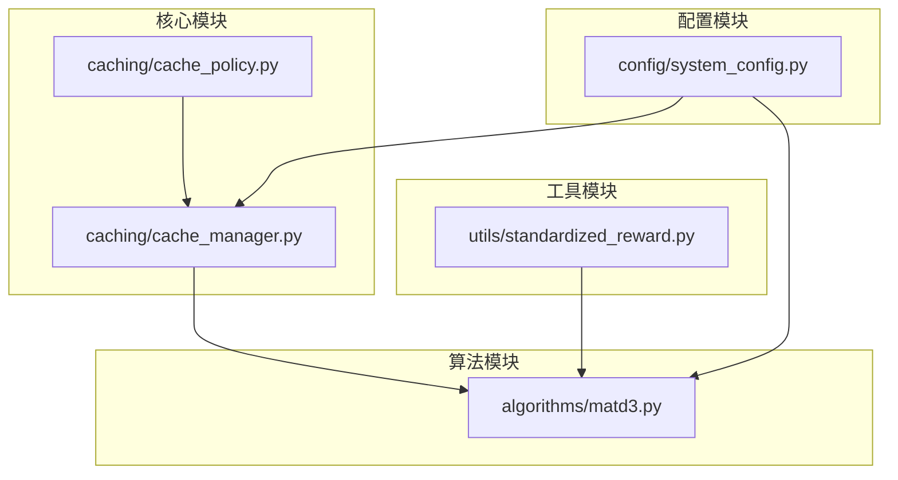
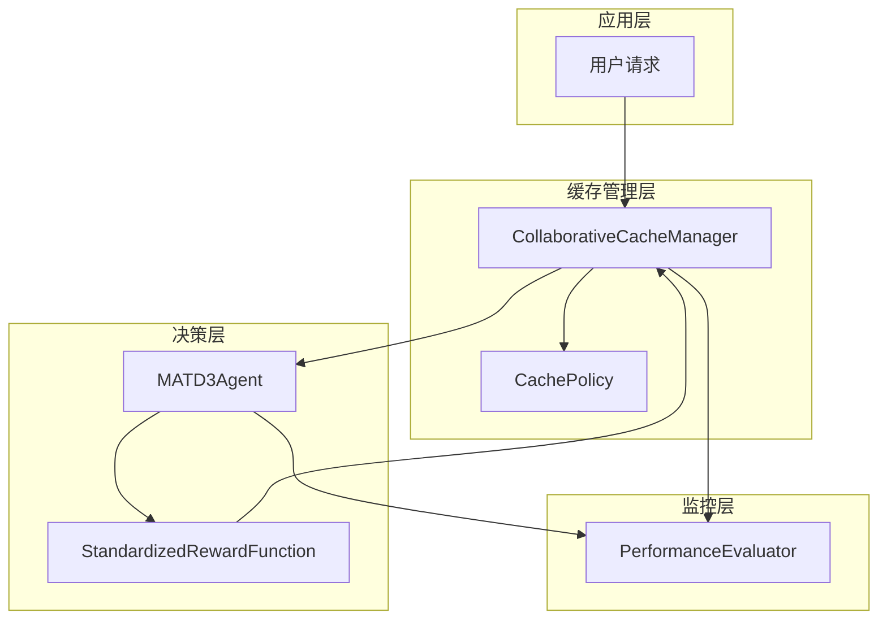
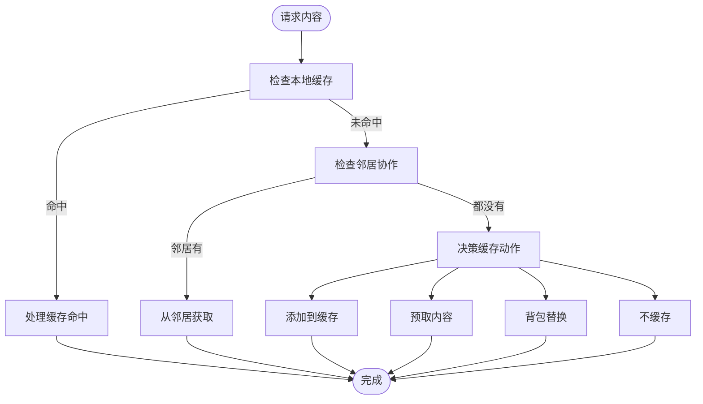
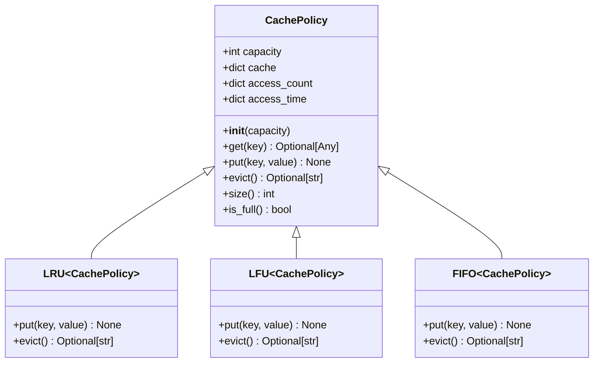
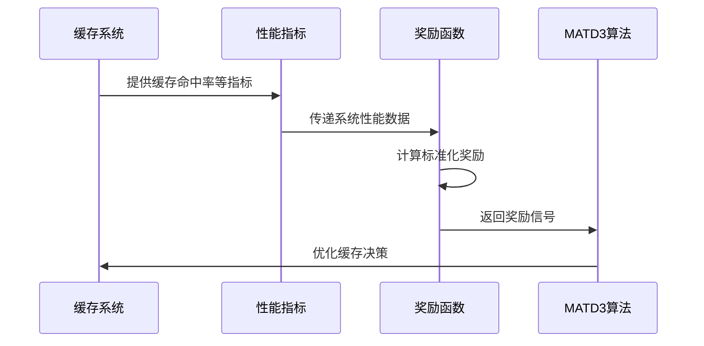
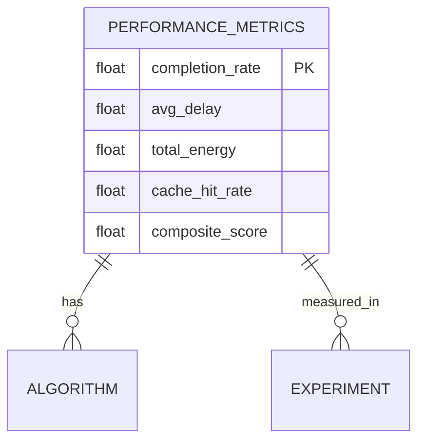
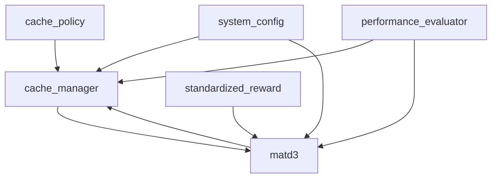

# 缓存决策管理

<cite>
**本文档引用文件**   
- [cache_manager.py](file://caching/cache_manager.py)
- [cache_policy.py](file://caching/cache_policy.py)
- [standardized_reward.py](file://utils/standardized_reward.py)
- [matd3.py](file://algorithms/matd3.py)
- [system_config.py](file://config/system_config.py)
- [performance_evaluator.py](file://evaluation/performance_evaluator.py)
</cite>

## 目录
1. [引言](#引言)
2. [项目结构](#项目结构)
3. [核心组件](#核心组件)
4. [架构概述](#架构概述)
5. [详细组件分析](#详细组件分析)
6. [依赖分析](#依赖分析)
7. [性能考量](#性能考量)
8. [故障排除指南](#故障排除指南)
9. [结论](#结论)

## 引言
本文档全面阐述了基于内容热度的智能缓存系统，重点分析了缓存管理、替换策略、强化学习协同机制及性能评估。系统通过`cache_manager.py`实现边缘节点的内容存储生命周期管理，结合`cache_policy.py`中的LRU、LFU等算法进行高效缓存决策，并与MATD3强化学习算法协同工作，利用`standardized_reward.py`将缓存命中率转化为训练信号，实现系统性能的持续优化。

## 项目结构
系统采用模块化设计，核心缓存功能位于`caching`模块，强化学习算法位于`algorithms`模块，奖励函数标准化在`utils`模块中实现，配置信息由`config`模块统一管理。

**图源**
- [cache_manager.py](file://caching/cache_manager.py#L1-L527)
- [cache_policy.py](file://caching/cache_policy.py#L1-L55)
- [matd3.py](file://algorithms/matd3.py#L1-L549)
- [standardized_reward.py](file://utils/standardized_reward.py#L1-L148)
- [system_config.py](file://config/system_config.py#L1-L318)

**节源**
- [cache_manager.py](file://caching/cache_manager.py#L1-L527)
- [cache_policy.py](file://caching/cache_policy.py#L1-L55)
- [matd3.py](file://algorithms/matd3.py#L1-L549)
- [standardized_reward.py](file://utils/standardized_reward.py#L1-L148)
- [system_config.py](file://config/system_config.py#L1-L318)

## 核心组件
本系统核心组件包括缓存管理器、缓存策略基类、标准化奖励函数和MATD3强化学习算法。`CollaborativeCacheManager`负责管理边缘节点的缓存生命周期，`CachePolicy`定义了缓存策略的通用接口，`StandardizedRewardFunction`确保奖励计算的一致性，`MATD3Environment`则实现了多智能体协同决策。

**节源**
- [cache_manager.py](file://caching/cache_manager.py#L1-L527)
- [cache_policy.py](file://caching/cache_policy.py#L1-L55)
- [standardized_reward.py](file://utils/standardized_reward.py#L1-L148)
- [matd3.py](file://algorithms/matd3.py#L1-L549)

## 架构概述
系统采用多层架构，由缓存管理层、策略执行层、强化学习决策层和监控评估层构成。各层之间通过标准化接口通信，形成闭环优化系统。

**图源**
- [cache_manager.py](file://caching/cache_manager.py#L1-L527)
- [cache_policy.py](file://caching/cache_policy.py#L1-L55)
- [matd3.py](file://algorithms/matd3.py#L1-L549)
- [standardized_reward.py](file://utils/standardized_reward.py#L1-L148)
- [performance_evaluator.py](file://evaluation/performance_evaluator.py#L1-L313)

## 详细组件分析

### 缓存管理器分析
`CollaborativeCacheManager`是系统的核心，负责管理边缘节点的内容存储生命周期，包括缓存插入、查询和淘汰。

#### 缓存生命周期管理

**图源**
- [cache_manager.py](file://caching/cache_manager.py#L100-L250)

**节源**
- [cache_manager.py](file://caching/cache_manager.py#L1-L527)

#### 缓存替换策略

**图源**
- [cache_policy.py](file://caching/cache_policy.py#L8-L55)

**节源**
- [cache_policy.py](file://caching/cache_policy.py#L1-L55)

### 缓存策略分析
`cache_policy.py`实现了LRU、LFU等多种替换算法，为缓存管理提供策略支持。

#### LRU与LFU算法复杂度
| 算法 | get时间复杂度 | put时间复杂度 | evict时间复杂度 | 数据结构 |
|------|-------------|-------------|---------------|---------|
| LRU | O(1) | O(1) | O(1) | OrderedDict |
| LFU | O(1) | O(1) | O(1) | 双哈希表+双向链表 |

**节源**
- [cache_policy.py](file://caching/cache_policy.py#L8-L55)

### 强化学习协同分析
缓存系统与MATD3算法协同工作，通过标准化奖励函数将缓存性能转化为强化学习训练信号。

#### 奖励函数协同流程

**图源**
- [standardized_reward.py](file://utils/standardized_reward.py#L11-L98)
- [matd3.py](file://algorithms/matd3.py#L410-L434)

**节源**
- [standardized_reward.py](file://utils/standardized_reward.py#L1-L148)
- [matd3.py](file://algorithms/matd3.py#L1-L549)

### 监控机制分析
系统通过`PerformanceEvaluator`实现缓存状态监控和性能评估。

#### 性能评估指标

**图源**
- [performance_evaluator.py](file://evaluation/performance_evaluator.py#L19-L73)

**节源**
- [performance_evaluator.py](file://evaluation/performance_evaluator.py#L1-L313)

## 依赖分析
系统各组件之间存在明确的依赖关系，形成完整的缓存决策闭环。

**图源**
- [cache_policy.py](file://caching/cache_policy.py#L8-L55)
- [cache_manager.py](file://caching/cache_manager.py#L1-L527)
- [matd3.py](file://algorithms/matd3.py#L1-L549)
- [standardized_reward.py](file://utils/standardized_reward.py#L1-L148)
- [system_config.py](file://config/system_config.py#L1-L318)
- [performance_evaluator.py](file://evaluation/performance_evaluator.py#L1-L313)

**节源**
- [cache_policy.py](file://caching/cache_policy.py#L1-L55)
- [cache_manager.py](file://caching/cache_manager.py#L1-L527)
- [matd3.py](file://algorithms/matd3.py#L1-L549)
- [standardized_reward.py](file://utils/standardized_reward.py#L1-L148)
- [system_config.py](file://config/system_config.py#L1-L318)
- [performance_evaluator.py](file://evaluation/performance_evaluator.py#L1-L313)

## 性能考量
系统在设计时充分考虑了高并发场景下的性能优化和稳定性保障。

### 配置实践指南
| 配置项 | 推荐值 | 说明 |
|-------|-------|------|
| 缓存容量 | 10GB | RSU节点缓存容量 |
| 替换策略 | LRU | 通用场景推荐 |
| 预取窗口 | 10% | 缓存容量的10%用于预取 |
| 同步间隔 | 300秒 | 邻居缓存状态同步频率 |

### 缓存雪崩预防
1. **过期时间随机化**：为缓存项设置随机过期时间，避免集中失效
2. **热点数据永不过期**：对高热度内容采用逻辑过期策略
3. **降级机制**：当缓存系统异常时，自动降级到数据库直连
4. **预热机制**：系统启动时预先加载热点数据

**节源**
- [cache_manager.py](file://caching/cache_manager.py#L1-L527)
- [system_config.py](file://config/system_config.py#L1-L318)

## 故障排除指南
当系统出现性能问题时，可按以下步骤进行排查：

1. **检查缓存命中率**：通过`get_cache_statistics()`获取命中率指标
2. **分析淘汰日志**：查看`_evict_item()`调用频率和淘汰内容
3. **验证奖励信号**：确认`calculate_standardized_reward()`输出合理性
4. **监控资源使用**：检查CPU、内存和网络带宽使用情况

**节源**
- [cache_manager.py](file://caching/cache_manager.py#L1-L527)
- [standardized_reward.py](file://utils/standardized_reward.py#L1-L148)
- [performance_evaluator.py](file://evaluation/performance_evaluator.py#L1-L313)

## 结论
本文档详细阐述了基于内容热度的智能缓存系统，展示了`cache_manager.py`如何管理边缘节点的内容存储生命周期，分析了`cache_policy.py`中LRU、LFU等替换算法的实现逻辑，说明了缓存策略如何与MATD3算法协同工作，并描述了缓存状态监控机制。系统通过标准化的奖励函数实现了缓存性能与强化学习的闭环优化，为车联网边缘计算提供了高效的缓存解决方案。