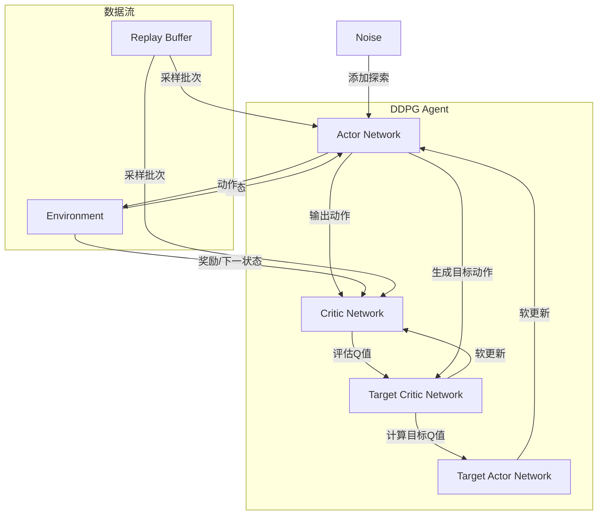
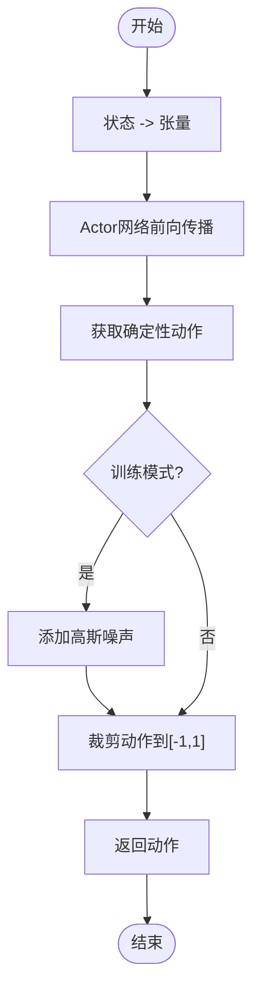
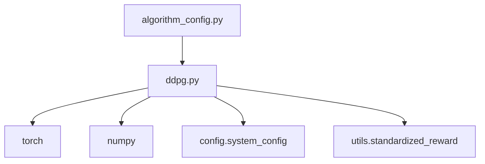

# DDPG算法实现

<cite>
**Referenced Files in This Document**   
- [ddpg.py](file://single_agent/ddpg.py)
- [algorithm_config.py](file://config/algorithm_config.py)
- [system_config.py](file://config/system_config.py)
- [standardized_reward.py](file://utils/standardized_reward.py)
</cite>

## 目录
1. [引言](#引言)
2. [核心组件](#核心组件)
3. [架构概述](#架构概述)
4. [详细组件分析](#详细组件分析)
5. [依赖分析](#依赖分析)
6. [性能考量](#性能考量)
7. [故障排除指南](#故障排除指南)
8. [结论](#结论)

## 引言
本文档详细阐述了深度确定性策略梯度（DDPG）算法在车联网边缘计算（VEC）环境下的单智能体任务卸载决策实现机制。该实现基于Actor-Critic架构，专为处理连续动作空间的控制问题而设计。文档将深入解析其核心组件，包括目标网络、经验回放缓冲区和探索噪声机制，并结合代码说明DDPGAgent类的完整工作流程。同时，将分析该算法在特定应用场景下的适用性、优势与潜在挑战，并提供超参数配置建议。

## 核心组件
DDPG算法的核心实现位于`single_agent/ddpg.py`文件中，主要由以下几个关键组件构成：`DDPGAgent`（智能体主类）、`DDPGActor`（策略网络）、`DDPGCritic`（价值网络）、`DDPGReplayBuffer`（经验回放缓冲区）和`DDPGConfig`（算法配置）。这些组件协同工作，实现了从环境交互、经验存储到网络更新的完整强化学习循环。

**Section sources**
- [ddpg.py](file://single_agent/ddpg.py#L32-L344)

## 架构概述
DDPG算法采用经典的Actor-Critic双网络架构。Actor网络负责根据当前状态输出一个确定性的动作，而Critic网络则评估该动作的价值。为了稳定训练过程，系统维护了两套独立的网络：主网络（Actor/Critic）用于实时决策和梯度更新，目标网络（Target Actor/Target Critic）则用于生成学习目标，其参数通过主网络的软更新策略缓慢同步。



**Diagram sources**
- [ddpg.py](file://single_agent/ddpg.py#L55-L172)

**Section sources**
- [ddpg.py](file://single_agent/ddpg.py#L55-L172)

## 详细组件分析
本节将对DDPG算法的各个核心组件进行深入分析，包括其设计原理和具体实现。

### DDPGAgent类分析
`DDPGAgent`类是整个算法的控制中心，负责协调Actor和Critic网络、管理经验回放缓冲区，并执行训练更新。

#### 初始化流程
`DDPGAgent`的初始化流程通过`__init__`方法实现。它首先接收状态维度、动作维度和配置对象作为参数。随后，它会创建主Actor和Critic网络，并为每个网络创建一个对应的目标网络副本。目标网络的初始参数通过`hard_update`方法从主网络完全复制。此外，该流程还会初始化Adam优化器、经验回放缓冲区，并从配置中加载探索噪声的初始规模。

**Section sources**
- [ddpg.py](file://single_agent/ddpg.py#L175-L198)

#### 动作选择机制
`select_action`方法负责在给定状态下选择一个动作。首先，它将输入的状态转换为PyTorch张量并送入设备（CPU/GPU）。然后，通过Actor网络的前向传播得到一个确定性的动作。在训练模式下，为了鼓励探索，会向该动作添加一个来自正态分布的噪声，并将最终的动作裁剪到[-1.0, 1.0]的范围内。



**Diagram sources**
- [ddpg.py](file://single_agent/ddpg.py#L216-L228)

**Section sources**
- [ddpg.py](file://single_agent/ddpg.py#L216-L228)

#### 经验存储机制
`store_experience`方法是一个简单的接口，它将当前的状态、动作、奖励、下一状态和终止标志直接传递给`DDPGReplayBuffer`实例的`push`方法。缓冲区会将这些经验元组存储在预分配的内存中，并使用循环指针来管理存储位置。

**Section sources**
- [ddpg.py](file://single_agent/ddpg.py#L230-L233)

#### 网络更新流程
`update`方法是训练的核心，它实现了Critic和Actor网络的更新逻辑。该流程首先检查缓冲区中是否有足够的经验。然后，它会从缓冲区中随机采样一个批次的经验。接着，它调用`_update_critic`方法来计算Critic的损失并进行梯度下降，再调用`_update_actor`方法来更新Actor网络。最后，通过`soft_update`方法对两个目标网络进行软更新，并根据衰减率降低探索噪声的规模。

```mermaid
sequenceDiagram
participant Agent as DDPGAgent
participant Buffer as ReplayBuffer
participant Critic as Critic Network
participant Actor as Actor Network
participant TargetCritic as Target Critic
participant TargetActor as Target Actor
Agent->>Agent : 检查缓冲区大小
Agent->>Buffer : sample(batch_size)
Buffer-->>Agent : 返回经验批次
Agent->>Critic : _update_critic(...)
Critic->>TargetCritic : 计算目标Q值
Critic->>Critic : 计算当前Q值
Critic->>Critic : 计算MSE损失
Critic->>Agent : 返回Critic损失
Agent->>Actor : _update_actor(...)
Actor->>Critic : 计算Actor生成动作的Q值
Actor->>Actor : 计算Actor损失(-Q)
Actor->>Actor : 梯度下降
Actor->>Agent : 返回Actor损失
Agent->>TargetActor : soft_update(tau)
Agent->>TargetCritic : soft_update(tau)
Agent->>Agent : 衰减噪声
Agent-->>Agent : 返回训练信息
```

**Diagram sources**
- [ddpg.py](file://single_agent/ddpg.py#L235-L275)

**Section sources**
- [ddpg.py](file://single_agent/ddpg.py#L235-L275)

### DDPGConfig配置分析
`DDPGConfig`类定义了算法的所有超参数。该实现对标准配置进行了多项优化以提升收敛性。例如，`hidden_dim`被设置为256以增加网络容量；`actor_lr`和`critic_lr`分别设置为1e-4和3e-4，以实现更稳定的Actor和更快的Critic学习；`batch_size`增加到128以提高样本效率；`tau`减小到0.005以实现更平滑的目标网络更新；`noise_scale`和`noise_decay`被调整为0.3和0.9999，以加强探索并减缓噪声衰减速度。

**Section sources**
- [ddpg.py](file://single_agent/ddpg.py#L32-L52)

## 依赖分析
DDPG算法的实现依赖于多个外部模块和配置文件。`ddpg.py`文件直接依赖于`torch`、`numpy`等第三方库，并通过`from config import config`导入全局配置。`DDPGAgent`类在计算奖励时，会动态导入`utils.standardized_reward`模块中的`calculate_standardized_reward`函数。此外，`algorithm_config.py`文件中定义了一个`ddpg_config`字典，其中包含与`DDPGConfig`类相似的参数，这表明系统可能支持通过外部配置文件覆盖默认参数。



**Diagram sources**
- [ddpg.py](file://single_agent/ddpg.py#L1-L561)
- [algorithm_config.py](file://config/algorithm_config.py#L1-L73)
- [system_config.py](file://config/system_config.py#L1-L319)
- [standardized_reward.py](file://utils/standardized_reward.py#L1-L152)

**Section sources**
- [ddpg.py](file://single_agent/ddpg.py#L1-L561)
- [algorithm_config.py](file://config/algorithm_config.py#L1-L73)
- [system_config.py](file://config/system_config.py#L1-L319)
- [standardized_reward.py](file://utils/standardized_reward.py#L1-L152)

## 性能考量
DDPG算法在车联网边缘计算场景下具有显著优势。其最大的优势在于能够处理连续动作空间，这使得它可以精确地控制任务卸载的比例、资源分配的粒度等连续决策变量，而DQN等离散算法则无法做到这一点。然而，该算法也存在收敛速度较慢的潜在问题，这通常源于Actor和Critic网络之间的复杂交互以及目标网络更新的延迟效应。为了缓解此问题，本实现通过增加网络容量、优化学习率和增强探索策略来提升收敛速度。

## 故障排除指南
当DDPG算法训练不稳定或性能不佳时，应首先检查`standardized_reward.py`中的奖励函数。该文件中的`calculate_standardized_reward`函数是所有算法的统一奖励来源，其权重配置（`reward_weight_delay`, `reward_weight_energy`, `reward_weight_loss`）直接影响学习目标。如果奖励信号过弱，可以参考代码中的`amplified_reward`逻辑，适当放大奖励值。此外，应监控`DDPGAgent`中的`noise_scale`，确保其按预期衰减，以平衡探索与利用。

**Section sources**
- [standardized_reward.py](file://utils/standardized_reward.py#L1-L152)

## 结论
本文档全面解析了DDPG算法在单智能体任务卸载决策中的实现。该实现通过精心设计的Actor-Critic架构、目标网络软更新、经验回放和探索噪声机制，为连续控制问题提供了一个有效的解决方案。尽管存在收敛速度较慢的挑战，但其在处理连续动作空间方面的优势使其在VEC等复杂场景中具有重要价值。通过`config`模块，用户可以方便地调整学习率、噪声衰减率和批量大小等关键超参数，以适应不同的任务需求。