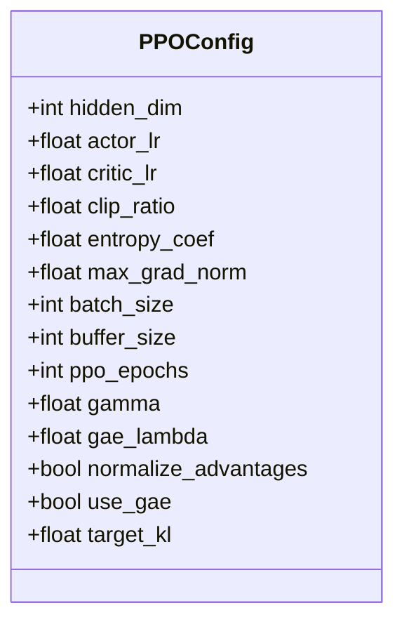
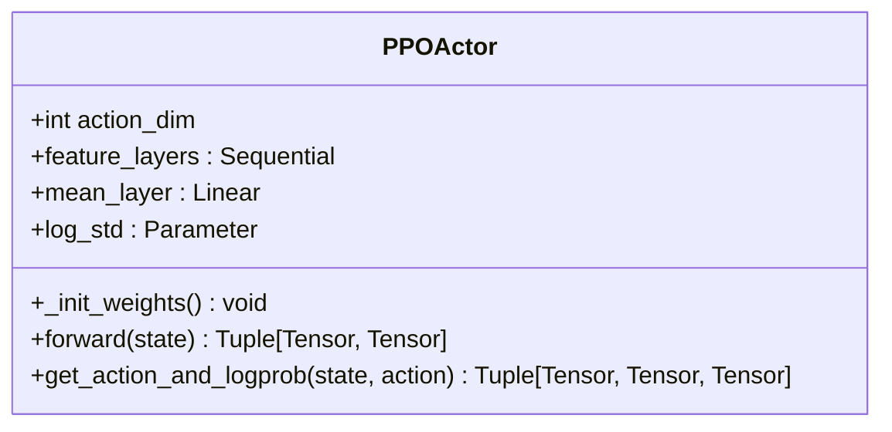
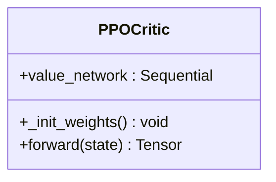
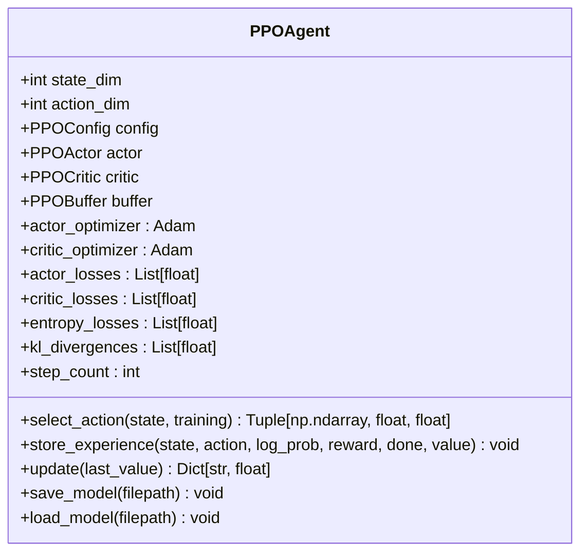
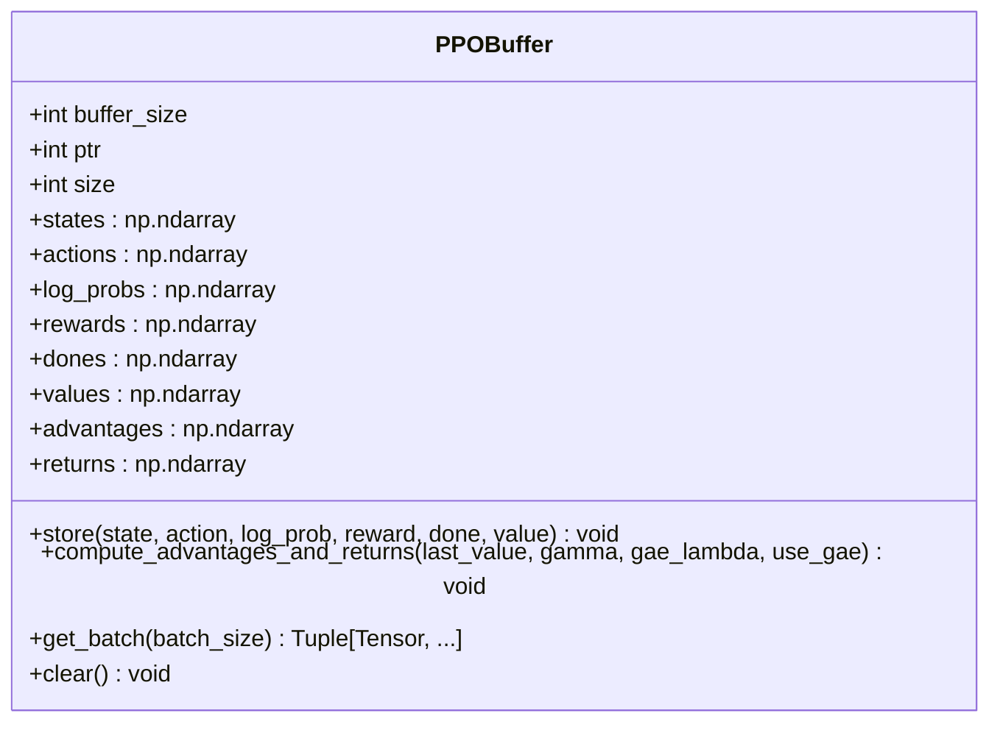
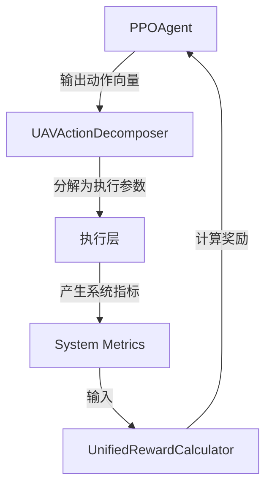

# PPO算法实现

<cite>
**本文档引用的文件**  
- [ppo.py](file://single_agent/ppo.py)
- [algorithm_config.py](file://config/algorithm_config.py)
- [uav_action_space.py](file://algorithms/uav_action_space.py)
- [reward_calculator.py](file://utils/reward_calculator.py)
- [system_config.py](file://config/system_config.py)
</cite>

## 目录
1. [引言](#引言)
2. [PPO核心组件](#ppo核心组件)
3. [策略更新机制](#策略更新机制)
4. [经验缓冲区设计](#经验缓冲区设计)
5. [优势函数与GAE实现](#优势函数与gae实现)
6. [车联网任务卸载场景中的PPO应用](#车联网任务卸载场景中的ppo应用)
7. [超参数调优指南](#超参数调优指南)
8. [与确定性策略梯度方法的对比](#与确定性策略梯度方法的对比)
9. [结论](#结论)

## 引言
本文档系统性地阐述了近端策略优化（PPO）算法在车联网任务卸载系统中的实现细节。重点分析其核心机制——裁剪代理目标函数（clipped surrogate objective），该机制通过限制策略更新的幅度，在保证训练稳定性的同时维持较高的样本效率。文档深入解析了`PPOAgent`类中策略损失、熵正则化、KL散度监控以及广义优势估计（GAE）的实现逻辑，并探讨了`PPOBuffer`经验缓冲区的结构设计及其在多轮更新中的作用。结合固定无人机（UAV）在边缘计算环境中的任务卸载决策，展示了PPO处理连续动作空间的灵活性。

**Section sources**
- [ppo.py](file://single_agent/ppo.py#L32-L55)
- [uav_action_space.py](file://algorithms/uav_action_space.py#L22-L109)

## PPO核心组件
PPO算法的实现主要由四个核心类构成：`PPOConfig`、`PPOActor`、`PPOCritic`和`PPOAgent`，它们共同协作完成策略的学习与优化。

### 配置管理
`PPOConfig`类集中管理了算法的所有超参数，包括网络结构、PPO特定参数和训练参数。这些参数的设计旨在平衡探索与利用、稳定性与收敛速度。



**Diagram sources**
- [ppo.py](file://single_agent/ppo.py#L32-L55)

### 策略网络（Actor）
`PPOActor`是一个随机策略网络，输出动作的均值和标准差。它采用正态分布（Normal）来建模动作空间，从而能够处理连续动作。网络通过`orthogonal_`方法初始化权重，以增强训练的稳定性。



**Diagram sources**
- [ppo.py](file://single_agent/ppo.py#L58-L113)

### 价值网络（Critic）
`PPOCritic`负责估计状态价值函数V(s)，用于计算优势函数。其结构与Actor网络类似，但输出维度为1。同样采用正交初始化，确保价值估计的准确性。



**Diagram sources**
- [ppo.py](file://single_agent/ppo.py#L116-L144)

### 智能体主控类
`PPOAgent`是算法的核心控制器，负责协调Actor和Critic网络，管理经验缓冲区，并执行PPO更新循环。它封装了动作选择、经验存储和策略更新的完整流程。



**Diagram sources**
- [ppo.py](file://single_agent/ppo.py#L235-L407)

**Section sources**
- [ppo.py](file://single_agent/ppo.py#L235-L407)

## 策略更新机制
PPO的核心在于其创新的裁剪代理目标函数，该机制有效解决了传统策略梯度方法中步长选择的难题。

### 裁剪代理目标函数
在`PPOAgent.update`方法中，策略更新通过最小化裁剪后的代理损失来实现。该损失函数定义为：
```
actor_loss = -min(ratio * advantages, clip(ratio, 1-ε, 1+ε) * advantages)
```
其中，`ratio`是新旧策略概率的比值，`ε`（即`clip_ratio`）是裁剪范围。此设计确保了策略更新不会过于激进，从而维持了训练的稳定性。

### 熵正则化
为了鼓励智能体进行探索，总Actor损失中加入了负熵项：
```
total_actor_loss = actor_loss + entropy_coef * (-entropy.mean())
```
熵正则化项`entropy_coef`作为超参数，控制着探索的强度。较高的值会促使智能体保持更高的动作不确定性。

### KL散度监控与早停
在每次PPO更新周期中，都会计算新旧策略之间的KL散度：
```
kl_div = (batch_old_log_probs - new_log_probs).mean()
```
如果KL散度超过`target_kl`的四倍，更新循环将提前终止（early stopping），防止策略发生过度更新，这是PPO保证稳定性的另一道防线。

**Section sources**
- [ppo.py](file://single_agent/ppo.py#L287-L387)

## 经验缓冲区设计
`PPOBuffer`是PPO算法中用于存储和管理经验数据的关键组件，其设计支持高效的多轮小批量更新。

### 结构与功能
`PPOBuffer`是一个固定大小的环形缓冲区，存储了状态、动作、对数概率、奖励、终止标志、价值估计、优势函数和回报等数据。其`store`方法以循环方式写入数据，`clear`方法在每次更新后清空缓冲区。

### 多轮更新作用
与DQN等算法不同，PPO允许从同一组经验中进行多轮（`ppo_epochs`次）更新。`PPOBuffer.get_batch`方法通过随机采样生成小批量数据，使得有限的经验可以被重复利用，极大地提高了样本效率。这种“重放”机制是PPO高效性的关键。



**Diagram sources**
- [ppo.py](file://single_agent/ppo.py#L147-L232)

**Section sources**
- [ppo.py](file://single_agent/ppo.py#L147-L232)

## 优势函数与GAE实现
准确的优势函数估计是PPO成功的关键，`PPOBuffer.compute_advantages_and_returns`方法实现了广义优势估计（GAE）。

### GAE计算逻辑
GAE通过结合多步TD误差来平衡偏差和方差。其计算过程从后往前进行，利用递归关系：
```
delta_t = r_t + γ * V(s_{t+1}) * (1-done) - V(s_t)
advantage_t = delta_t + γ * λ * (1-done) * advantage_{t+1}
```
其中`λ`（`gae_lambda`）控制了多步回溯的权重。当`λ=1`时，GAE退化为蒙特卡洛估计；当`λ=0`时，退化为单步TD误差。

### 优势函数标准化
在更新前，代码实现了优势函数的标准化：
```
advantages = (advantages - advantages.mean()) / (advantages.std() + 1e-8)
```
此操作将优势值归一化到零均值、单位方差，有助于稳定梯度更新，防止因优势值尺度差异过大而导致训练不稳定。

**Section sources**
- [ppo.py](file://single_agent/ppo.py#L180-L214)

## 车联网任务卸载场景中的PPO应用
在本系统中，PPO被应用于固定UAV的决策优化，展示了其在复杂连续动作空间中的灵活性。

### 连续动作空间处理
`FixedUAVActionSpace`类定义了一个8维的连续动作空间，每一维对应一个具体的决策参数，如电池功率管理、服务优先级、覆盖区域调整等。PPO的随机策略网络（`PPOActor`）天然适合这种连续空间，能够输出精确的控制信号。

### 动作解释与分解
`UAVActionDecomposer`类将PPO输出的连续动作向量解释为具体的执行参数。例如，将`[-1,1]`范围内的动作值映射到实际的功率级别（30%-100%）、覆盖半径倍数（0.5-1.5）等物理量，实现了从抽象策略到具体决策的转换。

### 奖励函数集成
系统的奖励计算由`UnifiedRewardCalculator`统一管理，该模块实现了论文中的目标函数，综合考虑了延迟、能耗和数据丢失率。PPO智能体通过最大化这个统一的奖励信号，学习到最优的卸载和资源管理策略。



**Diagram sources**
- [uav_action_space.py](file://algorithms/uav_action_space.py#L22-L109)
- [uav_action_space.py](file://algorithms/uav_action_space.py#L111-L176)
- [reward_calculator.py](file://utils/reward_calculator.py#L20-L244)

**Section sources**
- [uav_action_space.py](file://algorithms/uav_action_space.py#L22-L176)
- [reward_calculator.py](file://utils/reward_calculator.py#L20-L244)

## 超参数调优指南
合理的超参数设置对PPO的性能至关重要。以下是关键超参数的调优建议：

| 超参数 | 推荐值 | 说明 |
| :--- | :--- | :--- |
| `clip_ratio` | 0.1 - 0.3 | 控制策略更新的保守程度。值越小越稳定，但学习速度越慢。 |
| `entropy_coef` | 0.001 - 0.05 | 控制探索强度。初始值可设高些以促进探索，后期可降低。 |
| `ppo_epochs` | 3 - 10 | 每批经验的更新轮数。值越大样本效率越高，但可能过拟合。 |
| `target_kl` | 0.01 - 0.02 | KL散度的参考值。用于早停，防止策略崩溃。 |
| `gamma` | 0.99 - 0.999 | 折扣因子。值越高越关注长期回报。 |
| `gae_lambda` | 0.9 - 0.99 | GAE的权衡参数。值越高方差越大，偏差越小。 |
| `batch_size` | 64 - 256 | 批次大小。影响训练稳定性和速度。 |

**Section sources**
- [ppo.py](file://single_agent/ppo.py#L32-L55)
- [algorithm_config.py](file://config/algorithm_config.py#L50-L58)

## 与确定性策略梯度方法的对比
PPO与DDPG、TD3等基于确定性策略梯度的方法在处理车联网任务卸载时有显著差异。

| 特性 | PPO (随机策略) | DDPG/TD3 (确定性策略) |
| :--- | :--- | :--- |
| **策略类型** | 随机策略，输出动作分布 | 确定性策略，输出确定动作 |
| **探索方式** | 通过策略本身的随机性（如正态分布） | 依赖外部噪声（如Ornstein-Uhlenbeck） |
| **训练稳定性** | 高，通过裁剪和KL散度约束 | 相对较低，对超参数敏感 |
| **样本效率** | 高，支持多轮更新 | 低，通常单轮更新 |
| **实现复杂度** | 中等 | 高，需要目标网络和软更新 |
| **适用场景** | 通用，尤其适合高维连续空间 | 适合需要精确控制的场景 |

PPO在本系统中表现出更好的鲁棒性和易调性，特别适合UAV这种需要在探索（如尝试新覆盖模式）和利用（如保持稳定悬停）之间动态平衡的场景。

**Section sources**
- [ppo.py](file://single_agent/ppo.py#L235-L407)
- [single_agent/ddpg.py](file://single_agent/ddpg.py)
- [single_agent/td3.py](file://single_agent/td3.py)

## 结论
本文档详细解析了PPO算法在车联网任务卸载系统中的实现。PPO通过其裁剪代理目标函数和KL散度早停机制，在训练稳定性上表现出色。经验缓冲区的设计和多轮更新策略极大地提升了样本效率。在处理固定UAV的8维连续动作空间时，PPO展现了强大的灵活性和适应性。与DDPG、TD3等方法相比，PPO在实现复杂度和调参难度上更具优势，是解决此类复杂决策问题的有效选择。未来的工作可以探索自适应的`clip_ratio`和`entropy_coef`，以进一步提升算法性能。