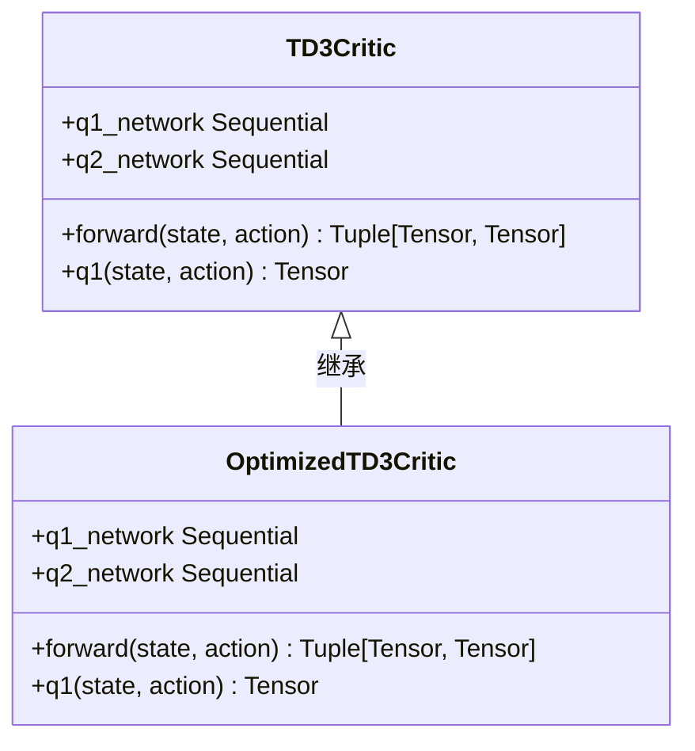
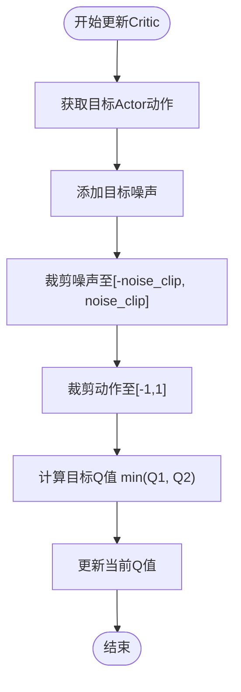
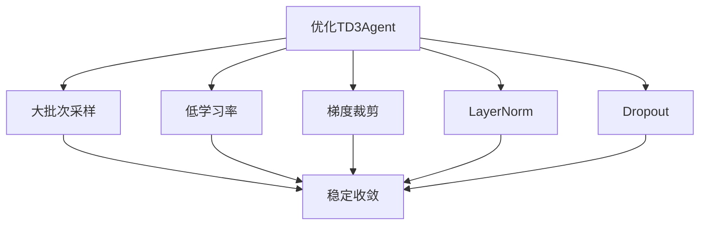

# TD3算法实现

<cite>
**本文档引用的文件**  
- [td3.py](file://single_agent/td3.py)
- [td3_optimized.py](file://single_agent/td3_optimized.py)
- [td3_optimized_agent.py](file://single_agent/td3_optimized_agent.py)
</cite>

## 目录
1. [引言](#引言)
2. [核心机制实现分析](#核心机制实现分析)
3. [双Q网络与目标策略平滑机制](#双q网络与目标策略平滑机制)
4. [延迟策略更新与目标网络更新](#延迟策略更新与目标网络更新)
5. [优先级经验回放集成](#优先级经验回放集成)
6. [标准版本与优化版本对比](#标准版本与优化版本对比)
7. [高维连续控制任务中的优势](#高维连续控制任务中的优势)
8. [调参实践建议](#调参实践建议)
9. [结论](#结论)

## 引言
TD3（Twin Delayed Deep Deterministic Policy Gradient）算法是一种先进的深度强化学习方法，专为解决连续动作空间中的控制问题而设计。本项目实现了标准TD3及其优化版本，应用于边缘计算环境下的资源调度与任务迁移决策。通过双Q网络、目标策略平滑和延迟策略更新三大核心机制，TD3有效缓解了Q值过高估计问题，提升了训练稳定性。优化版本进一步引入批次大小优化、学习率调度器和梯度裁剪等技术，显著增强了数值稳定性和收敛效率。

## 核心机制实现分析
TD3算法在`single_agent/td3.py`中通过`TD3Agent`类实现，其核心机制包括双Q网络结构、目标策略平滑和延迟策略更新。该类维护了主网络（actor和critic）与目标网络（target_actor和target_critic），并通过软更新方式逐步同步参数，确保训练过程的稳定性。优化版本`OptimizedTD3Agent`位于`td3_optimized_agent.py`，在原有基础上增强了网络结构、优化器配置和经验回放机制，提升了整体性能。

**Section sources**
- [td3.py](file://single_agent/td3.py#L216-L426)
- [td3_optimized_agent.py](file://single_agent/td3_optimized_agent.py#L122-L382)

## 双Q网络与目标策略平滑机制
### 双Q网络结构
TD3采用双Q网络（Twin Critic）结构，由`TD3Critic`类实现。该结构包含两个独立的Q网络（q1_network和q2_network），在计算目标Q值时取两者最小值，从而抑制Q值的过高估计。这种设计有效减少了策略更新过程中的偏差，提高了学习稳定性。



**Diagram sources**
- [td3.py](file://single_agent/td3.py#L100-L150)
- [td3_optimized.py](file://single_agent/td3_optimized.py#L262-L332)

### 目标策略平滑
目标策略平滑是TD3的关键创新之一，在`_update_critic`方法中实现。通过为目标动作添加噪声并进行裁剪，避免了目标Q值对特定动作的过度敏感，增强了策略的鲁棒性。具体实现中，噪声被限制在`[-noise_clip, noise_clip]`范围内，确保扰动不会过大。



**Diagram sources**
- [td3.py](file://single_agent/td3.py#L336-L370)
- [td3_optimized_agent.py](file://single_agent/td3_optimized_agent.py#L262-L324)

## 延迟策略更新与目标网络更新
### 延迟策略更新机制
TD3通过延迟策略更新减少策略更新频率，从而提高训练稳定性。在`update`方法中，仅当`update_count % policy_delay == 0`时才执行Actor网络更新。这一机制使得Critic网络有更多机会收敛，避免了Actor过快更新导致的不稳定。

```mermaid
sequenceDiagram
participant Agent as TD3Agent
participant Critic as Critic Network
participant Actor as Actor Network
participant Target as Target Networks
loop 每次更新
Agent->>Critic : 更新Critic网络
Critic-->>Agent : 返回Critic损失
alt 更新周期满足
Agent->>Actor : 更新Actor网络
Actor-->>Agent : 返回Actor损失
Agent->>Target : 软更新目标网络
end
Agent->>Agent : 衰减探索噪声
end
```

**Diagram sources**
- [td3.py](file://single_agent/td3.py#L283-L334)
- [td3_optimized_agent.py](file://single_agent/td3_optimized_agent.py#L197-L260)

### 目标网络稳定更新
目标网络通过软更新方式逐步吸收主网络参数，更新公式为：`θ_target = τ × θ + (1-τ) × θ_target`。该机制在`soft_update`方法中实现，确保目标Q值变化平滑，避免训练过程中的剧烈波动。

**Section sources**
- [td3.py](file://single_agent/td3.py#L388-L400)
- [td3_optimized_agent.py](file://single_agent/td3_optimized_agent.py#L340-L350)

## 优先级经验回放集成
TD3将优先级经验回放（PER）与TD误差紧密结合。在`_update_critic`中计算TD误差后，立即调用`replay_buffer.update_priorities`更新对应经验的优先级。高TD误差的经验将获得更高采样概率，加速关键经验的学习。

```mermaid
flowchart LR
A[采样经验] --> B[计算TD误差]
B --> C{是否包含NaN/Inf?}
C --> |是| D[使用默认优先级]
C --> |否| E[计算abs(TD误差)+1e-6]
D --> F[更新优先级]
E --> F
F --> G[用于下次采样]
```

**Section sources**
- [td3.py](file://single_agent/td3.py#L336-L370)
- [td3_optimized_agent.py](file://single_agent/td3_optimized_agent.py#L262-L324)

## 标准版本与优化版本对比
### 配置参数对比
| 参数 | 标准TD3 | 优化TD3 | 改进效果 |
|------|--------|--------|--------|
| actor_lr | 1e-4 | 5e-6 | 提升数值稳定性 |
| critic_lr | 1e-4 | 1e-5 | 减少梯度震荡 |
| batch_size | 256 | 512 | 提高样本利用率 |
| policy_delay | 2 | 4 | 增强训练稳定性 |
| target_noise | 0.1 | 0.05 | 减少策略扰动 |
| buffer_size | 100000 | 1000000 | 增强经验多样性 |

**Section sources**
- [td3.py](file://single_agent/td3.py#L32-L62)
- [td3_optimized.py](file://single_agent/td3_optimized.py#L25-L54)

### 优化技术分析
优化版本引入了多项改进：
1. **批次大小优化**：采用更大的批次提高训练稳定性
2. **学习率调度器**：使用`ExponentialLR`逐步降低学习率
3. **梯度裁剪**：设置`grad_clip=0.5`防止梯度爆炸
4. **网络结构改进**：增加LayerNorm和Dropout提升泛化能力



**Section sources**
- [td3_optimized.py](file://single_agent/td3_optimized.py#L25-L54)
- [td3_optimized_agent.py](file://single_agent/td3_optimized_agent.py#L125-L169)

## 高维连续控制任务中的优势
TD3在边缘节点资源调度中展现出卓越性能，特别是在处理高维连续动作空间时。通过120维的动作输出（包含车辆、RSU和UAV的联合决策），TD3能够精确控制本地处理比例、卸载目标选择、计算资源分配等连续变量。其确定性策略网络保证了相同状态下输出动作的一致性，适用于需要稳定控制的场景。

**Section sources**
- [td3_optimized.py](file://single_agent/td3_optimized.py#L65-L119)
- [td3_optimized_agent.py](file://single_agent/td3_optimized_agent.py#L171-L190)

## 调参实践建议
### 关键参数调优
- **目标噪声**：建议初始值0.05-0.1，过高会导致策略不稳定，过低则探索不足
- **延迟更新周期**：通常设置为2-4，过大会减慢收敛速度，过小会降低稳定性
- **探索噪声衰减**：建议衰减率0.999-0.9999，确保充分探索后再收敛

### 训练稳定性技巧
1. 使用大缓冲区（>100万）保证经验多样性
2. 采用极低学习率（1e-5量级）配合指数衰减
3. 设置合理的预热步数（>5万步）避免早期过拟合
4. 定期保存检查点，便于恢复和比较

**Section sources**
- [td3.py](file://single_agent/td3.py#L32-L62)
- [td3_optimized.py](file://single_agent/td3_optimized.py#L25-L54)

## 结论
TD3算法通过双Q网络、目标策略平滑和延迟策略更新三大机制，有效解决了连续控制任务中的Q值过高估计问题。本实现不仅完整复现了标准TD3，还通过批次优化、学习率调度和梯度裁剪等技术显著提升了训练稳定性。在边缘计算资源调度场景中，TD3展现出精确的动作输出能力和良好的收敛特性，为复杂系统的智能决策提供了可靠解决方案。