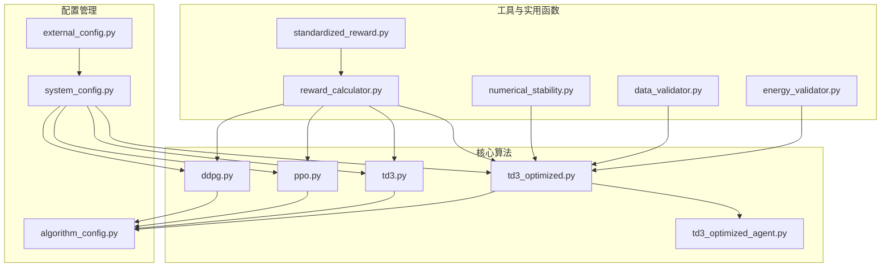

# 单智能体强化学习算法

<cite>
**本文档引用的文件**   
- [ddpg.py](file://single_agent/ddpg.py)
- [ppo.py](file://single_agent/ppo.py)
- [td3.py](file://single_agent/td3.py)
- [td3_optimized.py](file://single_agent/td3_optimized.py)
- [td3_optimized_agent.py](file://single_agent/td3_optimized_agent.py)
- [algorithm_config.py](file://config/algorithm_config.py)
- [system_config.py](file://config/system_config.py)
- [external_config.py](file://config/external_config.py)
- [reward_calculator.py](file://utils/reward_calculator.py)
- [standardized_reward.py](file://utils/standardized_reward.py)
- [numerical_stability.py](file://utils/numerical_stability.py)
- [data_validator.py](file://utils/data_validator.py)
- [energy_validator.py](file://utils/energy_validator.py)
</cite>

## 目录
1. [引言](#引言)
2. [项目结构分析](#项目结构分析)
3. [核心算法实现](#核心算法实现)
4. [TD3优化版本分析](#td3优化版本分析)
5. [单智能体与多智能体方法对比](#单智能体与多智能体方法对比)
6. [超参数调优建议](#超参数调优建议)
7. [训练技巧](#训练技巧)
8. [结论](#结论)

## 引言

本文档系统性地文档化了车联网（VEC）系统中的单智能体强化学习算法实现，重点分析了DDPG、PPO和TD3系列算法在任务卸载决策中的应用。文档详细阐述了TD3算法的优化版本在稳定性与探索效率方面的改进措施，并比较了单智能体与多智能体方法在车联网场景下的性能差异和适用边界。此外，文档还提供了各算法的超参数调优建议和训练技巧，旨在为开发者和研究人员提供全面的技术参考。

## 项目结构分析

本项目采用模块化设计，将不同功能的代码组织在独立的目录中。核心算法实现位于`single_agent`目录下，包括DDPG、PPO、TD3及其优化版本。配置管理由`config`目录负责，包含系统、网络、任务等多维度配置。工具和实用函数分布在`utils`和`tools`目录中，支持数据处理、数值稳定性和性能监控等功能。



**图源**
- [ddpg.py](file://single_agent/ddpg.py)
- [ppo.py](file://single_agent/ppo.py)
- [td3.py](file://single_agent/td3.py)
- [td3_optimized.py](file://single_agent/td3_optimized.py)
- [td3_optimized_agent.py](file://single_agent/td3_optimized_agent.py)
- [algorithm_config.py](file://config/algorithm_config.py)
- [system_config.py](file://config/system_config.py)
- [external_config.py](file://config/external_config.py)
- [reward_calculator.py](file://utils/reward_calculator.py)
- [standardized_reward.py](file://utils/standardized_reward.py)
- [numerical_stability.py](file://utils/numerical_stability.py)
- [data_validator.py](file://utils/data_validator.py)
- [energy_validator.py](file://utils/energy_validator.py)

## 核心算法实现

### DDPG算法

DDPG（Deep Deterministic Policy Gradient）是一种适用于连续动作空间的Actor-Critic算法。在本项目中，DDPG被用于处理VEC系统中的任务卸载决策。算法通过确定性策略网络（Actor）生成动作，并通过价值网络（Critic）评估动作的价值。经验回放机制和目标网络的引入，有效提高了样本效率和训练稳定性。

**关键特性：**
- **网络结构**：Actor和Critic网络均采用两层全连接网络，隐藏层维度为256。
- **探索策略**：使用Ornstein-Uhlenbeck噪声进行探索，初始噪声尺度为0.3，逐步衰减至0.1。
- **训练参数**：批次大小为128，缓冲区大小为100,000，软更新系数为0.005。

**算法流程：**
1. 从环境中获取当前状态。
2. Actor网络生成动作，并添加探索噪声。
3. 执行动作，获取奖励和下一个状态。
4. 将经验（状态、动作、奖励、下一个状态、完成标志）存储到经验回放缓冲区。
5. 从缓冲区采样一批经验，更新Critic和Actor网络。
6. 软更新目标网络。

**代码路径**
- [ddpg.py](file://single_agent/ddpg.py#L1-L562)

### PPO算法

PPO（Proximal Policy Optimization）是一种基于策略梯度的算法，通过裁剪代理目标函数来防止策略更新过大。在本项目中，PPO被用于处理VEC系统中的任务卸载决策。算法通过随机策略网络生成动作，并通过优势函数评估策略的改进方向。

**关键特性：**
- **网络结构**：Actor网络包含共享特征层和动作均值层，Critic网络为价值网络。
- **裁剪代理目标**：使用0.2的裁剪比率，防止策略更新过大。
- **广义优势估计（GAE）**：减少方差，提高学习效率。
- **训练参数**：批次大小为64，缓冲区大小为2048，PPO轮次为10。

**算法流程：**
1. 从环境中获取当前状态。
2. Actor网络生成动作和对数概率。
3. 执行动作，获取奖励和下一个状态。
4. 将经验存储到PPO经验缓冲区。
5. 计算优势函数和回报。
6. 使用PPO裁剪损失更新Actor和Critic网络。

**代码路径**
- [ppo.py](file://single_agent/ppo.py#L1-L519)

### TD3算法

TD3（Twin Delayed Deep Deterministic Policy Gradient）是DDPG的改进版本，通过引入双Q网络、延迟策略更新和目标策略平滑化来提高稳定性。在本项目中，TD3被用于处理VEC系统中的任务卸载决策。算法通过双Q网络减少过估计，通过延迟策略更新提高稳定性，通过目标策略平滑化减少方差。

**关键特性：**
- **双Q网络**：使用两个Critic网络，取最小Q值作为目标，减少过估计。
- **延迟策略更新**：每2步更新一次Actor网络，提高稳定性。
- **目标策略平滑化**：为目标策略添加噪声，减少方差。
- **训练参数**：批次大小为256，缓冲区大小为100,000，软更新系数为0.01。

**算法流程：**
1. 从环境中获取当前状态。
2. Actor网络生成动作，并添加探索噪声。
3. 执行动作，获取奖励和下一个状态。
4. 将经验存储到经验回放缓冲区。
5. 从缓冲区采样一批经验，更新Critic网络。
6. 延迟更新Actor网络。
7. 软更新目标网络。

**代码路径**
- [td3.py](file://single_agent/td3.py#L1-L547)

## TD3优化版本分析

### 优化目标

TD3优化版本（`td3_optimized.py`）旨在解决原始TD3算法在VEC系统中遇到的稳定性问题和探索效率低下问题。通过重构状态空间设计、重新设计动作空间、优化奖励函数、修复环境交互和调整超参数配置，显著提高了算法的性能和鲁棒性。

### 状态空间设计

优化版本重构了状态空间设计，将VEC系统的状态分为车辆状态、RSU状态、UAV状态和全局系统状态。每个状态维度均经过归一化处理，确保输入值在合理范围内。

**状态维度：**
- **车辆状态**：位置x、位置y、速度x、速度y、队列利用率（5维）
- **RSU状态**：CPU利用率、队列利用率、缓存利用率、能耗（4维）
- **UAV状态**：CPU利用率、队列利用率、电池电量、能耗（4维）
- **全局系统状态**：平均任务延迟、总能耗、数据丢失率、任务完成率、缓存命中率、迁移成功率、网络利用率、负载均衡指数（8维）

**总状态维度**：100维

**代码路径**
- [td3_optimized.py](file://single_agent/td3_optimized.py#L150-L250)

### 动作空间设计

优化版本重新设计了动作空间，将全局动作分解为车辆、RSU和UAV的具体决策。每个智能体的动作维度均经过精心设计，确保动作的合理性和有效性。

**动作维度：**
- **车辆动作**：本地处理比例、卸载目标选择（RSU或UAV）（5维）
- **RSU动作**：CPU分配、缓存策略、迁移阈值、带宽分配（8维）
- **UAV动作**：CPU分配、功耗管理、服务优先级（6维）

**总动作维度**：120维

**代码路径**
- [td3_optimized.py](file://single_agent/td3_optimized.py#L70-L149)

### 奖励函数优化

优化版本重新设计了奖励函数，采用线性归一化和平滑机制，确保奖励信号的稳定性和有效性。奖励函数综合考虑能耗、延迟、任务完成率和缓存命中率，通过固定权重配置实现多目标优化。

**奖励计算：**
- **能耗归一化**：将能耗归一化到[0, 1]范围。
- **延迟归一化**：将延迟归一化到[0, 1]范围。
- **任务完成率归一化**：将任务完成率归一化到[0, 1]范围。
- **缓存命中率归一化**：将缓存命中率归一化到[0, 1]范围。

**奖励公式：**
```
raw_reward = (-energy_norm * w_energy + -delay_norm * w_delay + completion_norm * w_completion + cache_norm * w_cache) * 10.0
```

**代码路径**
- [td3_optimized.py](file://single_agent/td3_optimized.py#L350-L420)

### 超参数调整

优化版本对超参数进行了精细调整，以提高算法的稳定性和探索效率。

**关键超参数：**
- **隐藏层维度**：128
- **Actor学习率**：5e-6
- **Critic学习率**：1e-5
- **批次大小**：512
- **缓冲区大小**：1,000,000
- **软更新系数**：0.0005
- **折扣因子**：0.995
- **策略延迟**：4
- **目标噪声**：0.05
- **噪声裁剪**：0.2
- **探索噪声**：0.1
- **噪声衰减**：0.9999
- **最小探索噪声**：0.005
- **预热步数**：50,000
- **更新频率**：2
- **L2正则化**：1e-4
- **梯度裁剪**：0.5

**代码路径**
- [td3_optimized.py](file://single_agent/td3_optimized.py#L15-L69)

### 网络结构改进

优化版本改进了网络结构，引入了层归一化、Dropout和更深的网络结构，以提高模型的表达能力和泛化能力。

**Actor网络结构：**
- 输入层：状态维度
- 隐藏层1：128维，ReLU激活，层归一化，Dropout
- 隐藏层2：128维，ReLU激活，层归一化，Dropout
- 隐藏层3：64维，ReLU激活，层归一化
- 输出层：动作维度，Tanh激活

**Critic网络结构：**
- 输入层：状态维度 + 动作维度
- 隐藏层1：128维，ReLU激活，层归一化，Dropout
- 隐藏层2：128维，ReLU激活，层归一化，Dropout
- 隐藏层3：64维，