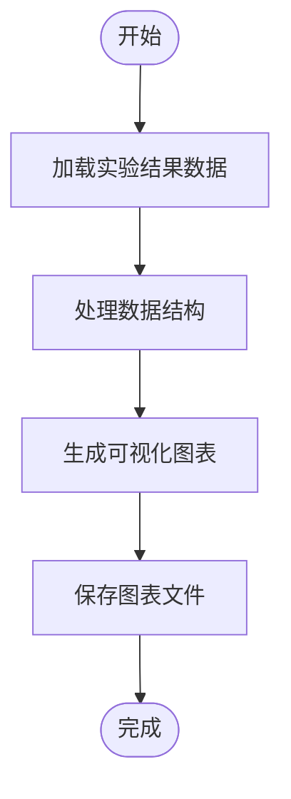
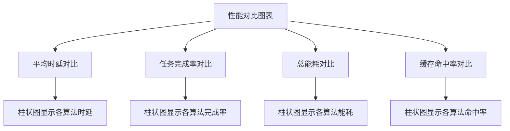
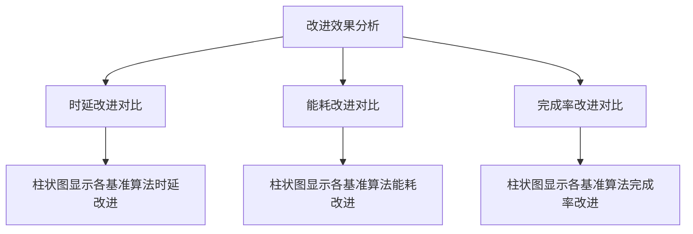
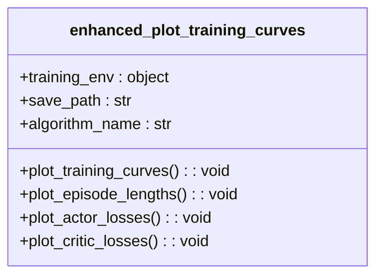
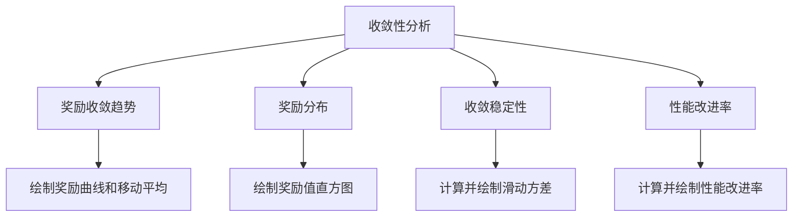
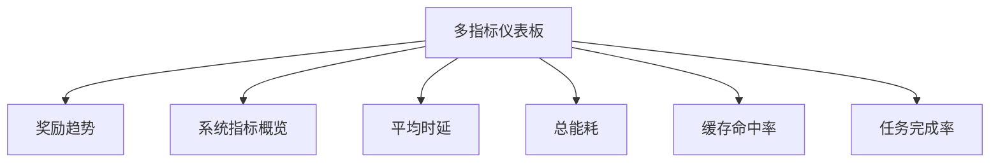
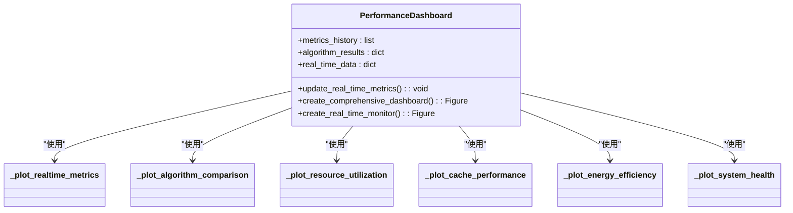
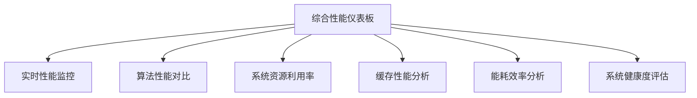

# 可视化与分析工具

<cite>
**Referenced Files in This Document**   
- [visualize_results.py](file://visualize_results.py)
- [tools/advanced_visualization.py](file://tools/advanced_visualization.py)
- [tools/performance_dashboard.py](file://tools/performance_dashboard.py)
</cite>

## 目录
1. [可视化功能概述](#可视化功能概述)
2. [训练结果可视化](#训练结果可视化)
3. [高级可视化功能](#高级可视化功能)
4. [性能监控仪表板](#性能监控仪表板)
5. [图表解读指南](#图表解读指南)
6. [自定义可视化方法](#自定义可视化方法)

## 可视化功能概述

本系统提供了一套完整的可视化与分析工具，用于评估和监控边缘计算环境下的算法性能。这些工具主要分为三个层次：基础结果可视化、高级分析可视化和实时性能监控仪表板。

系统通过 `visualize_results.py` 脚本提供基础的实验结果可视化功能，能够加载训练日志并生成性能对比图表。`tools/advanced_visualization.py` 模块提供了更丰富的可视化功能，包括训练曲线分析、收敛性评估和多指标仪表板。`tools/performance_dashboard.py` 模块则实现了交互式的性能监控仪表板，支持实时数据更新和综合性能评估。

这些可视化工具共同构成了一个完整的分析生态系统，从训练过程监控到最终性能评估，为研究人员和开发者提供了全面的洞察力。

## 训练结果可视化

### 结果加载与处理

`visualize_results.py` 脚本通过 `load_results()` 函数从 `results/full_experiment_results.json` 文件中加载实验结果数据。该函数使用标准的 JSON 解析方法读取存储的实验数据，为后续的可视化分析提供数据基础。

**Section sources**
- [visualize_results.py](file://visualize_results.py#L11-L14)

### 性能对比图表

`create_performance_comparison()` 函数生成四维性能对比图表，全面展示不同算法在各种场景下的表现。该函数创建了一个 2×2 的子图布局，分别显示平均时延、任务完成率、总能耗和缓存命中率的对比情况。

图表对比了五种算法（MATD3-MIG、Random、Greedy、Round_Robin、Load_Aware）在三种实验场景（标准、高负载、大规模）下的性能表现。通过并列的柱状图，可以直观地比较各算法的优劣。

**Section sources**
- [visualize_results.py](file://visualize_results.py#L16-L112)

### 改进效果分析

`create_improvement_chart()` 函数专门用于展示 MATD3-MIG 算法相对于其他基准算法的改进效果。该函数生成三个并列的柱状图，分别显示时延改进、能耗改进和完成率改进的百分比。

通过这种可视化方式，可以清晰地看到在不同实验场景下，MATD3-MIG 算法相对于 Random、Greedy、Round_Robin 和 Load_Aware 等基准算法的具体改进程度，为算法优势的量化分析提供了直观支持。

**Section sources**
- [visualize_results.py](file://visualize_results.py#L114-L155)

### 结果摘要输出

`print_summary()` 函数生成实验结果的文本摘要，以结构化的方式展示关键性能指标。摘要内容包括各实验场景下的平均时延、任务完成率、总能耗和缓存命中率，以及相对于其他算法的最佳改进效果。

这种文本摘要与图形可视化相辅相成，为用户提供了一种快速了解实验结果的途径，特别适合在命令行环境中查看和分享实验结果。

**Section sources**
- [visualize_results.py](file://visualize_results.py#L157-L189)

## 高级可视化功能

### 训练曲线分析

`advanced_visualization.py` 模块中的 `enhanced_plot_training_curves()` 函数提供了增强的训练过程可视化功能。该函数创建一个 2×2 的子图布局，分别显示：

1. **训练奖励变化**：展示回合奖励随训练回合的变化趋势，包括原始奖励和移动平均线
2. **回合长度变化**：显示每个训练回合的持续时间
3. **Actor网络损失**：监控策略网络的训练损失
4. **Critic网络损失**：监控价值网络的训练损失

这种多维度的训练过程监控有助于分析算法的收敛性和稳定性。

**Diagram sources**
- [tools/advanced_visualization.py](file://tools/advanced_visualization.py#L22-L117)

### 系统指标监控

`plot_system_metrics()` 函数专注于系统级性能指标的可视化，包括平均任务时延、总能耗、缓存命中率和任务完成率随训练回合的变化。这些指标直接反映了系统在实际运行中的表现，是评估算法实用性的关键。

通过观察这些指标的变化趋势，可以判断算法是否在持续改进系统性能，以及是否存在性能瓶颈或不稳定现象。

**Section sources**
- [tools/advanced_visualization.py](file://tools/advanced_visualization.py#L162-L217)

### 收敛性分析

`plot_convergence_analysis()` 函数提供专门的收敛性分析功能，通过多种方式评估算法的收敛特性：

- **奖励收敛趋势**：显示奖励值随训练回合的变化，包括滑动平均线
- **奖励分布**：通过直方图展示奖励值的分布情况
- **收敛稳定性**：使用滑动方差评估训练过程的稳定性
- **性能改进率**：计算并显示性能的改进速度

这些分析工具帮助研究人员判断算法是否已经收敛，以及收敛的质量如何。

**Section sources**
- [tools/advanced_visualization.py](file://tools/advanced_visualization.py#L312-L393)

### 多指标仪表板

`plot_multi_metric_dashboard()` 函数创建一个综合的多指标性能仪表板，将多个关键指标整合在一个复杂的布局中。该仪表板包括：

- **奖励趋势分析**：大图显示奖励变化
- **系统指标概览**：标准化后的多个系统指标对比
- **详细指标图**：分别显示平均时延、总能耗、缓存命中率和任务完成率的详细变化

这种综合视图提供了对系统性能的全面洞察，适合在项目汇报或论文展示中使用。

**Section sources**
- [tools/advanced_visualization.py](file://tools/advanced_visualization.py#L395-L485)

## 性能监控仪表板

### 仪表板架构

`PerformanceDashboard` 类是实时性能监控的核心组件，采用模块化的架构设计，包含多个专门的绘图方法：

- `_plot_realtime_metrics()`：实时性能监控
- `_plot_algorithm_comparison()`：算法性能对比
- `_plot_resource_utilization()`：系统资源利用率
- `_plot_cache_performance()`：缓存性能分析
- `_plot_energy_efficiency()`：能耗效率分析
- `_plot_system_health()`：系统健康度评估

这种设计使得仪表板易于扩展和维护，每个功能模块都可以独立开发和测试。

**Diagram sources**
- [tools/performance_dashboard.py](file://tools/performance_dashboard.py#L25-L320)

### 实时性能监控

`create_real_time_monitor()` 函数提供了一个简洁的实时监控界面，包含六个关键指标的实时变化图表：

1. 奖励趋势
2. 平均时延
3. 能耗监控
4. 缓存命中率
5. 任务完成率
6. 系统负载

这些图表以固定的时间步长更新，为用户提供了一个直观的系统状态概览，适合在训练过程中持续监控。

**Section sources**
- [tools/performance_dashboard.py](file://tools/performance_dashboard.py#L300-L320)

### 综合性能评估

`create_comprehensive_dashboard()` 函数生成一个全面的性能监控仪表板，整合了多个维度的性能信息：

- **实时性能监控**：双Y轴图表显示奖励和时延的实时变化
- **算法性能对比**：多指标柱状图比较不同算法的性能
- **系统资源利用率**：水平条形图显示CPU、内存、网络和存储的利用率
- **缓存性能分析**：饼图展示不同类型缓存的命中率分布
- **能耗效率分析**：折线图显示24小时内的能耗效率趋势
- **系统健康度评估**：雷达图综合评估系统的各项健康指标

这种综合视图为系统性能的全面评估提供了强大的支持。

**Section sources**
- [tools/performance_dashboard.py](file://tools/performance_dashboard.py#L25-L320)

## 图表解读指南

### 训练曲线解读

训练曲线是评估算法学习过程的关键工具。在解读训练曲线时，应注意以下几点：

- **奖励趋势**：理想的奖励曲线应呈现上升趋势，并最终趋于稳定。如果奖励值波动过大，可能表明算法不稳定
- **移动平均线**：比原始数据更能反映真实的训练趋势，有助于判断算法是否在持续改进
- **损失函数**：Actor和Critic网络的损失应逐渐减小，但不应过快下降，否则可能表示过拟合

### 性能对比图解读

性能对比图用于比较不同算法或配置的性能。解读时应关注：

- **相对性能**：比较各算法在相同指标下的表现，找出最优算法
- **场景差异**：观察算法在不同实验场景下的表现变化，评估其鲁棒性
- **改进幅度**：通过改进效果图表，量化新算法相对于基准算法的优势

### 仪表板解读

综合性能仪表板提供了系统的整体视图，解读时应：

- **关注关键指标**：奖励、时延、能耗等核心性能指标
- **识别瓶颈**：通过资源利用率图表识别系统瓶颈
- **评估健康度**：雷达图提供了系统健康度的综合评估
- **监控趋势**：关注各项指标的变化趋势，及时发现潜在问题

## 自定义可视化方法

### 扩展可视化功能

用户可以通过以下方式扩展系统的可视化功能：

1. **添加新的图表类型**：在现有模块中添加新的绘图函数
2. **修改现有图表**：调整图表的样式、颜色和布局
3. **集成新的数据源**：从其他文件或数据库加载数据进行可视化

### 创建自定义仪表板

要创建自定义的性能监控仪表板，可以继承 `PerformanceDashboard` 类并重写相应的绘图方法，或直接使用 matplotlib 的 gridspec 功能创建新的布局。

### 集成外部可视化库

系统支持集成其他可视化库，如 seaborn、plotly 等，以实现更丰富的交互式可视化效果。通过在现有代码中引入这些库，可以创建动态、可交互的图表。

### 自动化报告生成

可以将多个可视化函数组合起来，创建自动化报告生成脚本。这样的脚本可以在实验完成后自动运行，生成包含所有关键图表和摘要的完整报告。