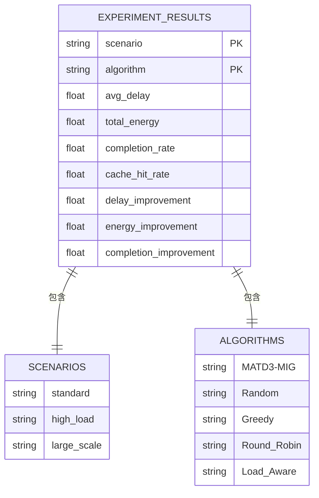
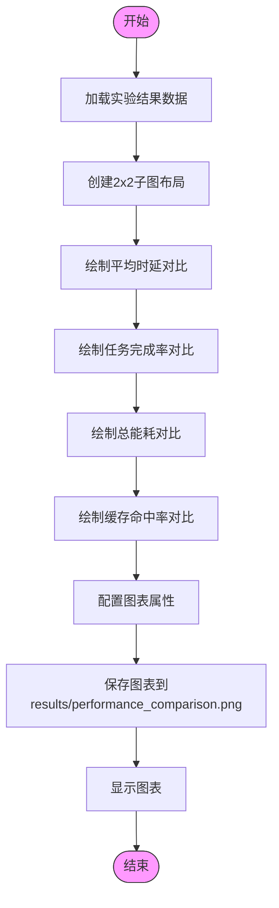
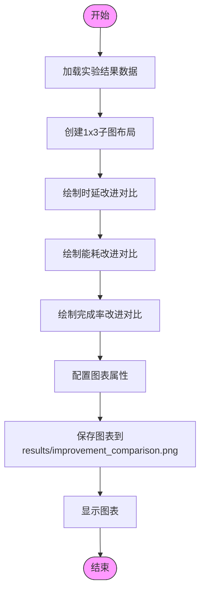
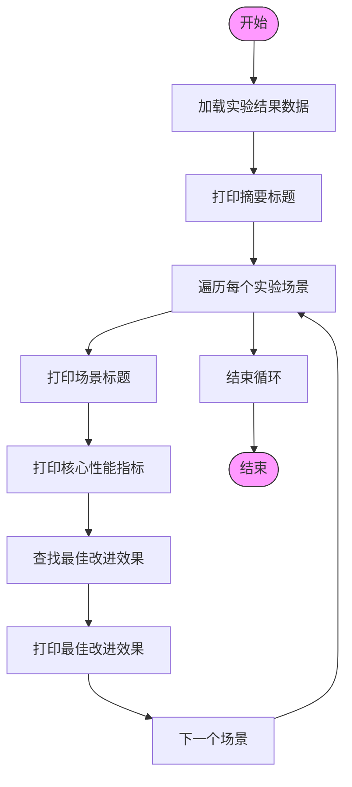

# 基础结果可视化

<cite>
**本文档中引用的文件**  
- [visualize_results.py](file://visualize_results.py)
- [run_full_experiment.py](file://run_full_experiment.py)
- [experiments/evaluation.py](file://experiments/evaluation.py)
</cite>

## 目录
1. [简介](#简介)
2. [核心功能分析](#核心功能分析)
3. [数据加载机制](#数据加载机制)
4. [性能对比图表生成](#性能对比图表生成)
5. [改进效果图表生成](#改进效果图表生成)
6. [文本摘要生成](#文本摘要生成)
7. [视觉元素配置](#视觉元素配置)
8. [扩展性设计](#扩展性设计)
9. [使用示例](#使用示例)

## 简介
本模块`visualize_results.py`负责将多场景实验结果进行可视化展示，提供直观的性能对比和改进效果分析。该模块通过加载JSON格式的实验结果文件，生成包含多个关键性能指标的对比图表，并输出文本摘要报告。模块主要包含四个核心函数：`load_results`用于加载实验数据，`create_performance_comparison`生成四子图性能对比图，`create_improvement_chart`展示算法改进百分比，`print_summary`输出文本摘要。这些功能共同构成了完整的实验结果可视化系统，帮助研究人员快速理解MATD3-MIG算法在不同场景下的性能表现。

## 核心功能分析
`visualize_results.py`模块实现了完整的实验结果可视化流程，从数据加载到图表生成再到文本摘要输出。模块首先通过`load_results`函数从JSON文件中加载多场景实验数据，然后利用`create_performance_comparison`函数生成包含平均时延、任务完成率、总能耗和缓存命中率的四子图对比图表，再通过`create_improvement_chart`函数展示MATD3-MIG相对于基线算法的改进百分比，最后使用`print_summary`函数生成详细的文本摘要。整个流程在`main`函数中被调用执行，确保了可视化结果的完整生成。模块还包含了错误处理机制，当缺少必要的可视化依赖时会给出安装建议，同时确保结果目录的存在。

**Section sources**
- [visualize_results.py](file://visualize_results.py#L1-L216)

## 数据加载机制
`load_results`函数负责从JSON文件中加载多场景实验数据。该函数读取`results/full_experiment_results.json`文件，该文件由`run_full_experiment.py`中的`save_results`方法生成。JSON数据结构包含三个主要实验场景：标准场景、高负载场景和大规模场景，每个场景下包含MATD3-MIG算法和四种基线算法（Random、Greedy、Round_Robin、Load_Aware）的性能指标。每个算法的性能数据包括平均时延、总能耗、任务完成率和缓存命中率等关键指标，以及与其他算法的改进百分比数据。这种结构化的数据组织方式使得后续的可视化分析能够轻松地进行跨场景和跨算法的对比。



**Diagram sources**
- [visualize_results.py](file://visualize_results.py#L11-L14)
- [run_full_experiment.py](file://run_full_experiment.py#L484-L494)
- [experiments/evaluation.py](file://experiments/evaluation.py#L406-L445)

## 性能对比图表生成
`create_performance_comparison`函数生成包含四个子图的性能对比图表，全面展示不同算法在各种指标上的表现。该函数创建2×2的子图布局，分别展示平均时延、任务完成率、总能耗和缓存命中率的对比。图表使用柱状图形式，横轴表示三种实验场景（标准、高负载、大规模），纵轴表示相应指标的数值，不同算法用不同颜色的柱子表示。图表配置了中文字体支持，确保中文标签正确显示，并添加了网格线以提高可读性。最终图表保存为`results/performance_comparison.png`，分辨率为300dpi，确保高质量输出。



**Diagram sources**
- [visualize_results.py](file://visualize_results.py#L16-L112)

## 改进效果图表生成
`create_improvement_chart`函数专门用于展示MATD3-MIG算法相对于基线算法的改进百分比。该函数生成一个包含三个子图的水平布局，分别展示时延改进、能耗改进和完成率改进的对比。每个子图以百分比形式显示MATD3-MIG相对于Random、Greedy、Round_Robin和Load_Aware四种基线算法的性能提升。图表使用柱状图表示改进程度，正值表示性能提升，负值表示性能下降。与性能对比图类似，该函数也配置了中文字体支持和网格线，并将最终结果保存为`results/improvement_comparison.png`，便于后续分析和报告使用。



**Diagram sources**
- [visualize_results.py](file://visualize_results.py#L114-L155)

## 文本摘要生成
`print_summary`函数生成结构化的文本摘要，以清晰的格式展示关键性能指标。摘要以分隔线包围，包含MATD3-MIG算法在三种实验场景下的详细性能数据。对于每个场景，摘要显示平均时延、任务完成率、总能耗和缓存命中率等核心指标，并突出展示最佳改进效果，包括时延、能耗和完成率的最大改进百分比。函数使用表情符号和格式化字符增强可读性，使关键信息一目了然。文本摘要不仅提供了精确的数值结果，还通过"最佳改进效果"部分突出了算法的优势，为研究人员提供了快速评估算法性能的途径。



**Diagram sources**
- [visualize_results.py](file://visualize_results.py#L157-L189)

## 视觉元素配置
模块通过`matplotlib`的`rcParams`配置了视觉元素，确保图表的可读性和美观性。主要配置包括设置中文字体为'SimHei'和'Arial Unicode MS'，以支持中文标签的正确显示，并关闭`axes.unicode_minus`以避免负号显示问题。图表布局方面，性能对比图采用15×12英寸的大小和2×2子图布局，而改进效果图采用18×6英寸的大小和1×3子图布局，确保足够的空间展示数据。所有图表都添加了半透明的网格线（alpha=0.3）以提高数据可读性，并使用`tight_layout`优化子图间距。图表标题使用16号字体和粗体，坐标轴标签和图例也进行了适当的格式化，整体视觉效果专业且清晰。

**Section sources**
- [visualize_results.py](file://visualize_results.py#L20-L21)

## 扩展性设计
模块设计具有良好的扩展性，便于支持新的评估指标或算法对比。要添加新的评估指标，只需在JSON结果文件中包含相应的数据字段，并在`create_performance_comparison`或`create_improvement_chart`函数中添加对应的子图绘制逻辑即可。要支持新的基线算法，需要在`algorithms`列表中添加算法名称，并确保结果文件中包含该算法的数据。模块的函数式设计使得各个可视化功能相对独立，可以单独调用或修改。此外，通过参数化场景和算法列表，模块可以轻松适应不同数量的实验场景和对比算法，而无需修改核心逻辑。

**Section sources**
- [visualize_results.py](file://visualize_results.py#L18-L19)
- [visualize_results.py](file://visualize_results.py#L24-L25)

## 使用示例
以下代码示例展示了如何调用`visualize_results.py`模块中的函数生成自定义报告：

```python
# 导入可视化模块
import visualize_results

# 生成性能对比图表
visualize_results.create_performance_comparison()

# 生成改进效果图表
visualize_results.create_improvement_chart()

# 打印文本摘要
visualize_results.print_summary()

# 或者直接运行主函数生成完整报告
if __name__ == "__main__":
    visualize_results.main()
```

用户可以根据需要单独调用特定的可视化函数，或者运行整个模块生成完整的可视化报告。生成的图表将保存在`results/`目录下，便于在论文或演示中使用。

**Section sources**
- [visualize_results.py](file://visualize_results.py#L191-L216)