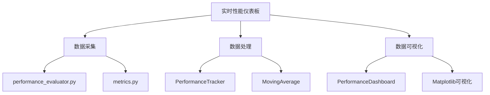
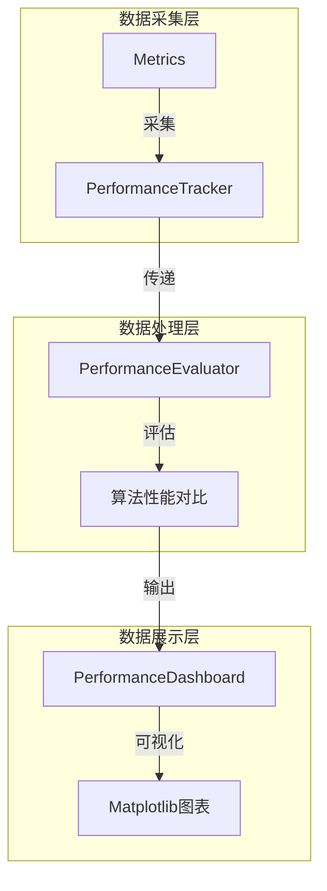
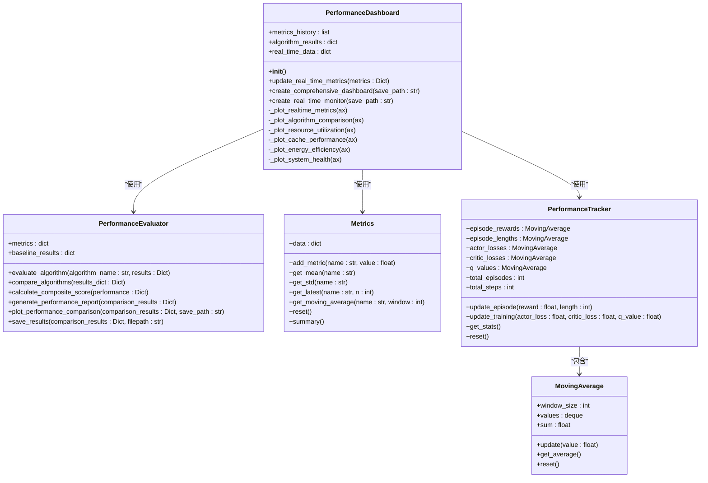
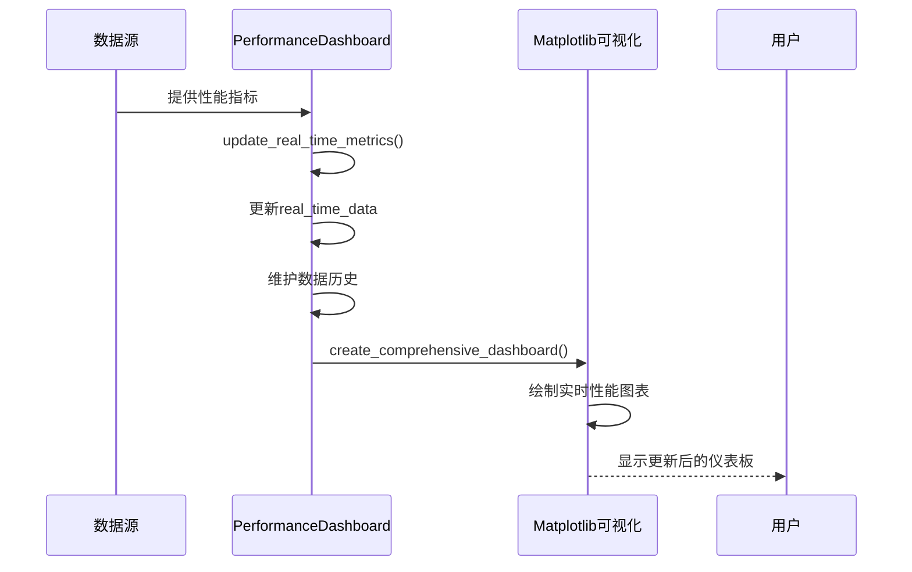
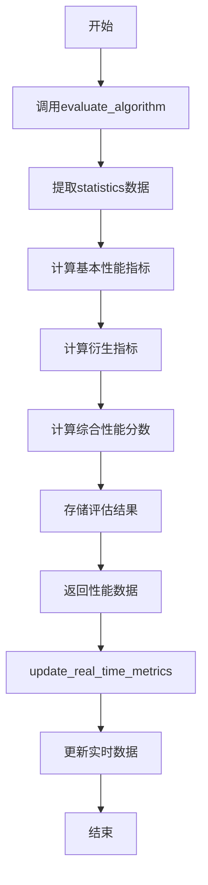
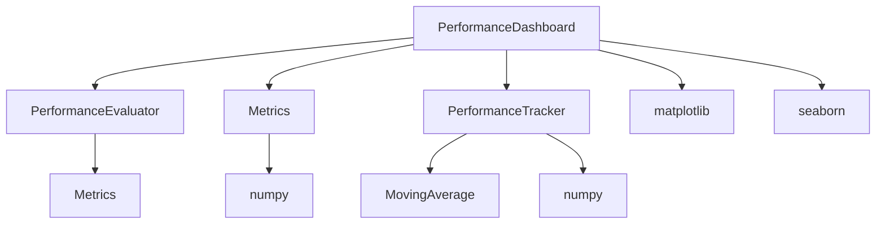

# 实时性能仪表板

<cite>
**本文档引用的文件**
- [performance_dashboard.py](file://tools/performance_dashboard.py)
- [performance_evaluator.py](file://evaluation/performance_evaluator.py)
- [metrics.py](file://utils/metrics.py)
</cite>

## 目录
1. [简介](#简介)
2. [项目结构](#项目结构)
3. [核心组件](#核心组件)
4. [架构概述](#架构概述)
5. [详细组件分析](#详细组件分析)
6. [依赖分析](#依赖分析)
7. [性能考虑](#性能考虑)
8. [故障排除指南](#故障排除指南)
9. [结论](#结论)

## 简介
本文档全面阐述了基于 `performance_dashboard.py` 构建的实时性能监控系统。该系统从 `evaluation/performance_evaluator.py` 和 `utils/metrics.py` 中采集延迟、能耗、任务完成率等核心指标，支持模块化布局设计，可动态添加新的监控面板。文档详细说明了数据更新机制、前端交互控件的后端处理逻辑、状态管理机制以及告警通知配置方法，并提供了扩展新指标的接口实现步骤。

## 项目结构
性能监控系统主要由三个核心模块构成：`tools/performance_dashboard.py` 负责可视化展示与实时监控界面构建；`evaluation/performance_evaluator.py` 提供算法性能评估与对比功能；`utils/metrics.py` 实现基础指标计算与数据跟踪。系统通过模块化设计实现了数据采集、处理与展示的分离，便于维护和扩展。

**图表来源**
- [performance_dashboard.py](file://tools/performance_dashboard.py#L1-L50)
- [performance_evaluator.py](file://evaluation/performance_evaluator.py#L1-L20)
- [metrics.py](file://utils/metrics.py#L1-L15)

**本节来源**
- [performance_dashboard.py](file://tools/performance_dashboard.py#L1-L100)
- [project_structure](file://#L1-L50)

## 核心组件
系统核心组件包括 `PerformanceDashboard` 类，负责构建综合性能仪表板；`PerformanceEvaluator` 类，用于评估和比较不同算法的性能；以及 `Metrics` 和 `PerformanceTracker` 类，用于指标计算和性能跟踪。这些组件协同工作，实现了从数据采集到可视化展示的完整监控流程。

**本节来源**
- [performance_dashboard.py](file://tools/performance_dashboard.py#L40-L60)
- [performance_evaluator.py](file://evaluation/performance_evaluator.py#L12-L30)
- [metrics.py](file://utils/metrics.py#L9-L25)

## 架构概述
系统采用分层架构设计，底层由 `utils/metrics.py` 提供基础指标计算能力，中层由 `evaluation/performance_evaluator.py` 进行算法性能评估，顶层由 `tools/performance_dashboard.py` 实现数据可视化。数据流从指标采集开始，经过处理和评估，最终在仪表板上以多种图表形式展示。

**图表来源**
- [metrics.py](file://utils/metrics.py#L9-L64)
- [performance_evaluator.py](file://evaluation/performance_evaluator.py#L12-L253)
- [performance_dashboard.py](file://tools/performance_dashboard.py#L1-L50)

## 详细组件分析

### PerformanceDashboard 分析
`PerformanceDashboard` 类是系统的核心可视化组件，负责创建综合性能仪表板和实时监控界面。它通过多个私有方法绘制不同类型的图表，包括实时性能监控、算法性能对比、系统资源利用率等。

#### 类图

**图表来源**
- [performance_dashboard.py](file://tools/performance_dashboard.py#L1-L50)
- [performance_evaluator.py](file://evaluation/performance_evaluator.py#L12-L30)
- [metrics.py](file://utils/metrics.py#L9-L64)

### 数据更新机制
系统支持两种数据更新机制：基于轮询的定期更新和实时数据推送。`update_real_time_metrics` 方法负责接收新的性能指标并更新内部数据结构，同时自动维护最近100个数据点的历史记录。

**图表来源**
- [performance_dashboard.py](file://tools/performance_dashboard.py#L40-L54)
- [performance_dashboard.py](file://tools/performance_dashboard.py#L100-L133)

**本节来源**
- [performance_dashboard.py](file://tools/performance_dashboard.py#L40-L133)

### 指标采集流程
系统从 `evaluation/performance_evaluator.py` 和 `utils/metrics.py` 中采集核心性能指标。`PerformanceEvaluator` 负责评估算法性能，计算完成率、延迟、能耗等指标；`Metrics` 和 `PerformanceTracker` 则提供基础的指标计算和跟踪功能。

**图表来源**
- [performance_evaluator.py](file://evaluation/performance_evaluator.py#L19-L47)
- [performance_dashboard.py](file://tools/performance_dashboard.py#L40-L54)

**本节来源**
- [performance_evaluator.py](file://evaluation/performance_evaluator.py#L19-L47)
- [performance_dashboard.py](file://tools/performance_dashboard.py#L40-L54)

## 依赖分析
系统各组件之间存在明确的依赖关系。`PerformanceDashboard` 依赖于 `PerformanceEvaluator` 进行算法性能评估，同时使用 `Metrics` 和 `PerformanceTracker` 进行基础指标计算。这种依赖关系确保了数据采集、处理和展示的分离，提高了系统的可维护性和可扩展性。

**图表来源**
- [performance_dashboard.py](file://tools/performance_dashboard.py#L1-L50)
- [performance_evaluator.py](file://evaluation/performance_evaluator.py#L1-L20)
- [metrics.py](file://utils/metrics.py#L1-L15)

**本节来源**
- [performance_dashboard.py](file://tools/performance_dashboard.py#L1-L100)
- [performance_evaluator.py](file://evaluation/performance_evaluator.py#L1-L30)
- [metrics.py](file://utils/metrics.py#L1-L25)

## 性能考虑
系统在设计时考虑了性能优化。`PerformanceDashboard` 通过限制历史数据点数量（最多100个）来控制内存使用；`MovingAverage` 类使用 `deque` 数据结构实现高效的移动平均计算；`PerformanceEvaluator` 采用加权求和的方式快速计算综合性能分数。这些优化措施确保了系统在处理大量数据时仍能保持良好的响应速度。

**本节来源**
- [performance_dashboard.py](file://tools/performance_dashboard.py#L50-L60)
- [metrics.py](file://utils/metrics.py#L30-L50)
- [performance_evaluator.py](file://evaluation/performance_evaluator.py#L70-L90)

## 故障排除指南
当系统出现性能监控异常时，可按照以下步骤进行排查：首先检查 `real_time_data` 字典是否正确更新；其次验证 `PerformanceEvaluator` 的评估结果是否合理；最后确认 Matplotlib 可视化组件是否正常工作。此外，应检查数据源是否正常提供性能指标，以及各组件之间的依赖关系是否正确建立。

**本节来源**
- [performance_dashboard.py](file://tools/performance_dashboard.py#L40-L54)
- [performance_evaluator.py](file://evaluation/performance_evaluator.py#L19-L47)
- [metrics.py](file://utils/metrics.py#L15-L19)

## 结论
本文档详细阐述了实时性能监控系统的架构和实现。系统通过模块化设计实现了数据采集、处理和展示的分离，具有良好的可维护性和可扩展性。`PerformanceDashboard` 提供了丰富的可视化功能，`PerformanceEvaluator` 实现了算法性能的量化评估，`Metrics` 和 `PerformanceTracker` 提供了基础的指标计算能力。该系统为VEC边缘计算系统的性能监控提供了全面的解决方案。