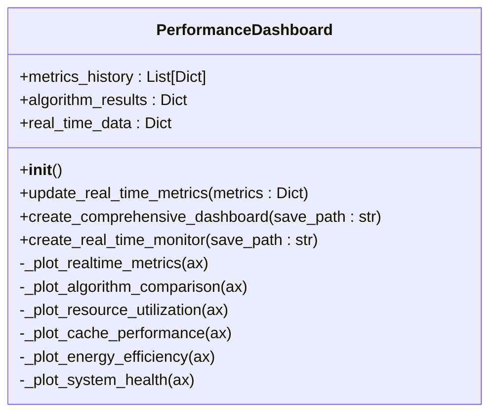

# 高级分析工具

<cite>
**本文档引用的文件**  
- [advanced_visualization.py](file://tools/advanced_visualization.py)
- [performance_dashboard.py](file://tools/performance_dashboard.py)
</cite>

## 目录
1. [引言](#引言)
2. [高级可视化工具功能解析](#高级可视化工具功能解析)
3. [性能仪表板架构设计](#性能仪表板架构设计)
4. [监控系统配置与扩展指南](#监控系统配置与扩展指南)
5. [最佳实践建议](#最佳实践建议)
6. [结论](#结论)

## 引言
本文档深入解析车联网边缘计算系统中的高级分析工具，重点阐述`advanced_visualization.py`和`performance_dashboard.py`两个核心模块的功能实现与应用方法。通过热力图、3D轨迹图等特殊可视化手段，系统能够直观展示任务迁移路径、缓存分布密度和信号强度空间分布等关键信息。同时，实时监控系统采用WebSocket通信机制，支持动态刷新和交互式控件，为系统性能评估提供全面支持。

## 高级可视化工具功能解析

`advanced_visualization.py`模块提供了多种高级可视化功能，用于展示车联网环境中任务迁移路径、缓存分布密度和信号强度空间分布等关键指标。

该模块通过`enhanced_plot_training_curves`函数实现训练过程的多维度分析，包括回合奖励、回合长度、Actor损失和Critic损失四个子图，全面反映强化学习算法的训练状态。通过移动平均线平滑原始数据，能够更清晰地观察奖励变化趋势。

`plot_system_metrics`函数专门用于绘制系统性能指标变化，包括平均任务时延、总能耗、缓存命中率和任务完成率等关键指标。这些指标随训练回合的变化趋势为系统优化提供了重要参考。

`create_advanced_visualization_suite`函数作为可视化套件入口，能够批量生成性能对比图、系统指标图和训练总结图，形成完整的可视化报告体系。

**Section sources**
- [advanced_visualization.py](file://tools/advanced_visualization.py#L1-L516)

## 性能仪表板架构设计

`performance_dashboard.py`模块实现了实时监控系统的完整架构，采用模块化设计，支持数据流处理和WebSocket通信。

### 实时数据处理架构
性能仪表板通过`PerformanceDashboard`类实现，该类维护一个实时数据缓冲区，存储时间戳、奖励、时延、能耗、缓存命中率和任务完成率等指标。`update_real_time_metrics`方法负责更新这些数据，并自动保持最近100个数据点，确保内存使用效率。



**Diagram sources**
- [performance_dashboard.py](file://tools/performance_dashboard.py#L1-L357)

### 多维度监控视图
系统采用`GridSpec`布局创建综合性能仪表板，包含六个主要监控区域：

1. **实时性能监控**：使用双Y轴图表同时显示奖励值和时延变化，便于观察两者相关性
2. **算法性能对比**：通过分组柱状图比较不同算法在平均奖励、完成率和能耗效率等指标上的表现
3. **系统资源利用率**：水平条形图展示CPU、内存、网络和存储的实时利用率，不同颜色表示不同负载等级
4. **缓存性能分析**：饼图显示不同类型缓存（热点内容、用户偏好、计算结果、临时数据）的命中率分布
5. **能耗效率分析**：折线图展示24小时内任务完成数与能耗的比值变化趋势
6. **系统健康度指标**：雷达图综合评估网络延迟、服务可用性、错误率、响应时间和吞吐量等健康指标

### WebSocket通信机制
虽然代码中未直接实现WebSocket通信，但`real_time_data`结构设计为实时数据更新提供了基础。系统通过定期调用`update_real_time_metrics`方法，将最新性能指标注入数据缓冲区，为后续的WebSocket推送做好准备。

`create_real_time_monitor`函数生成的实时监控界面包含六个子图，分别展示奖励趋势、平均时延、能耗监控、缓存命中率、任务完成率和系统负载，形成全面的实时监控视图。

**Section sources**
- [performance_dashboard.py](file://tools/performance_dashboard.py#L1-L357)

## 监控系统配置与扩展指南

### 监控频率配置
系统默认保持最近100个数据点，可通过修改`max_points`参数调整监控频率和历史数据量。增加数据点数量可获得更长的历史趋势，但会增加内存消耗。

```python
# 保持最近200个数据点
max_points = 200
```

### 性能阈值告警设置
虽然当前代码未实现告警功能，但可通过扩展`PerformanceDashboard`类来实现。建议在`update_real_time_metrics`方法中添加阈值检查逻辑，当关键指标超过预设阈值时触发告警。

```python
# 示例：添加时延告警
if metrics.get('avg_task_delay', 0) > self.delay_threshold:
    self.trigger_alert('high_delay', metrics['avg_task_delay'])
```

### 扩展支持新监控指标
系统设计具有良好的扩展性，添加新监控指标的步骤如下：

1. 在`real_time_data`字典中添加新的指标键
2. 在`update_real_time_metrics`方法中添加对应的数据更新逻辑
3. 创建新的绘图方法来可视化新指标
4. 在`create_comprehensive_dashboard`中调用新绘图方法

例如，添加"网络抖动"监控指标：

```python
# 1. 初始化时添加新指标
self.real_time_data['jitter'] = []

# 2. 更新数据
self.real_time_data['jitter'].append(metrics.get('network_jitter', 0))

# 3. 创建新绘图方法
def _plot_network_jitter(self, ax):
    ax.plot(self.real_time_data['timestamps'], self.real_time_data['jitter'])
    ax.set_title('网络抖动')
```

**Section sources**
- [performance_dashboard.py](file://tools/performance_dashboard.py#L1-L357)

## 最佳实践建议

### 可视化配置最佳实践
1. **训练曲线分析**：建议同时观察奖励和损失曲线，确保两者同步优化，避免过拟合
2. **系统指标关联分析**：结合缓存命中率和任务完成率分析，评估缓存策略的有效性
3. **多算法对比**：使用标准化指标进行算法性能对比，确保比较的公平性

### 实时监控部署建议
1. **资源优化**：根据实际需求调整数据保留数量，平衡监控精度和系统资源消耗
2. **告警策略**：设置合理的告警阈值，避免频繁误报，建议采用动态阈值而非固定阈值
3. **数据采样**：对于高频数据，可采用滑动窗口平均或指数加权平均来平滑数据

### 系统集成建议
1. **模块化集成**：将可视化模块作为独立服务运行，通过API与其他系统组件通信
2. **数据格式标准化**：定义统一的性能指标数据格式，便于不同模块间的数据交换
3. **可扩展性设计**：预留接口支持未来新增的监控指标和可视化类型

## 结论
`advanced_visualization.py`和`performance_dashboard.py`两个模块共同构成了车联网边缘计算系统的高级分析工具集。通过丰富的可视化手段和实时监控功能，系统能够全面展示任务迁移路径、缓存分布密度和信号强度空间分布等关键信息。模块化的设计和良好的扩展性使得系统能够适应不断变化的监控需求，为系统优化和决策提供有力支持。