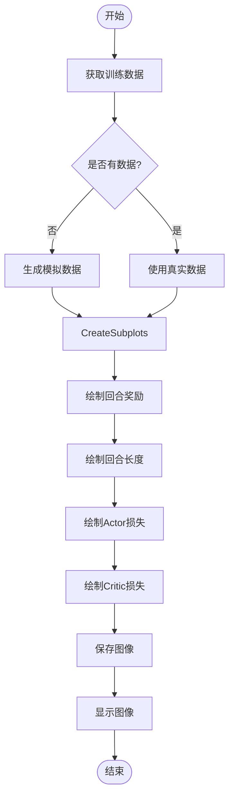
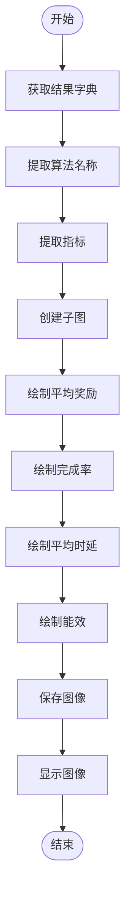
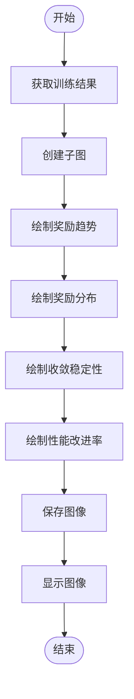

# 高级可视化功能

<cite>
**本文档引用的文件**  
- [advanced_visualization.py](file://tools/advanced_visualization.py)
- [demo.py](file://demo.py)
</cite>

## 目录
1. [简介](#简介)
2. [高级可视化功能概述](#高级可视化功能概述)
3. [训练曲线可视化](#训练曲线可视化)
4. [性能对比与系统指标分析](#性能对比与系统指标分析)
5. [收敛性与多指标仪表板](#收敛性与多指标仪表板)
6. [调用示例与代码片段](#调用示例与代码片段)
7. [自定义与优化建议](#自定义与优化建议)

## 简介
本模块 `advanced_visualization.py` 提供了针对车联网边缘缓存系统中多智能体强化学习训练过程的高级可视化功能。通过丰富的图表展示，帮助研究人员和开发者深入理解算法性能、系统指标变化趋势以及训练收敛情况。结合 `demo.py` 中的调用示例，可以快速生成特定场景下的可视化结果，为系统优化提供数据支持。

## 高级可视化功能概述
`advanced_visualization.py` 模块实现了多种可视化功能，包括增强的训练曲线绘制、性能对比图、系统指标变化图、训练总结图、收敛性分析图以及多指标仪表板。这些功能均基于 `matplotlib` 和 `seaborn` 库实现，并配置了中文字体支持，确保图表中的中文能够正确显示。模块还提供了创建高级可视化套件的功能，可以一键生成多个相关图表，便于全面分析系统性能。

**Section sources**
- [advanced_visualization.py](file://tools/advanced_visualization.py#L1-L515)

## 训练曲线可视化
`enhanced_plot_training_curves` 函数用于绘制增强的训练曲线，展示训练过程中各项指标的变化趋势。该函数通过 `subplots` 创建一个 2x2 的子图布局，分别展示回合奖励、回合长度、Actor 损失和 Critic 损失。为了更清晰地观察奖励变化趋势，函数还计算并绘制了移动平均线。此外，函数支持动态标题，可根据传入的算法名称调整图表标题。



**Diagram sources**
- [advanced_visualization.py](file://tools/advanced_visualization.py#L22-L117)

**Section sources**
- [advanced_visualization.py](file://tools/advanced_visualization.py#L22-L117)

## 性能对比与系统指标分析
`plot_performance_comparison` 函数用于绘制不同算法之间的性能对比图。该函数通过 `bar` 图展示各算法在平均奖励、完成率、平均时延和能效等指标上的表现，并在每个柱状图上添加数值标签，便于直观比较。`plot_system_metrics` 函数则用于绘制系统指标随训练回合的变化趋势，包括平均时延、总能耗、缓存命中率和任务完成率。



**Diagram sources**
- [advanced_visualization.py](file://tools/advanced_visualization.py#L119-L160)

**Section sources**
- [advanced_visualization.py](file://tools/advanced_visualization.py#L119-L160)

## 收敛性与多指标仪表板
`plot_convergence_analysis` 函数用于绘制收敛性分析图，帮助评估算法的收敛速度和稳定性。该函数通过四个子图展示奖励收敛趋势、奖励分布、收敛稳定性（滑动方差）和性能改进率。`plot_multi_metric_dashboard` 函数则用于绘制多指标仪表板，将奖励趋势、系统指标概览和详细指标图整合在一个大图中，提供更全面的性能视图。



**Diagram sources**
- [advanced_visualization.py](file://tools/advanced_visualization.py#L312-L393)

**Section sources**
- [advanced_visualization.py](file://tools/advanced_visualization.py#L312-L393)

## 调用示例与代码片段
在 `demo.py` 中，可以通过调用 `test_visualization` 函数来测试高级可视化工具。该函数创建了一个模拟的训练环境，并调用 `enhanced_plot_training_curves`、`plot_convergence_analysis` 和 `plot_multi_metric_dashboard` 函数生成相应的图表。以下是一个生成特定场景下可视化结果的代码片段：

```python
# 生成高密度车辆移动场景下的可视化结果
mock_env = MockTrainingEnv()
enhanced_plot_training_curves(mock_env, "results/high_density_training_curves.png", "高密度车辆移动")
plot_convergence_analysis({'episode_rewards': mock_env.episode_rewards}, "results/high_density_convergence.png")
plot_multi_metric_dashboard(mock_env, "results/high_density_dashboard.png")
```

**Section sources**
- [demo.py](file://demo.py#L149-L197)
- [advanced_visualization.py](file://tools/advanced_visualization.py#L485-L515)

## 自定义与优化建议
为了生成更符合需求的可视化结果，可以自定义颜色映射、调整视角参数和导出高清图像。例如，通过设置 `plt.rcParams` 可以更改图表的字体、颜色和样式。为了优化渲染性能，建议在处理大量数据时使用数据抽样或聚合，避免一次性绘制过多数据点。此外，可以利用 `plt.savefig` 的 `dpi` 参数控制图像分辨率，确保导出的图像质量满足要求。

**Section sources**
- [advanced_visualization.py](file://tools/advanced_visualization.py#L0-L36)
- [advanced_visualization.py](file://tools/advanced_visualization.py#L114-L117)