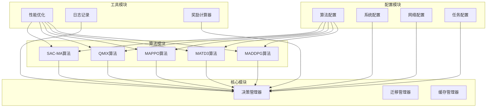
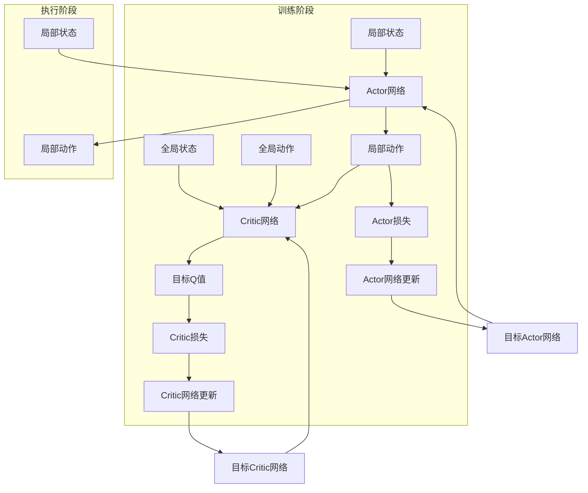
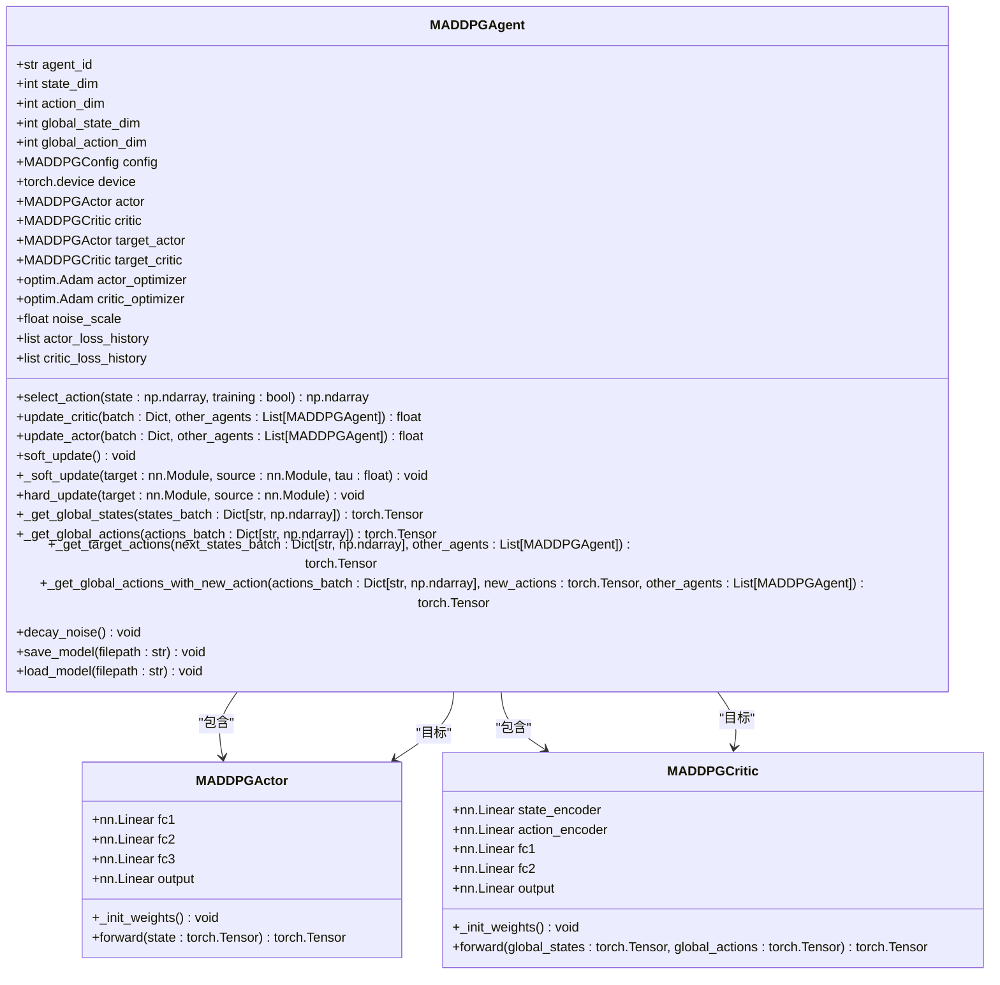
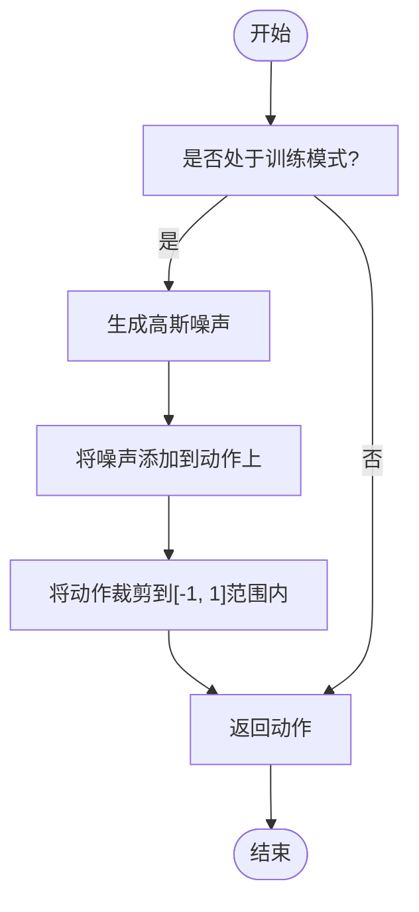
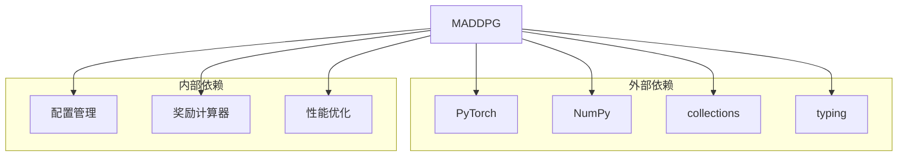

# MADDPG算法实现

<cite>
**本文档引用的文件**   
- [maddpg.py](file://algorithms/maddpg.py)
- [algorithm_config.py](file://config/algorithm_config.py)
- [system_config.py](file://config/system_config.py)
- [reward_calculator.py](file://utils/reward_calculator.py)
</cite>

## 目录
1. [引言](#引言)
2. [项目结构](#项目结构)
3. [核心组件](#核心组件)
4. [架构概述](#架构概述)
5. [详细组件分析](#详细组件分析)
6. [依赖分析](#依赖分析)
7. [性能考量](#性能考量)
8. [故障排除指南](#故障排除指南)
9. [结论](#结论)

## 引言
MADDPG（Multi-Agent Deep Deterministic Policy Gradient）是一种适用于多智能体环境的深度强化学习算法，特别适用于车联网边缘缓存系统中的任务迁移与协同决策。该算法采用中心化训练、去中心化执行（Centralized Training, Decentralized Execution）的架构设计，每个智能体拥有独立的Actor-Critic网络，其中Critic网络可以访问全局状态信息，而Actor网络仅依赖局部观测进行决策。这种设计使得MADDPG在处理部分可观测环境时具有显著优势，能够有效应对高动态车联网环境中的复杂决策问题。

## 项目结构
本项目采用模块化设计，将不同功能划分为独立的目录，便于维护和扩展。核心算法实现位于`algorithms`目录下，包括MADDPG、MATD3、MAPPO等多种多智能体强化学习算法。配置文件集中管理于`config`目录，涵盖系统、网络、任务等多方面参数。工具类和辅助函数分布在`tools`和`utils`目录中，提供性能优化、日志记录、奖励计算等功能。



**图表来源**
- [maddpg.py](file://algorithms/maddpg.py#L1-L645)
- [algorithm_config.py](file://config/algorithm_config.py#L1-L73)
- [system_config.py](file://config/system_config.py#L1-L318)

**章节来源**
- [maddpg.py](file://algorithms/maddpg.py#L1-L645)
- [algorithm_config.py](file://config/algorithm_config.py#L1-L73)
- [system_config.py](file://config/system_config.py#L1-L318)

## 核心组件
MADDPG算法的核心组件包括Actor网络、Critic网络、经验回放缓冲区和智能体环境。Actor网络负责生成动作，Critic网络评估动作的价值，经验回放缓冲区存储历史经验以提高样本效率，智能体环境管理多个智能体的交互和训练过程。

**章节来源**
- [maddpg.py](file://algorithms/maddpg.py#L55-L138)
- [maddpg.py](file://algorithms/maddpg.py#L141-L194)
- [maddpg.py](file://algorithms/maddpg.py#L197-L459)
- [maddpg.py](file://algorithms/maddpg.py#L462-L645)

## 架构概述
MADDPG算法的架构设计遵循中心化训练、去中心化执行的原则。在训练阶段，Critic网络可以访问全局状态信息，从而更准确地评估动作的价值；在执行阶段，每个智能体仅依赖局部观测进行决策，确保了算法的可扩展性和实时性。这种设计使得MADDPG在处理部分可观测环境时具有显著优势，能够有效应对高动态车联网环境中的复杂决策问题。



**图表来源**
- [maddpg.py](file://algorithms/maddpg.py#L258-L288)
- [maddpg.py](file://algorithms/maddpg.py#L290-L313)
- [maddpg.py](file://algorithms/maddpg.py#L330-L349)
- [maddpg.py](file://algorithms/maddpg.py#L351-L370)

**章节来源**
- [maddpg.py](file://algorithms/maddpg.py#L258-L288)
- [maddpg.py](file://algorithms/maddpg.py#L290-L313)
- [maddpg.py](file://algorithms/maddpg.py#L330-L349)
- [maddpg.py](file://algorithms/maddpg.py#L351-L370)

## 详细组件分析
### MADDPG智能体分析
MADDPG智能体是算法的核心执行单元，负责生成动作并更新网络参数。每个智能体包含一个Actor网络和一个Critic网络，以及对应的目标网络。Actor网络根据局部状态生成动作，Critic网络评估全局状态下动作的价值。通过软更新机制，目标网络逐步逼近主网络，确保训练过程的稳定性。

#### 类图


**图表来源**
- [maddpg.py](file://algorithms/maddpg.py#L55-L88)
- [maddpg.py](file://algorithms/maddpg.py#L91-L138)
- [maddpg.py](file://algorithms/maddpg.py#L197-L459)

**章节来源**
- [maddpg.py](file://algorithms/maddpg.py#L55-L88)
- [maddpg.py](file://algorithms/maddpg.py#L91-L138)
- [maddpg.py](file://algorithms/maddpg.py#L197-L459)

### 训练流程分析
MADDPG的训练流程主要包括经验存储、经验采样、网络更新和目标网络软更新四个步骤。首先，智能体将当前的经验（状态、动作、奖励、下一状态、是否结束）存储到经验回放缓冲区中。然后，从缓冲区中随机采样一批经验用于训练。接着，使用采样的经验更新Critic网络和Actor网络。最后，通过软更新机制更新目标网络。

#### 序列图
```mermaid
sequenceDiagram
participant Environment as "环境"
participant Agent as "智能体"
participant Buffer as "经验回放缓冲区"
participant Critic as "Critic网络"
participant Actor as "Actor网络"
Environment->>Agent : 提供状态
Agent->>Actor : select_action(state)
Actor-->>Agent : 动作
Agent->>Environment : 执行动作
Environment->>Agent : 奖励和下一状态
Agent->>Buffer : push(状态, 动作, 奖励, 下一状态, 是否结束)
loop 每隔一定步数
Agent->>Buffer : sample(batch_size)
Buffer-->>Agent : 经验批次
Agent->>Critic : update_critic(经验批次, 其他智能体)
Critic-->>Agent : Critic损失
Agent->>Actor : update_actor(经验批次, 其他智能体)
Actor-->>Agent : Actor损失
Agent->>Agent : soft_update()
end
```

**图表来源**
- [maddpg.py](file://algorithms/maddpg.py#L548-L588)
- [maddpg.py](file://algorithms/maddpg.py#L258-L288)
- [maddpg.py](file://algorithms/maddpg.py#L290-L313)
- [maddpg.py](file://algorithms/maddpg.py#L315-L328)

**章节来源**
- [maddpg.py](file://algorithms/maddpg.py#L548-L588)
- [maddpg.py](file://algorithms/maddpg.py#L258-L288)
- [maddpg.py](file://algorithms/maddpg.py#L290-L313)
- [maddpg.py](file://algorithms/maddpg.py#L315-L328)

### 噪声探索机制分析
MADDPG采用高斯噪声探索机制，通过在动作上添加噪声来促进探索。噪声的尺度随训练进程逐渐衰减，确保初期充分探索，后期稳定收敛。具体而言，噪声尺度按指数衰减公式更新：`noise_scale = max(min_noise, noise_scale * noise_decay)`，其中`min_noise`为最小噪声尺度，`noise_decay`为衰减系数。

#### 流程图


**图表来源**
- [maddpg.py](file://algorithms/maddpg.py#L235-L256)
- [maddpg.py](file://algorithms/maddpg.py#L420-L429)

**章节来源**
- [maddpg.py](file://algorithms/maddpg.py#L235-L256)
- [maddpg.py](file://algorithms/maddpg.py#L420-L429)

## 依赖分析
MADDPG算法的实现依赖于多个外部库和内部模块。外部依赖主要包括PyTorch用于深度学习模型的构建和训练，NumPy用于数值计算，以及Python标准库中的`collections`和`typing`模块。内部依赖则包括配置管理、奖励计算、性能优化等模块，这些模块为MADDPG提供了必要的支持。



**图表来源**
- [maddpg.py](file://algorithms/maddpg.py#L1-L48)
- [algorithm_config.py](file://config/algorithm_config.py#L1-L73)
- [reward_calculator.py](file://utils/reward_calculator.py#L1-L244)

**章节来源**
- [maddpg.py](file://algorithms/maddpg.py#L1-L48)
- [algorithm_config.py](file://config/algorithm_config.py#L1-L73)
- [reward_calculator.py](file://utils/reward_calculator.py#L1-L244)

## 性能考量
MADDPG算法在高动态车联网环境中可能面临训练不稳定的问题，主要原因包括环境的非平稳性、奖励稀疏性和动作空间的连续性。为缓解这些问题，可以采取以下措施：
1. **增加经验回放缓冲区大小**：提高样本的多样性，减少过拟合风险。
2. **调整学习率**：降低学习率以提高训练稳定性，特别是在初期阶段。
3. **使用目标网络**：通过软更新机制平滑目标值的变化，减少训练波动。
4. **引入优先经验回放**：优先采样重要的经验，提高学习效率。
5. **调整噪声参数**：合理设置噪声尺度和衰减系数，平衡探索与利用。

此外，MADDPG在处理部分可观测环境时表现出色，尤其适用于任务迁移和缓存协同决策场景。通过中心化Critic网络利用全局状态信息，MADDPG能够更准确地评估动作的价值，从而做出更优的决策。

## 故障排除指南
在使用MADDPG算法时，可能会遇到一些常见问题，以下是相应的解决方案：
1. **训练不稳定**：检查学习率是否过高，尝试降低学习率；增加经验回放缓冲区大小；调整噪声参数。
2. **收敛速度慢**：增加批次大小；调整网络结构，增加隐藏层或神经元数量；使用更高效的优化器。
3. **过拟合**：增加正则化项；使用Dropout层；增加数据增强。
4. **探索不足**：增加初始噪声尺度；减小噪声衰减系数；使用更复杂的探索策略，如Ornstein-Uhlenbeck过程。

## 结论
MADDPG算法通过中心化训练、去中心化执行的架构设计，在处理部分可观测环境时表现出色，特别适用于车联网边缘缓存系统中的任务迁移和缓存协同决策。通过合理配置网络参数、优化训练流程和调整探索策略，可以有效提升算法的性能和稳定性。未来的工作可以进一步探索更高效的探索机制和更复杂的网络结构，以应对更高动态和更复杂的应用场景。