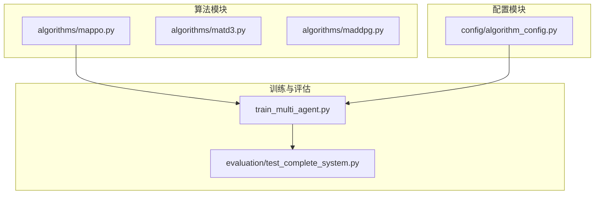
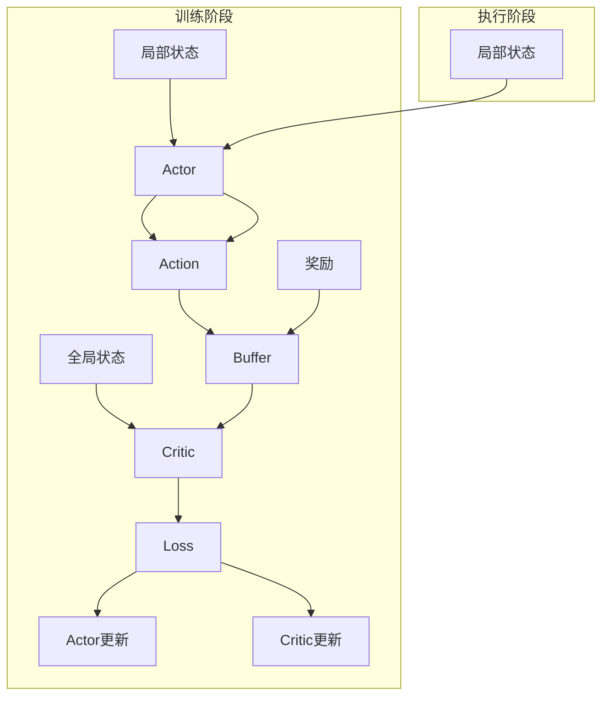
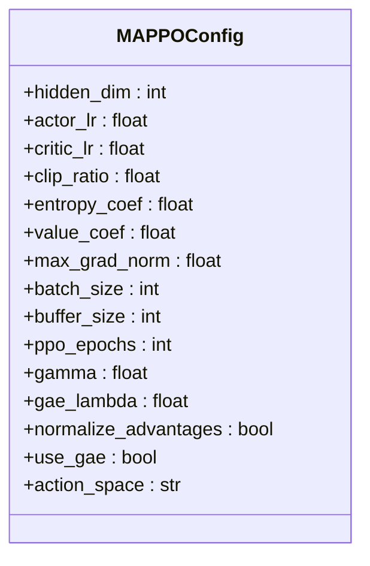
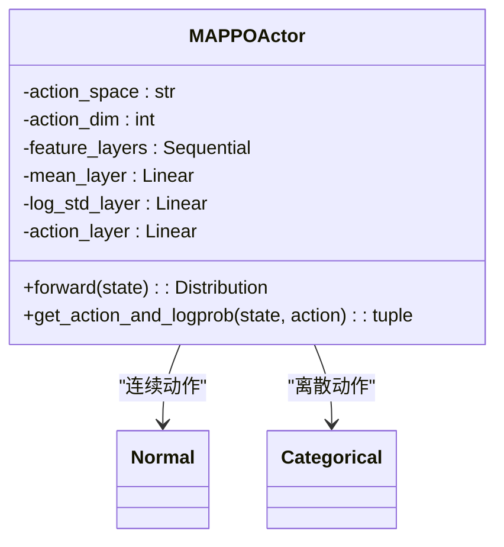
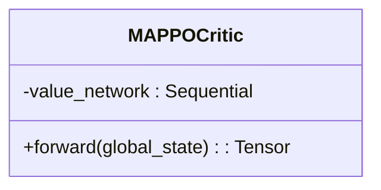
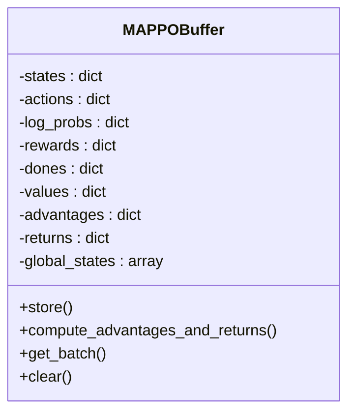
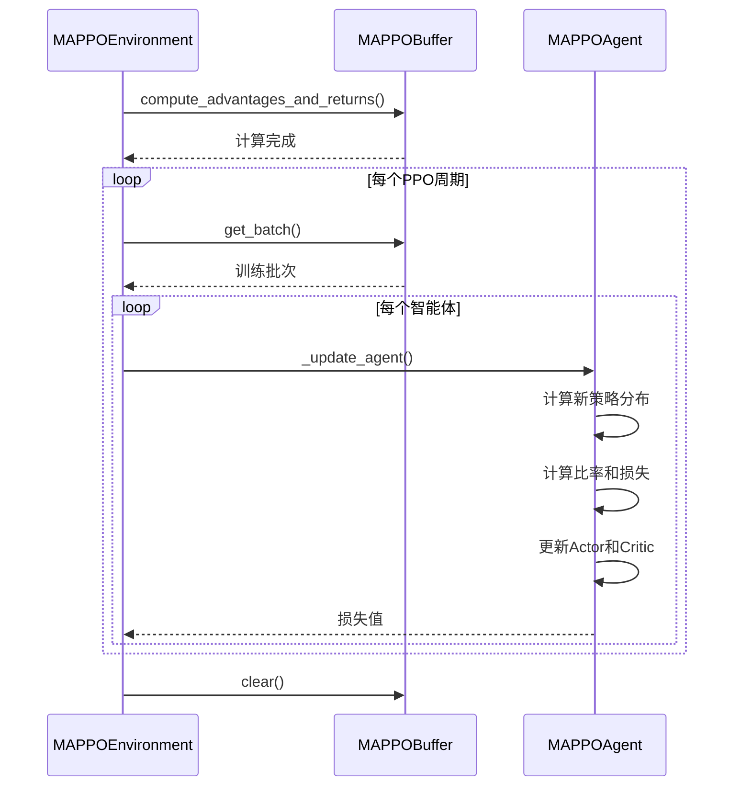
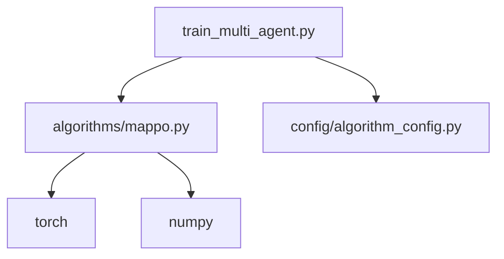

# MAPPO算法实现

<cite>
**本文档引用的文件**
- [mappo.py](file://algorithms/mappo.py)
- [train_multi_agent.py](file://train_multi_agent.py)
- [algorithm_config.py](file://config/algorithm_config.py)
</cite>

## 目录
1. [引言](#引言)
2. [项目结构](#项目结构)
3. [核心组件](#核心组件)
4. [架构概述](#架构概述)
5. [详细组件分析](#详细组件分析)
6. [依赖分析](#依赖分析)
7. [性能考量](#性能考量)
8. [故障排除指南](#故障排除指南)
9. [结论](#结论)

## 引言
本文档深入讲解MAPPO（Multi-Agent Proximal Policy Optimization）算法在本项目中的实现方式。MAPPO是一种基于策略梯度的多智能体强化学习方法，结合了PPO算法的稳定性与多智能体系统的协作能力。该算法采用集中式训练、分布式执行（CTDE）范式，适用于车联网环境下的复杂决策任务，如车辆缓存策略优化、资源分配和任务迁移管理。

## 项目结构
本项目采用模块化设计，将不同功能划分为独立的目录。核心算法位于`algorithms`目录下，包括MAPPO、MATD3、MADDPG等多种多智能体算法实现。配置文件集中于`config`目录，系统仿真逻辑在`evaluation`和`core`模块中实现，而训练流程由`train_multi_agent.py`统一调度。

**图示来源**
- [mappo.py](file://algorithms/mappo.py)
- [train_multi_agent.py](file://train_multi_agent.py)
- [algorithm_config.py](file://config/algorithm_config.py)

**章节来源**
- [mappo.py](file://algorithms/mappo.py)
- [train_multi_agent.py](file://train_multi_agent.py)

## 核心组件
MAPPO的核心组件包括策略网络（Actor）、价值网络（Critic）、经验回放缓冲区（Buffer）以及主环境控制器（Environment）。这些组件协同工作，实现策略的稳定更新与高效学习。

**章节来源**
- [mappo.py](file://algorithms/mappo.py#L29-L52)
- [mappo.py](file://algorithms/mappo.py#L55-L132)

## 架构概述
MAPPO采用中心化训练、去中心化执行的架构。每个智能体拥有独立的Actor网络用于决策，而Critic网络则接收全局状态进行集中式价值评估。这种设计既保证了训练时的信息完整性，又满足了实际部署中各智能体独立运行的需求。

**图示来源**
- [mappo.py](file://algorithms/mappo.py#L135-L165)
- [mappo.py](file://algorithms/mappo.py#L55-L132)

## 详细组件分析

### MAPPO配置分析
MAPPO的超参数通过`MAPPOConfig`类进行管理，涵盖学习率、折扣因子、GAE参数等关键设置。这些参数直接影响算法的收敛速度与最终性能。

**图示来源**
- [mappo.py](file://algorithms/mappo.py#L29-L52)

**章节来源**
- [mappo.py](file://algorithms/mappo.py#L29-L52)

### 策略网络分析
`MAPPOActor`类实现了策略网络，支持连续和离散动作空间。网络结构包含共享特征层和特定输出层，通过正交初始化确保训练稳定性。

**图示来源**
- [mappo.py](file://algorithms/mappo.py#L55-L132)

**章节来源**
- [mappo.py](file://algorithms/mappo.py#L55-L132)

### 价值网络分析
`MAPPOCritic`类实现集中式价值网络，输入为全局状态，输出为状态价值估计。深层网络结构增强了对复杂状态空间的建模能力。

**图示来源**
- [mappo.py](file://algorithms/mappo.py#L135-L165)

**章节来源**
- [mappo.py](file://algorithms/mappo.py#L135-L165)

### 经验缓冲区分析
`MAPPOBuffer`类管理多智能体的经验数据，支持GAE优势函数计算和小批量采样。缓冲区为每个智能体独立存储状态、动作、奖励等信息。

**图示来源**
- [mappo.py](file://algorithms/mappo.py#L168-L283)

**章节来源**
- [mappo.py](file://algorithms/mappo.py#L168-L283)

### 训练更新机制分析
MAPPO的更新过程分为两个阶段：首先计算优势函数和回报，然后进行多轮PPO更新。`update`方法协调整个训练流程，`_update_agent`方法执行单个智能体的策略更新。

**图示来源**
- [mappo.py](file://algorithms/mappo.py#L451-L498)
- [mappo.py](file://algorithms/mappo.py#L500-L543)

**章节来源**
- [mappo.py](file://algorithms/mappo.py#L451-L498)
- [mappo.py](file://algorithms/mappo.py#L500-L543)

## 依赖分析
MAPPO算法依赖于PyTorch框架进行张量计算和自动微分，同时利用NumPy处理经验缓冲区中的数据。训练脚本`train_multi_agent.py`负责调度MAPPO环境，而`algorithm_config.py`提供基础配置支持。

**图示来源**
- [mappo.py](file://algorithms/mappo.py)
- [train_multi_agent.py](file://train_multi_agent.py)

**章节来源**
- [mappo.py](file://algorithms/mappo.py)
- [train_multi_agent.py](file://train_multi_agent.py)

## 性能考量
MAPPO在处理高维状态空间和长期依赖任务中表现出色，尤其适用于车联网中的长期缓存策略学习。其计算开销相对较高，主要源于集中式Critic网络和多轮PPO更新。建议使用GPU加速训练，并合理设置`ppo_epochs`和`batch_size`以平衡效率与稳定性。

**章节来源**
- [mappo.py](file://algorithms/mappo.py#L29-L52)
- [mappo.py](file://algorithms/mappo.py#L451-L498)

## 故障排除指南
常见问题包括训练不稳定、奖励不增长等。建议检查优势函数是否标准化、学习率是否过高、缓冲区大小是否充足。可通过监控Actor和Critic损失曲线诊断问题。

**章节来源**
- [mappo.py](file://algorithms/mappo.py#L451-L498)
- [mappo.py](file://algorithms/mappo.py#L500-L543)

## 结论
MAPPO算法通过PPO的clip机制有效提升了多智能体环境下的训练稳定性。其支持共享或独立策略配置，结合GAE和mini-batch更新，能够在复杂车联网场景中学习高效的长期策略。合理调优学习率、epoch等超参数，可进一步提升性能表现。