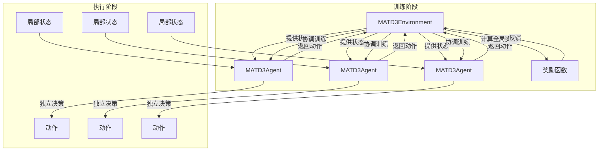
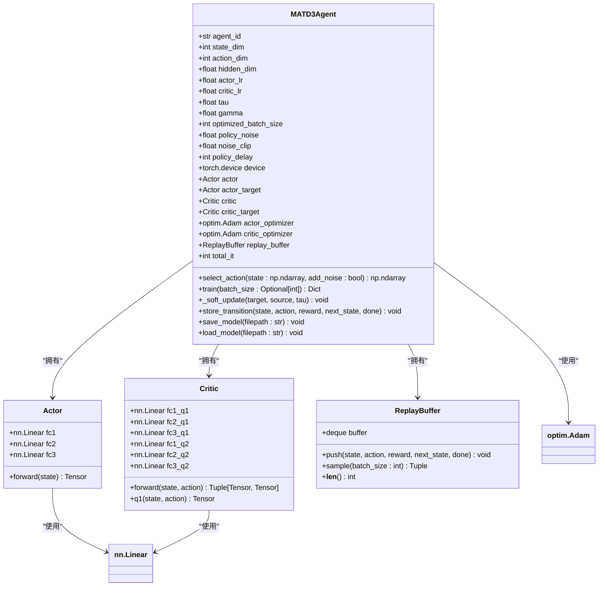
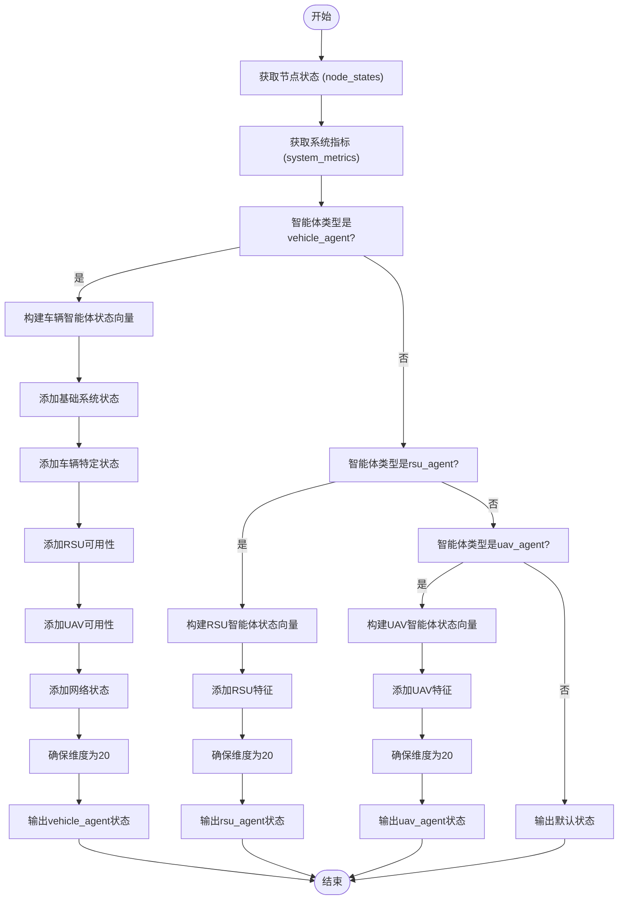
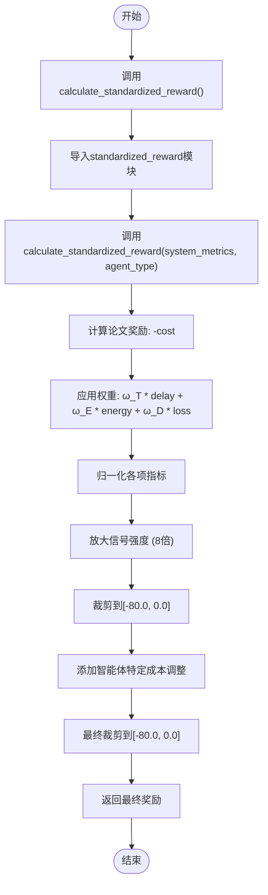
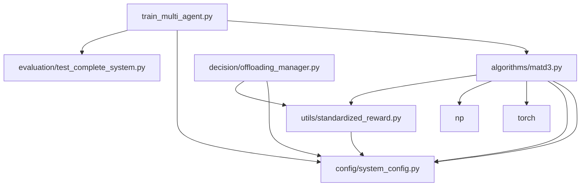

# MATD3算法实现

<cite>
**本文档引用文件**   
- [matd3.py](file://algorithms/matd3.py)
- [system_config.py](file://config/system_config.py)
- [algorithm_config.py](file://config/algorithm_config.py)
- [standardized_reward.py](file://utils/standardized_reward.py)
- [offloading_manager.py](file://decision/offloading_manager.py)
- [train_multi_agent.py](file://train_multi_agent.py)
- [paper_ending.tex](file://docs/paper_ending.tex)
</cite>

## 目录
1. [引言](#引言)
2. [项目结构](#项目结构)
3. [核心组件](#核心组件)
4. [架构概述](#架构概述)
5. [详细组件分析](#详细组件分析)
6. [依赖分析](#依赖分析)
7. [性能考量](#性能考量)
8. [故障排除指南](#故障排除指南)
9. [结论](#结论)
10. [附录](#附录)（如有必要）

## 引言
本文档深入解析MATD3（多智能体双延迟深度确定性策略梯度）算法在车联网边缘计算环境中的实现机制。该算法旨在解决连续动作空间中的任务卸载与资源分配决策问题，通过actor-critic双网络架构、目标网络软更新、经验回放和双Q网络等技术，优化系统在延迟、能耗和任务完成率方面的表现。文档详细阐述了算法的实现细节、训练稳定性优化技巧，并与其他多智能体算法进行了对比。

## 项目结构
项目采用模块化设计，各目录职责分明，便于维护和扩展。

```mermaid
graph TD
A[VEC_mig_caching] --> B[algorithms]
A --> C[caching]
A --> D[communication]
A --> E[config]
A --> F[core]
A --> G[decision]
A --> H[evaluation]
A --> I[experiments]
A --> J[migration]
A --> K[single_agent]
A --> L[tests]
A --> M[tools]
A --> N[utils]
A --> O[demo.py]
A --> P[main.py]
A --> Q[train_multi_agent.py]
A --> R[run_full_experiment.py]
A --> S[visualize_results.py]
B --> B1[matd3.py]
B --> B2[maddpg.py]
B --> B3[qmix.py]
B --> B4[mappo.py]
B --> B5[sac_ma.py]
B --> B6[uav_action_space.py]
E --> E1[system_config.py]
E --> E2[algorithm_config.py]
E --> E3[network_config.py]
E --> E4[external_config.py]
G --> G1[offloading_manager.py]
N --> N1[standardized_reward.py]
N --> N2[numerical_stability.py]
N --> N3[logger.py]
N --> N4[metrics.py]
```



**图源**
- [matd3.py](file://algorithms/matd3.py)
- [system_config.py](file://config/system_config.py)

**本节来源**
- [matd3.py](file://algorithms/matd3.py)
- [system_config.py](file://config/system_config.py)

## 核心组件
本项目的核心是`algorithms/matd3.py`文件中实现的MATD3算法，它包含智能体（Agent）和环境（Environment）两个主要类。智能体负责学习最优策略，而环境则管理多个智能体的交互和训练流程。`config/system_config.py`提供了算法运行所需的全局配置，`utils/standardized_reward.py`则定义了统一的奖励计算逻辑。

**本节来源**
- [matd3.py](file://algorithms/matd3.py#L1-L50)
- [system_config.py](file://config/system_config.py#L1-L10)

## 架构概述
MATD3算法采用集中式训练、分散式执行（CTDE）的架构。在训练时，环境可以访问所有智能体的状态和动作，以计算全局奖励并协调训练过程；在执行时，每个智能体仅根据自身的局部观测做出决策。



**图源**
- [matd3.py](file://algorithms/matd3.py#L252-L549)
- [train_multi_agent.py](file://train_multi_agent.py#L500-L549)

## 详细组件分析

### MATD3智能体分析
`MATD3Agent`类是算法的核心，实现了actor-critic架构和TD3的关键技术。

#### 类图


**图源**
- [matd3.py](file://algorithms/matd3.py#L100-L249)

#### 动作选择与策略更新流程
```mermaid
sequenceDiagram
participant Agent as "MATD3Agent"
participant Actor as "Actor网络"
participant Critic as "Critic网络"
participant Buffer as "经验回放缓冲区"
Agent->>Actor : select_action(state)
Actor-->>Agent : 返回动作
Agent->>Agent : 添加噪声
Agent-->>Agent : 返回最终动作
loop 每次训练迭代
Agent->>Buffer : store_transition()
Agent->>Agent : total_it += 1
Agent->>Buffer : sample(batch_size)
Agent->>Critic : 计算目标Q值
Critic->>Critic : next_action = actor_target(next_state) + noise
Critic->>Critic : target_q = reward + γ * min(Q1', Q2')
Critic->>Agent : 返回target_q
Agent->>Critic : 更新Critic网络
Critic-->>Agent : critic_loss
alt total_it % policy_delay == 0
Agent->>Actor : 更新Actor网络
Actor->>Critic : actor_loss = -mean(Q1)
Actor-->>Agent : actor_loss
Agent->>Agent : 软更新目标网络
Agent-->>Agent : 返回actor_loss
else
Agent-->>Agent : 返回0.0
end
end
```

**图源**
- [matd3.py](file://algorithms/matd3.py#L100-L249)

**本节来源**
- [matd3.py](file://algorithms/matd3.py#L100-L249)

### MATD3环境分析
`MATD3Environment`类负责管理多个智能体的生命周期，包括状态构建、奖励计算和训练协调。

#### 状态向量构建流程


**图源**
- [matd3.py](file://algorithms/matd3.py#L252-L549)

#### 奖励计算机制


**图源**
- [matd3.py](file://algorithms/matd3.py#L252-L549)
- [standardized_reward.py](file://utils/standardized_reward.py#L108-L124)

**本节来源**
- [matd3.py](file://algorithms/matd3.py#L252-L549)
- [standardized_reward.py](file://utils/standardized_reward.py#L1-L151)

## 依赖分析
项目各组件间存在清晰的依赖关系，确保了功能的模块化和可维护性。



**图源**
- [matd3.py](file://algorithms/matd3.py)
- [system_config.py](file://config/system_config.py)
- [standardized_reward.py](file://utils/standardized_reward.py)

**本节来源**
- [matd3.py](file://algorithms/matd3.py)
- [system_config.py](file://config/system_config.py)
- [standardized_reward.py](file://utils/standardized_reward.py)

## 性能考量
为了确保训练的稳定性和效率，项目采用了多项优化措施。

1.  **GPU加速**：智能体的网络计算和训练过程默认在GPU上执行，显著提升了计算速度。
2.  **优化批次大小**：通过`tools.performance_optimization`模块动态调整批次大小，以提高GPU利用率。
3.  **数值稳定性**：`utils/numerical_stability.py`模块提供了`safe_divide`, `safe_log`, `clamp`等函数，防止训练过程中出现NaN或Inf值。
4.  **奖励信号放大**：在`standardized_reward.py`中，通过将基础奖励放大8倍来解决奖励信号过弱的问题，使智能体能更有效地学习。
5.  **移动平均**：`utils/metrics.py`中的`MovingAverage`类用于平滑奖励、时延等指标，便于监控训练趋势。

[无来源，因为本节提供一般性指导]

## 故障排除指南
当遇到训练问题时，可参考以下解决方案。

**本节来源**
- [numerical_stability.py](file://utils/numerical_stability.py#L1-L293)
- [logger.py](file://utils/logger.py#L1-L67)

### 常见收敛问题及解决方案
| 问题现象 | 可能原因 | 解决方案 |
| :--- | :--- | :--- |
| **奖励不收敛或波动剧烈** | 奖励信号过弱、探索噪声过大 | 检查`standardized_reward.py`中的奖励放大倍数；调整`config.rl.exploration_noise` |
| **出现NaN或Inf损失** | 数值溢出、除零错误 | 启用`numerical_stability.py`中的监控；检查输入数据的有效性 |
| **智能体不学习** | 学习率过高或过低、批次大小不当 | 调整`config.rl.actor_lr`和`config.rl.critic_lr`；尝试不同的`OPTIMIZED_BATCH_SIZES` |
| **训练速度慢** | 未使用GPU、批次大小过小 | 确认CUDA可用；检查`performance_optimization`模块是否正确加载 |
| **过估计问题** | Critic网络高估Q值 | 确保双Q网络（Twin Q）和延迟更新（Delayed Update）机制正常工作 |

### 调参建议
- **学习率 (`actor_lr`, `critic_lr`)**：通常设置在`1e-4