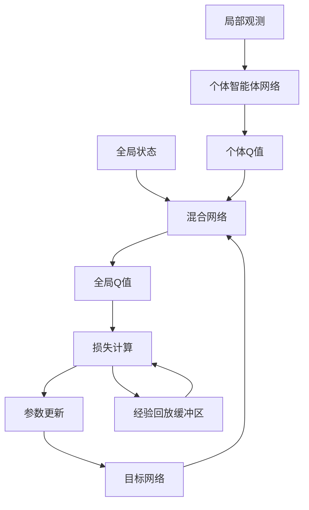
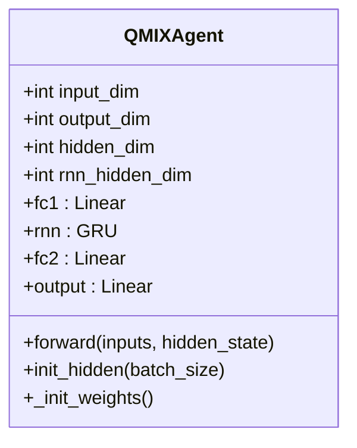
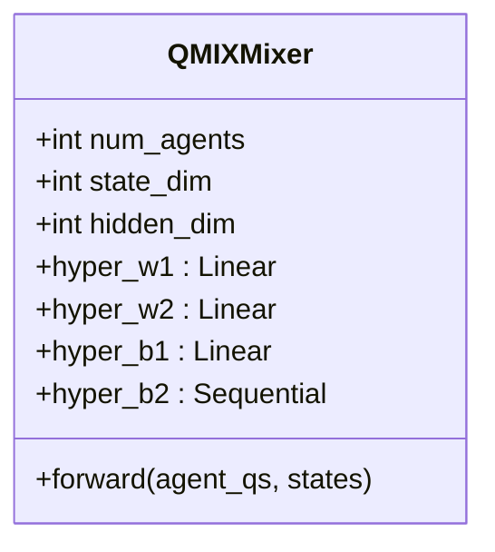
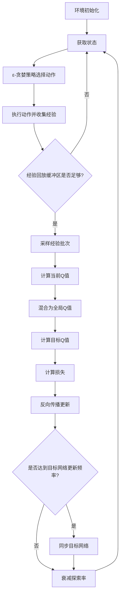
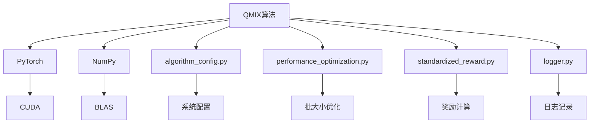

# QMIX算法实现

<cite>
**本文档引用的文件**   
- [qmix.py](file://algorithms/qmix.py)
- [train_multi_agent.py](file://train_multi_agent.py)
- [standardized_reward.py](file://utils/standardized_reward.py)
</cite>

## 目录
1. [项目结构](#项目结构)
2. [核心组件](#核心组件)
3. [架构概述](#架构概述)
4. [详细组件分析](#详细组件分析)
5. [依赖分析](#依赖分析)
6. [性能考量](#性能考量)
7. [故障排除指南](#故障排除指南)

## 项目结构
项目采用模块化设计，主要包含算法、缓存、通信、配置、核心功能、决策、评估、实验、迁移、单智能体算法、工具和工具类等模块。算法模块中实现了包括QMIX在内的多种多智能体强化学习算法。

```mermaid
graph TD
A[项目根目录] --> B[algorithms]
A --> C[caching]
A --> D[communication]
A --> E[config]
A --> F[core]
A --> G[decision]
A --> H[evaluation]
A --> I[experiments]
A --> J[migration]
A --> K[single_agent]
A --> L[tests]
A --> M[tools]
A --> N[utils]
A --> O[demo.py]
A --> P[main.py]
A --> Q[train_multi_agent.py]
A --> R[run_full_experiment.py]
A --> S[visualize_results.py]
B --> B1[qmix.py]
B --> B2[matd3.py]
B --> B3[maddpg.py]
B --> B4[mappo.py]
B --> B5[sac_ma.py]
E --> E1[algorithm_config.py]
E --> E2[network_config.py]
E --> E3[system_config.py]
M --> M1[performance_optimization.py]
M --> M2[advanced_visualization.py]
N --> N1[standardized_reward.py]
N --> N2[logger.py]
N --> N3[data_processor.py]
```

**图示来源**
- [qmix.py](file://algorithms/qmix.py)
- [train_multi_agent.py](file://train_multi_agent.py)

## 核心组件
QMIX算法的核心组件包括个体智能体网络、混合网络、经验回放缓冲区和训练环境。个体智能体网络负责处理局部观测并输出动作价值，混合网络通过单调性约束将个体Q值混合为全局Q值，经验回放缓冲区存储训练样本，训练环境协调整个学习过程。

**组件来源**
- [qmix.py](file://algorithms/qmix.py#L54-L598)

## 架构概述
QMIX算法采用集中式训练、分布式执行的架构。在训练时，利用全局状态信息通过混合网络将各智能体的Q值整合为全局Q值进行优化；在执行时，各智能体仅根据局部观测独立决策。这种架构既保证了学习效率，又满足了实际部署的去中心化需求。

**图示来源**
- [qmix.py](file://algorithms/qmix.py#L54-L194)
- [qmix.py](file://algorithms/qmix.py#L142-L194)

## 详细组件分析

### 个体智能体网络分析
个体智能体网络采用RNN结构处理部分可观测环境下的序列信息，通过全连接层和GRU层的组合提取特征，最终输出各动作的Q值。

**图示来源**
- [qmix.py](file://algorithms/qmix.py#L54-L139)

### 混合网络分析
混合网络是QMIX算法的核心创新，通过超网络生成权重，确保混合过程的单调性，从而保证全局最优策略的可学习性。

**图示来源**
- [qmix.py](file://algorithms/qmix.py#L142-L194)

### 训练流程分析
QMIX的训练流程包括经验收集、网络更新和目标网络同步三个主要步骤，通过ε-贪婪策略平衡探索与利用。

**图示来源**
- [qmix.py](file://algorithms/qmix.py#L360-L532)

## 依赖分析
QMIX算法依赖于PyTorch框架进行神经网络构建和训练，依赖NumPy进行数值计算，依赖配置模块进行参数管理，依赖工具模块进行性能优化。算法通过标准化奖励函数与其他模块解耦，确保了模块间的低耦合度。

**图示来源**
- [qmix.py](file://algorithms/qmix.py)
- [algorithm_config.py](file://config/algorithm_config.py)
- [standardized_reward.py](file://utils/standardized_reward.py)

## 性能考量
QMIX算法在性能方面进行了多项优化：使用RMSprop优化器提高收敛速度，采用经验回放缓冲区提高样本利用率，通过目标网络稳定训练过程，利用梯度裁剪防止梯度爆炸。训练过程中动态调整探索率，平衡探索与利用。

## 故障排除指南
常见问题包括训练不稳定、收敛缓慢和信用分配不均。解决方案包括调整学习率、增加批大小、优化奖励函数权重和检查网络结构。通过监控训练损失、探索率和缓冲区大小等指标，可以及时发现并解决问题。

**组件来源**
- [qmix.py](file://algorithms/qmix.py#L445-L523)
- [standardized_reward.py](file://utils/standardized_reward.py#L1-L151)