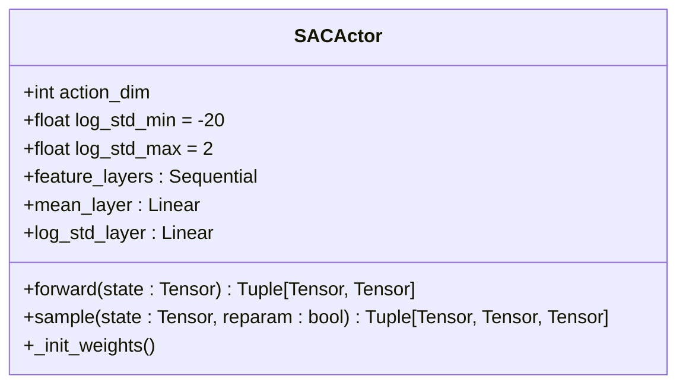
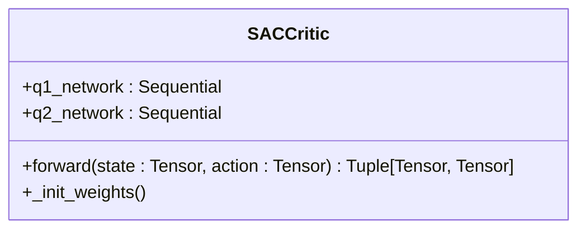
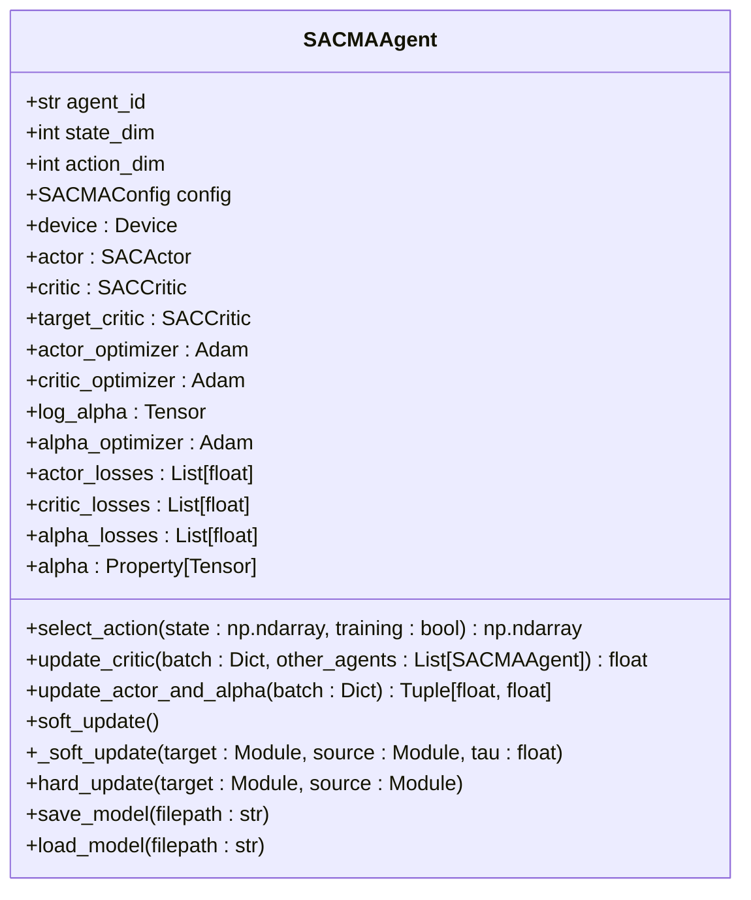
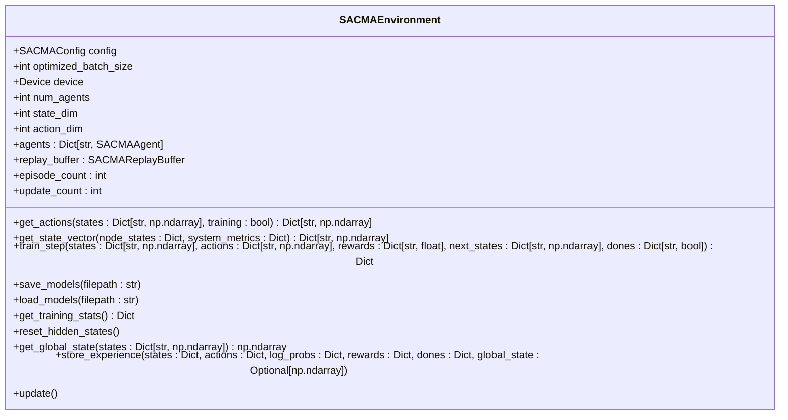
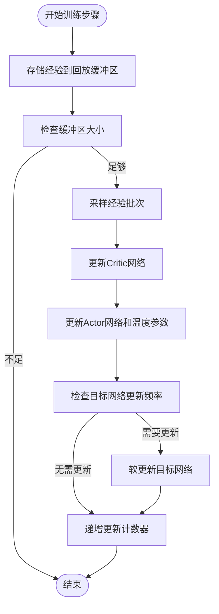

# SAC-MA算法实现

<cite>
**本文档引用文件**  
- [sac_ma.py](file://algorithms/sac_ma.py)
- [algorithm_config.py](file://config/algorithm_config.py)
</cite>

## 目录
1. [引言](#引言)
2. [SAC-MA算法配置](#sac-ma算法配置)
3. [Actor网络实现](#actor网络实现)
4. [Critic网络实现](#critic网络实现)
5. [智能体核心逻辑](#智能体核心逻辑)
6. [多智能体环境管理](#多智能体环境管理)
7. [训练流程分析](#训练流程分析)
8. [熵调节机制](#熵调节机制)
9. [与MATD3算法对比](#与matd3算法对比)
10. [应用场景与优势](#应用场景与优势)

## 引言
SAC-MA（Soft Actor-Critic for Multi-Agent）是一种基于最大熵强化学习框架的多智能体算法，专为连续动作空间设计。该算法通过引入自动温度调节机制和双Q网络结构，实现了高样本效率和稳定的训练过程。在本系统中，SAC-MA被应用于边缘计算环境下的动态任务卸载与迁移决策，能够有效平衡策略探索与利用，适应稀疏奖励场景，并具备良好的节能潜力。

## SAC-MA算法配置
SAC-MA算法的配置参数定义在`SACMAConfig`类中，涵盖了网络结构、SAC核心参数、训练参数等多个方面。这些配置确保了算法在多智能体环境中的高效运行。

**Section sources**
- [sac_ma.py](file://algorithms/sac_ma.py#L33-L55)

## Actor网络实现
SAC-MA的Actor网络采用随机策略网络结构，能够同时输出动作均值和对数标准差，从而实现自适应探索。网络由共享特征层、均值输出层和对数标准差输出层组成，并对输出的对数标准差进行范围限制，以保证数值稳定性。

### 网络结构
Actor网络通过前向传播计算动作分布的均值和对数标准差，然后利用重参数化技巧进行动作采样。tanh变换确保输出动作在[-1, 1]范围内，同时考虑变换的雅可比行列式来正确计算对数概率。

**Diagram sources**
- [sac_ma.py](file://algorithms/sac_ma.py#L58-L129)

**Section sources**
- [sac_ma.py](file://algorithms/sac_ma.py#L58-L129)

## Critic网络实现
SAC-MA采用双Q网络（Twin Critic）结构，包含两个独立的Q函数网络（Q1和Q2），用于减少Q值的过估计问题。每个Q网络由多层全连接层构成，输入为状态和动作的拼接向量，输出为对应的Q值。

### 双Q网络优势
双Q网络通过取两个Q值的最小值作为目标Q值，有效缓解了传统DQN算法中的过估计问题，提高了训练稳定性。

**Diagram sources**
- [sac_ma.py](file://algorithms/sac_ma.py#L132-L173)

**Section sources**
- [sac_ma.py](file://algorithms/sac_ma.py#L132-L173)

## 智能体核心逻辑
SACMAAgent类实现了单个智能体的核心逻辑，包括网络初始化、动作选择、Critic更新、Actor更新以及温度参数调节等功能。

### 初始化过程
智能体初始化时创建Actor和Critic网络，并根据配置决定是否启用自动熵调节机制。若启用，则初始化目标熵和可学习的温度参数log_alpha。

### 动作选择
在训练模式下，智能体通过采样随机策略选择动作；在评估模式下，使用确定性策略（即均值经过tanh变换后的结果）进行动作选择。

### Critic更新
Critic网络更新使用目标Q值进行监督学习，目标Q值由目标Critic网络计算得到，并减去当前策略的熵项。损失函数采用均方误差，对两个Q网络分别计算并求和。

### Actor与温度参数更新
Actor网络更新旨在最大化Q值与策略熵的加权和，其中权重由温度参数α控制。温度参数通过自动调节机制优化，使实际策略熵接近预设的目标熵。

**Diagram sources**
- [sac_ma.py](file://algorithms/sac_ma.py#L232-L387)

**Section sources**
- [sac_ma.py](file://algorithms/sac_ma.py#L232-L387)

## 多智能体环境管理
SACMAEnvironment类负责管理多个SACMAAgent实例，协调它们的训练过程，并提供统一的接口进行动作获取和模型保存。

### 环境初始化
环境初始化时创建指定数量的智能体（如车辆、RSU、无人机代理），并为其分配唯一的ID。同时初始化经验回放缓冲区，用于存储和采样训练数据。

### 动作获取
环境通过调用各智能体的`select_action`方法获取所有智能体的动作，形成联合动作向量。

### 模型管理
环境提供统一的模型保存和加载接口，可批量保存或加载所有智能体的模型参数。

**Diagram sources**
- [sac_ma.py](file://algorithms/sac_ma.py#L390-L553)

**Section sources**
- [sac_ma.py](file://algorithms/sac_ma.py#L390-L553)

## 训练流程分析
SAC-MA的训练流程在`train_step`方法中实现，主要包括经验存储、批次采样、网络更新和目标网络软更新等步骤。

### 训练步骤
1. 将当前状态转移经验存入回放缓冲区
2. 当缓冲区数据量达到批次大小时，开始训练
3. 从缓冲区随机采样一个批次的经验数据
4. 对每个智能体执行Critic网络更新
5. 对每个智能体执行Actor网络和温度参数更新
6. 按设定频率对目标Critic网络进行软更新

**Diagram sources**
- [sac_ma.py](file://algorithms/sac_ma.py#L464-L501)

**Section sources**
- [sac_ma.py](file://algorithms/sac_ma.py#L464-L501)

## 熵调节机制
SAC-MA采用自动温度调节机制来平衡策略的探索与利用。温度参数α通过优化一个额外的损失函数来自动调整，使策略的实际熵趋近于预设的目标熵。

### 目标熵设置
目标熵通常设置为动作维度的负数倍，具体值由`target_entropy_ratio`参数控制。在本实现中，默认目标熵为动作维度的-1.0倍。

### 温度参数更新
温度参数的损失函数设计为：α的对数与（策略熵 + 目标熵）的乘积的负期望。通过最小化该损失，可以自动调节α值，使策略熵稳定在目标范围内。

**Section sources**
- [sac_ma.py](file://algorithms/sac_ma.py#L232-L387)

## 与MATD3算法对比
相较于MATD3算法，SAC-MA在样本效率和最终性能上表现出明显优势。MATD3虽然通过目标策略平滑和延迟更新等