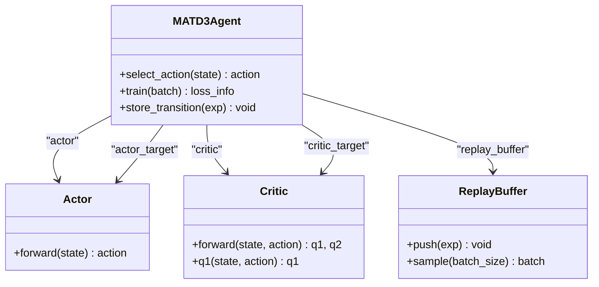
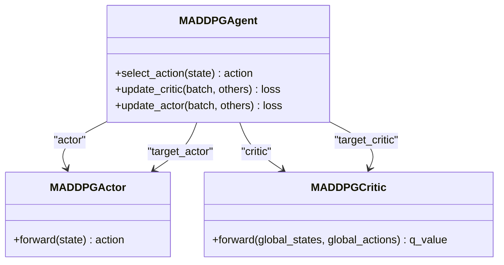
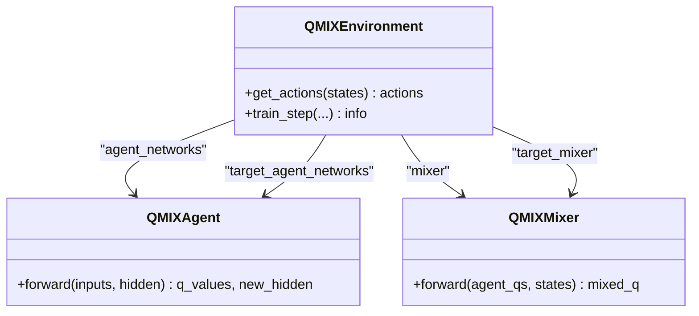
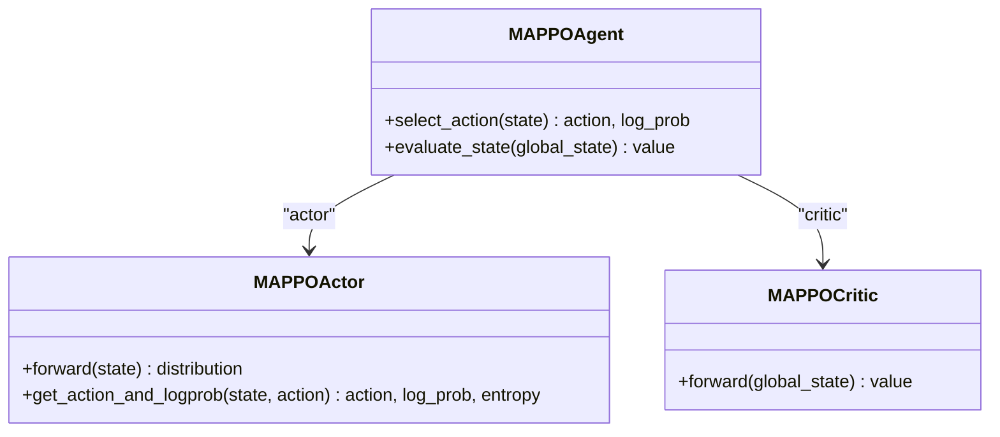
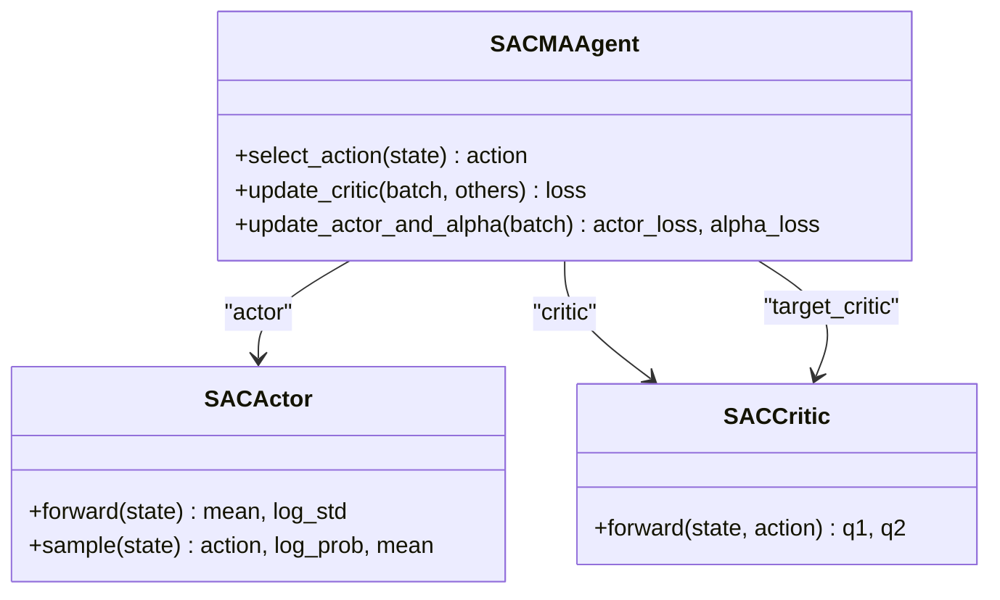
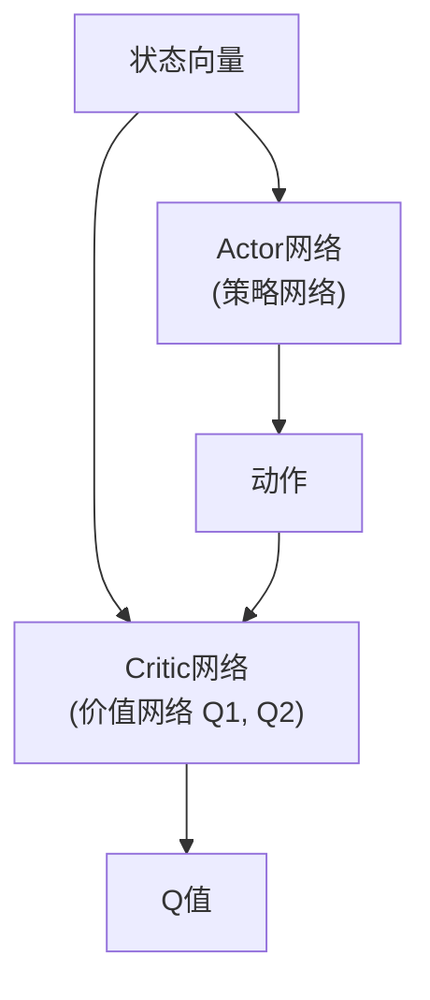

# 多智能体强化学习算法

<cite>
**本文档引用的文件**
- [matd3.py](file://algorithms/matd3.py)
- [maddpg.py](file://algorithms/maddpg.py)
- [qmix.py](file://algorithms/qmix.py)
- [mappo.py](file://algorithms/mappo.py)
- [sac_ma.py](file://algorithms/sac_ma.py)
- [algorithm_config.py](file://config/algorithm_config.py)
- [system_config.py](file://config/system_config.py)
- [standardized_reward.py](file://utils/standardized_reward.py)
- [train_multi_agent.py](file://train_multi_agent.py)
</cite>

## 目录
1. [引言](#引言)
2. [算法原理与架构](#算法原理与架构)
3. [MATD3算法详解](#matd3算法详解)
4. [算法对比分析](#算法对比分析)
5. [算法选择指南](#算法选择指南)
6. [训练机制与实现](#训练机制与实现)
7. [结论](#结论)

## 引言

本项目实现了一套完整的多智能体强化学习算法框架，旨在解决车联网环境下的任务卸载与资源管理问题。系统集成了MATD3、MADDPG、QMIX、MAPPO和SAC-MA五种主流多智能体算法，通过集中式训练、分布式执行的范式，协调车辆、路侧单元（RSU）和无人机（UAV）等异构智能体，优化系统性能。

项目采用模块化设计，各算法实现遵循统一的接口规范，便于比较和替换。核心目标是通过多智能体协同决策，最小化任务时延、能耗和数据丢失率的加权成本函数。系统通过标准化的奖励函数确保所有算法使用一致的优化目标，提高了实验的可比性和结果的可靠性。

**Section sources**
- [matd3.py](file://algorithms/matd3.py#L1-L50)
- [maddpg.py](file://algorithms/maddpg.py#L1-L50)
- [train_multi_agent.py](file://train_multi_agent.py#L1-L50)

## 算法原理与架构

### MATD3 (Multi-Agent Twin Delayed DDPG)

MATD3是DDPG算法在多智能体环境下的扩展，结合了TD3的改进技术。其核心是Actor-Critic架构，其中Actor网络输出确定性策略，Critic网络评估状态-动作对的价值。MATD3的关键创新在于“Twin”Critic和延迟策略更新：使用两个Critic网络取最小值来抑制Q值的过高估计，并延迟更新Actor网络以稳定训练过程。

**Diagram sources**
- [matd3.py](file://algorithms/matd3.py#L100-L250)

### MADDPG (Multi-Agent DDPG)

MADDPG采用集中式训练、分布式执行（CTDE）范式。每个智能体拥有独立的Actor网络用于执行策略，但其Critic网络可以访问全局状态和所有智能体的动作，从而学习到更优的联合动作价值函数。这种设计允许Critic在训练时利用全局信息进行更准确的评估，而Actor在执行时仅依赖局部观测，保证了算法的可扩展性。

**Diagram sources**
- [maddpg.py](file://algorithms/maddpg.py#L200-L350)

### QMIX (Monotonic Value Function Factorisation)

QMIX是一种基于值函数分解的算法，专为部分可观测的多智能体环境设计。它通过一个混合网络（Mixer）将各智能体的个体Q值单调地组合成全局Q值。Mixer网络的权重被设计为全局状态的函数，并且保证为正，从而满足单调性约束，确保联合最优策略的发现。QMIX使用RNN处理历史信息，增强了智能体在部分可观测环境下的决策能力。

**Diagram sources**
- [qmix.py](file://algorithms/qmix.py#L200-L350)

### MAPPO (Multi-Agent Proximal Policy Optimization)

MAPPO将单智能体的PPO算法扩展到多智能体领域。它采用策略梯度方法，通过限制策略更新的步长（使用clip ratio）来保证训练的稳定性。MAPPO同样遵循CTDE范式，其Critic网络是集中的，可以访问全局状态来评估状态价值，而Actor网络是分布式的，根据局部观测选择动作。该算法通过多次迭代更新策略，样本效率高且训练过程稳定。

**Diagram sources**
- [mappo.py](file://algorithms/mappo.py#L200-L350)

### SAC-MA (Multi-Agent Soft Actor-Critic)

SAC-MA基于最大熵强化学习框架，旨在学习既最优又随机的策略。其目标函数不仅最大化累积奖励，还最大化策略的熵，从而鼓励探索。SAC-MA使用两个Critic网络（Twin Q）来抑制过估计，并引入自动温度调节机制来平衡奖励和熵的权重。该算法在连续动作空间中表现出色，具有高样本效率和良好的探索能力。

**Diagram sources**
- [sac_ma.py](file://algorithms/sac_ma.py#L200-L350)

## MATD3算法详解

作为项目主推算法，MATD3在实现上进行了多项优化，确保了其在复杂车联网环境中的高效性和稳定性。

### Actor-Critic架构

MATD3的核心是Actor-Critic双网络架构。Actor网络（策略网络）是一个三层全连接神经网络，输入为智能体的局部状态，输出为[-1, 1]范围内的连续动作，通过tanh激活函数实现。Critic网络（价值网络）包含两个独立的Q网络（Q1和Q2），每个网络都将状态和动作拼接后作为输入，输出对应的Q值。这种双Critic设计是TD3的关键，通过取两个Q值的最小值来计算目标Q值，有效缓解了Q值过高估计的问题。

**Diagram sources**
- [matd3.py](file://algorithms/matd3.py#L50-L100)

### 目标网络与软更新

为了稳定训练过程，MATD3为Actor和Critic网络分别维护了目标网络（target network）。目标网络的参数不是实时更新的，而是缓慢地跟随主网络更新。具体采用“软更新”（soft update）策略：
`θ_target = τ * θ + (1 - τ) * θ_target`
其中`θ`是主网络参数，`θ_target`是目标网络参数，`τ`是一个很小的值（如0.005）。这种渐进式的更新方式避免了Q值的剧烈波动，显著提高了训练的稳定性。

**Section sources**
- [matd3.py](file://algorithms/matd3.py#L350-L370)

### 经验回放机制

MATD3使用经验回放缓冲区（ReplayBuffer）来存储智能体与环境交互的经验（状态、动作、奖励、下一状态、是否结束）。训练时，算法从缓冲区中随机采样一个批次的经验进行学习。这种打破数据间时间相关性的方法，使得样本更加独立同分布，极大地提高了数据的利用效率和训练的稳定性。项目中还实现了针对GPU优化的批次大小，进一步提升了训练速度。

**Section sources**
- [matd3.py](file://algorithms/matd3.py#L150-L180)

## 算法对比分析

下表系统地对比了五种算法在关键维度上的差异：

| 特性 | MATD3 | MADDPG | QMIX | MAPPO | SAC-MA |
| :--- | :--- | :--- | :--- | :--- | :--- |
| **动作空间** | 连续 | 连续 | 离散 | 连续/离散 | 连续 |
| **训练范式** | CTDE | CTDE | CTDE | CTDE | CTDE |
| **中心化程度** | Critic集中 | Critic集中 | Critic集中 | Critic集中 | Critic集中 |
| **策略类型** | 确定性 | 确定性 | 随机性 | 随机性 | 随机性 |
| **关键创新** | Twin Critic, 延迟更新 | 全局Critic | 值函数分解, Mixer | PPO, Clip | 最大熵, 自动调温 |
| **样本效率** | 高 | 中 | 中 | 高 | 非常高 |
| **训练稳定性** | 非常高 | 中 | 高 | 非常高 | 高 |

**Section sources**
- [matd3.py](file://algorithms/matd3.py)
- [maddpg.py](file://algorithms/maddpg.py)
- [qmix.py](file://algorithms/qmix.py)
- [mappo.py](file://algorithms/mappo.py)
- [sac_ma.py](file://algorithms/sac_ma.py)

### 连续 vs 离散动作空间

MATD3、MADDPG、MAPPO和SAC-MA均支持连续动作空间，适用于需要精细控制的场景，如功率分配、资源比例调整等。它们的Actor网络输出的是连续的动作值。而QMIX专为离散动作空间设计，适用于决策类型为“选择”的场景，如选择卸载目标、选择缓存策略等。其Actor网络输出的是各动作的概率，通过ε-贪婪策略选择动作。

### 集中训练分散执行 (CTDE)

所有五种算法都遵循CTDE范式。在**训练阶段**，Critic网络可以访问全局信息（如所有智能体的状态和动作），这使得价值函数的评估更加准确，有助于学习到更优的联合策略。在**执行阶段**，每个智能体的Actor网络仅根据自身的局部观测来选择动作，这保证了算法在实际部署时的可扩展性和实时性，因为智能体无需实时共享所有私有信息。

## 算法选择指南

选择合适的算法应基于具体