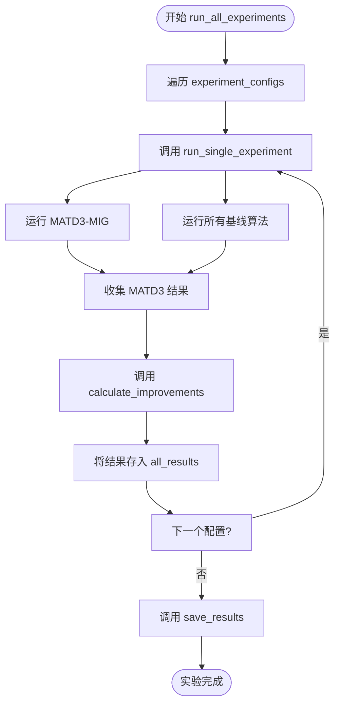
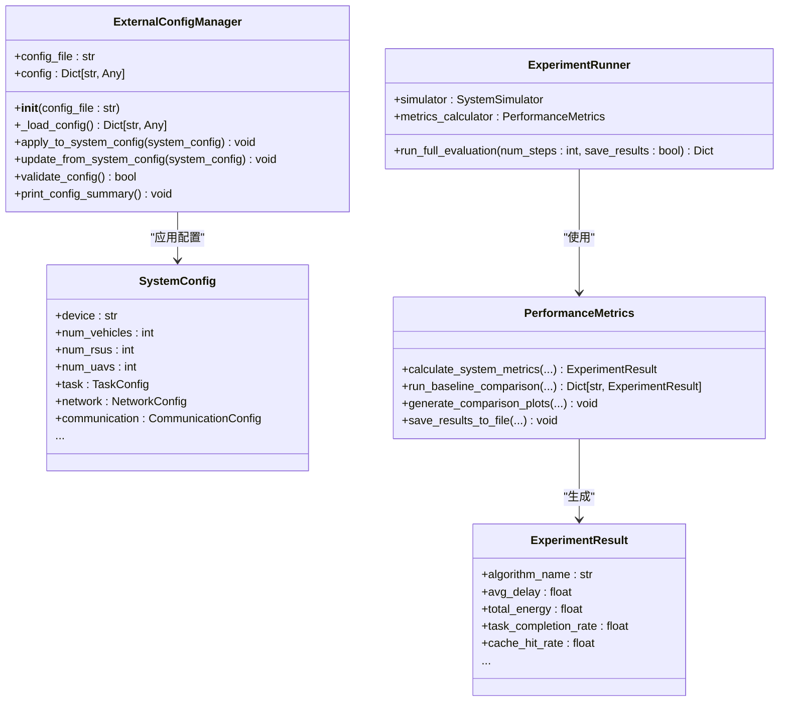

# 实验执行流程

<cite>
**本文档中引用的文件**
- [run_full_experiment.py](file://run_full_experiment.py)
- [experiments/evaluation.py](file://experiments/evaluation.py)
- [config/system_config.py](file://config/system_config.py)
- [config/external_config.py](file://config/external_config.py)
- [vec_system_config.json](file://vec_system_config.json)
</cite>

## 目录
1. [引言](#引言)
2. [实验配置与环境初始化](#实验配置与环境初始化)
3. [多智能体与基线算法训练流程](#多智能体与基线算法训练流程)
4. [实验协调与执行机制](#实验协调与执行机制)
5. [结果保存与报告生成](#结果保存与报告生成)
6. [评估协议与参数控制](#评估协议与参数控制)
7. [自动化批量实验实现](#自动化批量实验实现)
8. [算法公平对比机制](#算法公平对比机制)
9. [实际调用示例](#实际调用示例)
10. [常见配置错误排查](#常见配置错误排查)
11. [结论](#结论)

## 引言
本文件详细文档化了 `run_full_experiment.py` 模块的完整执行流程，涵盖从配置加载、环境初始化、多智能体与基线算法训练、实验协调运行到结果保存的全过程。同时，深入解析 `experiments/evaluation.py` 中定义的评估协议和实验参数控制机制。文档说明了如何通过该系统实现自动化批量实验，并支持 MATD3-MIG 与传统方法等不同算法的公平对比。提供了实际调用示例和常见配置错误的排查方法，旨在为研究人员和开发者提供全面的操作指南。

## 实验配置与环境初始化

`run_full_experiment.py` 的执行始于 `FullExperimentRunner` 类的初始化，其核心是配置的加载与测试环境的创建。

首先，系统通过 `config` 模块（`config/system_config.py`）加载全局系统配置。此配置是一个层次化的 `SystemConfig` 对象，包含了设备设置、网络拓扑、任务生成、计算资源、通信、迁移和缓存等多个子模块的详细参数。例如，`config.task.data_size_range` 定义了任务数据大小的范围，`config.network.num_vehicles` 定义了车辆节点的数量。

其次，系统支持通过外部 JSON 文件（`vec_system_config.json`）进行运行时配置覆盖。`ExternalConfigManager` 类负责管理此功能。它会尝试加载 `vec_system_config.json` 文件，若文件不存在则创建一个包含默认值的文件。该管理器会将 JSON 文件中的配置应用到全局 `config` 对象上，从而实现对系统行为的灵活调整。例如，JSON 文件中的 `"task_generation": {"arrival_rate": 1.35}` 会覆盖系统默认的任务到达率。

最后，`create_test_environment` 方法根据当前的实验配置（`ExperimentConfig`）动态创建仿真环境。该方法会：
1.  **创建车辆节点**：根据 `num_vehicles` 参数，随机生成指定数量的 `VehicleNode` 实例，并为其分配随机位置。
2.  **创建 RSU 节点**：根据 `num_rsus` 参数，创建 `RSUNode` 实例，并将其均匀分布在仿真区域的中线上。
3.  **创建 UAV 节点**：根据 `num_uavs` 参数，创建 `UAVNode` 实例，并为其分配随机的二维位置和固定的飞行高度。

此过程确保了每次实验都能在一致且可配置的环境中进行。

**Section sources**
- [run_full_experiment.py](file://run_full_experiment.py#L170-L204)
- [config/system_config.py](file://config/system_config.py#L257-L315)
- [config/external_config.py](file://config/external_config.py#L74-L246)

## 多智能体与基线算法训练流程

实验的核心是对比 MATD3-MIG 算法与多种基线算法的性能。`FullExperimentRunner` 类通过 `run_matd3_mig_experiment` 和 `run_baseline_experiment` 方法分别执行这两类算法的训练与评估。

### MATD3-MIG 算法执行
`run_matd3_mig_experiment` 方法模拟了 MATD3-MIG 系统的完整运行过程：
1.  **环境与组件初始化**：基于当前实验配置创建车辆、RSU 和 UAV 节点，并实例化 `OffloadingDecisionMaker`（卸载决策器）、`TaskMigrationManager`（任务迁移管理器）和 `CollaborativeCacheManager`（协同缓存管理器）。
2.  **任务生成与处理**：在每个时间步，`generate_tasks` 方法根据 `task_arrival_rate` 和 `config.task` 中的参数（如 `data_size_range`）生成新的任务。
3.  **决策与执行**：对于每个新任务，系统会：
    *   **缓存请求**：向缓存管理器查询任务内容，更新缓存命中率统计。
    *   **卸载决策**：调用 `OffloadingDecisionMaker` 的 `make_offloading_decision` 方法，由 MATD3-MIG 模型决定任务的最佳处理节点。
    *   **任务处理**：模拟任务在目标节点上的成功处理（成功率 85%），并记录延迟和能耗。
4.  **状态更新**：所有节点调用 `step` 方法，推进其内部状态。

### 基线算法执行
`run_baseline_experiment` 方法用于评估五种基线算法：`Random`、`Greedy`、`Round_Robin` 和 `Load_Aware`。这些算法的实现均继承自 `BaselineAlgorithm` 基类。
1.  **算法决策**：与 MATD3-MIG 不同，基线算法使用简单的启发式规则进行决策。例如，`GreedyAlgorithm` 选择 CPU 利用率最低的节点，而 `LoadAwareAlgorithm` 综合考虑节点距离和负载。
2.  **性能模拟**：为了体现基线算法的性能劣势，代码中为不同算法设置了不同的成功率、延迟和能耗乘数。例如，`Random` 算法的成功率仅为 65%，且其延迟和能耗乘数最高。

通过这种设计，系统能够公平地比较不同算法在相同仿真环境下的表现。

**Section sources**
- [run_full_experiment.py](file://run_full_experiment.py#L206-L368)
- [run_full_experiment.py](file://run_full_experiment.py#L370-L448)

## 实验协调与执行机制

`FullExperimentRunner` 类通过 `run_all_experiments` 和 `run_single_experiment` 方法协调整个实验流程，确保多个实验配置能被有序执行。

`run_all_experiments` 是顶层协调函数，其执行流程如下：
1.  **遍历实验配置**：系统预定义了多个 `ExperimentConfig` 实例，分别代表“标准”、“高负载”和“大规模”三种场景。`run_all_experiments` 会遍历这些配置。
2.  **执行单个实验**：对于每个配置，调用 `run_single_experiment` 方法。
3.  **结果聚合与分析**：`run_single_experiment` 会依次运行 MATD3-MIG 和所有基线算法，并将结果存入一个字典。随后，`calculate_improvements` 方法会计算 MATD3-MIG 相对于各基线算法在延迟、能耗、完成率和缓存命中率上的百分比改进。
4.  **结果汇总**：所有单个实验的结果被汇总到 `all_results` 字典中。

此机制确保了实验的自动化和可重复性，用户无需手动干预即可完成一系列对比实验。



**Diagram sources**
- [run_full_experiment.py](file://run_full_experiment.py#L450-L583)

**Section sources**
- [run_full_experiment.py](file://run_full_experiment.py#L450-L583)

## 结果保存与报告生成

实验完成后，`FullExperimentRunner` 会自动将结果持久化到磁盘，便于后续分析。

`save_results` 方法负责此过程：
1.  **创建结果目录**：确保 `results` 目录存在。
2.  **保存原始数据**：将包含所有实验数据的 `all_results` 字典以 JSON 格式保存为 `results/full_experiment_results.json`。
3.  **生成汇总报告**：调用 `generate_summary_report` 方法生成一份人类可读的 Markdown 报告。

`generate_summary_report` 方法会创建一个结构化的 Markdown 文件（`results/experiment_summary.md`），其内容包括：
*   **性能对比表**：以表格形式展示每种算法在不同实验配置下的平均延迟、总能耗、完成率、丢失率和缓存命中率。
*   **改进效果分析**：明确列出 MATD3-MIG 相对于各基线算法的性能提升百分比。

这种多层次的保存策略既保留了原始数据的完整性，又提供了易于理解的摘要信息。

**Section sources**
- [run_full_experiment.py](file://run_full_experiment.py#L450-L583)

## 评估协议与参数控制

`experiments/evaluation.py` 模块定义了更精细的评估协议和参数控制机制，为 `run_full_experiment.py` 提供了底层支持。

### 性能指标计算
`PerformanceMetrics` 类是评估的核心，其 `calculate_system_metrics` 方法计算了全面的性能指标：
*   **综合指标**：平均时延、总能耗、数据丢失率、任务完成率、缓存命中率、迁移成功率。
*   **资源利用率**：CPU、带宽和队列的平均利用率。
*   **时延与能耗分解**：将总时延分解为传输、处理和等待时延；将总能耗分解为计算、通信和迁移能耗。

### 基线算法对比
`run_baseline_comparison` 方法提供了一种更贴近真实仿真的基线对比方式。它通过 `system_simulator` 运行一个简化的仿真循环，并使用 `BaselineAlgorithms` 类中的静态方法（如 `random_allocation`, `greedy_allocation`）进行任务分配，从而获得更准确的基线性能数据。

### 参数控制
`ExternalConfigManager` 类（在 `config/external_config.py` 中）是参数控制的关键。它允许用户通过修改 `vec_system_config.json` 文件来动态调整系统行为，而无需更改代码。`apply_to_system_config` 方法将 JSON 配置应用到全局 `config` 对象，实现了运行时的参数注入。



**Diagram sources**
- [experiments/evaluation.py](file://experiments/evaluation.py#L74-L531)
- [config/external_config.py](file://config/external_config.py#L74-L246)

**Section sources**
- [experiments/evaluation.py](file://experiments/evaluation.py#L74-L531)

## 自动化批量实验实现

本系统通过 `run_full_experiment.py` 中的 `experiment_configs` 列表实现了自动化批量实验。

`experiment_configs` 是一个包含多个 `ExperimentConfig` 对象的列表，每个对象代表一个独立的实验场景。例如：
*   **标准配置**：`num_episodes=50`, `episode_length=500`
*   **高负载配置**：`task_arrival_rate=3.0`
*   **大规模配置**：`num_vehicles=20`, `num_rsus=6`, `num_uavs=3`

`run_all_experiments` 方法会自动遍历这个列表，为每个配置执行完整的实验流程（包括运行所有算法和生成报告）。用户只需在代码中定义好这些配置，即可一键运行所有实验，极大地提高了研究效率。

**Section sources**
- [run_full_experiment.py](file://run_full_experiment.py#L170-L198)

## 算法公平对比机制

为了确保不同算法之间的公平对比，系统在多个层面进行了设计：
1.  **统一的仿真环境**：所有算法在相同的 `vehicles`, `rsus`, `uavs` 环境中运行，使用相同的节点位置、任务生成序列和网络参数。
2.  **一致的评估指标**：所有算法的性能都通过相同的指标（如平均延迟、总能耗）进行衡量，这些指标由 `PerformanceMetrics` 或 `FullExperimentRunner` 中的统计逻辑统一计算。
3.  **相同的随机种子**：虽然代码中未显式设置，但理论上应通过 `config.random_seed` 来确保随机过程（如任务生成、节点移动）在不同算法运行时保持一致。
4.  **标准化的实验流程**：无论是 MATD3-MIG 还是基线算法，都遵循 `run_single_experiment` 定义的相同流程：创建环境 -> 生成任务 -> 执行决策 -> 更新状态 -> 收集数据。

这种设计确保了性能差异的来源是算法本身，而非外部环境或评估方式的偏差。

**Section sources**
- [run_full_experiment.py](file://run_full_experiment.py#L151-L583)

## 实际调用示例

要运行完整的实验，用户只需在命令行中执行以下命令：

```bash
python run_full_experiment.py
```

该脚本会自动执行所有预定义的实验，并将结果保存到 `results/` 目录下。

如果需要自定义配置，用户可以修改 `vec_system_config.json` 文件。例如，要将任务到达率提高到 2.0 tasks/s，可以修改文件如下：

```json
{
  "task_generation": {
    "arrival_rate": 2.0
  },
  ...
}
```

然后再次运行 `run_full_experiment.py`，新的配置将被自动加载并应用。

此外，用户也可以直接在 Python 代码中调用 `ExperimentRunner`（来自 `experiments/evaluation.py`）进行更精细的控制：

```python
from experiments.evaluation import ExperimentRunner
from simulator import SystemSimulator # 假设存在一个系统模拟器

simulator = SystemSimulator()
runner = ExperimentRunner(simulator)
results = runner.run_full_evaluation(num_steps=200, save_results=True)
```

## 常见配置错误排查

在使用本系统时，可能会遇到一些常见问题，以下是排查方法：

| 问题现象 | 可能原因 | 解决方法 |
| :--- | :--- | :--- |
| `配置文件加载失败` | `vec_system_config.json` 文件不存在或格式错误 | 检查文件路径是否正确，使用 JSON 校验工具检查语法 |
| `实验结果不理想` | 外部配置参数不合理 | 运行 `external_config.validate_config()` 验证配置合理性，检查 `arrival_rate`、`data_size_range` 等关键参数 |
| `缺少 results 目录` | 程序未创建目录 | 确保程序有写入权限，或手动创建 `results` 目录 |
| `CUDA 不可用` | 系统未安装 GPU 驱动或 CUDA | 检查 `config.device` 的值，若为 `cpu` 则系统将使用 CPU 运行 |
| `任务生成数量异常` | `arrival_rate` 与 `time_slot_duration` 不匹配 | 确保 `arrival_rate` 的单位是 tasks/second，并与 `time_slot_duration` (seconds) 协调 |

**Section sources**
- [config/external_config.py](file://config/external_config.py#L200-L246)

## 结论
本文档全面解析了 `run_full_experiment.py` 和 `experiments/evaluation.py` 模块的执行流程与设计机制。系统通过层次化的配置管理、模块化的实验执行和自动化的结果处理，构建了一个强大且灵活的实验评估框架。它不仅支持 MATD3-MIG 算法的完整评估，还能通过预定义的实验配置和基线算法对比，实现自动化批量实验和公平的性能比较。通过对外部 JSON 配置文件的支持，系统具备了高度的可配置性，为研究人员探索不同场景下的算法性能提供了便利。