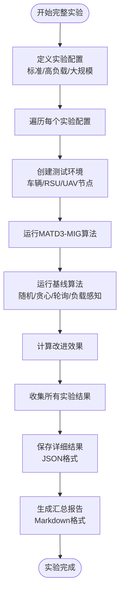
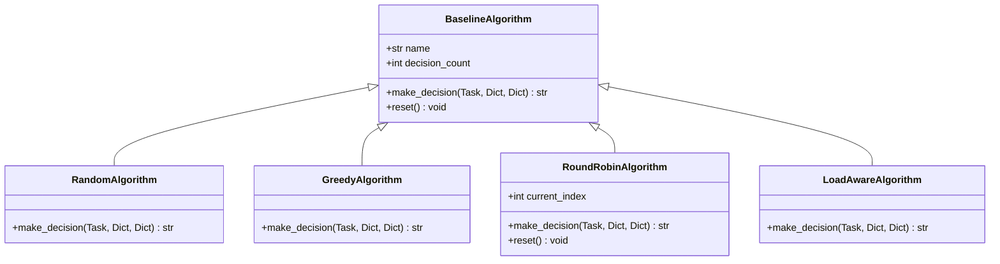
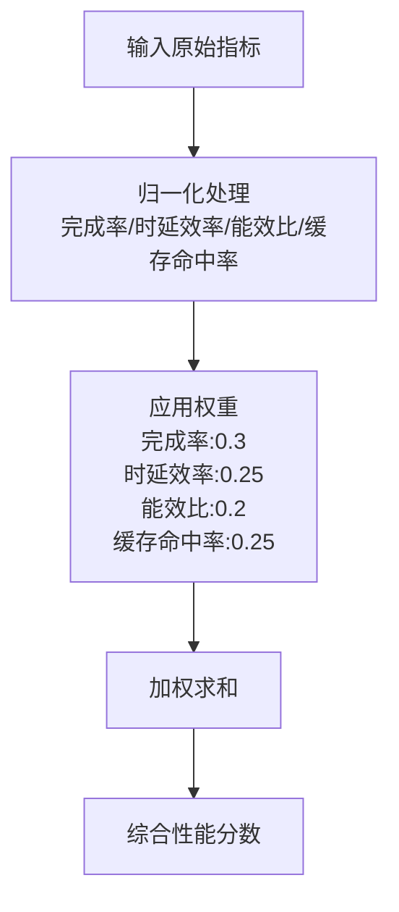
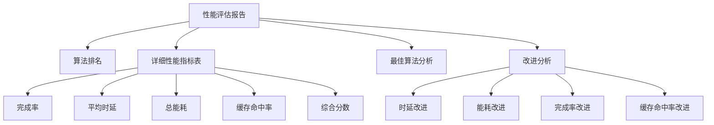

# 实验评估框架

<cite>
**本文档中引用的文件**  
- [performance_evaluator.py](file://evaluation/performance_evaluator.py)
- [run_full_experiment.py](file://run_full_experiment.py)
- [matd3.py](file://algorithms/matd3.py)
- [reward_calculator.py](file://utils/reward_calculator.py)
- [energy_validator.py](file://utils/energy_validator.py)
- [train_multi_agent.py](file://train_multi_agent.py)
- [experiments/evaluation.py](file://experiments/evaluation.py)
- [decision/offloading_manager.py](file://decision/offloading_manager.py)
</cite>

## 目录
1. [引言](#引言)
2. [实验运行流程](#实验运行流程)
3. [性能评估指标定义](#性能评估指标定义)
4. [基线算法对比方法](#基线算法对比方法)
5. [综合性能评分机制](#综合性能评分机制)
6. [统计显著性分析与公平比较](#统计显著性分析与公平比较)
7. [评估结果解读指南](#评估结果解读指南)
8. [性能瓶颈诊断方法](#性能瓶颈诊断方法)
9. [结论](#结论)

## 引言
本系统提供了一套完整的实验评估框架，用于对多智能体任务卸载与迁移算法（如MATD3-MIG）进行系统性性能评估。该框架支持自动化执行多组实验、计算关键性能指标、与多种基线算法进行公平对比，并生成详细的可视化报告。评估过程不仅关注任务完成率、延迟和能耗等核心指标，还通过综合评分和统计分析确保结果的可靠性和可解释性。

## 实验运行流程
系统通过`run_full_experiment.py`脚本自动化执行完整的实验评估流程。该流程设计为可重复、可配置的多场景测试，确保评估结果的全面性和鲁棒性。



**Diagram sources**
- [run_full_experiment.py](file://run_full_experiment.py#L166-L204)
- [run_full_experiment.py](file://run_full_experiment.py#L546-L583)

**Section sources**
- [run_full_experiment.py](file://run_full_experiment.py#L546-L583)

## 性能评估指标定义
`performance_evaluator.py`模块负责计算和定义所有关键性能指标。这些指标从不同维度全面反映算法的性能表现。

### 核心指标计算
性能评估器通过`evaluate_algorithm`方法计算以下核心指标：

| 指标名称 | 计算公式 | 说明 |
|---------|--------|------|
| **任务完成率** | `completed_tasks / total_tasks` | 成功处理的任务占总生成任务的比例 |
| **平均时延** | `total_delay / completed_tasks` | 成功任务从生成到完成的平均耗时 |
| **总能耗** | `Σ(各节点能耗)` | 系统在实验期间消耗的总能量 |
| **缓存命中率** | `cache_hits / cache_requests` | 缓存请求中成功命中的比例 |
| **任务丢失率** | `dropped_tasks / total_tasks` | 因超时或失败而丢失的任务比例 |

### 衍生效率指标
为了更深入地分析性能，系统还计算了以下衍生指标：

- **能效比**：`完成的任务数 / 总能耗`，衡量单位能耗下的任务处理能力
- **时延效率**：`1 / 平均时延`，衡量任务处理的响应速度
- **综合性能分数**：基于加权归一化的多维度综合评分

**Section sources**
- [performance_evaluator.py](file://evaluation/performance_evaluator.py#L19-L47)
- [train_multi_agent.py](file://train_multi_agent.py#L343-L372)

## 基线算法对比方法
系统实现了多种经典的基线算法，用于与先进的MATD3-MIG算法进行公平对比，验证其优越性。

### 基线算法实现
`run_full_experiment.py`中定义了四种基线算法：



**Diagram sources**
- [run_full_experiment.py](file://run_full_experiment.py#L100-L164)

**Section sources**
- [run_full_experiment.py](file://run_full_experiment.py#L100-L164)
- [experiments/evaluation.py](file://experiments/evaluation.py#L213-L243)

### 对比实验执行
`FullExperimentRunner`类负责协调所有算法的对比实验：

1. **环境隔离**：为每个算法创建独立的测试环境，确保公平性
2. **参数一致**：使用相同的任务生成率、网络拓扑和系统参数
3. **多次运行**：通过多轮实验减少随机性影响
4. **结果聚合**：对多次运行的结果进行统计平均

## 综合性能评分机制
为了提供一个统一的性能衡量标准，系统采用加权归一化方法计算综合性能分数。

### 评分计算流程


**Diagram sources**
- [performance_evaluator.py](file://evaluation/performance_evaluator.py#L49-L73)

### 评分函数实现
`calculate_composite_score`方法实现了评分逻辑：

1. **归一化**：将各指标映射到[0,1]区间
   - 完成率：直接使用
   - 时延效率：`min(值/10.0, 1.0)`
   - 能效比：`min(值/1000, 1.0)`
   - 缓存命中率：直接使用
2. **加权求和**：根据预设权重计算最终分数

该机制确保了不同量纲的指标可以公平比较，为算法选择提供量化依据。

**Section sources**
- [performance_evaluator.py](file://evaluation/performance_evaluator.py#L49-L73)
- [reward_calculator.py](file://utils/reward_calculator.py#L38-L70)

## 统计显著性分析与公平比较
系统通过多种机制确保评估结果的统计显著性和比较的公平性。

### 改进幅度计算
`calculate_improvements`方法量化了MATD3-MIG相对于基线算法的改进：

```python
# 时延和能耗（越小越好）
improvement = (基线值 - MATD3值) / 基线值 * 100

# 完成率和缓存命中率（越大越好）
improvement = (MATD3值 - 基线值) / 基线值 * 100
```

**Section sources**
- [run_full_experiment.py](file://run_full_experiment.py#L453-L482)
- [performance_evaluator.py](file://evaluation/performance_evaluator.py#L104-L132)

### 多场景验证
系统在三种不同配置下运行实验，确保结果的鲁棒性：

| 实验配置 | 车辆数 | RSU数 | UAV数 | 任务到达率 |
|---------|-------|------|------|----------|
| 标准 | 12 | 4 | 2 | 2.0 |
| 高负载 | 12 | 4 | 2 | 3.0 |
| 大规模 | 20 | 6 | 3 | 2.0 |

这种多场景测试避免了算法在特定条件下过拟合的问题。

**Section sources**
- [run_full_experiment.py](file://run_full_experiment.py#L166-L204)

## 评估结果解读指南
系统生成的评估报告包含丰富的信息，正确解读这些结果对于理解算法性能至关重要。

### 报告结构
`generate_performance_report`方法生成结构化的Markdown报告：



**Diagram sources**
- [performance_evaluator.py](file://evaluation/performance_evaluator.py#L141-L183)

### 关键解读要点
1. **排名优先**：首先关注综合分数排名，确定最佳算法
2. **改进分析**：查看改进百分比，理解优势来源
3. **指标权衡**：分析是否存在性能权衡（如降低时延导致能耗增加）
4. **场景差异**：比较不同实验配置下的表现，识别算法的适用场景

**Section sources**
- [performance_evaluator.py](file://evaluation/performance_evaluator.py#L141-L183)
- [run_full_experiment.py](file://run_full_experiment.py#L496-L544)

## 性能瓶颈诊断方法
当评估结果不理想时，系统提供了多种诊断工具帮助识别性能瓶颈。

### 能耗验证
`energy_validator.py`模块提供能耗数据的合理性检查：

- **范围检查**：确保能耗值在物理合理范围内
- **分布检查**：检测异常的零能耗或最大值聚集
- **一致性检查**：验证总能耗与组件能耗之和的一致性
- **效率检查**：计算每周期计算能耗和每MB传输能耗

**Section sources**
- [energy_validator.py](file://utils/energy_validator.py#L35-L74)
- [energy_validator.py](file://utils/energy_validator.py#L251-L276)

### 时延分析
通过分解时延成分诊断瓶颈：


**Diagram sources**
- [decision/offloading_manager.py](file://decision/offloading_manager.py#L316-L345)

### 数值稳定性检查
`enhance_numerical_stability.py`提供数值计算的稳定性测试，确保评估结果不受数值误差影响。

**Section sources**
- [energy_validator.py](file://utils/energy_validator.py#L153-L178)

## 结论
本实验评估框架提供了一套完整、严谨的性能评估解决方案。通过自动化执行多场景实验、计算多维度性能指标、与多种基线算法进行公平对比，并生成详细的可视化报告，系统能够全面、客观地评估算法性能。综合评分机制和统计显著性分析确保了评估结果的可靠性和可解释性，而丰富的诊断工具则帮助研究人员深入理解算法行为，识别性能瓶颈。这一框架为算法开发和优化提供了坚实的数据支持。