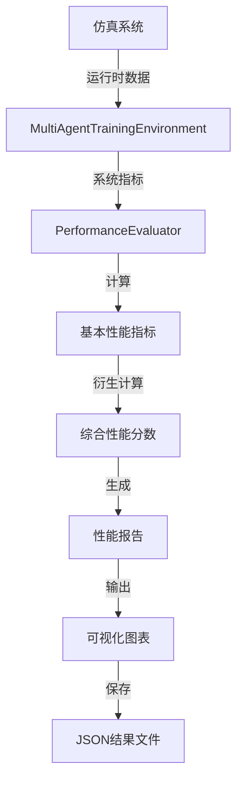
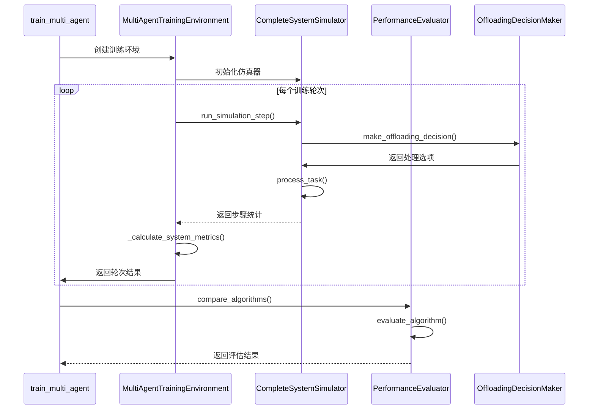

# 性能评估指标

<cite>
**本文档引用的文件**   
- [performance_evaluator.py](file://evaluation/performance_evaluator.py)
- [test_complete_system.py](file://evaluation/test_complete_system.py)
- [train_multi_agent.py](file://train_multi_agent.py)
- [offloading_manager.py](file://decision/offloading_manager.py)
</cite>

## 目录
1. [引言](#引言)
2. [核心性能指标定义](#核心性能指标定义)
3. [指标计算逻辑与数据来源](#指标计算逻辑与数据来源)
4. [评估器与训练决策模块集成机制](#评估器与训练决策模块集成机制)
5. [综合性能评分计算方法](#综合性能评分计算方法)
6. [自定义扩展接口使用方法](#自定义扩展接口使用方法)
7. [典型性能瓶颈识别路径](#典型性能瓶颈识别路径)
8. [优化建议](#优化建议)
9. [结论](#结论)

## 引言
本文档深入解析`performance_evaluator.py`中实现的关键性能指标计算逻辑，涵盖任务完成率、平均延迟、系统能耗、缓存命中率和迁移成功率等核心指标。文档详细说明了各指标的数学定义、数据来源及计算周期，并阐述了性能评估器如何与训练和决策模块集成以收集运行时数据。此外，文档还提供了指标加权组合方式和自定义扩展接口的使用方法，并包含典型性能瓶颈的识别路径和优化建议。

## 核心性能指标定义
性能评估器通过`PerformanceEvaluator`类实现，主要评估以下关键性能指标：

| 指标名称 | 数学定义 | 说明 |
|--------|--------|------|
| **任务完成率** | `completed_tasks / total_tasks` | 成功处理的任务占生成任务的比例 |
| **平均延迟** | `total_delay / completed_tasks` | 成功完成任务的平均处理时延（秒） |
| **系统能耗** | `sum(energy_consumption)` | 系统在仿真过程中消耗的总能量（焦耳） |
| **缓存命中率** | `cache_hits / (cache_hits + cache_misses)` | 缓存请求中成功命中的比例 |
| **迁移成功率** | `dynamic_success_rate` | 任务在RSU间迁移的成功率（由迁移管理器提供） |
| **丢弃率** | `dropped_tasks / total_tasks` | 因超时或资源不足而被丢弃的任务比例 |

这些指标共同构成了系统性能的多维度评估体系，能够全面反映车联网边缘计算系统的运行效率和资源利用情况。

**Section sources**
- [performance_evaluator.py](file://evaluation/performance_evaluator.py#L19-L47)
- [test_complete_system.py](file://evaluation/test_complete_system.py#L482-L511)

## 指标计算逻辑与数据来源
性能指标的计算遵循一个清晰的数据流和处理逻辑，从仿真系统收集原始数据，经过处理和计算，最终生成评估结果。



**Diagram sources**
- [train_multi_agent.py](file://train_multi_agent.py#L302-L457)
- [performance_evaluator.py](file://evaluation/performance_evaluator.py#L19-L47)

### 数据来源与计算周期
性能数据主要来源于`CompleteSystemSimulator`的运行时输出，通过`MultiAgentTrainingEnvironment`进行收集和预处理。数据采集遵循以下周期：

1. **单步采集**：在每个仿真时隙（time slot）结束时，`run_simulation_step`方法返回当前步骤的统计信息，包括生成任务数、完成任务数、总延迟、总能耗等。
2. **轮次聚合**：在每个训练轮次（episode）结束时，`_calculate_system_metrics`方法将所有步骤的统计数据聚合，计算出该轮次的平均指标。
3. **最终评估**：当所有轮次完成后，`compare_algorithms`方法调用`evaluate_algorithm`对每个算法的最终性能进行评估。

关键数据字段映射如下：
- `generated_tasks` → `total_tasks`
- `processed_tasks` → `completed_tasks`
- `total_delay` → `avg_delay`
- `total_energy` → `total_energy`
- `cache_hits` + `cache_misses` → `cache_hit_rate`

**Section sources**
- [test_complete_system.py](file://evaluation/test_complete_system.py#L482-L511)
- [train_multi_agent.py](file://train_multi_agent.py#L302-L457)

## 评估器与训练决策模块集成机制
性能评估器与训练和决策模块的集成是通过一系列精心设计的接口和数据流实现的，确保了评估过程的准确性和实时性。



**Diagram sources**
- [train_multi_agent.py](file://train_multi_agent.py#L475-L623)
- [offloading_manager.py](file://decision/offloading_manager.py#L281-L325)

### 集成流程详解
1. **环境初始化**：`train_multi_agent.py`创建`MultiAgentTrainingEnvironment`实例，该环境内部初始化`CompleteSystemSimulator`。
2. **决策集成**：在每个仿真步骤中，仿真器调用`OffloadingDecisionMaker`的`make_offloading_decision`方法，该方法结合任务分类和处理模式评估来选择最佳卸载策略。
3. **数据收集**：`MultiAgentTrainingEnvironment`的`_calculate_system_metrics`方法从仿真器的`run_simulation_step`结果中提取原始数据，并进行验证和修正。
4. **性能评估**：训练完成后，`PerformanceEvaluator`的`compare_algorithms`方法被调用，它接收来自训练环境的最终统计结果，并进行算法性能比较。

这种集成机制确保了评估器能够获取到真实反映系统运行状态的数据，同时保持了模块间的松耦合性。

**Section sources**
- [train_multi_agent.py](file://train_multi_agent.py#L736-L791)
- [offloading_manager.py](file://decision/offloading_manager.py#L281-L325)

## 综合性能评分计算方法
综合性能评分是通过加权组合多个关键指标来实现的，旨在提供一个单一的、可比较的性能度量标准。

```mermaid
flowchart TD
A[基本指标] --> B[归一化]
B --> C[加权求和]
C --> D[综合分数]
subgraph 归一化
B1[completion_rate: 0-1]
B2[delay_efficiency: min(x,10)/10]
B3[energy_efficiency: min(x/1000,1)]
B4[cache_hit_rate: 0-1]
end
subgraph 加权
C1[completion_rate * 0.3]
C2[delay_efficiency * 0.25]
C3[energy_efficiency * 0.2]
C4[cache_hit_rate * 0.25]
end
```

**Diagram sources**
- [performance_evaluator.py](file://evaluation/performance_evaluator.py#L49-L73)

### 计算步骤
1. **衍生指标计算**：
   - `energy_efficiency = completed_tasks / max(total_energy, 1)`
   - `delay_efficiency = 1.0 / max(avg_delay, 0.001)`

2. **归一化处理**：
   - `completion_rate`: 直接使用，范围0-1
   - `delay_efficiency`: `min(x, 10.0) / 10.0`
   - `energy_efficiency`: `min(x / 1000, 1.0)`
   - `cache_hit_rate`: 直接使用，范围0-1

3. **加权求和**：
   ```python
   composite_score = (
       0.3 * normalized_completion_rate +
       0.25 * normalized_delay_efficiency +
       0.2 * normalized_energy_efficiency +
       0.25 * normalized_cache_hit_rate
   )
   ```

权重分配体现了系统设计的优先级：任务完成率最重要（30%），其次是延迟效率和缓存命中率（各25%），最后是能量效率（20%）。

**Section sources**
- [performance_evaluator.py](file://evaluation/performance_evaluator.py#L49-L73)

## 自定义扩展接口使用方法
`PerformanceEvaluator`类提供了多个可扩展的接口，允许用户根据具体需求自定义评估逻辑。

### 可扩展方法
1. **`evaluate_algorithm`**: 可以重写此方法以添加新的性能指标或修改现有指标的计算方式。
2. **`calculate_composite_score`**: 可以修改权重分配或添加新的评估维度。
3. **`generate_performance_report`**: 可以自定义报告的格式和内容。
4. **`plot_performance_comparison`**: 可以添加新的图表类型或修改现有图表的样式。

### 扩展示例
```python
class CustomPerformanceEvaluator(PerformanceEvaluator):
    def calculate_composite_score(self, performance: Dict) -> float:
        # 添加迁移成功率作为新指标
        weights = {
            'completion_rate': 0.25,
            'delay_efficiency': 0.2,
            'energy_efficiency': 0.15,
            'cache_hit_rate': 0.2,
            'migration_success_rate': 0.2  # 新增权重
        }
        
        normalized_scores = {
            'completion_rate': performance['completion_rate'],
            'delay_efficiency': min(performance['delay_efficiency'], 10.0) / 10.0,
            'energy_efficiency': min(performance['energy_efficiency'] / 1000, 1.0),
            'cache_hit_rate': performance['cache_hit_rate'],
            'migration_success_rate': performance.get('migration_success_rate', 0.0)  # 新增指标
        }
        
        return sum(weights[metric] * normalized_scores[metric] for metric in weights.keys())
```

通过继承`PerformanceEvaluator`并重写相关方法，用户可以轻松地扩展评估器的功能，以适应不同的应用场景和评估需求。

**Section sources**
- [performance_evaluator.py](file://evaluation/performance_evaluator.py#L12-L253)

## 典型性能瓶颈识别路径
通过分析性能评估结果，可以识别出系统中的典型性能瓶颈，并采取相应的优化措施。

### 识别路径
1. **低任务完成率**：
   - 检查`completion_rate`是否低于预期阈值（如80%）
   - 分析`drop_rate`是否过高
   - 检查`avg_delay`是否超过任务截止时间

2. **高延迟问题**：
   - 检查`avg_delay`是否显著高于其他算法
   - 分析通信延迟和计算延迟的构成
   - 检查网络带宽利用率是否过高

3. **高能耗问题**：
   - 检查`total_energy`是否显著高于其他算法
   - 分析传输能耗和计算能耗的构成
   - 检查是否有过多的远程卸载

4. **低缓存命中率**：
   - 检查`cache_hit_rate`是否低于预期（如60%）
   - 分析缓存策略是否合理
   - 检查缓存容量是否足够

5. **迁移成功率低**：
   - 检查`migration_success_rate`是否低于预期
   - 分析迁移决策是否过于激进
   - 检查目标RSU的负载情况

### 诊断工具
- **性能报告**：`generate_performance_report`方法生成的Markdown报告提供了详细的指标对比。
- **对比图表**：`plot_performance_comparison`方法生成的柱状图直观地展示了各算法的性能差异。
- **JSON结果**：`save_results`方法保存的JSON文件包含了完整的评估数据，可用于进一步分析。

**Section sources**
- [performance_evaluator.py](file://evaluation/performance_evaluator.py#L141-L183)

## 优化建议
基于性能评估结果，可以提出以下优化建议：

1. **调整任务分类阈值**：
   - 如果低延迟任务过多导致完成率低，可以适当放宽`delay_threshold_1`和`delay_threshold_2`。
   - 如果高延迟任务过多导致资源浪费，可以收紧`delay_threshold_3`。

2. **优化卸载决策权重**：
   - 如果能耗过高，可以增加`w_energy`权重，减少远程卸载。
   - 如果延迟过高，可以增加`w_delay`权重，促进更积极的卸载。

3. **改进缓存策略**：
   - 实现更智能的缓存替换算法，如LRU或LFU。
   - 增加缓存容量或采用分布式缓存。

4. **增强迁移管理**：
   - 优化迁移决策算法，避免在高负载RSU间迁移。
   - 引入预测性迁移，提前将任务迁移到预期负载较低的RSU。

5. **算法参数调优**：
   - 调整强化学习算法的超参数，如学习率、折扣因子等。
   - 优化神经网络结构，提高决策质量。

6. **系统配置优化**：
   - 增加RSU和UAV的数量，提高覆盖范围。
   - 提升通信带宽和计算能力。

通过持续的性能评估和优化，可以不断提升系统的整体性能和用户体验。

## 结论
本文档详细解析了`performance_evaluator.py`中实现的关键性能指标计算逻辑，包括任务完成率、平均延迟、系统能耗、缓存命中率和迁移成功率等。文档说明了评估器如何与训练和决策模块集成以收集运行时数据，并提供了指标加权组合方式和自定义扩展接口的使用方法。通过识别典型性能瓶颈并提出优化建议，本文档为系统性能的持续改进提供了有力支持。性能评估器的设计体现了模块化、可扩展和易用性的原则，是车联网边缘计算系统开发和优化的重要工具。