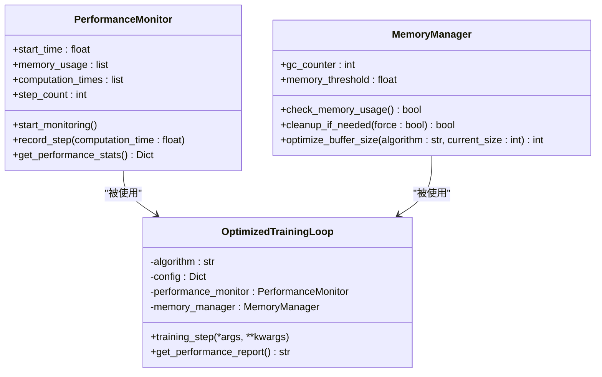
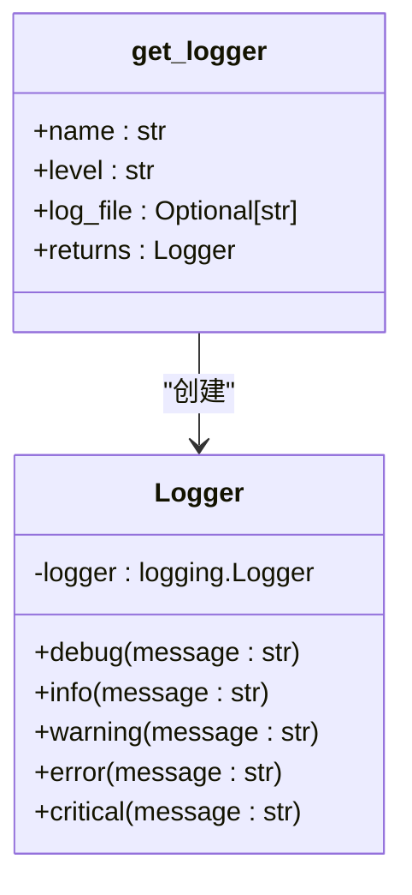
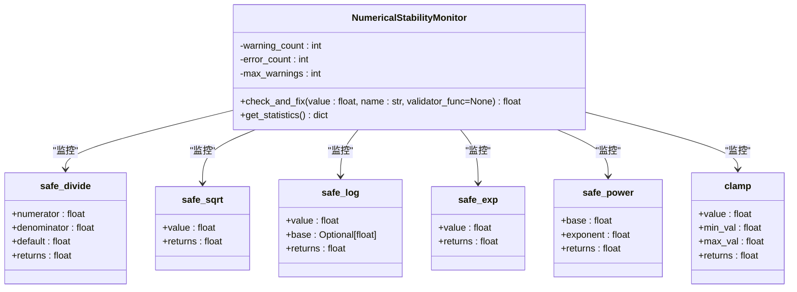
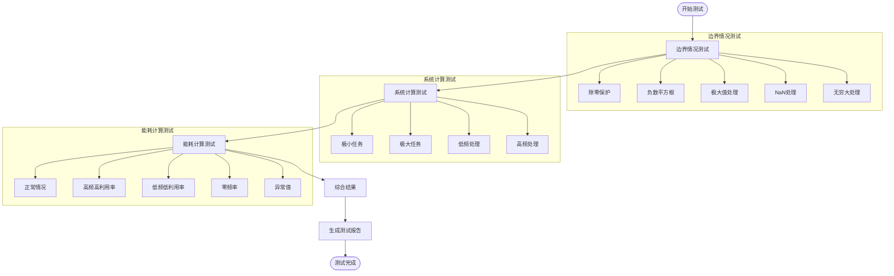
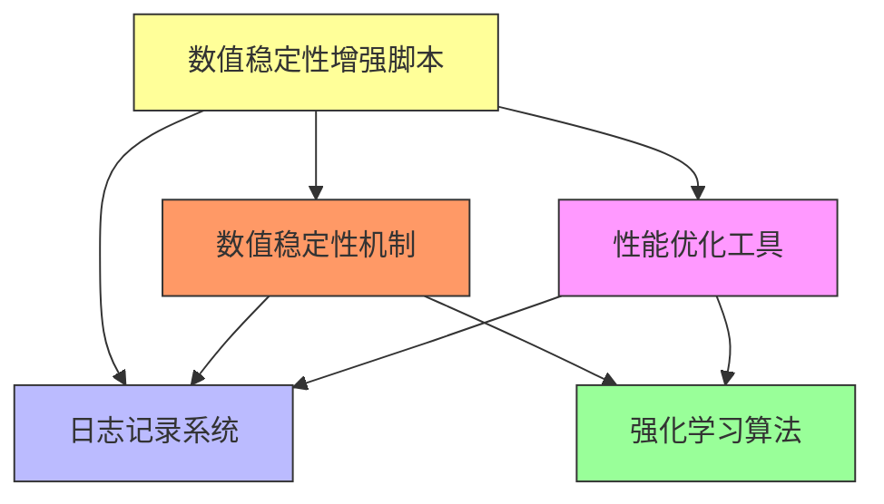

# 工具与优化

<cite>
**Referenced Files in This Document**  
- [performance_optimization.py](file://tools/performance_optimization.py)
- [logger.py](file://utils/logger.py)
- [numerical_stability.py](file://utils/numerical_stability.py)
- [enhance_numerical_stability.py](file://enhance_numerical_stability.py)
</cite>

## 目录
1. [引言](#引言)
2. [性能优化工具](#性能优化工具)
3. [日志记录系统](#日志记录系统)
4. [数值稳定性机制](#数值稳定性机制)
5. [数值稳定性增强脚本](#数值稳定性增强脚本)
6. [综合分析](#综合分析)
7. [结论](#结论)

## 引言

本项目包含一套完整的工具集，旨在提升系统的性能、可维护性和数值计算的稳定性。这些工具覆盖了性能优化、日志记录和数值稳定性三个关键领域，为强化学习算法的稳定运行提供了坚实的基础。本文档将详细说明这些工具的功能、实现机制和使用方法。

## 性能优化工具

性能优化工具模块（`performance_optimization.py`）提供了一套全面的性能监控和内存管理解决方案，旨在确保算法在不同硬件环境下都能高效稳定地运行。

### 性能监控与内存管理

该模块通过`PerformanceMonitor`类和`MemoryManager`类实现了对系统性能的全面监控和内存的智能管理。



**Diagram sources**  
- [performance_optimization.py](file://tools/performance_optimization.py#L50-L100)
- [performance_optimization.py](file://tools/performance_optimization.py#L110-L150)

**Section sources**  
- [performance_optimization.py](file://tools/performance_optimization.py#L1-L337)

### 优化技术详解

性能优化模块提供了多种具体的技术来提升系统性能：

1. **动态批次大小调整**：通过`get_optimal_batch_size`函数，根据可用内存自动调整批次大小，确保在不同硬件配置下都能获得最佳性能。
2. **内存高效批处理**：`memory_efficient_batch_processing`函数实现了分批处理大数据集，同时定期进行内存清理，防止内存溢出。
3. **NumPy数组优化**：`optimize_numpy_arrays`函数自动将`float64`转换为`float32`，将大整数类型转换为更紧凑的类型，显著减少内存占用。
4. **装饰器模式**：`performance_timer`装饰器可以轻松地为任何方法添加性能计时功能，便于性能分析。

这些技术共同构成了一个完整的性能优化框架，通过`OptimizedTrainingLoop`类为各种强化学习算法提供统一的优化接口。

## 日志记录系统

日志记录系统（`logger.py`）提供了一个简单而强大的日志记录功能，支持多级别日志记录和文件输出。

### 日志系统架构

日志系统采用标准的Python logging模块，通过`Logger`类封装了常用的功能，提供了简洁的API。



**Diagram sources**  
- [logger.py](file://utils/logger.py#L15-L60)

**Section sources**  
- [logger.py](file://utils/logger.py#L1-L68)

### 功能特性

日志系统具有以下主要特性：

1. **多级别记录**：支持`DEBUG`、`INFO`、`WARNING`、`ERROR`和`CRITICAL`五个级别的日志记录，便于不同场景下的调试和监控。
2. **双输出通道**：同时支持控制台输出和文件输出，方便开发和生产环境的使用。
3. **避免重复处理器**：在`__init__`方法中检查是否已存在处理器，防止日志重复输出。
4. **灵活配置**：可以通过参数指定日志名称、级别和输出文件，满足不同模块的需求。
5. **格式化输出**：统一的日志格式包含时间戳、模块名、级别和消息，便于日志分析。

系统还提供了`get_logger`工厂函数和`default_logger`全局实例，简化了日志记录器的获取和使用。

## 数值稳定性机制

数值稳定性模块（`numerical_stability.py`）是系统稳定运行的关键，它解决了强化学习训练中常见的梯度爆炸和数值溢出问题。

### 核心问题与解决方案

在强化学习训练中，由于复杂的数学计算和长时间的迭代过程，经常会出现以下数值问题：
- **除零错误**：当分母接近零时导致计算中断
- **数值溢出**：指数运算或大数相乘导致结果超出浮点数表示范围
- **NaN值传播**：一旦出现NaN值，会迅速传播到整个计算图
- **梯度爆炸/消失**：梯度值过大或过小，导致模型无法收敛

数值稳定性模块通过一系列安全函数和验证机制来解决这些问题。

### 安全计算函数

模块提供了一系列"安全"版本的数学函数，这些函数在执行计算前会进行必要的检查和修正：



**Diagram sources**  
- [numerical_stability.py](file://utils/numerical_stability.py#L20-L250)

**Section sources**  
- [numerical_stability.py](file://utils/numerical_stability.py#L1-L294)

### 领域特定验证

除了通用的数学函数，模块还提供了针对特定领域的验证函数，确保输入数据的合理性：

- `validate_sinr`: 验证信噪比值，防止通信计算中的异常
- `validate_energy`: 验证能耗值，确保物理意义的正确性
- `validate_delay`: 验证延迟值，处理网络传输中的异常情况
- `validate_probability`: 验证概率值，确保在0-1范围内
- `validate_cpu_frequency`: 验证CPU频率，防止硬件参数异常
- `validate_data_size`: 验证数据大小，确保在合理范围内

这些验证函数与`NumericalStabilityMonitor`监控器配合使用，能够及时发现并修复数值问题，保证系统的稳定运行。

## 数值稳定性增强脚本

`enhance_numerical_stability.py`脚本是一个自动化工具，用于增强系统的数值稳定性。

### 脚本功能

该脚本主要提供以下功能：

1. **自动创建数值稳定性模块**：如果`utils/numerical_stability.py`文件不存在，脚本会自动生成该文件，包含所有必要的安全函数和验证器。
2. **创建测试脚本**：生成`test_numerical_stability.py`测试文件，用于验证系统的数值稳定性。
3. **全面测试**：运行一系列边界情况测试，确保系统在各种极端条件下都能稳定运行。

### 使用方法

使用该脚本非常简单，只需在命令行中执行：

```bash
python enhance_numerical_stability.py
```

脚本执行后会：
1. 创建或更新`utils/numerical_stability.py`文件
2. 创建`test_numerical_stability.py`测试文件
3. 运行全面的稳定性测试
4. 输出测试结果和使用建议

### 测试覆盖

脚本创建的测试覆盖了多种边界情况：



**Diagram sources**  
- [enhance_numerical_stability.py](file://enhance_numerical_stability.py#L100-L500)

**Section sources**  
- [enhance_numerical_stability.py](file://enhance_numerical_stability.py#L1-L543)

## 综合分析

这三个工具模块共同构成了一个完整的系统优化框架，它们之间相互协作，共同提升系统的整体性能和稳定性。

### 模块间关系



**Diagram sources**  
- [performance_optimization.py](file://tools/performance_optimization.py)
- [logger.py](file://utils/logger.py)
- [numerical_stability.py](file://utils/numerical_stability.py)
- [enhance_numerical_stability.py](file://enhance_numerical_stability.py)

### 协同工作流程

在实际运行中，这些模块按照以下流程协同工作：

1. **初始化阶段**：系统启动时，创建`Logger`实例用于记录运行信息。
2. **训练循环**：`OptimizedTrainingLoop`管理训练过程，使用`PerformanceMonitor`记录性能数据。
3. **内存管理**：`MemoryManager`定期检查内存使用情况，必要时执行垃圾回收。
4. **数值计算**：在关键计算中使用`numerical_stability`模块的安全函数，防止数值异常。
5. **问题监控**：`NumericalStabilityMonitor`监控数值健康状态，发现异常时记录警告。
6. **日志输出**：所有重要事件、警告和错误都通过`Logger`记录到控制台和文件。

这种分层的架构设计使得各个模块职责清晰，易于维护和扩展。

## 结论

本项目的工具集为强化学习系统的稳定运行提供了全面的保障。性能优化工具通过智能的内存管理和性能监控，确保系统在各种硬件环境下都能高效运行。日志记录系统提供了完善的调试和监控能力，便于问题排查和系统分析。数值稳定性机制从根本上解决了训练过程中的数值问题，防止了梯度爆炸和NaN值传播等常见故障。

`enhance_numerical_stability.py`脚本进一步简化了这些工具的使用，通过自动化的方式增强系统的数值稳定性。建议在项目开发和部署过程中充分利用这些工具，定期运行稳定性测试，确保系统的长期稳定运行。