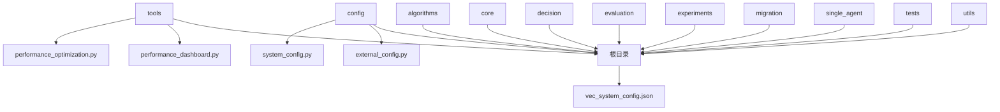
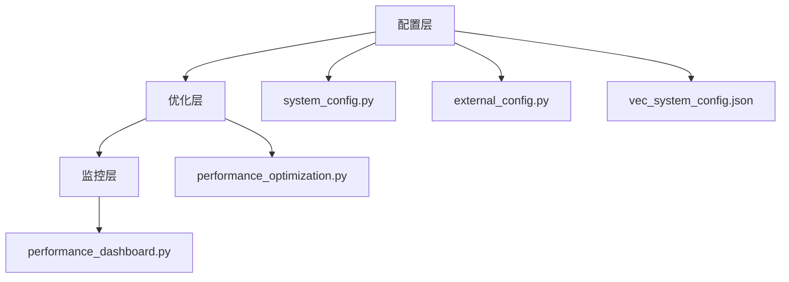
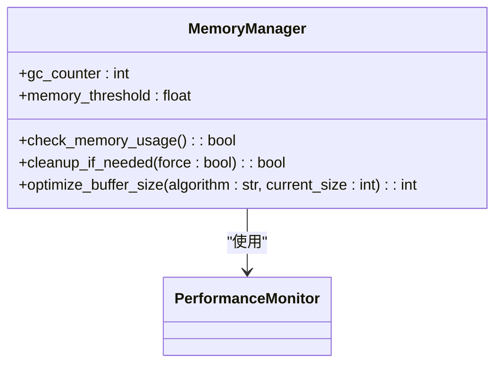
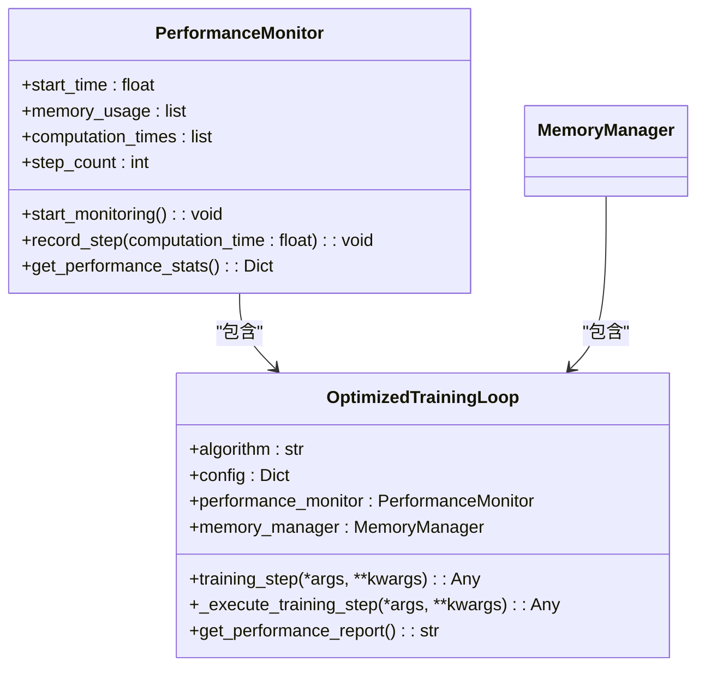
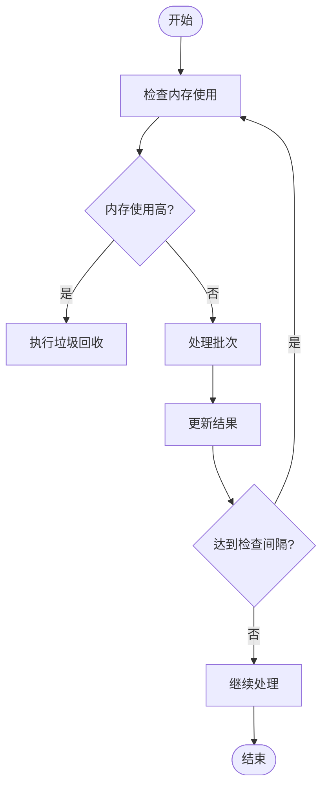
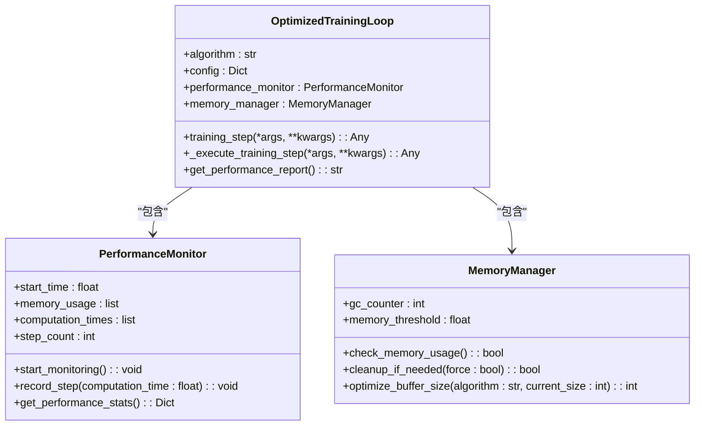
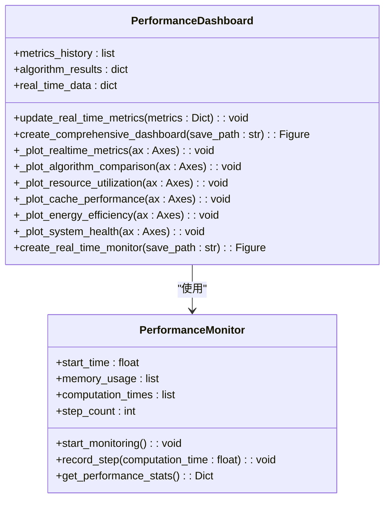
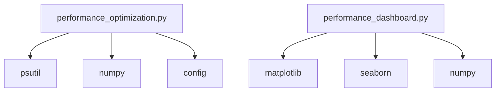

# 性能优化工具

<cite>
**本文档引用的文件**
- [performance_optimization.py](file://tools/performance_optimization.py)
- [performance_dashboard.py](file://tools/performance_dashboard.py)
- [system_config.py](file://config/system_config.py)
- [external_config.py](file://config/external_config.py)
- [vec_system_config.json](file://vec_system_config.json)
</cite>

## 目录
1. [简介](#简介)
2. [项目结构](#项目结构)
3. [核心组件](#核心组件)
4. [架构概述](#架构概述)
5. [详细组件分析](#详细组件分析)
6. [依赖分析](#依赖分析)
7. [性能考虑](#性能考虑)
8. [故障排除指南](#故障排除指南)
9. [结论](#结论)

## 简介
本文档详细说明了`performance_optimization.py`模块中实现的性能优化技术，包括内存管理策略、计算加速方法、批量处理机制以及资源调度优化。该模块与核心训练流程集成，旨在提升多智能体强化学习的训练效率。结合`performance_dashboard.py`，文档还描述了性能监控仪表板的构建方式，支持实时指标展示与瓶颈分析。通过代码示例展示如何调用优化接口，配置参数，并解释其对训练收敛速度和系统吞吐量的影响。此外，涵盖常见性能问题的诊断方法和调优建议。

## 项目结构
本项目采用模块化设计，将不同功能分离到独立的目录中。`tools`目录包含性能优化和监控工具，`algorithms`目录包含多种强化学习算法实现，`config`目录管理系统的配置参数。

**Diagram sources**
- [performance_optimization.py](file://tools/performance_optimization.py)
- [performance_dashboard.py](file://tools/performance_dashboard.py)
- [system_config.py](file://config/system_config.py)
- [external_config.py](file://config/external_config.py)
- [vec_system_config.json](file://vec_system_config.json)

**Section sources**
- [performance_optimization.py](file://tools/performance_optimization.py)
- [performance_dashboard.py](file://tools/performance_dashboard.py)
- [system_config.py](file://config/system_config.py)
- [external_config.py](file://config/external_config.py)
- [vec_system_config.json](file://vec_system_config.json)

## 核心组件
`performance_optimization.py`模块提供了多种性能优化技术，包括内存管理、计算加速、批量处理和资源调度。`performance_dashboard.py`模块提供了实时性能监控和综合指标展示功能。

**Section sources**
- [performance_optimization.py](file://tools/performance_optimization.py)
- [performance_dashboard.py](file://tools/performance_dashboard.py)

## 架构概述
系统架构分为三层：配置层、优化层和监控层。配置层通过`system_config.py`和`external_config.py`管理系统的静态和动态配置。优化层通过`performance_optimization.py`实现各种性能优化技术。监控层通过`performance_dashboard.py`提供实时性能监控和综合指标展示。

**Diagram sources**
- [system_config.py](file://config/system_config.py)
- [external_config.py](file://config/external_config.py)
- [vec_system_config.json](file://vec_system_config.json)
- [performance_optimization.py](file://tools/performance_optimization.py)
- [performance_dashboard.py](file://tools/performance_dashboard.py)

## 详细组件分析

### 内存管理策略分析
`MemoryManager`类实现了内存管理策略，通过定期垃圾回收和内存使用率检查来优化内存使用。

**Diagram sources**
- [performance_optimization.py](file://tools/performance_optimization.py#L150-L180)

**Section sources**
- [performance_optimization.py](file://tools/performance_optimization.py#L150-L180)

### 计算加速方法分析
`performance_timer`装饰器用于性能计时，`optimize_numpy_arrays`函数用于优化numpy数组的内存使用。

**Diagram sources**
- [performance_optimization.py](file://tools/performance_optimization.py#L50-L140)
- [performance_optimization.py](file://tools/performance_optimization.py#L281-L316)

**Section sources**
- [performance_optimization.py](file://tools/performance_optimization.py#L50-L140)
- [performance_optimization.py](file://tools/performance_optimization.py#L281-L316)

### 批量处理机制分析
`memory_efficient_batch_processing`函数实现了内存高效的批处理机制，通过分批处理数据来减少内存使用。

**Diagram sources**
- [performance_optimization.py](file://tools/performance_optimization.py#L200-L220)

**Section sources**
- [performance_optimization.py](file://tools/performance_optimization.py#L200-L220)

### 资源调度优化分析
`create_performance_optimized_config`函数根据算法类型创建性能优化配置，包括批次大小、缓冲区大小等。

**Diagram sources**
- [performance_optimization.py](file://tools/performance_optimization.py#L242-L284)
- [performance_optimization.py](file://tools/performance_optimization.py#L281-L316)

**Section sources**
- [performance_optimization.py](file://tools/performance_optimization.py#L242-L284)
- [performance_optimization.py](file://tools/performance_optimization.py#L281-L316)

### 性能监控仪表板分析
`PerformanceDashboard`类提供了实时性能监控和综合指标展示功能，支持多种图表类型。

**Diagram sources**
- [performance_dashboard.py](file://tools/performance_dashboard.py#L20-L120)

**Section sources**
- [performance_dashboard.py](file://tools/performance_dashboard.py#L20-L120)

## 依赖分析
`performance_optimization.py`模块依赖于`psutil`、`numpy`等外部库，以及项目内部的`config`模块。`performance_dashboard.py`模块依赖于`matplotlib`、`seaborn`等可视化库。

**Diagram sources**
- [performance_optimization.py](file://tools/performance_optimization.py)
- [performance_dashboard.py](file://tools/performance_dashboard.py)

**Section sources**
- [performance_optimization.py](file://tools/performance_optimization.py)
- [performance_dashboard.py](file://tools/performance_dashboard.py)

## 性能考虑
通过合理配置`OPTIMIZED_BATCH_SIZES`、`MEMORY_CONFIG`和`COMPUTE_CONFIG`等参数，可以显著提升训练效率。建议根据实际硬件条件调整这些参数。

## 故障排除指南
常见性能问题包括内存泄漏、计算瓶颈和I/O瓶颈。通过`PerformanceMonitor`类可以监控内存使用和计算时间，帮助诊断这些问题。

**Section sources**
- [performance_optimization.py](file://tools/performance_optimization.py#L50-L140)

## 结论
`performance_optimization.py`和`performance_dashboard.py`模块提供了全面的性能优化和监控功能，能够显著提升多智能体强化学习的训练效率。通过合理配置和使用这些工具，可以有效解决训练过程中的性能瓶颈。