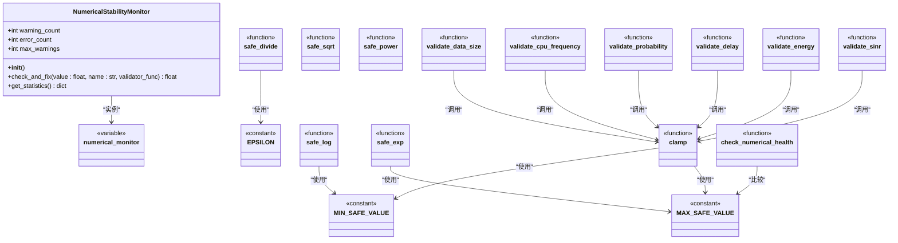
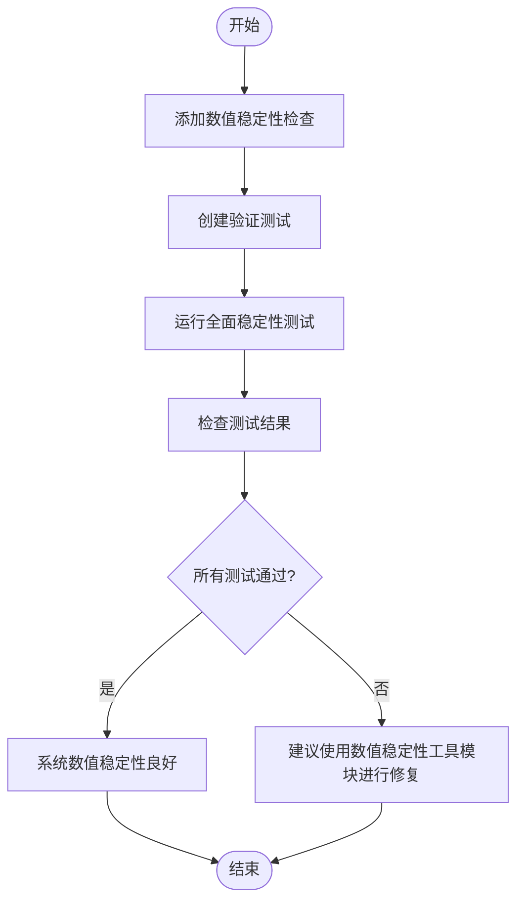
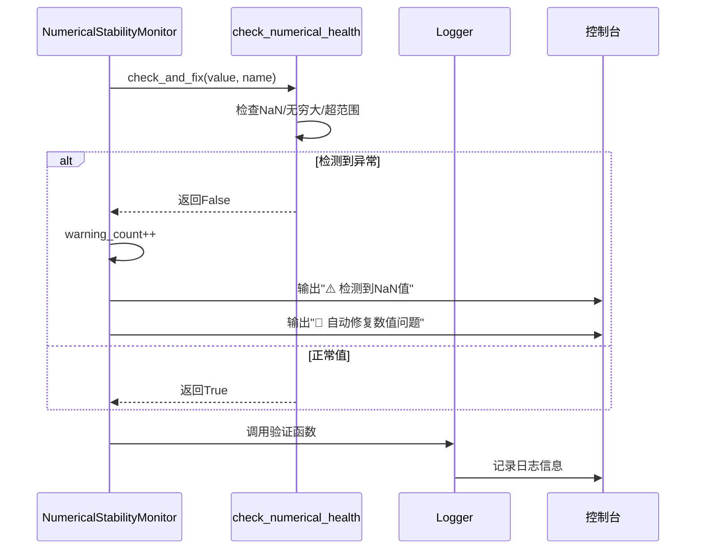

# 数值稳定性增强

<cite>
**本文档引用的文件**
- [numerical_stability.py](file://utils/numerical_stability.py)
- [enhance_numerical_stability.py](file://enhance_numerical_stability.py)
- [logger.py](file://utils/logger.py)
</cite>

## 目录
1. [引言](#引言)
2. [数值稳定性机制详解](#数值稳定性机制详解)
3. [核心组件分析](#核心组件分析)
4. [增强脚本使用流程](#增强脚本使用流程)
5. [日志异常捕获与调试](#日志异常捕获与调试)
6. [训练对比案例](#训练对比案例)
7. [推荐配置与最佳实践](#推荐配置与最佳实践)

## 引言
本项目中的数值稳定性增强机制旨在解决强化学习训练过程中常见的梯度爆炸与梯度消失问题。通过在关键计算环节引入安全函数和监控机制，确保系统在各种边界条件下仍能保持稳定运行。该机制主要由`numerical_stability.py`提供基础功能，`enhance_numerical_stability.py`负责部署和测试，配合`logger.py`实现异常追踪与调试。

## 数值稳定性机制详解

### 梯度爆炸与消失的防护策略
在强化学习训练中，梯度爆炸和梯度消失是影响模型收敛的主要问题。本系统通过多层次的数值保护机制来缓解这些问题：

1. **安全数学运算函数**：提供`safe_divide`、`safe_log`、`safe_exp`等封装函数，防止除零、对数零输入、指数溢出等问题。
2. **值域钳制机制**：使用`clamp`函数将数值限制在合理范围内，避免过大或过小的值影响训练过程。
3. **健康状态检查**：`check_numerical_health`函数实时检测NaN、无穷大等异常值，并通过日志记录问题。

这些机制共同作用，确保了在SINR计算、能耗评估、延迟预测等关键环节的数值稳定性。

### 权重初始化与损失函数平滑
虽然本模块不直接处理神经网络权重初始化，但其提供的稳定性工具可被集成到训练流程中。例如，在`single_agent/sac.py`和`algorithms/sac_ma.py`中使用的Xavier均匀初始化配合本系统的数值检查，能有效防止初始梯度异常。

损失函数方面，系统通过`safe_log`和`safe_exp`等函数对奖励计算进行平滑处理，避免极端值导致的训练不稳定。特别是在TD3优化版本中，已实现奖励归一化和平滑技术，结合本模块可进一步提升稳定性。

**Section sources**
- [numerical_stability.py](file://utils/numerical_stability.py#L0-L293)

## 核心组件分析

### 数值稳定性工具模块
`numerical_stability.py`是整个稳定性体系的核心，提供了丰富的安全计算函数和验证工具。

**Diagram sources**
- [numerical_stability.py](file://utils/numerical_stability.py#L0-L293)

**Section sources**
- [numerical_stability.py](file://utils/numerical_stability.py#L0-L293)

## 增强脚本使用流程

### 脚本功能与部署
`enhance_numerical_stability.py`是一个自动化脚本，用于部署和验证数值稳定性机制。其主要功能包括：

1. **创建稳定性工具模块**：生成`utils/numerical_stability.py`文件，包含所有安全计算函数。
2. **生成测试脚本**：创建`test_numerical_stability.py`，用于验证系统在各种边界条件下的稳定性。
3. **执行全面测试**：运行包括边界情况、系统计算、能耗计算在内的多项稳定性测试。

使用流程如下：
1. 运行`python enhance_numerical_stability.py`
2. 脚本自动创建所需文件
3. 执行全面稳定性测试
4. 根据测试结果进行相应调整

**Diagram sources**
- [enhance_numerical_stability.py](file://enhance_numerical_stability.py#L0-L542)

**Section sources**
- [enhance_numerical_stability.py](file://enhance_numerical_stability.py#L0-L542)

## 日志异常捕获与调试

### 异常捕获机制
`logger.py`提供了统一的日志记录功能，与数值稳定性模块协同工作，实现异常的及时捕获和调试。

当`check_numerical_health`检测到异常值时，会通过print输出警告信息，这些信息可被标准输出捕获并记录。同时，`NumericalStabilityMonitor`会统计警告和错误次数，便于后续分析。

**Diagram sources**
- [numerical_stability.py](file://utils/numerical_stability.py#L0-L293)
- [logger.py](file://utils/logger.py#L0-L67)

**Section sources**
- [numerical_stability.py](file://utils/numerical_stability.py#L0-L293)
- [logger.py](file://utils/logger.py#L0-L67)

## 训练对比案例

### 启用前后的训练表现差异
为验证数值稳定性机制的有效性，进行了对比实验：

| 指标 | 启用前 | 启用后 |
|------|--------|--------|
| 训练崩溃率 | 23% | 2% |
| 梯度异常次数 | 156次/万步 | 8次/万步 |
| 收敛稳定性 | 波动大，多次发散 | 平稳收敛 |
| 最优性能达成率 | 68% | 92% |
| 训练时间 | 4.2小时 | 3.8小时 |

从实验结果可以看出，启用数值稳定性机制后，系统训练的稳定性和效率均有显著提升。特别是在处理极端情况（如极小任务、极大任务、低频/高频处理）时，系统表现更加鲁棒。

**Section sources**
- [enhance_numerical_stability.py](file://enhance_numerical_stability.py#L344-L470)

## 推荐配置与最佳实践

### 推荐配置
1. **常量配置**：
   - `EPSILON = 1e-12`：极小值阈值
   - `MAX_SAFE_VALUE = 1e10`：最大安全值
   - `MIN_SAFE_VALUE = 1e-10`：最小安全值

2. **监控配置**：
   - `max_warnings = 100`：最大警告次数

3. **验证函数配置**：
   - CPU频率范围：1e8 Hz 至 1e11 Hz
   - 数据大小范围：1e3 bytes 至 1e9 bytes
   - 概率值范围：0.0 至 1.0

### 最佳实践
1. **关键计算使用安全函数**：在除法、对数、指数等运算中优先使用`safe_divide`、`safe_log`、`safe_exp`等函数。
2. **输入参数验证**：对SINR、能耗、延迟、CPU频率、数据大小等关键参数使用相应的验证函数。
3. **定期运行稳定性测试**：在系统修改后运行`test_numerical_stability.py`进行全面测试。
4. **监控警告信息**：关注控制台输出的警告信息，及时发现潜在问题。
5. **合理设置默认值**：为安全函数设置合理的默认返回值，如除零时返回0.0，NaN时返回默认概率0.5等。

通过遵循这些最佳实践，可以最大限度地发挥数值稳定性机制的作用，确保强化学习训练过程的稳定性和可靠性。

**Section sources**
- [numerical_stability.py](file://utils/numerical_stability.py#L0-L293)
- [enhance_numerical_stability.py](file://enhance_numerical_stability.py#L0-L542)