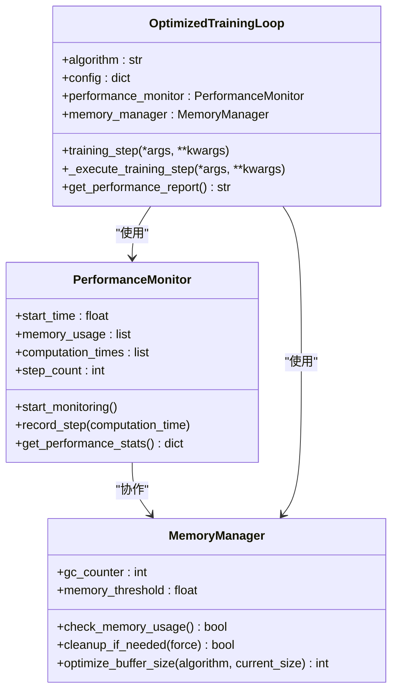
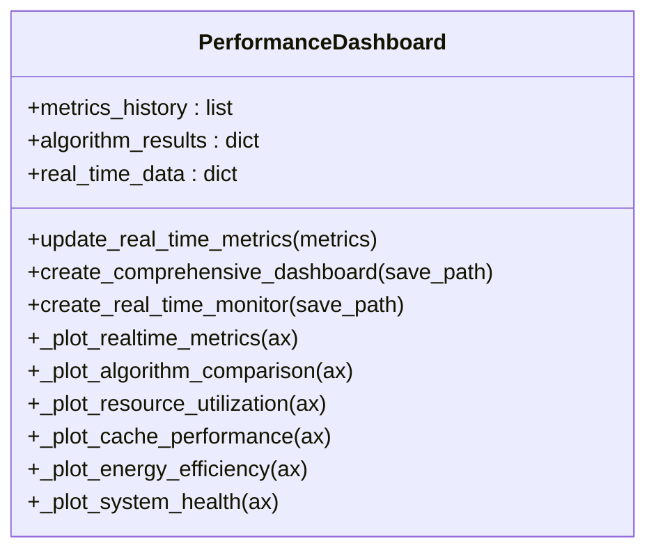
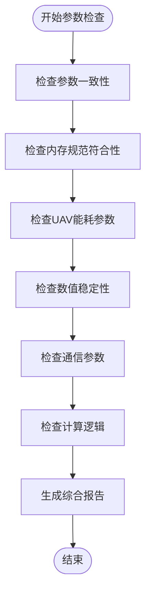
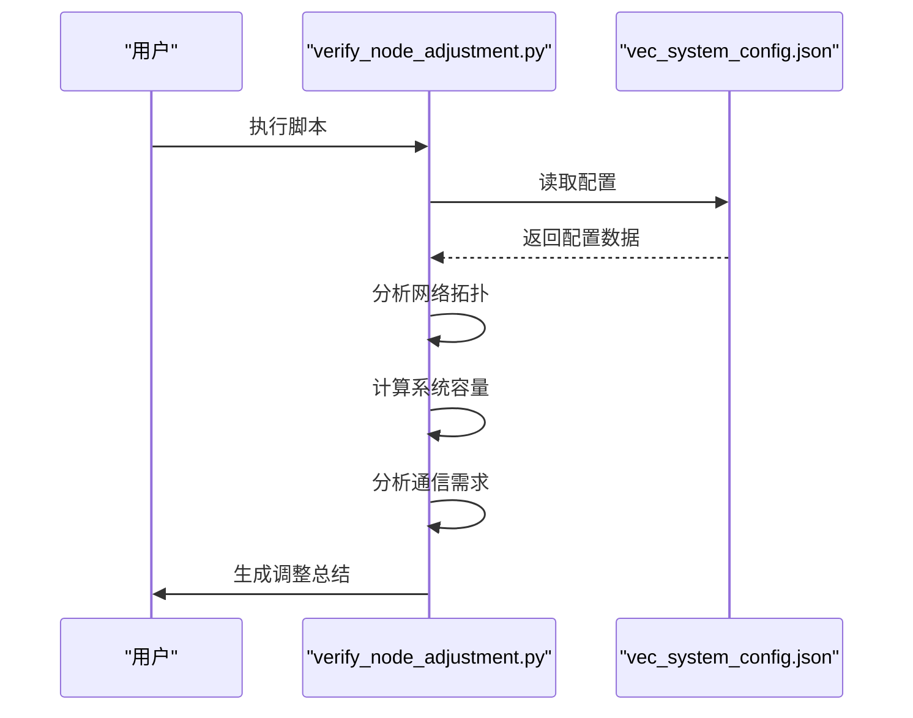
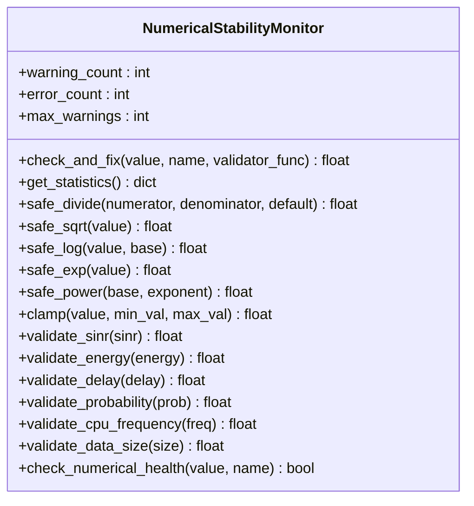

# 专用分析与验证工具

<cite>
**本文档引用的文件**
- [performance_optimization.py](file://tools/performance_optimization.py)
- [performance_dashboard.py](file://tools/performance_dashboard.py)
- [comprehensive_parameter_check.py](file://comprehensive_parameter_check.py)
- [verify_node_adjustment.py](file://verify_node_adjustment.py)
- [enhance_numerical_stability.py](file://enhance_numerical_stability.py)
- [vec_system_config.json](file://vec_system_config.json)
</cite>

## 目录
1. [简介](#简介)
2. [性能优化工具](#性能优化工具)
3. [性能监控仪表板](#性能监控仪表板)
4. [参数完整性校验](#参数完整性校验)
5. [节点调整验证](#节点调整验证)
6. [数值稳定性增强](#数值稳定性增强)
7. [使用场景示例](#使用场景示例)
8. [命令行接口与配置](#命令行接口与配置)
9. [结论](#结论)

## 简介
本项目包含一系列专用分析与系统验证工具，旨在提升边缘计算系统的性能、稳定性和可靠性。这些工具覆盖了从参数校验、性能优化到实时监控的完整生命周期，为系统开发和部署提供全面的技术支持。通过这些工具，开发者可以有效识别系统瓶颈、验证配置合理性、监控运行状态，并确保数值计算的稳定性。

## 性能优化工具
`performance_optimization.py` 是一个综合性的性能优化工具模块，通过性能剖析识别计算瓶颈，并生成优化建议报告。该工具集成了性能监控、内存管理和计算优化等多种功能，为不同算法提供最优的配置参数。



**图表来源**
- [performance_optimization.py](file://tools/performance_optimization.py#L100-L200)

**本节来源**
- [performance_optimization.py](file://tools/performance_optimization.py#L1-L337)

### 性能监控与分析
`PerformanceMonitor` 类负责监控系统的运行性能，记录内存使用、计算时间和步数等关键指标。通过 `record_step` 方法，系统可以实时跟踪每个训练步骤的性能表现，并生成详细的性能统计报告。

### 内存管理优化
`MemoryManager` 类实现了智能内存管理策略，通过定期垃圾回收和动态缓冲区调整来优化内存使用。当内存使用率超过阈值时，系统会自动执行清理操作，确保训练过程的稳定性。

### 优化训练循环
`OptimizedTrainingLoop` 类提供了一个优化的训练框架，集成了性能监控和内存管理功能。通过 `performance_timer` 装饰器，系统可以精确测量每个训练步骤的执行时间，并根据性能数据进行动态调整。

## 性能监控仪表板
`performance_dashboard.py` 集成了 Matplotlib 和 Pandas，实现了系统状态的实时可视化监控。该工具提供了一个综合性的性能监控界面，能够同时展示多个关键指标的变化趋势。



**图表来源**
- [performance_dashboard.py](file://tools/performance_dashboard.py#L50-L100)

**本节来源**
- [performance_dashboard.py](file://tools/performance_dashboard.py#L1-L357)

### 综合性能仪表板
`create_comprehensive_dashboard` 方法创建了一个包含六个子图的综合性能仪表板，全面展示系统的运行状态。仪表板包括实时性能监控、算法性能对比、系统资源利用率、缓存性能分析、能耗效率趋势和系统健康度评估等模块。

### 实时数据更新
`update_real_time_metrics` 方法负责更新实时指标数据，将最新的性能数据添加到历史记录中。系统会自动维护最近100个数据点，确保监控界面的响应速度和数据的时效性。

### 多维度可视化
仪表板采用多种图表类型来展示不同维度的性能数据。包括折线图、柱状图、饼图、雷达图等，使用户能够直观地理解系统的运行状态和性能趋势。

## 参数完整性校验
`comprehensive_parameter_check.py` 负责对算法、网络和系统配置参数进行完整性与合理性校验。该工具通过一系列检查函数，确保系统配置符合设计规范和性能要求。



**图表来源**
- [comprehensive_parameter_check.py](file://comprehensive_parameter_check.py#L100-L200)

**本节来源**
- [comprehensive_parameter_check.py](file://comprehensive_parameter_check.py#L1-L361)

### 参数一致性检查
`check_parameter_consistency` 函数比较外部配置文件和系统内部配置的参数值，确保两者的一致性。检查内容包括任务生成参数、CPU频率范围等关键配置。

### 内存规范验证
`check_memory_specifications` 函数验证系统参数是否符合预定义的内存规范。检查项目包括任务到达率、数据大小范围、计算密度和输出比例等，确保系统运行在合理的工作负载下。

### 数值稳定性检查
`check_numerical_stability` 函数模拟各种计算场景，检查是否存在数值溢出、除零等潜在问题。通过模拟处理时间、负载因子等计算，提前发现可能的数值稳定性问题。

## 节点调整验证
`verify_node_adjustment.py` 用于验证节点调整策略的有效性与稳定性。该工具分析调整后的网络拓扑，评估系统容量和通信需求，确保调整方案的合理性。



**图表来源**
- [verify_node_adjustment.py](file://verify_node_adjustment.py#L50-L100)

**本节来源**
- [verify_node_adjustment.py](file://verify_node_adjustment.py#L1-L285)

### 网络拓扑分析
`analyze_adjusted_configuration` 函数分析调整后的网络拓扑，计算车辆密度、RSU密度和覆盖率等关键指标。同时检查配置是否符合论文要求，确保实验的可比性。

### 系统容量评估
`calculate_system_capacity` 函数计算系统的总处理能力，包括车辆、RSU和UAV的贡献。通过计算系统负载因子，评估系统是否处于合理的工作负载范围内。

### 通信需求分析
`analyze_communication_requirements` 函数分析系统的通信需求，计算带宽利用率。通过评估上传和下载数据量，确保通信资源能够满足系统需求。

## 数值稳定性增强
`enhance_numerical_stability.py` 在训练前对模型参数进行预处理，以提升数值稳定性。该工具创建了数值稳定性工具模块，并提供了全面的验证测试。



**图表来源**
- [enhance_numerical_stability.py](file://enhance_numerical_stability.py#L150-L200)

**本节来源**
- [enhance_numerical_stability.py](file://enhance_numerical_stability.py#L1-L543)

### 安全数学运算
该工具提供了一系列安全的数学运算函数，如 `safe_divide`、`safe_sqrt`、`safe_log` 等，能够有效防止除零、负数开方、对数域错误等问题。

### 参数验证函数
针对系统中的关键参数，提供了专门的验证函数，如 `validate_sinr`、`validate_energy`、`validate_delay` 等。这些函数能够将异常值修正到合理范围内，确保计算的稳定性。

### 全面稳定性测试
`run_comprehensive_stability_test` 函数运行全面的稳定性测试，包括边界情况测试、系统计算测试和能耗计算测试，确保系统在各种极端条件下的稳定性。

## 使用场景示例
以下是一些典型使用场景的示例，展示了如何在实际工作中应用这些专用分析与验证工具。

### 部署前参数检查
在系统部署前，运行 `comprehensive_parameter_check.py` 进行全面的参数检查：

```bash
python comprehensive_parameter_check.py
```

该命令将执行所有检查项，生成详细的检查报告，帮助开发者发现并修复潜在的配置问题。

### 多智能体训练监控
在多智能体训练过程中，调用 `performance_dashboard.py` 监控系统状态：

```python
from tools.performance_dashboard import create_performance_dashboard

# 创建性能仪表板
dashboard = create_performance_dashboard(training_env, save_path="training_dashboard.png")
```

这将生成一个包含多个性能指标的综合仪表板，帮助开发者实时了解训练过程的状态。

### UAV节点调整验证
在调整UAV节点位置后，使用 `verify_node_adjustment.py` 验证系统性能变化：

```bash
python verify_node_adjustment.py
```

该命令将分析调整后的配置，评估系统容量和通信需求，生成调整效果总结，确保调整方案的有效性。

## 命令行接口与配置
这些工具提供了简洁的命令行接口和灵活的配置文件依赖，便于在不同场景下使用。

### 命令行接口
所有工具都支持直接通过命令行执行，无需额外参数。执行后会自动读取配置文件并生成相应的输出。

### 配置文件依赖
- `vec_system_config.json`: 主要配置文件，包含网络拓扑、任务生成、计算资源等核心参数
- 外部配置文件: 用于参数外部化管理，提高配置的灵活性

### 输出格式
- 控制台输出: 实时显示检查结果和性能指标
- JSON报告: 生成结构化的检查报告，便于后续分析
- PNG图像: 生成性能监控图表，直观展示系统状态

## 结论
本项目提供的专用分析与验证工具集，为边缘计算系统的开发和部署提供了全面的技术支持。通过性能优化、实时监控、参数校验和数值稳定性增强等功能，显著提升了系统的可靠性和效率。这些工具不仅能够帮助开发者快速识别和解决问题，还能确保系统在各种工作负载下的稳定运行。建议在系统开发的各个阶段都使用这些工具，以确保最终系统的质量和性能。