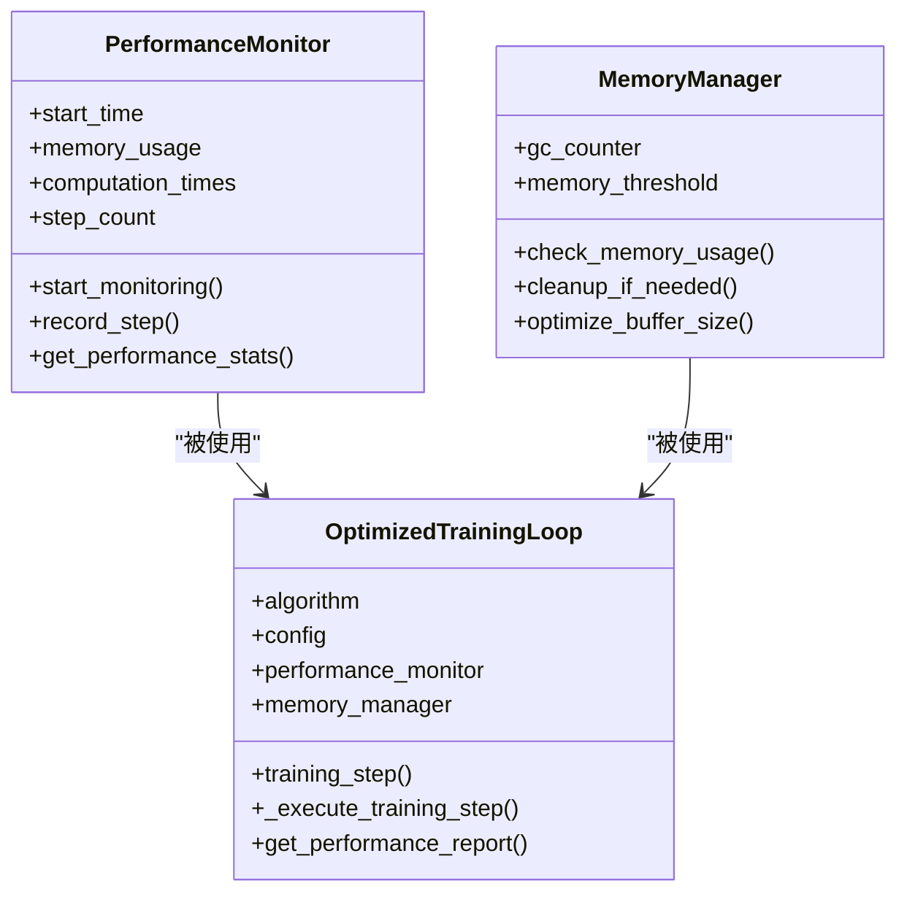
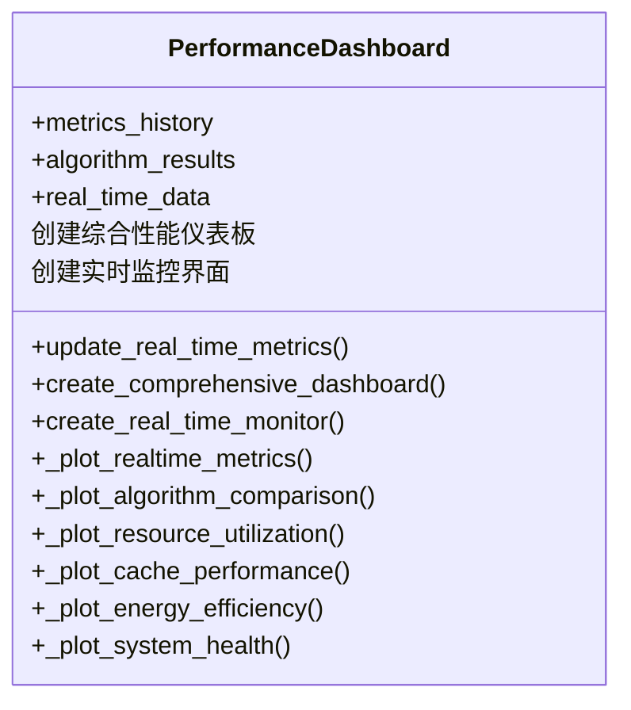

# 工具与实用程序

<cite>
**本文档中引用的文件**   
- [logger.py](file://utils/logger.py)
- [metrics.py](file://utils/metrics.py)
- [reward_calculator.py](file://utils/reward_calculator.py)
- [numerical_stability.py](file://utils/numerical_stability.py)
- [performance_optimization.py](file://tools/performance_optimization.py)
- [performance_dashboard.py](file://tools/performance_dashboard.py)
- [comprehensive_parameter_check.py](file://comprehensive_parameter_check.py)
- [verify_node_adjustment.py](file://verify_node_adjustment.py)
- [data_validator.py](file://utils/data_validator.py)
- [standardized_reward.py](file://utils/standardized_reward.py)
</cite>

## 目录
1. [简介](#简介)
2. [通用工具函数](#通用工具函数)
3. [性能分析与优化工具](#性能分析与优化工具)
4. [系统验证与调试工具](#系统验证与调试工具)
5. [使用示例](#使用示例)
6. [结论](#结论)

## 简介
本项目提供了一套完整的开发与调试工具集，旨在提升系统的可维护性、稳定性和开发效率。这些工具覆盖了日志记录、性能监控、数值稳定性保障、系统验证等多个关键方面。通过结构化的日志记录、统一的奖励计算、实时的性能监控和全面的系统验证，开发者能够更有效地进行系统调试、性能优化和实验分析。本文档详细说明了这些工具的功能、用途和使用方法，为项目的开发和维护提供指导。

## 通用工具函数

### 日志记录
`utils/logger.py` 模块提供了统一的日志记录功能，通过 `Logger` 类实现结构化日志输出。该模块支持同时向控制台和文件输出日志，并采用标准的格式化模板，包含时间戳、日志级别、模块名称和消息内容。这有助于开发者在开发和调试过程中追踪系统行为，分析问题根源。

**Section sources**
- [logger.py](file://utils/logger.py#L1-L67)

### 性能指标计算
`utils/metrics.py` 模块提供了性能指标的计算和跟踪功能。它包含 `Metrics` 类用于存储和计算各种指标的平均值、标准差和移动平均值；`MovingAverage` 类用于高效计算滑动窗口内的平均值；`PerformanceTracker` 类则专门用于跟踪强化学习训练过程中的关键性能指标，如回合奖励、损失函数值等。

**Section sources**
- [metrics.py](file://utils/metrics.py#L1-L147)

### 多目标奖励函数
`utils/reward_calculator.py` 模块实现了统一的多目标奖励函数，严格遵循论文中的目标函数。该模块通过 `UnifiedRewardCalculator` 类计算奖励，综合考虑延迟、能耗和数据丢失率等多个因素，并根据权重配置生成最终的奖励值。此外，还提供了性能奖励和智能体特定奖励，以鼓励更优的系统行为。

**Section sources**
- [reward_calculator.py](file://utils/reward_calculator.py#L1-L244)

### 数值稳定性保障
`utils/numerical_stability.py` 模块提供了一系列安全的数学运算函数，用于解决浮点数运算中的溢出和精度问题。该模块包含 `safe_divide`、`safe_sqrt`、`safe_log` 等函数，确保在分母为零、负数开方或对数输入为负等异常情况下程序能够稳定运行。同时，`NumericalStabilityMonitor` 类用于监控系统中的数值健康状况。

**Section sources**
- [numerical_stability.py](file://utils/numerical_stability.py#L1-L293)

## 性能分析与优化工具

### 性能瓶颈分析与优化
`tools/performance_optimization.py` 模块提供了性能分析和优化功能。该模块通过 `PerformanceMonitor` 和 `MemoryManager` 类监控系统的计算时间、内存使用等性能指标。`get_optimal_batch_size` 函数可根据可用内存自动推荐最优的批次大小，而 `OptimizedTrainingLoop` 类则提供了一个优化的训练循环框架，集成性能监控和内存管理，帮助开发者识别和解决性能瓶颈。



**Diagram sources**
- [performance_optimization.py](file://tools/performance_optimization.py#L1-L336)

### 实时性能监控
`tools/performance_dashboard.py` 模块提供了实时性能监控界面。通过 `PerformanceDashboard` 类，可以创建包含多个子图的综合仪表板，实时展示奖励、延迟、能耗、缓存命中率等关键指标的变化趋势。该模块支持生成静态的综合报告和动态的实时监控界面，帮助开发者直观地了解系统运行状态。



**Diagram sources**
- [performance_dashboard.py](file://tools/performance_dashboard.py#L1-L356)

## 系统验证与调试工具

### 系统参数全面检查
`comprehensive_parameter_check.py` 脚本用于全面检查系统配置参数的一致性和合理性。该脚本会验证外部配置与系统配置之间的一致性，检查各项参数是否符合内存规范要求，验证UAV能耗模型参数的完整性，并检测潜在的数值稳定性问题。通过执行此脚本，可以确保系统配置的正确性，避免因配置错误导致的实验失败。

**Section sources**
- [comprehensive_parameter_check.py](file://comprehensive_parameter_check.py#L1-L360)

### 节点调整验证
`verify_node_adjustment.py` 脚本用于验证节点数量调整后的系统性能。该脚本分析调整后的网络拓扑配置，计算系统处理容量，分析通信需求，并生成调整总结报告。通过执行此脚本，可以评估节点数量调整对系统性能的影响，确保调整后的配置能够满足实验需求。

**Section sources**
- [verify_node_adjustment.py](file://verify_node_adjustment.py#L1-L284)

## 使用示例

### 验证输入数据完整性
`utils/data_validator.py` 模块提供了数据验证功能，可用于验证输入数据的完整性。通过 `SystemMetricsValidator` 类，可以检查各项系统指标是否在合理范围内，验证指标间的逻辑关系，并检测异常值。以下是如何调用该模块验证系统指标的示例：

```python
from utils.data_validator import validate_system_metrics

# 假设的系统指标
metrics = {
    'avg_task_delay': 0.5,
    'total_energy_consumption': 300.0,
    'task_completion_rate': 0.95,
    'cache_hit_rate': 0.8
}

# 验证指标
results = validate_system_metrics(metrics)
for result in results:
    print(f"{result.level.value}: {result.message}")
```

**Section sources**
- [data_validator.py](file://utils/data_validator.py#L1-L439)

### 统一不同实验的奖励尺度
`utils/standardized_reward.py` 模块提供了统一的奖励计算接口，确保不同实验使用相同的奖励尺度。通过 `calculate_standardized_reward` 函数，可以基于系统性能指标计算标准化的奖励值。以下是如何调用该模块计算奖励的示例：

```python
from utils.standardized_reward import calculate_standardized_reward

# 假设的系统指标
system_metrics = {
    'avg_task_delay': 0.1,
    'total_energy_consumption': 500.0,
    'data_loss_rate': 0.05
}

# 计算标准化奖励
reward = calculate_standardized_reward(system_metrics, agent_type='vehicle_agent')
print(f"计算得到的奖励: {reward}")
```

**Section sources**
- [standardized_reward.py](file://utils/standardized_reward.py#L1-L148)

## 结论
本项目提供的开发与调试工具集全面覆盖了系统开发的各个环节。从基础的日志记录和数值稳定性保障，到高级的性能监控和系统验证，这些工具为项目的稳定运行和高效开发提供了坚实的基础。通过合理使用这些工具，开发者可以更深入地理解系统行为，快速定位和解决问题，从而加速研究和开发进程。建议在项目开发过程中充分利用这些工具，以确保实验结果的可靠性和可重复性。