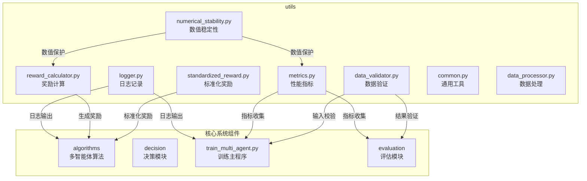
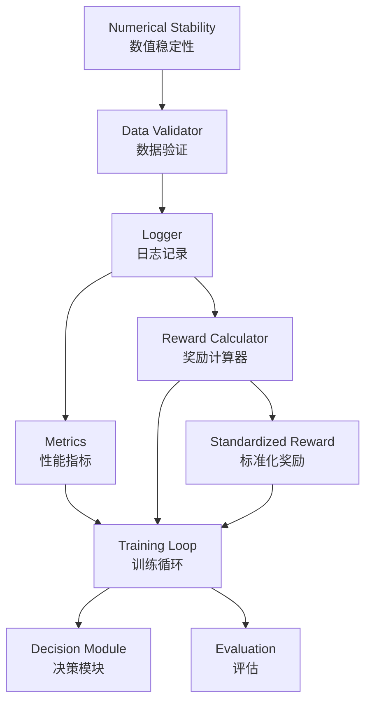
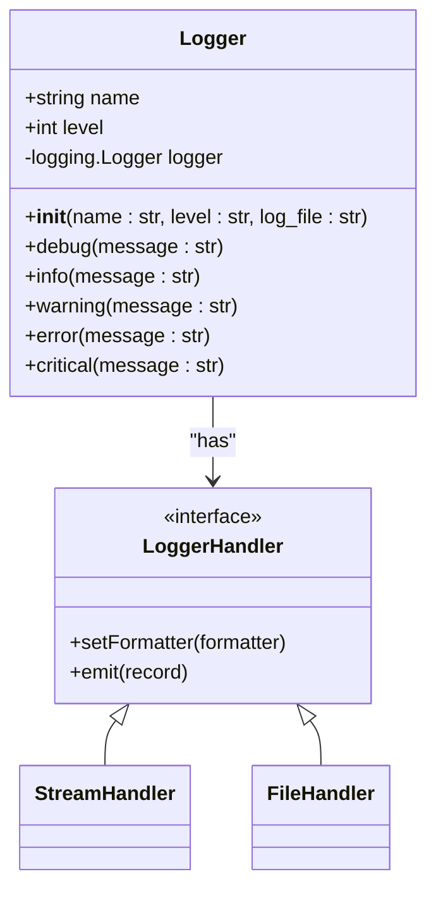
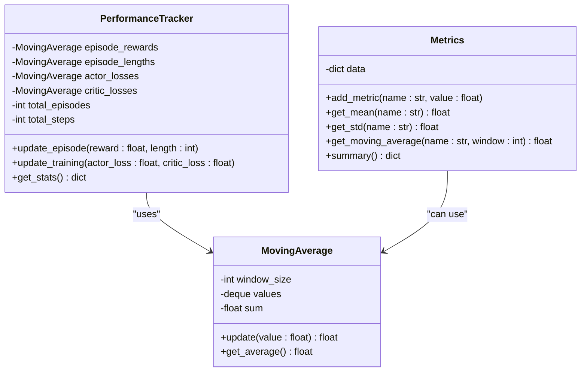
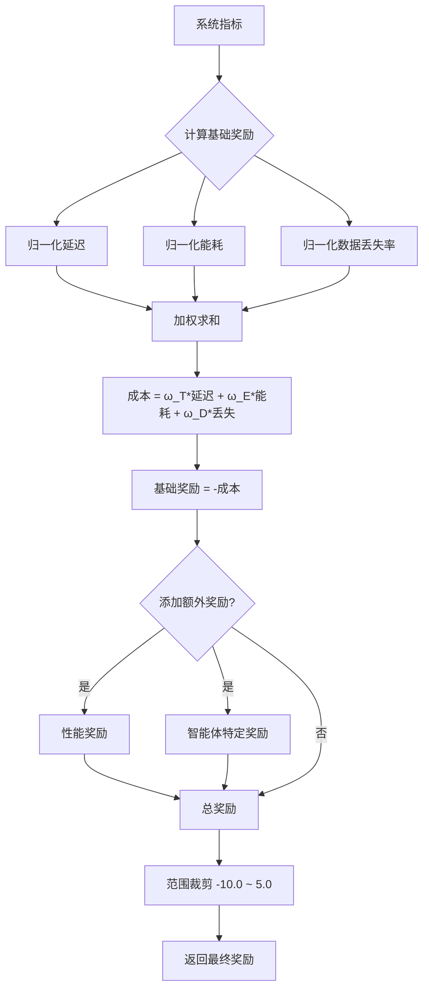
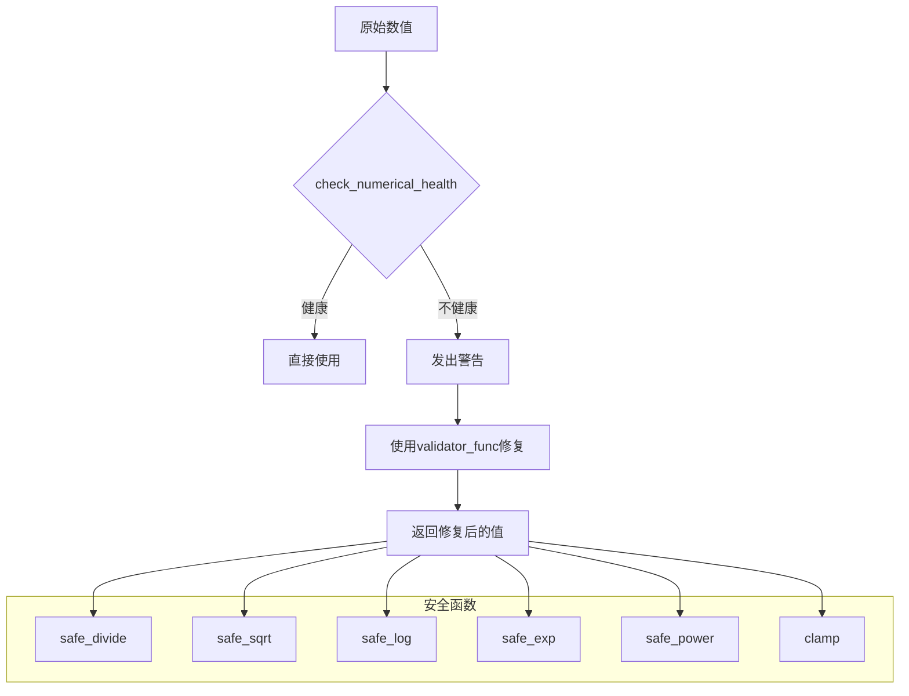
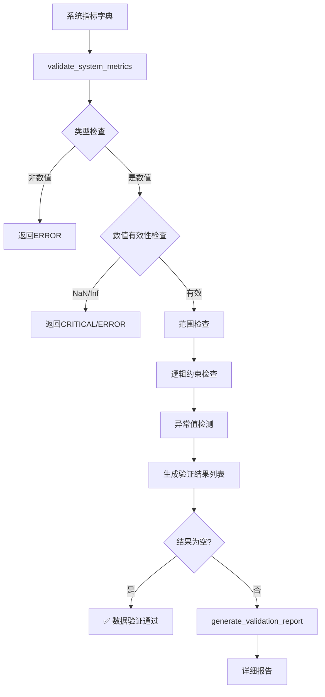
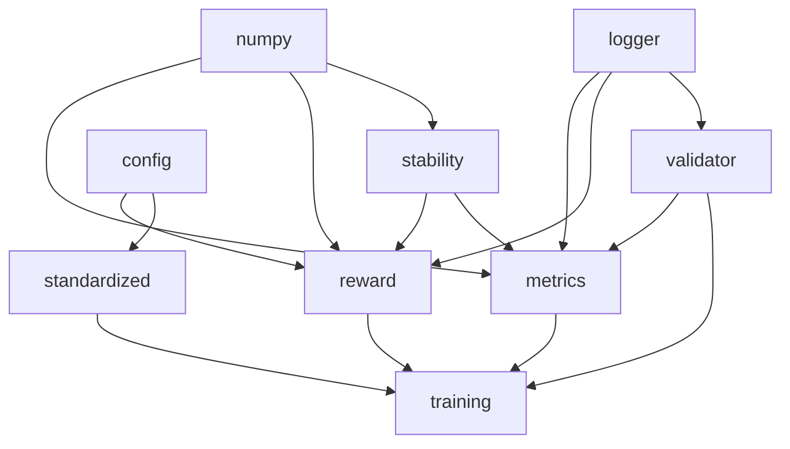

# 通用工具库

<cite>
**本文档中引用的文件**  
- [logger.py](file://utils/logger.py)
- [metrics.py](file://utils/metrics.py)
- [reward_calculator.py](file://utils/reward_calculator.py)
- [numerical_stability.py](file://utils/numerical_stability.py)
- [data_validator.py](file://utils/data_validator.py)
- [standardized_reward.py](file://utils/standardized_reward.py)
</cite>

## 目录
1. [简介](#简介)
2. [项目结构](#项目结构)
3. [核心组件](#核心组件)
4. [架构概览](#架构概览)
5. [详细组件分析](#详细组件分析)
6. [依赖分析](#依赖分析)
7. [性能考量](#性能考量)
8. [故障排除指南](#故障排除指南)
9. [结论](#结论)

## 简介
本项目为面向车联网（VEC）环境下的迁移缓存系统，提供了一套完整的多智能体强化学习训练与评估框架。`utils` 目录作为系统的通用工具库，为整个项目提供了日志记录、性能度量、奖励计算、数值稳定性保障和数据验证等关键基础设施。这些工具模块设计为高内聚、低耦合，确保了系统各组件（如多智能体算法、缓存管理、决策模块）能够以统一、可靠的方式进行交互和监控。本文档旨在详细阐述 `utils` 目录下各模块的实现原理、使用方法及在系统中的集成方式。

## 项目结构
`utils` 目录是整个项目的核心工具集，为上层算法和业务逻辑提供基础支持。其内部结构清晰，每个模块职责单一，便于维护和复用。

**图示来源**
- [logger.py](file://utils/logger.py)
- [metrics.py](file://utils/metrics.py)
- [reward_calculator.py](file://utils/reward_calculator.py)
- [numerical_stability.py](file://utils/numerical_stability.py)
- [data_validator.py](file://utils/data_validator.py)
- [standardized_reward.py](file://utils/standardized_reward.py)

**本节来源**
- [utils](file://utils)

## 核心组件
`utils` 目录下的核心组件共同构成了系统的“神经系统”，负责监控、评估和保障系统的健康运行。`logger.py` 提供了结构化的日志输出，是调试和监控的第一道防线。`metrics.py` 和 `PerformanceTracker` 类实现了对延迟、能耗、命中率等核心性能指标的精确计算与跟踪。`reward_calculator.py` 实现了多目标优化的奖励函数，通过加权策略将复杂的系统目标（最小化延迟、能耗、数据丢失）统一为一个可优化的标量奖励信号。`numerical_stability.py` 通过梯度裁剪和数值缩放等技术，防止了训练过程中的数值溢出或NaN值导致的训练崩溃。`data_validator.py` 确保了输入数据的完整性和合理性，而 `standardized_reward.py` 则为跨实验结果的公平对比提供了标准化的基准。

**本节来源**
- [logger.py](file://utils/logger.py#L1-L67)
- [metrics.py](file://utils/metrics.py#L1-L147)
- [reward_calculator.py](file://utils/reward_calculator.py#L1-L244)
- [numerical_stability.py](file://utils/numerical_stability.py#L1-L293)
- [data_validator.py](file://utils/data_validator.py#L1-L439)
- [standardized_reward.py](file://utils/standardized_reward.py#L1-L148)

## 架构概览
整个 `utils` 模块的架构设计遵循了模块化和分层原则。最底层是 `numerical_stability.py`，它为所有上层计算提供了数值安全的保障。在其之上，`data_validator.py` 负责数据入口的校验，确保进入系统的数据是合法的。`logger.py` 作为贯穿始终的监控工具，记录了从数据校验到指标计算、再到奖励生成的全过程。`metrics.py` 和 `reward_calculator.py` 是核心业务逻辑层，分别负责性能评估和决策信号生成。`standardized_reward.py` 作为一个特殊的模块，与 `reward_calculator.py` 功能相似但更严格，用于确保不同实验间的奖励计算逻辑完全一致，从而保证结果的可比性。这种分层架构使得系统既灵活又稳定。

**图示来源**
- [numerical_stability.py](file://utils/numerical_stability.py#L1-L293)
- [data_validator.py](file://utils/data_validator.py#L1-L439)
- [logger.py](file://utils/logger.py#L1-L67)
- [metrics.py](file://utils/metrics.py#L1-L147)
- [reward_calculator.py](file://utils/reward_calculator.py#L1-L244)
- [standardized_reward.py](file://utils/standardized_reward.py#L1-L148)

## 详细组件分析

### 日志记录器 (logger.py) 分析
`logger.py` 模块实现了结构化日志输出与级别控制。它封装了 Python 的 `logging` 模块，提供了一个 `Logger` 类，支持 `DEBUG`、`INFO`、`WARNING`、`ERROR` 和 `CRITICAL` 五个日志级别。该类可以同时将日志输出到控制台和文件，便于开发和生产环境的监控。通过 `get_logger` 工厂函数，系统各组件可以获取到命名唯一的日志记录器实例，避免了日志混乱。日志格式包含了时间戳、模块名、日志级别和消息内容，便于问题追踪。

**图示来源**
- [logger.py](file://utils/logger.py#L1-L67)

**本节来源**
- [logger.py](file://utils/logger.py#L1-L67)

### 性能指标 (metrics.py) 分析
`metrics.py` 模块定义了 `Metrics`、`MovingAverage` 和 `PerformanceTracker` 三个核心类。`Metrics` 类使用字典存储各类指标的历史数据，并提供计算均值、标准差、移动平均和最新值的方法。`MovingAverage` 类通过 `deque` 实现了高效的滑动窗口平均值计算，避免了每次计算都遍历整个历史数据。`PerformanceTracker` 类则是一个更高层次的聚合器，它内部集成了多个 `MovingAverage` 实例，专门用于跟踪训练过程中的回合奖励、回合长度、Actor/Critic损失等关键指标，为训练进度监控提供了直接的数据支持。

**图示来源**
- [metrics.py](file://utils/metrics.py#L1-L147)

**本节来源**
- [metrics.py](file://utils/metrics.py#L1-L147)

### 奖励计算器 (reward_calculator.py) 分析
`reward_calculator.py` 模块实现了多目标奖励函数。其核心是 `UnifiedRewardCalculator` 类，它根据配置文件中的权重（`reward_weight_delay`, `reward_weight_energy`, `reward_weight_loss`）对延迟、能耗和数据丢失率进行加权求和，形成一个综合成本。奖励值即为该成本的负值（`reward = -cost`），符合强化学习中最大化奖励的目标。为了确保数值稳定性，各项指标在加权前会进行归一化处理（如延迟除以1.0秒，能耗除以1000.0焦耳）。此外，该模块还支持添加性能奖励（如缓存命中率奖励）和智能体特定奖励，使得奖励函数更加丰富和灵活。

**图示来源**
- [reward_calculator.py](file://utils/reward_calculator.py#L1-L244)

**本节来源**
- [reward_calculator.py](file://utils/reward_calculator.py#L1-L244)

### 数值稳定性 (numerical_stability.py) 分析
`numerical_stability.py` 模块通过一系列安全函数防止训练崩溃。它定义了 `safe_divide`、`safe_log`、`safe_exp`、`safe_power` 等函数，这些函数在执行数学运算前会检查输入值的有效性（如是否为NaN、无穷大）和范围（如是否会导致溢出）。例如，`safe_divide` 会在分母接近零时返回默认值，`safe_exp` 会限制输入值以防止指数爆炸。`NumericalStabilityMonitor` 类则提供了一个监控器，可以检查和修复数值问题，并记录警告和错误的数量，为调试数值不稳定问题提供了有力工具。

**图示来源**
- [numerical_stability.py](file://utils/numerical_stability.py#L1-L293)

**本节来源**
- [numerical_stability.py](file://utils/numerical_stability.py#L1-L293)

### 数据验证器 (data_validator.py) 分析
`data_validator.py` 模块实现了全面的数据完整性校验机制。`SystemMetricsValidator` 类为每一项系统指标（如延迟、能耗、命中率）定义了合理的取值范围，并能检查指标间的逻辑关系（如任务完成率与数据丢失率之和不应超过1）。它还利用历史数据进行趋势分析，通过Z-score检测异常值。`ExperimentDataValidator` 类则负责验证整个实验结果文件的完整性。该模块提供了 `quick_validate` 等便捷接口，可以快速返回一个简明的验证报告（如✅通过、⚠️警告、❌错误），便于在训练或评估流程中集成。

**图示来源**
- [data_validator.py](file://utils/data_validator.py#L1-L439)

**本节来源**
- [data_validator.py](file://utils/data_validator.py#L1-L439)

### 标准化奖励 (standardized_reward.py) 分析
`standardized_reward.py` 模块的作用是在跨实验结果对比中提供标准化的基准。它实现的 `StandardizedRewardFunction` 类与 `reward_calculator.py` 功能高度相似，但其设计目标是“严格遵循论文”，不包含任何额外的性能激励或智能体特定奖励（或仅包含极小的激励），以确保不同算法、不同参数配置下的实验结果是在完全相同的奖励函数下产生的，从而保证了比较的公平性。`validate_reward_consistency` 函数可用于验证奖励函数的配置是否正确加载。

**本节来源**
- [standardized_reward.py](file://utils/standardized_reward.py#L1-L148)

## 依赖分析
`utils` 模块内部各组件之间存在明确的依赖关系。`reward_calculator.py` 和 `metrics.py` 依赖于 `numerical_stability.py` 提供的数值保护，以确保在极端情况下计算不会崩溃。`data_validator.py` 依赖于 `logging` 模块进行日志记录。`standardized_reward.py` 与 `reward_calculator.py` 功能重叠，但前者更侧重于一致性，后者更侧重于灵活性。从外部依赖看，所有 `utils` 模块都依赖于 `numpy` 进行数值计算，并依赖于 `config` 模块读取配置参数。`train_multi_agent.py` 和 `train_single_agent.py` 等主程序则直接依赖于 `logger.py`、`metrics.py` 和 `reward_calculator.py` 来完成训练循环。

**图示来源**
- [metrics.py](file://utils/metrics.py#L1-L147)
- [reward_calculator.py](file://utils/reward_calculator.py#L1-L244)
- [numerical_stability.py](file://utils/numerical_stability.py#L1-L293)
- [data_validator.py](file://utils/data_validator.py#L1-L439)
- [standardized_reward.py](file://utils/standardized_reward.py#L1-L148)
- [train_multi_agent.py](file://train_multi_agent.py#L736-L791)
- [train_single_agent.py](file://train_single_agent.py#L567-L621)

**本节来源**
- [metrics.py](file://utils/metrics.py#L1-L147)
- [reward_calculator.py](file://utils/reward_calculator.py#L1-L244)
- [numerical_stability.py](file://utils/numerical_stability.py#L1-L293)
- [data_validator.py](file://utils/data_validator.py#L1-L439)
- [standardized_reward.py](file://utils/standardized_reward.py#L1-L148)

## 性能考量
`utils` 模块的设计充分考虑了性能。`MovingAverage` 类使用 `deque` 和累加和的方式，将移动平均的计算复杂度从 O(n) 降低到 O(1)。`data_validator.py` 的异常值检测只在历史数据足够时才进行，避免了不必要的计算开销。日志记录器通过检查处理器是否已存在来避免重复添加，减少了I/O操作。尽管这些工具模块会带来一定的运行时开销，但它们对于保障系统稳定性和提供调试信息至关重要，其性能开销远小于其带来的价值。

## 故障排除指南
当系统出现异常时，`utils` 模块是首要的排查工具。
- **训练不收敛或奖励为NaN**：首先检查 `logger.py` 的输出，看是否有来自 `numerical_stability.py` 的警告（如“检测到NaN值”）。使用 `data_validator.py` 验证输入的 `system_metrics` 是否包含异常值。
- **性能指标异常**：使用 `data_validator.py` 的 `quick_validate` 函数检查指标数据，看是否超出合理范围或存在逻辑矛盾。
- **不同实验结果无法比较**：确认是否使用了 `standardized_reward.py` 中的 `calculate_standardized_reward(use_paper_only=True)` 接口，以排除额外奖励带来的影响。
- **日志文件过大**：检查 `logger.py` 的日志级别，确保生产环境中不使用 `DEBUG` 级别。

**本节来源**
- [logger.py](file://utils/logger.py#L1-L67)
- [numerical_stability.py](file://utils/numerical_stability.py#L1-L293)
- [data_validator.py](file://utils/data_validator.py#L1-L439)
- [standardized_reward.py](file://utils/standardized_reward.py#L1-L148)

## 结论
`utils` 目录下的通用工具模块是整个VEC迁移缓存系统稳定、可靠运行的基石。它们通过结构化日志、精确的性能度量、科学的奖励函数、严格的数值保护和全面的数据验证，构建了一个健壮的基础设施层。这些模块不仅实现了各自的功能，而且通过清晰的接口和合理的依赖关系，紧密地协同工作，为上层的强化学习算法和决策逻辑提供了强有力的支持。理解和掌握这些工具的使用方法，对于开发、调试和评估本系统至关重要。