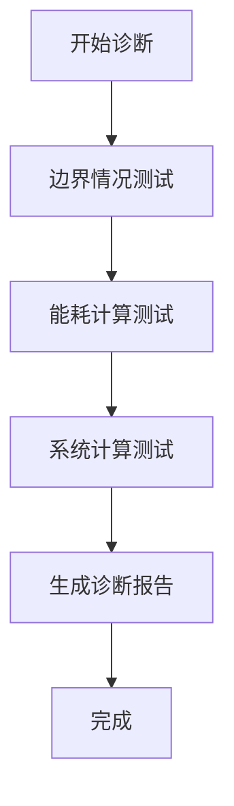

# 常见问题解答

<cite>
**本文档引用的文件**  
- [train_multi_agent.py](file://train_multi_agent.py)
- [train_single_agent.py](file://train_single_agent.py)
- [vec_system_config.json](file://vec_system_config.json)
- [config/external_config.py](file://config/external_config.py)
- [utils/numerical_stability.py](file://utils/numerical_stability.py)
- [utils/energy_validator.py](file://utils/energy_validator.py)
- [evaluation/performance_evaluator.py](file://evaluation/performance_evaluator.py)
- [single_agent/td3_optimized_agent.py](file://single_agent/td3_optimized_agent.py)
- [enhance_numerical_stability.py](file://enhance_numerical_stability.py)
- [tools/performance_optimization.py](file://tools/performance_optimization.py)
</cite>

## 目录
1. [安装错误](#安装错误)
2. [配置问题](#配置问题)
3. [训练失败](#训练失败)
4. [性能不佳](#性能不佳)
5. [调试技巧和诊断工具](#调试技巧和诊断工具)

## 安装错误

在安装VEC_mig_caching系统时，用户可能会遇到依赖包版本冲突或缺失的问题。建议使用虚拟环境进行安装，并严格按照requirements.txt文件中的版本要求安装依赖。如果出现CUDA相关错误，请确保CUDA驱动版本与PyTorch版本兼容。对于Windows用户，建议使用Anaconda进行环境管理，避免路径问题导致的安装失败。

## 配置问题

### 如何正确配置系统参数？

系统配置主要通过`vec_system_config.json`文件进行管理。该文件包含了时间设置、任务生成、网络拓扑、计算资源等多个维度的参数。用户可以根据实际需求调整这些参数，但需要注意参数之间的关联性。例如，增加车辆数量时，可能需要相应增加RSU的数量以保证覆盖范围。

```json
{
    "time_settings": {
        "time_slot_duration": 0.2,
        "simulation_time": 1000
    },
    "task_generation": {
        "arrival_rate": 1.35,
        "data_size_range": [5000000.0, 25000000.0]
    }
}
```

**配置来源**  
- [vec_system_config.json](file://vec_system_config.json)
- [config/external_config.py](file://config/external_config.py)

### 配置文件验证失败怎么办？

当配置文件验证失败时，系统会输出具体的错误信息。常见的问题包括：时隙长度不在0.1-1.0秒范围内、任务到达率不合理、数据大小范围不正确等。用户应根据提示修改相应参数。可以通过调用`ExternalConfigManager.validate_config()`方法来手动验证配置文件的合理性。

**配置来源**  
- [config/external_config.py](file://config/external_config.py#L201-L255)

## 训练失败

### 如何解决CUDA内存不足问题？

CUDA内存不足是深度强化学习训练中常见的问题。解决方案包括：
1. 减小批次大小(batch_size)，在`tools/performance_optimization.py`中提供了根据可用内存自动调整批次大小的功能
2. 使用梯度累积技术，减少每次前向传播的内存占用
3. 启用混合精度训练，减少显存使用
4. 增加垃圾回收频率，及时释放不再使用的内存

```python
def optimize_batch_size(algorithm: str, available_memory_gb: float) -> int:
    """根据可用内存优化批次大小"""
    if available_memory_gb < 4:
        return base_batch_size // 2
    elif available_memory_gb < 8:
        return base_batch_size
    else:
        return min(base_batch_size * 2, 512)
```

**训练来源**  
- [train_multi_agent.py](file://train_multi_agent.py#L120-L157)
- [tools/performance_optimization.py](file://tools/performance_optimization.py#L198-L244)

### 为什么训练过程出现NaN损失？

NaN损失通常是由于数值不稳定引起的。VEC_mig_caching系统提供了完善的数值稳定性保障机制：

1. **安全数学运算**：在`utils/numerical_stability.py`中实现了安全的除法、平方根、对数等运算，避免除零、负数开方等问题
2. **数值验证**：对能耗、延迟、概率等关键参数进行验证和修正
3. **监控机制**：通过`NumericalStabilityMonitor`类监控训练过程中的数值健康状态

```python
def safe_divide(numerator: float, denominator: float, default: float = 0.0) -> float:
    """安全除法，避免除零错误"""
    if abs(denominator) < EPSILON:
        return default
    result = numerator / denominator
    return clamp(result, -MAX_SAFE_VALUE, MAX_SAFE_VALUE)
```

当检测到NaN值时，系统会自动进行修复，并输出警告信息。用户可以通过运行`enhance_numerical_stability.py`中的全面稳定性测试来验证系统的数值稳定性。

**训练来源**  
- [utils/numerical_stability.py](file://utils/numerical_stability.py#L16-L37)
- [enhance_numerical_stability.py](file://enhance_numerical_stability.py#L436-L473)
- [single_agent/td3_optimized_agent.py](file://single_agent/td3_optimized_agent.py#L276-L308)

## 性能不佳

### 如何选择合适的算法配置？

不同算法适用于不同的场景，选择合适的算法配置需要考虑以下几个方面：

1. **问题复杂度**：对于简单的决策问题，DQN等基于值的算法可能就足够了；对于复杂的多智能体协作问题，建议使用MATD3、QMIX等专门设计的算法
2. **样本效率**：PPO、SAC等算法通常具有较好的样本效率，适合数据获取成本较高的场景
3. **稳定性要求**：TD3在DQN的基础上增加了双Q网络和延迟更新，提高了训练稳定性
4. **连续动作空间**：对于连续动作空间的问题，应选择DDPG、TD3、SAC等支持连续动作的算法

```python
# 支持的算法列表
SUPPORTED_ALGORITHMS = {
    'single_agent': ['DDPG', 'TD3', 'DQN', 'PPO', 'SAC'],
    'multi_agent': ['MATD3', 'MADDPG', 'QMIX', 'MAPPO', 'SAC-MA']
}
```

用户可以通过运行`train_multi_agent.py`和`train_single_agent.py`中的比较模式，对不同算法的性能进行评估，选择最适合当前场景的算法。

**性能来源**  
- [train_multi_agent.py](file://train_multi_agent.py#L120-L157)
- [train_single_agent.py](file://train_single_agent.py#L120-L157)

### 如何评估算法性能？

系统提供了完善的性能评估框架，通过`evaluation/performance_evaluator.py`中的`PerformanceEvaluator`类实现。评估指标包括：
- 任务完成率
- 平均时延
- 总能耗
- 缓存命中率
- 综合性能分数

```python
class PerformanceEvaluator:
    def calculate_composite_score(self, performance: Dict) -> float:
        """计算综合性能分数"""
        weights = {
            'completion_rate': 0.3,
            'delay_efficiency': 0.25,
            'energy_efficiency': 0.2,
            'cache_hit_rate': 0.25
        }
        # 加权求和
        composite_score = sum(
            weights[metric] * normalized_scores[metric]
            for metric in weights.keys()
        )
        return composite_score
```

用户可以通过调用`compare_algorithms`方法来比较不同算法的性能，并生成详细的性能报告。

**性能来源**  
- [evaluation/performance_evaluator.py](file://evaluation/performance_evaluator.py#L12-L253)

## 调试技巧和诊断工具

### 数值稳定性诊断

当遇到训练不稳定或结果异常时，可以使用以下诊断工具：

1. **边界情况测试**：运行`enhance_numerical_stability.py`中的`test_edge_cases()`函数，测试各种边界情况下的系统表现
2. **能耗计算验证**：使用`utils/energy_validator.py`中的`EnergyValidator`类验证能耗计算的合理性
3. **系统计算稳定性测试**：运行`test_system_calculations()`函数，测试系统在各种计算场景下的稳定性



**诊断来源**  
- [enhance_numerical_stability.py](file://enhance_numerical_stability.py#L299-L346)
- [utils/energy_validator.py](file://utils/energy_validator.py#L0-L276)

### 性能监控

系统提供了实时性能监控功能，可以跟踪以下指标：
- 内存使用情况
- 训练奖励变化
- 任务完成率
- 平均时延
- 能耗效率

用户可以通过`tools/performance_optimization.py`中的`performance_timer`装饰器来监控关键函数的执行时间，识别性能瓶颈。

**调试来源**  
- [tools/performance_optimization.py](file://tools/performance_optimization.py#L120-L157)
- [evaluation/performance_evaluator.py](file://evaluation/performance_evaluator.py#L12-L253)