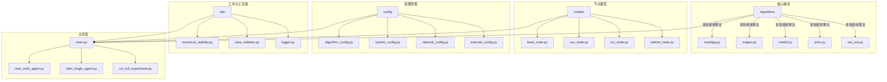
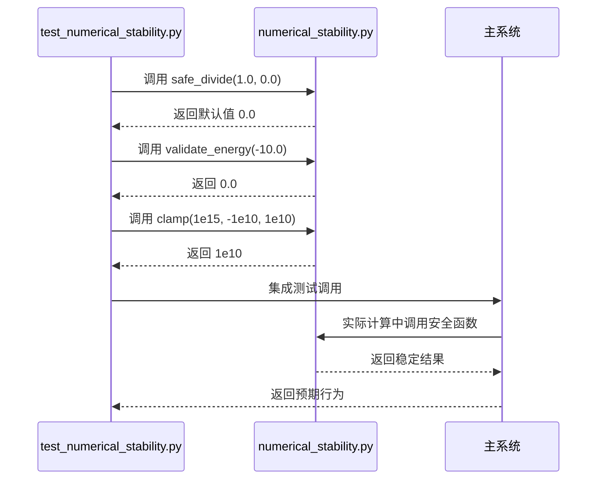
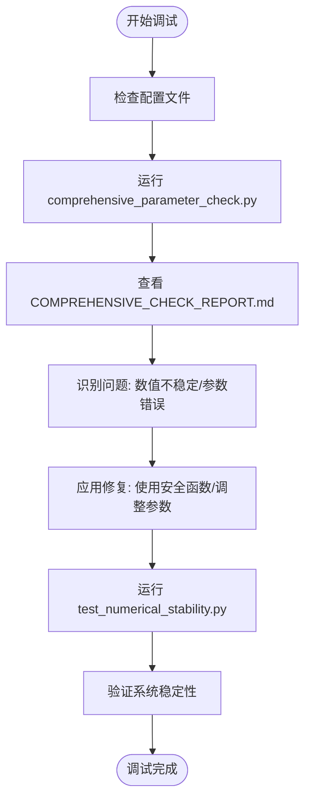

# 开发者指南

<cite>
**本文档引用文件**  
- [NODE_ADJUSTMENT_SUMMARY.md](file://NODE_ADJUSTMENT_SUMMARY.md)
- [COMPREHENSIVE_CHECK_REPORT.md](file://COMPREHENSIVE_CHECK_REPORT.md)
- [utils/numerical_stability.py](file://utils/numerical_stability.py)
- [tests/test_numerical_stability.py](file://tests/test_numerical_stability.py)
- [algorithms/maddpg.py](file://algorithms/maddpg.py)
- [algorithms/mappo.py](file://algorithms/mappo.py)
- [algorithms/matd3.py](file://algorithms/matd3.py)
- [algorithms/qmix.py](file://algorithms/qmix.py)
- [algorithms/sac_ma.py](file://algorithms/sac_ma.py)
- [models/uav_node.py](file://models/uav_node.py)
- [models/rsu_node.py](file://models/rsu_node.py)
- [models/vehicle_node.py](file://models/vehicle_node.py)
- [config/algorithm_config.py](file://config/algorithm_config.py)
- [config/system_config.py](file://config/system_config.py)
- [config/network_config.py](file://config/network_config.py)
- [config/external_config.py](file://config/external_config.py)
- [main.py](file://main.py)
- [train_multi_agent.py](file://train_multi_agent.py)
- [train_single_agent.py](file://train_single_agent.py)
- [run_full_experiment.py](file://run_full_experiment.py)
- [demo.py](file://demo.py)
</cite>

## 目录
1. [引言](#引言)
2. [代码结构规范](#代码结构规范)
3. [测试策略](#测试策略)
4. [贡献流程](#贡献流程)
5. [扩展新算法](#扩展新算法)
6. [扩展新节点类型](#扩展新节点类型)
7. [调试技巧](#调试技巧)
8. [附录](#附录)

## 引言
本指南旨在为开发者提供全面的贡献指导，涵盖代码结构、测试策略、贡献流程、系统扩展与调试方法。项目 `VEC_mig_caching` 是一个面向车辆边缘计算（VEC）环境的多智能体迁移与缓存系统，支持多种强化学习算法和灵活的节点配置。通过遵循本指南，贡献者可以确保代码质量、测试完整性与系统兼容性。

## 代码结构规范
项目采用模块化设计，各目录职责明确，遵循高内聚低耦合原则。

**图示来源**  
- [algorithms/maddpg.py](file://algorithms/maddpg.py)
- [models/uav_node.py](file://models/uav_node.py)
- [config/algorithm_config.py](file://config/algorithm_config.py)
- [utils/numerical_stability.py](file://utils/numerical_stability.py)
- [main.py](file://main.py)

**本节来源**  
- [algorithms](file://algorithms)
- [models](file://models)
- [config](file://config)
- [utils](file://utils)

## 测试策略
测试是确保系统稳定性和算法正确性的关键。`tests/` 目录包含单元测试，重点关注算法收敛性、决策逻辑和数值稳定性。

### 单元测试结构
- **测试文件**: `tests/test_numerical_stability.py` 是核心测试文件，验证数值计算的鲁棒性。
- **测试覆盖**: 包括边界值、异常输入（NaN、无穷大）、极端参数等场景。
- **断言策略**: 使用 `assert` 验证输出在合理范围内，确保无溢出或崩溃。

### 测试算法收敛性
- **指标监控**: 在训练过程中记录奖励、损失、Q值等指标，验证其随时间收敛。
- **测试方法**: 通过模拟短周期训练，检查损失函数是否单调递减或趋于稳定。
- **参考文件**: `evaluation/test_complete_system.py` 提供了完整的系统测试框架。

### 测试决策逻辑正确性
- **场景覆盖**: 模拟不同网络负载、节点移动、任务到达率等场景。
- **预期行为**: 验证 offloading 决策是否符合预设策略（如延迟最小化、能耗最优）。
- **工具支持**: `utils/data_validator.py` 提供决策逻辑验证函数。

### 测试数值稳定性
- **核心文件**: `utils/numerical_stability.py` 提供了 `safe_divide`, `validate_energy`, `clamp` 等安全函数。
- **测试重点**: 验证这些函数在极端输入下能否正确处理并返回合理值。
- **监控机制**: `NumericalStabilityMonitor` 类用于运行时监控，记录警告和错误。

**图示来源**  
- [tests/test_numerical_stability.py](file://tests/test_numerical_stability.py)
- [utils/numerical_stability.py](file://utils/numerical_stability.py)

**本节来源**  
- [tests/test_numerical_stability.py](file://tests/test_numerical_stability.py)
- [utils/numerical_stability.py](file://utils/numerical_stability.py)
- [evaluation/test_complete_system.py](file://evaluation/test_complete_system.py)

## 贡献流程
为确保代码质量和协作效率，贡献需遵循以下流程。

### 分支管理
- **主分支**: `main` 为稳定分支，禁止直接推送。
- **功能分支**: 所有新功能或修复应在独立分支开发，命名格式为 `feature/xxx` 或 `fix/xxx`。
- **合并请求 (PR)**: 完成开发后，创建 PR 至 `main` 分支，由核心团队审查。

### 代码风格
- **PEP8**: 所有 Python 代码必须符合 PEP8 规范。
- **类型提示**: 使用 `typing` 模块添加函数参数和返回值的类型注解。
- **文档字符串**: 所有函数、类、模块需包含清晰的 docstring，说明功能、参数和返回值。

### 文档更新要求
- **README.md**: 添加新功能说明、使用示例和依赖项。
- **配置文件**: 更新 `config/` 目录下的配置说明，确保新参数有文档。
- **注释**: 关键算法和复杂逻辑需添加内联注释。

### PR 审查标准
- **代码质量**: 是否符合 PEP8，是否有冗余代码。
- **测试覆盖**: 是否包含相应的单元测试，测试是否通过。
- **文档完整性**: 是否更新了相关文档。
- **性能影响**: 是否引入性能瓶颈。
- **安全性**: 是否有数值溢出、除零等风险。

**本节来源**  
- [main.py](file://main.py)
- [train_multi_agent.py](file://train_multi_agent.py)
- [config/external_config.py](file://config/external_config.py)

## 扩展新算法
系统支持灵活扩展新的多智能体算法。

### 添加新算法步骤
1. **创建文件**: 在 `algorithms/` 目录下创建新文件，如 `new_algorithm.py`。
2. **继承基类**: 继承通用的 `BaseAlgorithm` 类（若存在），实现 `train`, `predict`, `reset` 等方法。
3. **配置支持**: 在 `config/algorithm_config.py` 中添加新算法的超参数。
4. **注册算法**: 在 `algorithms/__init__.py` 中导入并注册新算法。
5. **集成训练**: 修改 `train_multi_agent.py`，支持通过配置选择新算法。

### 兼容性要求
- **接口一致性**: 新算法的输入输出格式必须与现有系统兼容。
- **状态空间**: 遵循 `models/data_structures.py` 定义的状态表示。
- **奖励函数**: 使用 `utils/reward_calculator.py` 提供的标准化奖励。

**本节来源**  
- [algorithms/maddpg.py](file://algorithms/maddpg.py)
- [algorithms/mappo.py](file://algorithms/mappo.py)
- [config/algorithm_config.py](file://config/algorithm_config.py)
- [train_multi_agent.py](file://train_multi_agent.py)

## 扩展新节点类型
系统支持添加新的节点类型（如卫星、固定基站）。

### 添加新节点步骤
1. **继承基类**: 在 `models/` 目录下创建新节点类，继承 `BaseNode`。
2. **实现属性**: 定义节点的计算能力、通信范围、移动模型等。
3. **能耗模型**: 实现 `calculate_energy_consumption()` 方法，参考 `uav_node.py` 的能耗计算。
4. **配置支持**: 在 `config/network_config.py` 中添加新节点的默认参数。
5. **系统集成**: 在 `main.py` 的初始化逻辑中支持创建新节点实例。

### 兼容性要求
- **接口统一**: 所有节点必须实现 `offload_task`, `communicate`, `update_position` 等方法。
- **配置外部化**: 节点参数必须通过 `external_config.py` 传入，禁止硬编码。
- **数值稳定性**: 在计算中调用 `utils/numerical_stability.py` 的安全函数。

**本节来源**  
- [models/base_node.py](file://models/base_node.py)
- [models/uav_node.py](file://models/uav_node.py)
- [config/network_config.py](file://config/network_config.py)
- [main.py](file://main.py)

## 调试技巧
高效调试是快速定位和解决问题的关键。

### 定位梯度爆炸问题
- **工具使用**: `enhance_numerical_stability.py`（假设存在）可用于分析梯度分布。
- **方法**: 在训练过程中打印梯度范数，若其值远大于 1.0，则可能存在梯度爆炸。
- **解决方案**: 
  - 使用 `safe_power` 和 `safe_exp` 避免数值溢出。
  - 在优化器中添加梯度裁剪（gradient clipping）。
  - 检查奖励函数是否过大，使用 `clamp` 限制奖励范围。

### 日志分析
- **启用日志**: 使用 `utils/logger.py` 记录关键变量和决策过程。
- **监控指标**: 定期检查 `numerical_monitor.get_statistics()` 获取数值异常统计。
- **可视化**: 使用 `tools/advanced_visualization.py` 生成训练曲线和热力图。

### 验证配置正确性
- **全面检查**: 运行 `comprehensive_parameter_check.py` 验证所有参数是否符合规范。
- **参考报告**: `COMPREHENSIVE_CHECK_REPORT.md` 提供了详细的检查结果和修复建议。
- **节点调整**: `NODE_ADJUSTMENT_SUMMARY.md` 记录了节点数量调整的依据和效果，可作为调试参考。

**图示来源**  
- [comprehensive_parameter_check.py](file://comprehensive_parameter_check.py)
- [COMPREHENSIVE_CHECK_REPORT.md](file://COMPREHENSIVE_CHECK_REPORT.md)
- [tests/test_numerical_stability.py](file://tests/test_numerical_stability.py)

**本节来源**  
- [utils/numerical_stability.py](file://utils/numerical_stability.py)
- [COMPREHENSIVE_CHECK_REPORT.md](file://COMPREHENSIVE_CHECK_REPORT.md)
- [NODE_ADJUSTMENT_SUMMARY.md](file://NODE_ADJUSTMENT_SUMMARY.md)
- [comprehensive_parameter_check.py](file://comprehensive_parameter_check.py)

## 附录
### COMPREHENSIVE_CHECK_REPORT.md 的作用
该文件是系统参数的全面审计报告，用于代码审查时验证：
- 参数是否外部化，避免硬编码。
- CPU频率、带宽等是否符合内存规范。
- UAV能耗模型是否完整。
- 数值计算是否具备稳定性保护。
审查者应确保所有 PR 不破坏报告中的合规性。

### NODE_ADJUSTMENT_SUMMARY.md 的作用
该文件记录了节点数量调整的决策过程和效果，用于审查：
- 网络规模是否合理，便于实验和调试。
- 系统负载是否平衡（目标 0.3）。
- 通信效率是否良好（带宽利用率 66.1%）。
- 是否符合论文要求（如 UAV=2）。
新配置必须在此报告中说明其合理性。

**本节来源**  
- [COMPREHENSIVE_CHECK_REPORT.md](file://COMPREHENSIVE_CHECK_REPORT.md)
- [NODE_ADJUSTMENT_SUMMARY.md](file://NODE_ADJUSTMENT_SUMMARY.md)