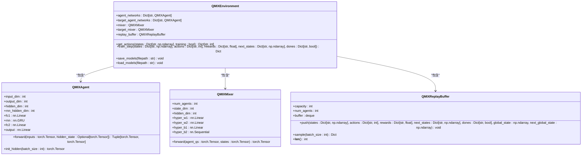
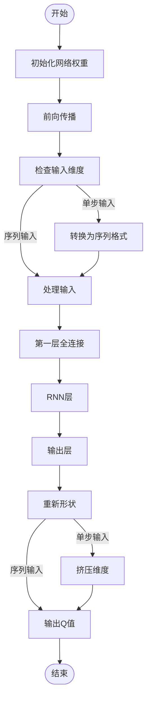
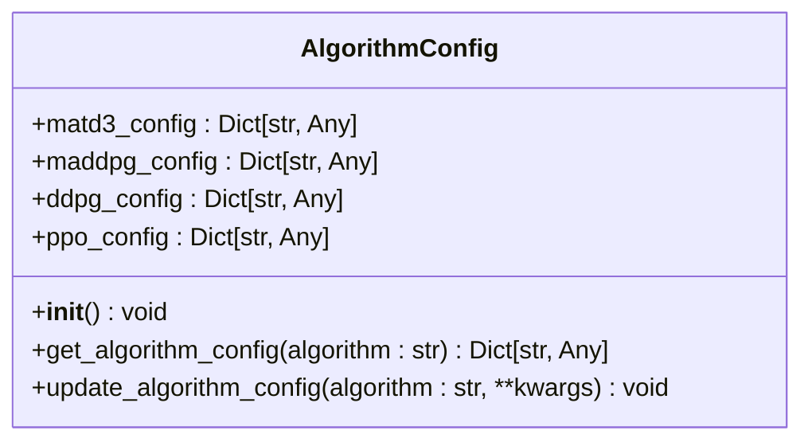
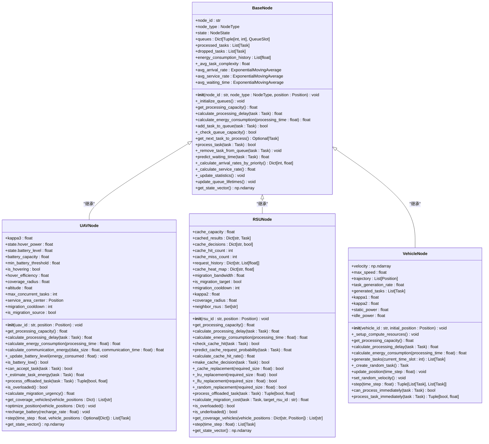
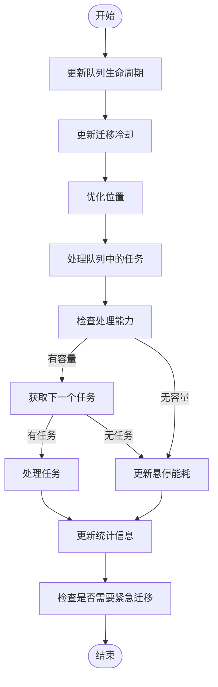
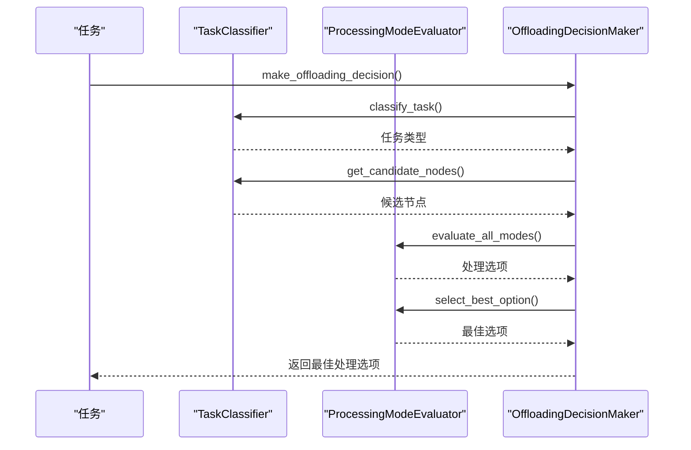
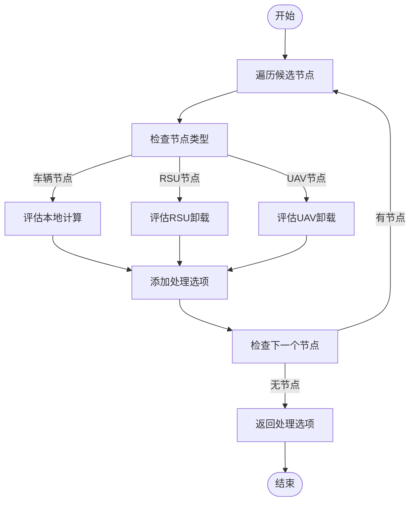
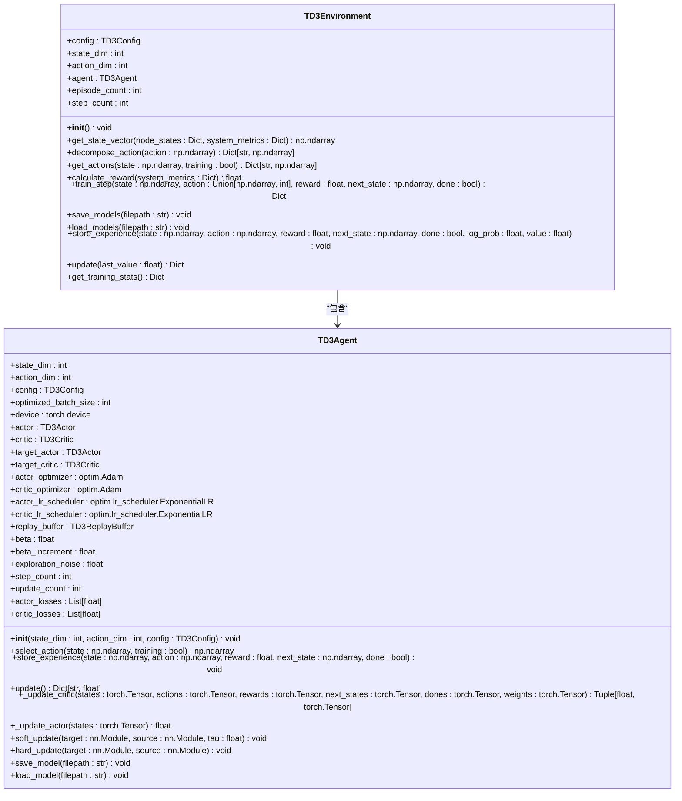

# 扩展开发指南

<cite>
**本文档引用的文件**
- [qmix.py](file://algorithms/qmix.py)
- [base_node.py](file://models/base_node.py)
- [uav_node.py](file://models/uav_node.py)
- [rsu_node.py](file://models/rsu_node.py)
- [vehicle_node.py](file://models/vehicle_node.py)
- [offloading_manager.py](file://decision/offloading_manager.py)
- [algorithm_config.py](file://config/algorithm_config.py)
- [td3.py](file://single_agent/td3.py)
- [ppo.py](file://single_agent/ppo.py)
</cite>

## 目录
1. [引言](#引言)
2. [扩展多智能体算法](#扩展多智能体算法)
3. [定义新节点类型](#定义新节点类型)
4. [兼容性处理](#兼容性处理)
5. [扩展单智能体算法](#扩展单智能体算法)
6. [测试与验证](#测试与验证)

## 引言
本指南旨在为开发者提供安全扩展系统功能的详细步骤。系统采用多智能体深度强化学习框架，支持多种算法和节点类型。通过继承基类和实现必要接口，开发者可以轻松添加新功能。本指南将详细介绍如何扩展多智能体算法、定义新节点类型、处理兼容性问题以及扩展单智能体算法。

## 扩展多智能体算法
要添加新的多智能体算法（如QMIX变体），需要继承`algorithms/`目录中的基类，并实现必要的策略网络和训练逻辑。

### 继承基类
在`algorithms/`目录中，所有多智能体算法都继承自一个共同的基类结构。以`qmix.py`为例，该文件实现了QMIX算法，包含`QMIXAgent`、`QMIXMixer`和`QMIXEnvironment`等核心组件。



**图表来源**
- [qmix.py](file://algorithms/qmix.py#L18-L598)

### 实现策略网络和训练逻辑
新算法需要实现策略网络和训练逻辑。以`QMIXAgent`为例，它使用RNN处理部分可观测环境，包含输入层、RNN层和输出层。



**图表来源**
- [qmix.py](file://algorithms/qmix.py#L100-L180)

### 注册配置项
在`algorithm_config.py`中注册新算法的配置项。该文件定义了`AlgorithmConfig`类，包含各种算法的配置。



**图表来源**
- [algorithm_config.py](file://config/algorithm_config.py#L1-L73)

**扩展多智能体算法**
- [qmix.py](file://algorithms/qmix.py#L1-L598)
- [algorithm_config.py](file://config/algorithm_config.py#L1-L73)

## 定义新节点类型
要定义新的节点类型（如新型UAV），需要继承`models/base_node.py`并实现状态更新和通信接口。

### 继承BaseNode
`BaseNode`是所有计算节点的抽象基类，定义了通用接口和属性。新节点类型需要继承此类并实现抽象方法。



**图表来源**
- [base_node.py](file://models/base_node.py#L18-L312)
- [uav_node.py](file://models/uav_node.py#L1-L360)
- [rsu_node.py](file://models/rsu_node.py#L1-L423)
- [vehicle_node.py](file://models/vehicle_node.py#L1-L300)

### 实现状态更新和通信接口
新节点类型需要实现状态更新和通信接口。以`UAVNode`为例，它实现了`step`方法来更新节点状态。



**图表来源**
- [uav_node.py](file://models/uav_node.py#L280-L360)

**定义新节点类型**
- [base_node.py](file://models/base_node.py#L18-L312)
- [uav_node.py](file://models/uav_node.py#L1-L360)
- [rsu_node.py](file://models/rsu_node.py#L1-L423)
- [vehicle_node.py](file://models/vehicle_node.py#L1-L300)

## 兼容性处理
新节点需要与`decision/offloading_manager.py`兼容，确保能参与任务卸载决策。

### 任务分类与卸载决策
`OffloadingDecisionMaker`类负责制定卸载决策，整合任务分类和评估。



**图表来源**
- [offloading_manager.py](file://decision/offloading_manager.py#L1-L625)

### 处理模式评估
`ProcessingModeEvaluator`类评估所有可行的处理模式，包括本地计算、RSU卸载、RSU间迁移和UAV卸载。



**图表来源**
- [offloading_manager.py](file://decision/offloading_manager.py#L1-L625)

**兼容性处理**
- [offloading_manager.py](file://decision/offloading_manager.py#L1-L625)

## 扩展单智能体算法
提供扩展`single_agent/`算法的示例，说明如何保持接口一致性。

### 继承单智能体基类
`single_agent/`目录中的算法都遵循类似的结构。以`td3.py`为例，它实现了TD3算法。



**图表来源**
- [td3.py](file://single_agent/td3.py#L1-L546)

### 保持接口一致性
新单智能体算法需要保持与现有算法的接口一致性。以`PPOEnvironment`为例，它实现了与`TD3Environment`相同的接口。

```mermaid
classDiagram
    class PPOEnvironment {
        +config: PPOConfig
        +state_dim: int
        +action_dim: int
        +