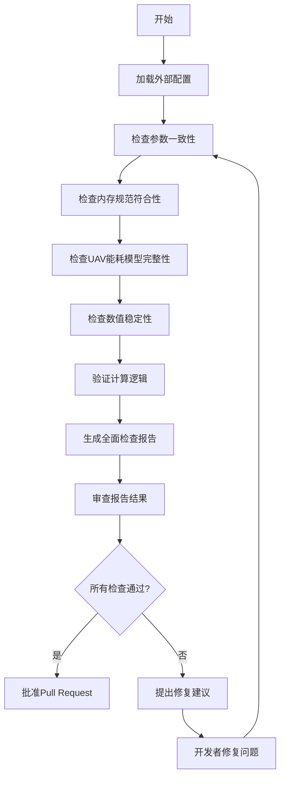
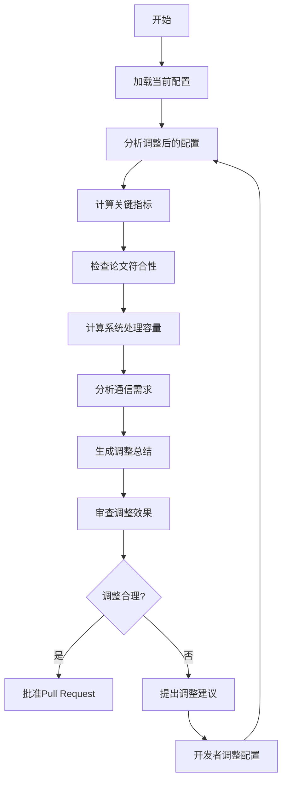

# 贡献流程

<cite>
**本文档引用的文件**
- [README.md](file://README.md)
- [NODE_ADJUSTMENT_SUMMARY.md](file://NODE_ADJUSTMENT_SUMMARY.md)
- [COMPREHENSIVE_CHECK_REPORT.md](file://COMPREHENSIVE_CHECK_REPORT.md)
- [config/system_config.py](file://config/system_config.py)
- [config/algorithm_config.py](file://config/algorithm_config.py)
- [config/external_config.py](file://config/external_config.py)
- [comprehensive_parameter_check.py](file://comprehensive_parameter_check.py)
- [verify_node_adjustment.py](file://verify_node_adjustment.py)
</cite>

## 目录
1. [贡献流程概述](#贡献流程概述)
2. [代码贡献标准流程](#代码贡献标准流程)
3. [文档更新规范](#文档更新规范)
4. [COMPREHENSIVE_CHECK_REPORT.md在代码审查中的应用](#comprehensive_check_reportmd在代码审查中的应用)
5. [NODE_ADJUSTMENT_SUMMARY.md的用途与记录规范](#node_adjustment_summarymd的用途与记录规范)
6. [Pull Request审查关键点](#pull-request审查关键点)
7. [提交信息格式规范](#提交信息格式规范)

## 贡献流程概述

本项目采用标准的Git工作流进行代码贡献，确保代码质量和系统稳定性。开发者需要遵循创建功能分支、编写符合PEP8规范的代码、更新相关文档、发起Pull Request等步骤。项目特别强调参数配置的一致性和系统可追溯性，通过COMPREHENSIVE_CHECK_REPORT.md和NODE_ADJUSTMENT_SUMMARY.md等文档确保代码审查的全面性和系统调整的可追踪性。

**Section sources**
- [README.md](file://README.md)

## 代码贡献标准流程

开发者贡献代码需遵循以下标准流程：

1. **创建功能分支**：从主分支创建新的功能分支，分支命名应具有描述性，如`feature/task-offloading-optimization`或`fix/energy-calculation-bug`。

2. **编写符合PEP8规范的代码**：所有Python代码必须符合PEP8编码规范，包括适当的缩进、命名约定、行长度限制等。使用工具如`flake8`或`black`进行代码格式化和检查。

3. **实现功能或修复问题**：在功能分支上实现新功能或修复已知问题，确保代码逻辑正确、性能优化且具有良好的可读性。

4. **编写和更新测试**：为新功能或修复编写相应的单元测试和集成测试，确保代码的可靠性和稳定性。

5. **更新相关文档**：在实现功能或修复问题后，及时更新相关文档，包括README.md、配置文件说明等。

6. **发起Pull Request**：当功能开发和测试完成后，向主分支发起Pull Request，提供详细的描述和变更说明。

**Section sources**
- [README.md](file://README.md)

## 文档更新规范

在贡献代码时，必须同步更新相关文档，确保文档与代码的一致性。主要文档包括：

- **README.md**：更新项目简介、快速开始指南、性能指标等，反映最新的功能和改进。

- **配置文件说明**：在`config/`目录下的配置文件中添加必要的注释和说明，解释新参数的用途和取值范围。

- **算法文档**：在`docs/`目录下更新算法相关的文档，如TD3算法分析与优化方案等。

- **实验报告**：在`results/`目录下更新实验结果和分析报告，记录新功能的性能表现。

**Section sources**
- [README.md](file://README.md)
- [config/system_config.py](file://config/system_config.py)
- [config/algorithm_config.py](file://config/algorithm_config.py)

## COMPREHENSIVE_CHECK_REPORT.md在代码审查中的应用

COMPREHENSIVE_CHECK_REPORT.md是代码审查过程中的重要工具，用于验证参数配置的一致性和系统的整体健康状况。该报告通过`comprehensive_parameter_check.py`脚本生成，检查以下关键方面：

- **参数一致性检查**：验证外部配置与系统配置的一致性，包括计算密度、任务到达率、数据大小范围等。

- **内存规范符合性**：检查CPU频率配置、通信参数等是否符合内存规范要求。

- **UAV能耗模型完整性**：确保UAV能耗模型的参数完整，如`uav_kappa3`、`uav_static_power`等。

- **数值稳定性检查**：评估系统计算的稳定性，处理边界情况和异常值。

- **计算逻辑验证**：验证处理能力计算、负载因子计算、通信需求计算等逻辑的正确性。

在代码审查过程中，审查者应检查COMPREHENSIVE_CHECK_REPORT.md的内容，确保所有检查项均通过，特别是参数一致性和内存规范符合性。如果发现任何问题，应在Pull Request中提出并要求修复。



**Diagram sources**
- [comprehensive_parameter_check.py](file://comprehensive_parameter_check.py)
- [COMPREHENSIVE_CHECK_REPORT.md](file://COMPREHENSIVE_CHECK_REPORT.md)

**Section sources**
- [comprehensive_parameter_check.py](file://comprehensive_parameter_check.py)
- [COMPREHENSIVE_CHECK_REPORT.md](file://COMPREHENSIVE_CHECK_REPORT.md)

## NODE_ADJUSTMENT_SUMMARY.md的用途与记录规范

NODE_ADJUSTMENT_SUMMARY.md用于记录节点行为调整的详细信息，确保系统调整的可追溯性和透明度。该文档通过`verify_node_adjustment.py`脚本生成，记录以下内容：

- **调整概览**：描述节点数量的调整情况，如车辆、RSU、UAV的数量变化。

- **调整效果**：评估调整后的系统性能，包括网络规模、仿真区域、车辆密度、RSU覆盖率、系统负载因子、带宽利用率等。

- **优化参数**：列出调整后的关键参数，如任务到达率、任务大小、计算密度、总带宽等。

- **最终配置优势**：总结调整后的系统优势，如符合论文规范、适中网络规模、系统稳定性高、保持优化成果等。

在进行节点调整时，开发者应运行`verify_node_adjustment.py`脚本生成NODE_ADJUSTMENT_SUMMARY.md，并将其包含在Pull Request中。审查者应仔细审查该文档，确保调整后的系统配置合理且符合预期。



**Diagram sources**
- [verify_node_adjustment.py](file://verify_node_adjustment.py)
- [NODE_ADJUSTMENT_SUMMARY.md](file://NODE_ADJUSTMENT_SUMMARY.md)

**Section sources**
- [verify_node_adjustment.py](file://verify_node_adjustment.py)
- [NODE_ADJUSTMENT_SUMMARY.md](file://NODE_ADJUSTMENT_SUMMARY.md)

## Pull Request审查关键点

在审查Pull Request时，应重点关注以下方面：

- **算法逻辑正确性**：审查新功能或修复的算法逻辑是否正确，是否符合论文中的描述和设计。

- **性能影响评估**：评估新代码对系统性能的影响，包括时延、能耗、任务完成率等关键指标。

- **测试覆盖率**：检查新代码的测试覆盖率，确保有足够的单元测试和集成测试覆盖所有关键路径。

- **日志完整性**：审查日志记录是否完整，是否包含足够的调试信息，便于问题排查和系统监控。

- **代码质量**：检查代码是否符合PEP8规范，是否有良好的可读性和可维护性。

- **文档更新**：确认相关文档是否已同步更新，包括README.md、配置文件说明、算法文档等。

- **COMPREHENSIVE_CHECK_REPORT.md**：审查全面检查报告，确保所有参数配置一致且符合内存规范。

- **NODE_ADJUSTMENT_SUMMARY.md**：如果涉及节点调整，审查调整总结报告，确保调整后的系统配置合理。

**Section sources**
- [README.md](file://README.md)
- [COMPREHENSIVE_CHECK_REPORT.md](file://COMPREHENSIVE_CHECK_REPORT.md)
- [NODE_ADJUSTMENT_SUMMARY.md](file://NODE_ADJUSTMENT_SUMMARY.md)

## 提交信息格式规范

为了便于版本管理和代码追溯，建议使用标准化的提交信息格式。提交信息应包含以下部分：

- **类型**：描述变更的类型，如`feat`（新功能）、`fix`（修复bug）、`docs`（文档更新）、`style`（代码格式化）、`refactor`（重构）、`test`（测试）、`chore`（构建过程或辅助工具的变动）。

- **范围**：描述变更影响的范围，如`algorithm`、`config`、`models`等。

- **描述**：简明扼要地描述变更内容，使用现在时态。

示例：
```
feat(algorithm): 实现MATD3算法的改进版本
fix(config): 修复UAV能耗模型参数缺失问题
docs(README): 更新项目简介和快速开始指南
```

遵循标准化的提交信息格式，有助于团队成员快速理解每次提交的目的和影响，提高代码审查的效率和质量。

**Section sources**
- [README.md](file://README.md)