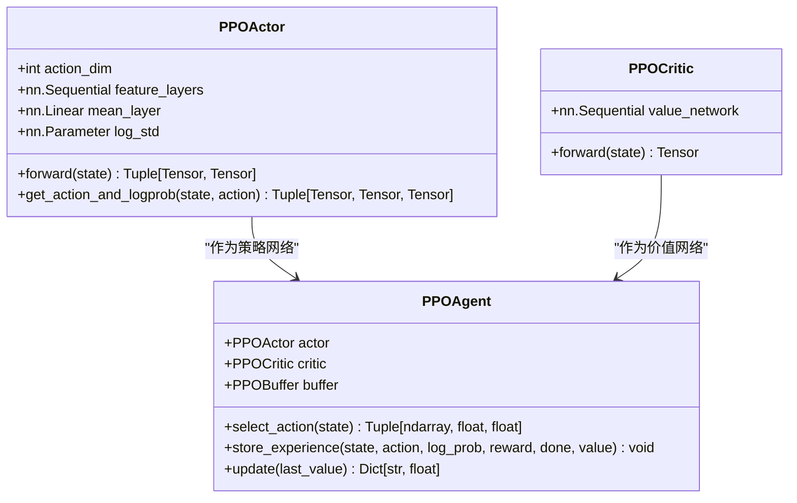
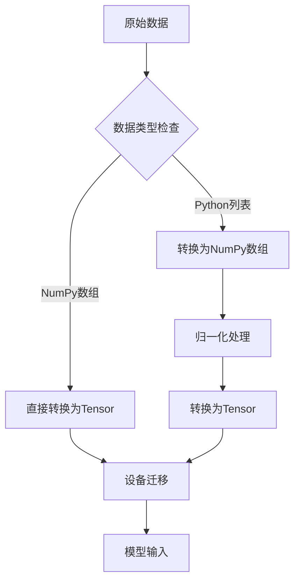
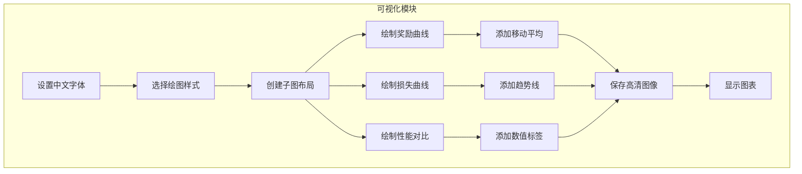

# 技术栈与依赖

<cite>
**本文档引用的文件**  
- [single_agent/ppo.py](file://single_agent/ppo.py)
- [utils/data_processor.py](file://utils/data_processor.py)
- [tools/advanced_visualization.py](file://tools/advanced_visualization.py)
- [visualize_results.py](file://visualize_results.py)
- [config/external_config.py](file://config/external_config.py)
- [enhance_numerical_stability.py](file://enhance_numerical_stability.py)
- [utils/common.py](file://utils/common.py)
</cite>

## 目录
1. [技术栈概述](#技术栈概述)
2. [核心框架与库](#核心框架与库)
3. [依赖安装指南](#依赖安装指南)
4. [环境配置建议](#环境配置建议)
5. [环境验证方法](#环境验证方法)

## 技术栈概述

VEC_mig_caching项目构建于现代深度学习与科学计算技术栈之上，采用模块化设计，支持多智能体强化学习在车联网边缘缓存与迁移场景中的应用。系统通过PyTorch实现深度神经网络，NumPy进行高效数值计算，并利用Matplotlib完成结果可视化。项目还集成了Seaborn用于高级数据可视化，以及Torch的分布式计算能力，确保在复杂边缘计算环境下的高效训练与推理。

**Section sources**
- [single_agent/ppo.py](file://single_agent/ppo.py#L0-L51)
- [utils/data_processor.py](file://utils/data_processor.py#L0-L188)
- [tools/advanced_visualization.py](file://tools/advanced_visualization.py#L0-L515)

## 核心框架与库

### PyTorch（深度神经网络实现）

PyTorch是本项目的核心深度学习框架，用于实现多智能体强化学习算法（如MATD3、MADDPG、PPO等）。在`single_agent/ppo.py`中，通过`torch.nn.Module`定义了Actor-Critic网络结构，使用`torch.optim.Adam`优化器进行参数更新，并通过`torch.distributions.Normal`实现连续动作空间的概率分布采样。

PyTorch的优势在于其动态计算图机制，便于调试和实现复杂的强化学习算法。在边缘计算场景中，PyTorch的轻量级和灵活性使其能够适应资源受限的车载设备和RSU节点。



**Diagram sources**
- [single_agent/ppo.py](file://single_agent/ppo.py#L47-L89)

**Section sources**
- [single_agent/ppo.py](file://single_agent/ppo.py#L0-L519)

### NumPy（高效数值计算）

NumPy为项目提供了高效的数值计算支持，广泛应用于数据处理、状态表示和奖励计算。在`utils/data_processor.py`中，`DataProcessor`类使用NumPy实现数据归一化、平滑、异常值移除和插值等预处理功能。

NumPy的向量化操作显著提升了计算效率，尤其在处理大规模车联网数据时，能够快速完成距离计算、信号强度转换等任务。其与PyTorch的无缝集成（通过`torch.from_numpy`和`.numpy()`）使得数据在CPU和GPU之间高效流转。



**Diagram sources**
- [utils/data_processor.py](file://utils/data_processor.py#L110-L141)

**Section sources**
- [utils/data_processor.py](file://utils/data_processor.py#L0-L188)
- [utils/common.py](file://utils/common.py#L0-L47)

### Matplotlib（结果可视化）

Matplotlib是项目的主要可视化工具，配合Seaborn实现高质量的训练曲线和性能分析图表。在`tools/advanced_visualization.py`中，通过配置中文字体支持（SimHei、Microsoft YaHei），解决了中文显示问题，并使用Seaborn的husl调色板提升图表美观度。

可视化模块提供了多种图表类型，包括训练奖励曲线、损失函数变化、性能对比柱状图和系统指标趋势图，帮助研究人员直观理解算法性能和系统行为。



**Diagram sources**
- [tools/advanced_visualization.py](file://tools/advanced_visualization.py#L0-L36)

**Section sources**
- [tools/advanced_visualization.py](file://tools/advanced_visualization.py#L0-L515)
- [visualize_results.py](file://visualize_results.py#L0-L216)

## 依赖安装指南

### 虚拟环境配置

建议使用Conda创建独立的虚拟环境，以避免依赖冲突：

```bash
conda create -n vec_mig_caching python=3.8
conda activate vec_mig_caching
```

### 包管理命令

安装核心依赖包：

```bash
pip install torch==1.12.0+cu113 torchvision==0.13.0+cu113 torchaudio==0.12.0 --extra-index-url https://download.pytorch.org/whl/cu113
pip install numpy==1.21.5 matplotlib==3.5.3 seaborn==0.11.2 pandas==1.3.5
```

### 常见安装问题解决方案

1. **CUDA版本不匹配**：根据GPU型号选择合适的PyTorch CUDA版本，可通过`nvidia-smi`查看驱动支持的CUDA版本。
2. **中文字体缺失**：在`tools/advanced_visualization.py`中已配置多种中文字体备选方案（SimHei、Microsoft YaHei），若仍无法显示，可手动安装中文字体包。
3. **内存不足**：在`config/external_config.py`中调整`parallel_environments`参数，减少并行环境数量以降低内存消耗。

**Section sources**
- [tools/advanced_visualization.py](file://tools/advanced_visualization.py#L0-L36)
- [config/external_config.py](file://config/external_config.py#L67-L101)

## 环境配置建议

### Windows系统

- 建议使用Anaconda作为Python发行版，便于管理包和环境。
- 安装Microsoft Visual C++ Build Tools以支持C扩展编译。
- 在PyCharm或VSCode中配置Conda环境，便于调试。

### Linux系统

- 使用系统包管理器安装CUDA和cuDNN（如Ubuntu的`apt`）。
- 建议使用`pip`而非`conda`安装PyTorch，以获得更好的性能优化。
- 配置`~/.matplotlib/fontList.cache`以确保中文字体正确加载。

**Section sources**
- [tools/advanced_visualization.py](file://tools/advanced_visualization.py#L0-L36)
- [enhance_numerical_stability.py](file://enhance_numerical_stability.py#L0-L51)

## 环境验证方法

运行`demo.py`脚本验证环境正确性：

```bash
python demo.py
```

该脚本将展示系统架构、关键文件状态和快速启动命令。若所有关键文件（如`algorithms/matd3.py`、`train_multi_agent.py`）均存在，则环境配置成功。

此外，可通过运行`test_numerical_stability.py`验证数值计算的稳定性，确保在边界条件下（如除零、无穷大）系统仍能正常运行。

**Section sources**
- [demo.py](file://demo.py#L146-L183)
- [enhance_numerical_stability.py](file://enhance_numerical_stability.py#L509-L542)