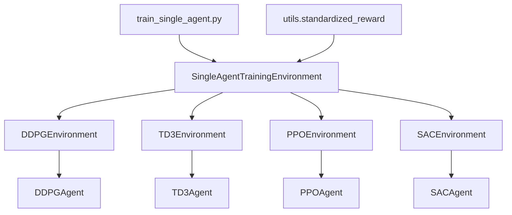
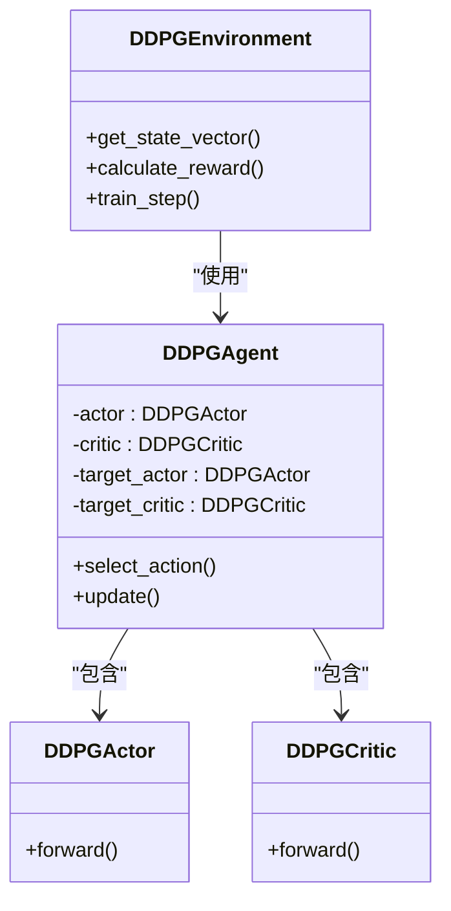
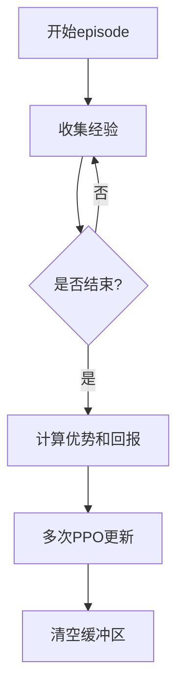
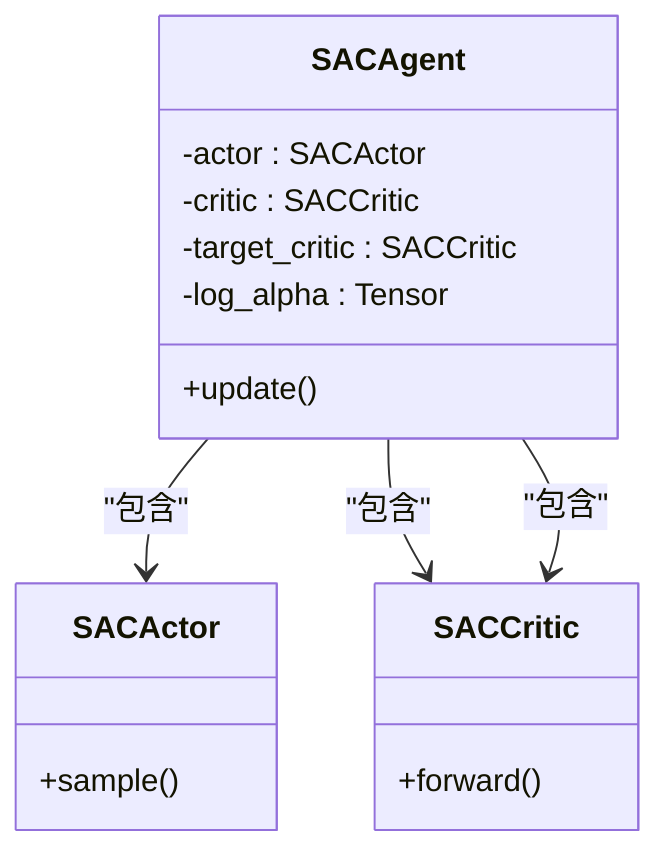
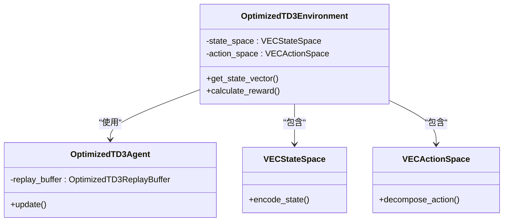
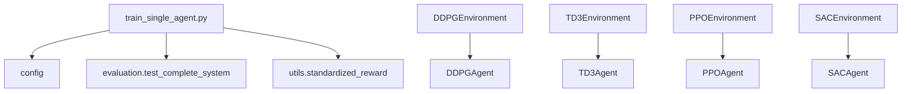

# 单智能体训练

<cite>
**本文档引用的文件**   
- [train_single_agent.py](file://train_single_agent.py)
- [single_agent/ddpg.py](file://single_agent/ddpg.py)
- [single_agent/td3.py](file://single_agent/td3.py)
- [single_agent/ppo.py](file://single_agent/ppo.py)
- [single_agent/sac.py](file://single_agent/sac.py)
- [single_agent/td3_optimized.py](file://single_agent/td3_optimized.py)
- [single_agent/td3_optimized_agent.py](file://single_agent/td3_optimized_agent.py)
</cite>

## 目录
1. [引言](#引言)
2. [项目结构](#项目结构)
3. [核心组件](#核心组件)
4. [架构概述](#架构概述)
5. [详细组件分析](#详细组件分析)
6. [依赖分析](#依赖分析)
7. [性能考虑](#性能考虑)
8. [故障排除指南](#故障排除指南)
9. [结论](#结论)

## 引言
本文档全面介绍单智能体强化学习训练模块的设计与实现。详细解析`train_single_agent.py`如何加载DDPG、PPO、TD3及其优化版本等算法进行独立训练。结合`single_agent`目录中的代码，说明各算法的Actor-Critic架构、探索策略、目标网络更新机制及TD3优化技巧（如延迟更新、双Q网络）。对比单智能体与多智能体训练在状态感知、决策独立性与扩展性方面的差异。提供典型训练配置示例，包括学习率、批量大小和折扣因子设置。说明该模式适用于边缘节点独立决策的场景，如本地缓存更新或单点任务处理。

## 项目结构
项目结构清晰地组织了不同功能模块。`single_agent`目录包含了DDPG、PPO、TD3、SAC等单智能体强化学习算法的具体实现。`train_single_agent.py`是单智能体训练的主入口脚本，负责初始化训练环境、加载指定算法并执行训练流程。`config`目录提供系统配置，`utils`目录包含标准化奖励计算等工具函数。

**Section sources**
- [train_single_agent.py](file://train_single_agent.py#L38-L78)
- [single_agent/ddpg.py](file://single_agent/ddpg.py#L32-L52)
- [single_agent/td3.py](file://single_agent/td3.py#L32-L62)
- [single_agent/ppo.py](file://single_agent/ppo.py#L32-L55)
- [single_agent/sac.py](file://single_agent/sac.py#L33-L55)

## 核心组件
`train_single_agent.py`中的`SingleAgentTrainingEnvironment`类是核心，它根据指定的算法（DDPG、TD3、PPO、SAC）创建相应的环境实例。每个算法环境（如`DDPGEnvironment`、`TD3Environment`）都封装了其特有的网络结构、训练逻辑和超参数配置。训练过程通过`train_single_algorithm`函数执行，该函数管理训练循环、评估、模型保存和结果记录。

**Section sources**
- [train_single_agent.py](file://train_single_agent.py#L567-L597)
- [train_single_agent.py](file://train_single_agent.py#L691-L725)
- [train_single_agent.py](file://train_single_agent.py#L785-L828)

## 架构概述
单智能体训练架构采用模块化设计。主训练脚本负责流程控制，而具体的算法逻辑被封装在各自的环境类中。这些环境类与一个统一的智能体类（如`DDPGAgent`）交互，后者实现了算法的核心逻辑。状态和动作在环境与智能体之间传递，奖励由`utils.standardized_reward`模块计算。



**Diagram sources **
- [train_single_agent.py](file://train_single_agent.py#L38-L78)
- [single_agent/ddpg.py](file://single_agent/ddpg.py#L175-L344)
- [single_agent/td3.py](file://single_agent/td3.py#L216-L426)
- [single_agent/ppo.py](file://single_agent/ppo.py#L235-L407)
- [single_agent/sac.py](file://single_agent/sac.py#L219-L412)

## 详细组件分析

### DDPG算法分析
DDPG算法采用确定性策略，其Actor网络输出连续动作。环境`DDPGEnvironment`负责构建状态向量和计算奖励。智能体`DDPGAgent`维护Actor和Critic网络，并通过软更新机制更新目标网络。探索通过在动作上添加高斯噪声实现。



**Diagram sources **
- [single_agent/ddpg.py](file://single_agent/ddpg.py#L55-L87)
- [single_agent/ddpg.py](file://single_agent/ddpg.py#L90-L129)
- [single_agent/ddpg.py](file://single_agent/ddpg.py#L175-L344)

### TD3算法分析
TD3算法在DDPG基础上引入了三项关键改进：双Q网络、延迟策略更新和目标策略平滑。`TD3Environment`和`TD3Agent`的结构与DDPG类似，但Critic网络是双Q网络（`TD3Critic`），并且Actor网络的更新频率低于Critic网络。

```mermaid
sequenceDiagram
participant Env as TD3Environment
participant Agent as TD3Agent
participant Critic as TD3Critic
participant Actor as TD3Actor
Env->>Agent : train_step()
Agent->>Critic : 更新Q网络
loop 每policy_delay步
Agent->>Actor : 更新策略网络
Agent->>Actor : 软更新目标网络
end
```

**Diagram sources **
- [single_agent/td3.py](file://single_agent/td3.py#L65-L97)
- [single_agent/td3.py](file://single_agent/td3.py#L100-L150)
- [single_agent/td3.py](file://single_agent/td3.py#L216-L426)

### PPO算法分析
PPO算法采用随机策略，其Actor网络输出动作的均值和标准差。`PPOEnvironment`的`get_actions`方法返回动作、对数概率和价值。训练在episode结束后通过`update`方法进行，使用重要性采样和裁剪机制来稳定策略更新。



**Diagram sources **
- [single_agent/ppo.py](file://single_agent/ppo.py#L58-L113)
- [single_agent/ppo.py](file://single_agent/ppo.py#L116-L144)
- [single_agent/ppo.py](file://single_agent/ppo.py#L235-L407)

### SAC算法分析
SAC算法是一种基于最大熵的off-policy算法，它自动调节熵的权重。`SACAgent`包含一个可学习的温度参数`alpha`，用于平衡任务回报和策略熵。Critic网络也是双Q网络，以减少Q值的过高估计。



**Diagram sources **
- [single_agent/sac.py](file://single_agent/sac.py#L58-L129)
- [single_agent/sac.py](file://single_agent/sac.py#L132-L173)
- [single_agent/sac.py](file://single_agent/sac.py#L219-L412)

### 优化的TD3算法分析
`td3_optimized.py`和`td3_optimized_agent.py`实现了对TD3算法的进一步优化，包括更复杂的状态和动作空间定义（`VECStateSpace`和`VECActionSpace`）、更稳定的奖励计算机制以及更保守的超参数配置（如极低的学习率和更大的延迟更新）。



**Diagram sources **
- [single_agent/td3_optimized.py](file://single_agent/td3_optimized.py#L57-L112)
- [single_agent/td3_optimized.py](file://single_agent/td3_optimized.py#L115-L214)
- [single_agent/td3_optimized_agent.py](file://single_agent/td3_optimized_agent.py#L122-L382)

## 依赖分析
单智能体训练模块依赖于`config`模块获取系统配置，依赖于`evaluation`模块中的`CompleteSystemSimulator`进行仿真，依赖于`utils`模块中的`standardized_reward`计算奖励。各算法环境之间相互独立，但共享相似的接口。



**Diagram sources **
- [train_single_agent.py](file://train_single_agent.py#L38-L78)
- [single_agent/ddpg.py](file://single_agent/ddpg.py#L347-L561)
- [single_agent/td3.py](file://single_agent/td3.py#L429-L546)
- [single_agent/ppo.py](file://single_agent/ppo.py#L410-L518)
- [single_agent/sac.py](file://single_agent/sac.py#L415-L530)

## 性能考虑
训练过程中，性能通过`MovingAverage`类进行追踪。模型会定期保存检查点，并在评估性能提升时保存最佳模型。训练结果以JSON格式保存，并生成多种可视化图表，包括奖励曲线、时延曲线和多指标仪表板。

**Section sources**
- [train_single_agent.py](file://train_single_agent.py#L567-L597)
- [train_single_agent.py](file://train_single_agent.py#L691-L725)
- [train_single_agent.py](file://train_single_agent.py#L785-L828)

## 故障排除指南
如果训练不稳定，可以检查奖励函数是否产生NaN或Inf值。`OptimizedTD3Environment`中包含了对状态和奖励向量的NaN/Inf检查和修复机制。此外，`td3_optimized_agent.py`中的`_update_critic`方法也包含了对Q值和损失的NaN检查。

**Section sources**
- [single_agent/td3_optimized.py](file://single_agent/td3_optimized.py#L335-L493)
- [single_agent/td3_optimized_agent.py](file://single_agent/td3_optimized_agent.py#L122-L382)

## 结论
单智能体训练模块设计灵活，支持多种主流强化学习算法。通过模块化的设计，可以方便地添加新的算法或修改现有算法。该模块适用于边缘计算场景下的独立决策问题，如车辆、RSU和UAV的本地资源管理和任务处理。