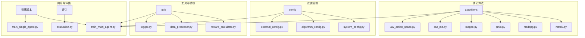
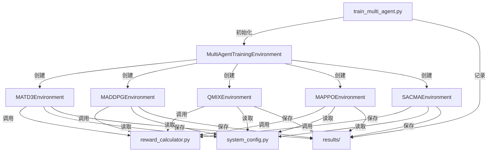
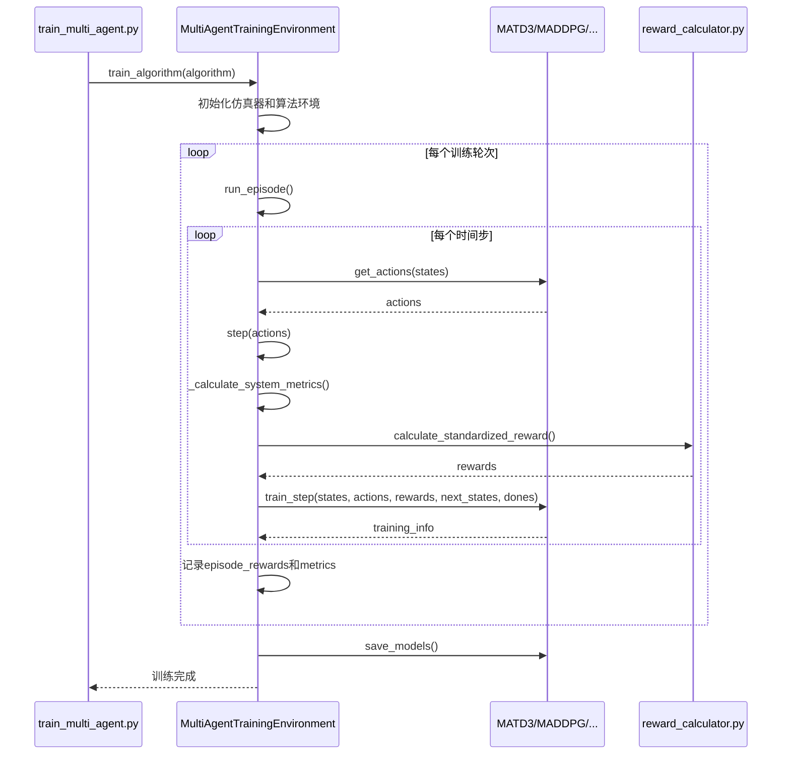

# 多智能体训练

<cite>
**本文档引用的文件**   
- [train_multi_agent.py](file://train_multi_agent.py)
- [matd3.py](file://algorithms/matd3.py)
- [maddpg.py](file://algorithms/maddpg.py)
- [qmix.py](file://algorithms/qmix.py)
- [mappo.py](file://algorithms/mappo.py)
- [sac_ma.py](file://algorithms/sac_ma.py)
- [uav_action_space.py](file://algorithms/uav_action_space.py)
- [reward_calculator.py](file://utils/reward_calculator.py)
- [system_config.py](file://config/system_config.py)
- [algorithm_config.py](file://config/algorithm_config.py)
</cite>

## 目录
1. [引言](#引言)
2. [项目结构](#项目结构)
3. [核心组件](#核心组件)
4. [架构概述](#架构概述)
5. [详细组件分析](#详细组件分析)
6. [依赖分析](#依赖分析)
7. [性能考虑](#性能考虑)
8. [故障排除指南](#故障排除指南)
9. [结论](#结论)

## 引言

本项目 `VEC_mig_caching` 实现了一个用于车辆边缘计算（VEC）环境中任务卸载和迁移决策的多智能体强化学习（MARL）框架。其核心目标是通过联合训练多个智能体，优化系统在任务延迟、能耗和数据丢失率等方面的综合性能。`train_multi_agent.py` 脚本是整个训练流程的入口，它支持多种先进的多智能体算法，包括 MATD3、MADDPG、QMIX、MAPPO 和 SAC-MA。

本技术文档将深入剖析该框架的实现机制。我们将详细讲解 `train_multi_agent.py` 如何初始化环境、加载算法配置并启动联合训练。接着，我们将结合 `algorithms` 目录下的具体实现，分析各算法的网络结构设计、经验回放机制、策略更新方式及协作机制。我们还将解释多智能体环境中的状态空间、动作空间和奖励函数设计，并提供实际训练命令示例和关键参数调优建议。最后，我们将阐述多智能体训练在任务卸载和迁移决策中的协同优势，并对比不同算法在收敛速度和稳定性上的表现。

## 项目结构

项目采用模块化设计，各目录职责分明，便于维护和扩展。



**图源**
- [train_multi_agent.py](file://train_multi_agent.py)
- [algorithms](file://algorithms)
- [config](file://config)
- [utils](file://utils)

**本节来源**
- [train_multi_agent.py](file://train_multi_agent.py)
- [algorithms](file://algorithms)
- [config](file://config)
- [utils](file://utils)

## 核心组件

本项目的核心组件包括多智能体训练脚本、多种算法实现、统一的奖励计算模块以及系统配置管理。`train_multi_agent.py` 作为总控脚本，负责协调整个训练流程。`algorithms` 目录下的各个文件实现了不同的多智能体强化学习算法，它们都遵循一个统一的接口，使得 `train_multi_agent.py` 可以无缝切换和比较不同算法。`utils/reward_calculator.py` 提供了标准化的奖励计算逻辑，确保所有算法在公平的基准上进行评估。`config` 目录下的配置文件则为整个系统提供了可定制的参数。

**本节来源**
- [train_multi_agent.py](file://train_multi_agent.py#L1-L50)
- [algorithms](file://algorithms)
- [utils/reward_calculator.py](file://utils/reward_calculator.py#L1-L50)
- [config/system_config.py](file://config/system_config.py#L1-L50)

## 架构概述

整个系统的架构可以分为三层：**训练控制层**、**算法实现层**和**环境与配置层**。



**图源**
- [train_multi_agent.py](file://train_multi_agent.py#L1-L100)
- [algorithms/matd3.py](file://algorithms/matd3.py#L1-L50)
- [algorithms/maddpg.py](file://algorithms/maddpg.py#L1-L50)
- [algorithms/qmix.py](file://algorithms/qmix.py#L1-L50)
- [algorithms/mappo.py](file://algorithms/mappo.py#L1-L50)
- [algorithms/sac_ma.py](file://algorithms/sac_ma.py#L1-L50)
- [utils/reward_calculator.py](file://utils/reward_calculator.py#L1-L50)
- [config/system_config.py](file://config/system_config.py#L1-L50)

## 详细组件分析

### 多智能体训练环境分析

`train_multi_agent.py` 中的 `MultiAgentTrainingEnvironment` 类是整个训练流程的核心控制器。它负责初始化仿真环境、创建特定算法的环境实例、执行训练循环并记录结果。

#### 初始化与环境创建
当脚本启动时，会根据命令行参数指定的 `algorithm` 名称，动态创建对应的算法环境实例。例如，当指定 `--algorithm MATD3` 时，会创建 `MATD3Environment` 的实例。这个过程通过简单的 `if-elif` 语句完成，确保了代码的清晰和可扩展性。

#### 状态与奖励计算
该类通过 `reset_environment` 和 `step` 方法与底层仿真器 `CompleteSystemSimulator` 交互，获取车辆、RSU 和 UAV 的状态信息，并将其转换为算法所需的格式。奖励计算则通过调用 `utils/reward_calculator.py` 中的 `calculate_standardized_reward` 函数来完成，这保证了奖励逻辑的一致性。

#### 训练循环
`run_episode` 方法实现了标准的强化学习训练循环。它会重复执行“选择动作 -> 执行动作 -> 计算奖励 -> 训练智能体”的步骤，直到达到最大步数或环境结束。对于 MAPPO 算法，由于其采用“在回合结束后进行批量更新”的策略，因此在 `run_episode` 中只收集经验，而在 `_run_mappo_episode` 中调用 `update` 方法进行实际的网络更新。



**图源**
- [train_multi_agent.py](file://train_multi_agent.py#L100-L800)

**本节来源**
- [train_multi_agent.py](file://train_multi_agent.py#L100-L800)

### 多智能体算法实现分析

`algorithms` 目录下的每个文件都实现了一种特定的多智能体强化学习算法。尽管它们的底层机制不同，但都遵循了相似的设计模式。

#### MATD3 (Multi-Agent TD3)
MATD3 是一种基于 Actor-Critic 框架的算法，旨在解决多智能体环境中的过估计问题。其核心组件包括：
- **Actor 网络**：一个简单的三层全连接神经网络，输出范围为 `[-1, 1]` 的连续动作。
- **Critic 网络**：采用“Twin”结构，包含两个独立的 Q 网络，取两者最小值作为目标 Q 值，以减少过估计。
- **经验回放缓冲区**：使用 `collections.deque` 实现，存储 `(state, action, reward, next_state, done)` 元组。
- **策略延迟更新**：Critic 网络更新频率高于 Actor 网络，以稳定训练过程。

MATD3 采用“集中式训练，分布式执行”（CTDE）范式，每个智能体拥有独立的 Actor-Critic 网络，但在训练时 Critic 可以访问全局信息。

#### MADDPG (Multi-Agent DDPG)
MADDPG 是 DDPG 在多智能体环境中的扩展。其关键特点是：
- **集中式 Critic**：Critic 网络的输入是所有智能体的状态和动作的拼接，即 `Q(s_1, ..., s_n, a_1, ..., a_n)`，这使得 Critic 能够学习到其他智能体的行为，从而指导当前智能体的策略更新。
- **分布式 Actor**：每个智能体的 Actor 网络只接收自身的局部观测 `s_i` 来生成动作 `a_i`，这保证了执行的分布式特性。
- **探索噪声衰减**：训练过程中，探索噪声的标准差会随着训练步数逐渐衰减，以平衡探索与利用。

#### QMIX (Monotonic Value Function Factorisation)
QMIX 是一种基于值函数分解的算法，特别适用于合作型多智能体任务。其创新之处在于：
- **QMIX 网络**：一个混合网络，将所有智能体的个体 Q 值 `Q_i` 混合成一个全局 Q 值 `Q_tot`。该网络通过超网络（Hypernetwork）生成权重，并强制权重为正，以保证 `Q_tot` 是 `Q_i` 的单调递增函数。
- **RNN 智能体**：每个智能体使用 GRU 网络来处理部分可观测环境中的序列信息，增强其记忆能力。
- **全局状态**：QMIX 需要一个全局状态 `s` 作为 QMIX 网络的输入，以确保混合过程的合理性。

#### MAPPO (Multi-Agent PPO)
MAPPO 将单智能体的近端策略优化（PPO）算法扩展到多智能体领域。其主要特点包括：
- **PPO 更新机制**：使用裁剪的代理目标函数，避免策略更新步长过大，从而提高训练的稳定性。
- **集中式价值网络**：Critic 网络接收全局状态作为输入，以更准确地评估状态价值。
- **经验缓冲区**：在完成一个完整的训练轮次后，将所有经验存储在一个大的缓冲区中，然后进行多次小批量的更新（PPO epochs）。

#### SAC-MA (Multi-Agent Soft Actor-Critic)
SAC-MA 基于最大熵强化学习框架，旨在提高样本效率和探索能力。其核心机制是：
- **熵最大化**：在目标函数中加入策略熵项，鼓励智能体探索更多样化的动作。
- **自动温度调节**：引入一个可学习的温度参数 `α`，自动平衡任务回报和策略熵之间的权重。
- **Twin Critic**：与 MATD3 类似，使用两个 Critic 网络来减少过估计。

**本节来源**
- [algorithms/matd3.py](file://algorithms/matd3.py#L1-L550)
- [algorithms/maddpg.py](file://algorithms/maddpg.py#L1-L650)
- [algorithms/qmix.py](file://algorithms/qmix.py#L1-L600)
- [algorithms/mappo.py](file://algorithms/mappo.py#L1-L590)
- [algorithms/sac_ma.py](file://algorithms/sac_ma.py#L1-L555)

### 状态、动作与奖励设计分析

#### 状态空间设计
状态空间的设计是多智能体协作的基础。在 `MATD3Environment` 和 `MADDPGEnvironment` 的 `get_state_vector` 方法中，状态向量被精心设计以包含丰富的信息：
- **基础系统状态**：如平均任务延迟、总能耗、数据丢失率等全局指标。
- **智能体特定状态**：如车辆的平均负载、队列长度；RSU 的缓存命中率、可用性；UAV 的电池电量、平均负载等。
- **网络状态**：如带宽利用率、迁移成功率、信道质量等。

这种设计使得每个智能体既能感知全局系统性能，又能关注自身节点的局部状态，从而做出更优的决策。

#### 动作空间设计
动作空间的设计因智能体而异。`uav_action_space.py` 文件定义了一个专门针对固定UAV的8维连续动作空间，每个维度对应一个具体的决策参数，如电池功率管理级别、服务优先级权重、覆盖区域调整等。这些连续的动作值随后会被 `UAVActionDecomposer` 分解为具体的执行参数，如功率级别、覆盖半径倍数等。

#### 奖励函数设计
奖励函数是驱动智能体学习的关键。`utils/reward_calculator.py` 中的 `UnifiedRewardCalculator` 实现了论文中的目标函数。其核心公式为：
`奖励 = - (ω_T * 归一化延迟 + ω_E * 归一化能耗 + ω_D * 归一化数据丢失率) + 性能奖励 + 智能体特定奖励`

其中，`ω_T`, `ω_E`, `ω_D` 是在 `system_config.py` 的 `RLConfig` 类中定义的权重，用于平衡不同优化目标的重要性。此外，还加入了任务完成率、缓存命中率等正向奖励，以鼓励高性能表现。

```mermaid
flowchart TD
    A[系统指标] --> B[归一化延迟]
    A --> C[归一化能耗]
    A --> D[归一化数据丢失率]
   