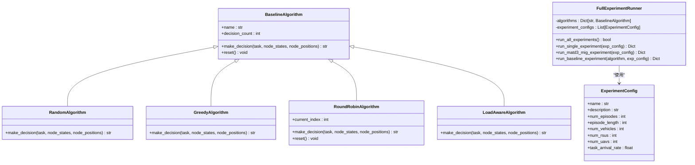
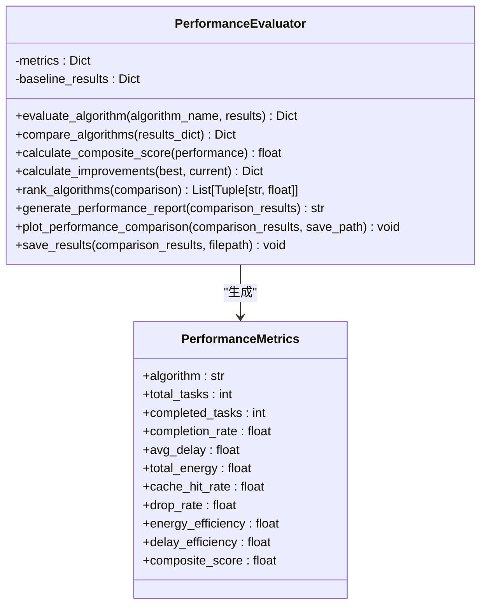
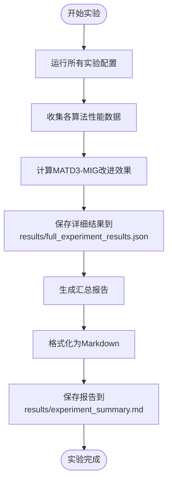

# 完整实验评估

<cite>
**本文档引用的文件**   
- [run_full_experiment.py](file://run_full_experiment.py)
- [vec_system_config.json](file://vec_system_config.json)
- [performance_evaluator.py](file://evaluation/performance_evaluator.py)
</cite>

## 目录
1. [引言](#引言)
2. [实验框架概述](#实验框架概述)
3. [系统参数配置](#系统参数配置)
4. [算法对比实验](#算法对比实验)
5. [性能评估体系](#性能评估体系)
6. [结果记录与报告生成](#结果记录与报告生成)
7. [自定义实验配置](#自定义实验配置)
8. [结论](#结论)

## 引言
本文档系统阐述了由`run_full_experiment.py`驱动的端到端实验评估框架。该框架旨在全面评估多智能体与单智能体算法在车辆边缘计算（VEC）环境下的性能表现，特别是针对MATD3-MIG等先进算法与随机、贪心等基线算法的对比分析。文档详细说明了实验的协调机制、性能指标体系、结果记录与报告生成流程，并提供了自定义实验配置的方法。

## 实验框架概述
`run_full_experiment.py`脚本是整个实验评估的核心，它协调了多智能体与单智能体算法的执行流程。该脚本通过`FullExperimentRunner`类实现，该类负责管理实验的生命周期，包括环境创建、任务生成、算法执行和结果收集。

**Section sources**
- [run_full_experiment.py](file://run_full_experiment.py#L151-L583)

## 系统参数配置
实验框架通过`vec_system_config.json`文件加载系统参数，这些参数定义了仿真环境的基本配置。该JSON文件包含了时间设置、任务生成、网络拓扑、计算资源、通信、迁移参数、缓存设置和性能优化等多个方面的配置。

```json
{
    "time_settings": {
        "time_slot_duration": 0.2,
        "simulation_time": 1000
    },
    "task_generation": {
        "arrival_rate": 1.35,
        "data_size_range": [5000000.0, 25000000.0],
        "compute_density": 500,
        "deadline_range": [3.5, 25.0],
        "output_ratio": 0.05
    },
    "network_topology": {
        "num_vehicles": 12,
        "num_rsus": 6,
        "num_uavs": 2,
        "area_width": 2500,
        "area_height": 2500,
        "rsu_coverage_radius": 360
    },
    "compute_resources": {
        "vehicle_cpu_freq_range": [8000000000.0, 25000000000.0],
        "rsu_cpu_freq_range": [45000000000.0, 55000000000.0],
        "uav_cpu_freq_range": [7000000000.0, 9000000000.0],
        "parallel_efficiency": 0.9
    },
    "communication": {
        "total_bandwidth": 50000000.0,
        "vehicle_tx_power": 30,
        "rsu_tx_power": 35,
        "uav_tx_power": 25
    },
    "migration_parameters": {
        "migration_threshold": 0.75,
        "rsu_overload_threshold": 0.85,
        "uav_overload_threshold": 0.8,
        "cooldown_period": 8.0,
        "max_migration_distance": 800
    },
    "cache_settings": {
        "vehicle_cache_capacity": 2000000000.0,
        "rsu_cache_capacity": 20000000000.0,
        "uav_cache_capacity": 4000000000.0,
        "cache_hit_threshold": 0.85,
        "prediction_window": 15
    },
    "performance_optimization": {
        "enable_adaptive_scheduling": true,
        "enable_load_balancing": true,
        "enable_energy_optimization": true,
        "batch_size_optimization": true,
        "parallel_environments": 8
    }
}
```

**Diagram sources**
- [vec_system_config.json](file://vec_system_config.json#L0-L68)

## 算法对比实验
实验框架支持多种算法的对比测试，包括先进的多智能体算法MATD3-MIG和多种基线算法。`FullExperimentRunner`类中定义了`algorithms`字典，用于管理所有待测试的算法实例。



**Diagram sources**
- [run_full_experiment.py](file://run_full_experiment.py#L151-L583)

## 性能评估体系
性能评估体系由`evaluation/performance_evaluator.py`文件中的`PerformanceEvaluator`类定义。该类提供了一套全面的性能指标，用于量化和比较不同算法的表现。



**Diagram sources**
- [performance_evaluator.py](file://evaluation/performance_evaluator.py#L12-L253)

## 结果记录与报告生成
实验结果的自动记录、统计分析与报告生成机制是评估框架的重要组成部分。`FullExperimentRunner`类中的`save_results`和`generate_summary_report`方法负责将实验结果持久化到文件系统。



**Diagram sources**
- [run_full_experiment.py](file://run_full_experiment.py#L467-L551)

## 自定义实验配置
用户可以通过修改`vec_system_config.json`文件来自定义实验配置，以支持不同网络拓扑、负载模式和移动性模型的仿真测试。此外，`run_full_experiment.py`脚本中的`experiment_configs`列表定义了多个预设的实验场景，包括标准配置、高负载场景和大规模场景。

**Section sources**
- [vec_system_config.json](file://vec_system_config.json#L0-L68)
- [run_full_experiment.py](file://run_full_experiment.py#L166-L204)

## 结论
`run_full_experiment.py`驱动的端到端实验评估框架提供了一个强大而灵活的工具，用于系统性地评估和比较不同算法在VEC环境下的性能。通过加载`vec_system_config.json`中的系统参数，该框架能够运行MATD3-MIG等先进算法与随机、贪心等基线算法的对比实验。`performance_evaluator.py`中定义的性能指标体系，包括任务完成率、平均延迟、能耗和缓存命中率，为性能评估提供了全面的视角。实验结果的自动记录、统计分析与报告生成机制确保了评估过程的可重复性和透明度。用户可以通过修改配置文件来自定义实验，以适应不同的研究需求。