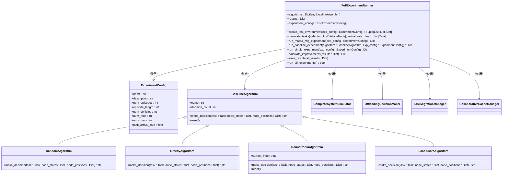

# 核心功能模块

<cite>
**本文档引用的文件**   
- [train_multi_agent.py](file://train_multi_agent.py)
- [train_single_agent.py](file://train_single_agent.py)
- [run_full_experiment.py](file://run_full_experiment.py)
- [visualize_results.py](file://visualize_results.py)
- [algorithms/matd3.py](file://algorithms/matd3.py)
- [single_agent/ddpg.py](file://single_agent/ddpg.py)
- [config/algorithm_config.py](file://config/algorithm_config.py)
- [utils/standardized_reward.py](file://utils/standardized_reward.py)
</cite>

## 目录
1. [多智能体训练](#多智能体训练)
2. [单智能体训练](#单智能体训练)
3. [完整实验评估](#完整实验评估)
4. [结果可视化](#结果可视化)
5. [功能调用示例](#功能调用示例)

## 多智能体训练

VEC_mig_caching系统提供了完整的多智能体强化学习训练框架，支持MATD3、MADDPG、QMIX、MAPPO和SAC-MA等多种先进算法。该功能通过`train_multi_agent.py`脚本实现，允许用户训练和比较不同多智能体算法在VEC（车辆边缘计算）环境中的性能表现。

多智能体训练的核心在于协调多个智能体（车辆、RSU、UAV）的决策过程，每个智能体负责特定类型的节点管理。系统通过`MultiAgentTrainingEnvironment`类统一管理训练流程，该类为不同算法提供了标准化的接口。训练过程中，系统会收集车辆、RSU和UAV的状态信息，包括位置、速度、任务队列长度、缓存利用率和能耗等关键指标，并将其转换为适合强化学习算法处理的归一化状态向量。

奖励函数的设计严格遵循论文中的目标函数，通过`utils/standardized_reward.py`模块实现标准化奖励计算。奖励计算综合考虑了平均任务时延、总能耗和数据丢失率三个关键性能指标，并根据预设权重进行加权求和。这种设计确保了所有算法使用相同的奖励逻辑，保证了比较的公平性。训练过程中，系统会自动记录每轮次的奖励、损失和各项性能指标，为后续分析提供数据支持。


**图源**
- [train_multi_agent.py](file://train_multi_agent.py#L63-L712)
- [algorithms/matd3.py](file://algorithms/matd3.py#L252-L549)

**节源**
- [train_multi_agent.py](file://train_multi_agent.py#L0-L1170)

## 单智能体训练

单智能体训练功能通过`train_single_agent.py`脚本实现，支持DDPG、TD3、DQN、PPO和SAC等主流强化学习算法。与多智能体训练不同，单智能体框架将整个VEC系统视为一个整体，由单一智能体做出所有决策。这种设计简化了训练过程，降低了算法复杂度，适用于系统规模较小或计算资源有限的场景。

`SingleAgentTrainingEnvironment`类负责管理单智能体训练流程，它将车辆、RSU和UAV的状态信息整合成一个全局状态向量，维度为60。该状态向量包含了基础系统状态、各节点状态以及派生特征，确保智能体能够全面了解系统状况。动作空间同样被整合为30维，代表所有节点的联合决策。训练过程中，系统会将全局动作分解为各节点的具体动作，实现统一决策与分布式执行的结合。

单智能体训练的优势在于其简单性和稳定性。由于只有一个智能体需要训练，避免了多智能体系统中常见的非平稳性问题。同时，全局状态感知使得智能体能够做出更协调的决策。然而，这种方法的可扩展性较差，当系统规模增大时，状态和动作空间会急剧膨胀，导致训练难度增加。因此，单智能体训练更适合用于基线比较或小规模场景的快速验证。


**图源**
- [train_single_agent.py](file://train_single_agent.py#L55-L490)
- [single_agent/ddpg.py](file://single_agent/ddpg.py#L347-L561)

**节源**
- [train_single_agent.py](file://train_single_agent.py#L0-L967)

## 完整实验评估

完整实验评估功能通过`run_full_experiment.py`脚本实现，旨在全面评估MATD3-MIG系统与其他基线算法的性能差异。该功能支持多种实验场景配置，包括标准场景、高负载场景和大规模场景，能够全面测试算法在不同条件下的表现。评估框架的核心是`FullExperimentRunner`类，它负责管理整个实验流程，包括环境创建、任务生成、算法执行和结果分析。

评估框架集成了多种基线算法，包括随机算法、贪心算法、轮询算法和负载感知算法。这些基线算法作为性能基准，与MATD3-MIG系统进行对比。每种算法的性能通过平均时延、总能耗、任务完成率、数据丢失率和缓存命中率等指标进行量化。实验结果以JSON格式保存，并生成详细的Markdown报告，包含性能对比表和改进效果分析。

评估框架的另一个重要特性是其可扩展性。通过`ExperimentConfig`类，用户可以轻松定义新的实验场景，调整车辆、RSU和UAV的数量，以及任务到达率等参数。这种灵活性使得研究人员能够针对特定应用场景进行定制化评估。此外，框架还提供了改进效果计算功能，能够量化MATD3-MIG系统相对于各基线算法的性能提升，为算法优化提供指导。



**图源**
- [run_full_experiment.py](file://run_full_experiment.py#L151-L583)

**节源**
- [run_full_experiment.py](file://run_full_experiment.py#L0-L608)

## 结果可视化

结果可视化功能通过`visualize_results.py`脚本实现，旨在帮助研究人员直观理解训练过程和性能趋势。该功能提供了多种图表类型，包括性能对比图、改进效果图和训练曲线图，能够全面展示实验结果。可视化模块依赖于`matplotlib`和`pandas`库，确保了图表的质量和可读性。

主要的可视化功能包括性能对比图表和改进效果图表。性能对比图表以柱状图形式展示了MATD3-MIG系统与各基线算法在不同实验场景下的性能差异，包括平均时延、任务完成率、总能耗和缓存命中率等指标。改进效果图表则量化了MATD3-MIG系统相对于各基线算法的性能提升，以百分比形式展示时延、能耗和完成率的改进效果。此外，系统还提供了高级可视化套件，包括增强训练曲线、收敛性分析和多指标仪表板，为深入分析提供支持。

可视化模块的设计充分考虑了用户体验。通过设置中文字体和禁用负号，确保了中文显示的正确性。图表布局经过精心设计，确保信息清晰易读。所有图表均以高分辨率（300dpi）保存，适用于论文和报告。此外，模块还提供了实验结果摘要打印功能，能够在控制台快速查看关键性能指标，方便研究人员进行初步分析。


**图源**
- [visualize_results.py](file://visualize_results.py#L0-L217)

**节源**
- [visualize_results.py](file://visualize_results.py#L0-L217)

## 功能调用示例

以下示例展示了如何调用VEC_mig_caching系统的核心功能：

多智能体训练的调用方式如下：
```bash
python train_multi_agent.py --algorithm MATD3 --episodes 200
python train_multi_agent.py --algorithm MADDPG --episodes 200
python train_multi_agent.py --algorithm QMIX --episodes 200
python train_multi_agent.py --compare --episodes 200
```
用户可以通过`--algorithm`参数指定要训练的算法，通过`--episodes`参数设置训练轮次数。使用`--compare`参数可以同时训练和比较所有支持的算法。

单智能体训练的调用方式类似：
```bash
python train_single_agent.py --algorithm DDPG --episodes 200
python train_single_agent.py --algorithm TD3 --episodes 200
python train_single_agent.py --algorithm PPO --episodes 200
python train_single_agent.py --compare --episodes 200
```
参数含义与多智能体训练相同，但针对的是单智能体算法。

完整实验评估的调用非常简单：
```bash
python run_full_experiment.py
```
该命令将自动运行所有预定义的实验场景，并生成详细的评估报告。

结果可视化的调用方式为：
```bash
python visualize_results.py
```
该命令将加载实验结果并生成相应的图表和摘要。

所有脚本都支持通过命令行参数进行配置，用户可以根据需要调整训练轮数、评估间隔、模型保存间隔等参数。此外，系统还提供了详细的日志输出，帮助用户监控训练和评估过程。

**节源**
- [train_multi_agent.py](file://train_multi_agent.py#L0-L1170)
- [train_single_agent.py](file://train_single_agent.py#L0-L967)
- [run_full_experiment.py](file://run_full_experiment.py#L0-L608)
- [visualize_results.py](file://visualize_results.py#L0-L217)