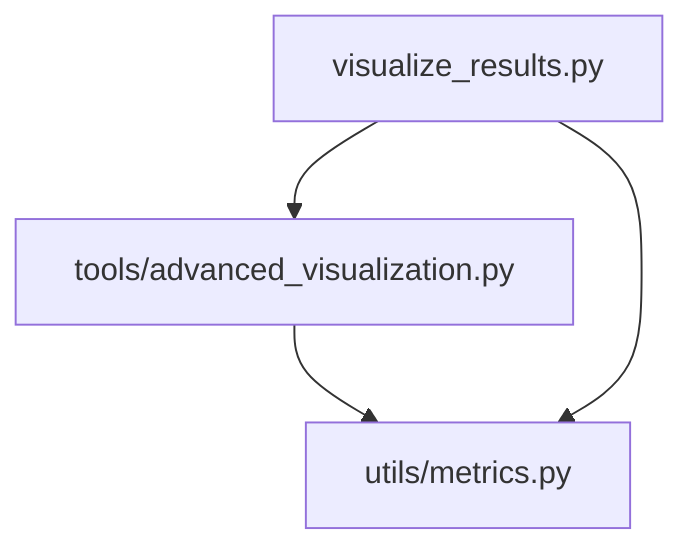
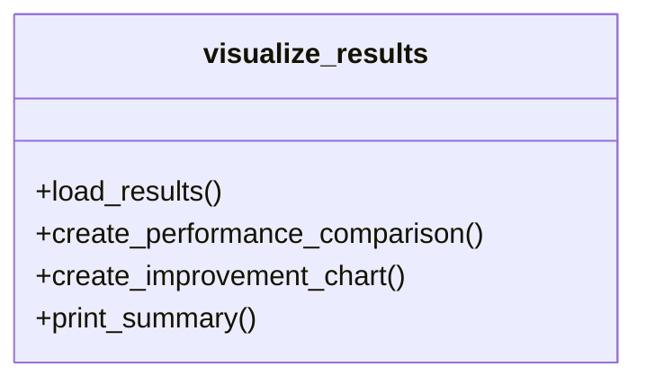
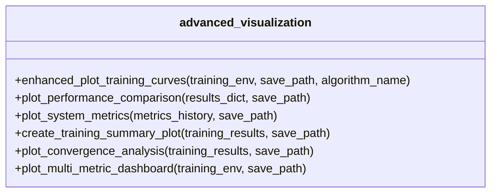
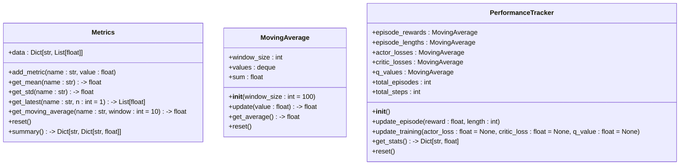

# 结果可视化

<cite>
**本文档引用的文件**
- [visualize_results.py](file://visualize_results.py)
- [tools/advanced_visualization.py](file://tools/advanced_visualization.py)
- [utils/metrics.py](file://utils/metrics.py)
</cite>

## 目录
1. [简介](#简介)
2. [项目结构](#项目结构)
3. [核心组件](#核心组件)
4. [架构概述](#架构概述)
5. [详细组件分析](#详细组件分析)
6. [依赖分析](#依赖分析)
7. [性能考量](#性能考量)
8. [故障排除指南](#故障排除指南)
9. [结论](#结论)
10. [附录](#附录)（如有必要）

## 简介
本文档详细说明了`visualize_results.py`如何加载训练日志和实验结果数据，并调用`advanced_visualization.py`中的高级绘图功能生成多维度性能图表。涵盖训练过程中的损失曲线、奖励变化趋势、Q值稳定性分析，以及实验对比的柱状图、折线图和热力图。解释如何通过可视化识别算法收敛问题、过拟合现象或策略震荡。提供自定义可视化模板的方法，支持用户扩展新的图表类型。结合`metrics.py`中的指标定义，确保可视化结果与系统评估标准一致，帮助研究人员快速洞察模型性能瓶颈。

## 项目结构
本项目采用模块化设计，主要分为算法、缓存、通信、配置、核心、决策、评估、迁移、单智能体、测试、工具、工具类和演示脚本等目录。`visualize_results.py`位于项目根目录，负责加载实验结果并生成可视化图表。`tools/advanced_visualization.py`提供了丰富的可视化功能，而`utils/metrics.py`则定义了性能指标的计算方法。

## 核心组件
`visualize_results.py`是本项目的核心组件之一，负责加载实验结果并生成可视化图表。它通过调用`tools/advanced_visualization.py`中的函数来实现高级绘图功能。`utils/metrics.py`中的`Metrics`和`PerformanceTracker`类用于计算和跟踪性能指标。

**Section sources**
- [visualize_results.py](file://visualize_results.py#L11-L155)
- [tools/advanced_visualization.py](file://tools/advanced_visualization.py#L22-L485)
- [utils/metrics.py](file://utils/metrics.py#L9-L147)

## 架构概述
`visualize_results.py`通过调用`tools/advanced_visualization.py`中的函数来生成多维度性能图表。`tools/advanced_visualization.py`提供了多种绘图功能，包括训练曲线、性能对比图、系统指标变化图、训练总结图、收敛性分析图和多指标仪表板。这些功能共同构成了一个完整的可视化解决方案。



**Diagram sources**
- [visualize_results.py](file://visualize_results.py#L11-L155)
- [tools/advanced_visualization.py](file://tools/advanced_visualization.py#L22-L485)
- [utils/metrics.py](file://utils/metrics.py#L9-L147)

## 详细组件分析

### visualize_results.py 分析
`visualize_results.py`的主要功能是加载实验结果并生成可视化图表。它通过调用`load_results`函数从`results/full_experiment_results.json`文件中加载实验结果，然后调用`create_performance_comparison`和`create_improvement_chart`函数生成性能对比图和改进效果图。

#### 主要函数
- `load_results`: 加载实验结果
- `create_performance_comparison`: 创建性能对比图表
- `create_improvement_chart`: 创建改进效果图表
- `print_summary`: 打印实验结果摘要



**Diagram sources**
- [visualize_results.py](file://visualize_results.py#L11-L155)

### advanced_visualization.py 分析
`tools/advanced_visualization.py`提供了丰富的可视化功能，包括训练曲线、性能对比图、系统指标变化图、训练总结图、收敛性分析图和多指标仪表板。这些功能通过调用`matplotlib`和`seaborn`库实现。

#### 主要函数
- `enhanced_plot_training_curves`: 增强的训练曲线绘制
- `plot_performance_comparison`: 绘制性能对比图
- `plot_system_metrics`: 绘制系统指标变化
- `create_training_summary_plot`: 创建训练总结图
- `plot_convergence_analysis`: 绘制收敛性分析图
- `plot_multi_metric_dashboard`: 绘制多指标仪表板



**Diagram sources**
- [tools/advanced_visualization.py](file://tools/advanced_visualization.py#L22-L485)

### metrics.py 分析
`utils/metrics.py`定义了性能指标的计算方法。`Metrics`类用于计算和跟踪性能指标，`MovingAverage`类用于计算移动平均值，`PerformanceTracker`类用于跟踪训练过程中的性能指标。

#### 主要类
- `Metrics`: 性能指标计算器
- `MovingAverage`: 移动平均计算器
- `PerformanceTracker`: 性能跟踪器



**Diagram sources**
- [utils/metrics.py](file://utils/metrics.py#L9-L147)

## 依赖分析
`visualize_results.py`依赖于`tools/advanced_visualization.py`和`utils/metrics.py`。`tools/advanced_visualization.py`提供了丰富的可视化功能，而`utils/metrics.py`则定义了性能指标的计算方法。这些依赖关系确保了可视化结果与系统评估标准一致。


**Diagram sources**
- [visualize_results.py](file://visualize_results.py#L11-L155)
- [tools/advanced_visualization.py](file://tools/advanced_visualization.py#L22-L485)
- [utils/metrics.py](file://utils/metrics.py#L9-L147)

## 性能考量
`visualize_results.py`通过调用`tools/advanced_visualization.py`中的函数来生成多维度性能图表。这些图表不仅包括训练过程中的损失曲线、奖励变化趋势、Q值稳定性分析，还包括实验对比的柱状图、折线图和热力图。通过这些图表，研究人员可以快速识别算法收敛问题、过拟合现象或策略震荡。

## 故障排除指南
如果在生成可视化图表时遇到问题，可以检查以下几点：
- 确保`results/full_experiment_results.json`文件存在且格式正确
- 确保`matplotlib`和`seaborn`库已安装
- 检查`visualize_results.py`中的路径是否正确
- 确保`tools/advanced_visualization.py`和`utils/metrics.py`文件没有被修改

**Section sources**
- [visualize_results.py](file://visualize_results.py#L11-L155)
- [tools/advanced_visualization.py](file://tools/advanced_visualization.py#L22-L485)
- [utils/metrics.py](file://utils/metrics.py#L9-L147)

## 结论
`visualize_results.py`通过调用`tools/advanced_visualization.py`中的高级绘图功能，生成了多维度性能图表，帮助研究人员快速洞察模型性能瓶颈。结合`metrics.py`中的指标定义，确保了可视化结果与系统评估标准一致。通过自定义可视化模板的方法，支持用户扩展新的图表类型。

## 附录
### 可视化模板示例
```python
def custom_visualization_template(data, save_path=None):
    """自定义可视化模板"""
    plt.figure(figsize=(10, 6))
    plt.plot(data['x'], data['y'], label='数据')
    plt.xlabel('X轴')
    plt.ylabel('Y轴')
    plt.title('自定义图表')
    plt.legend()
    plt.grid(True)
    if save_path:
        plt.savefig(save_path, dpi=300, bbox_inches='tight')
    plt.show()
```