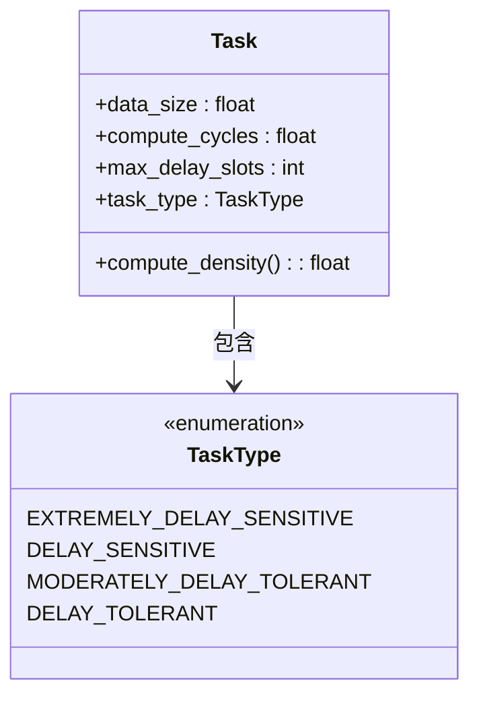
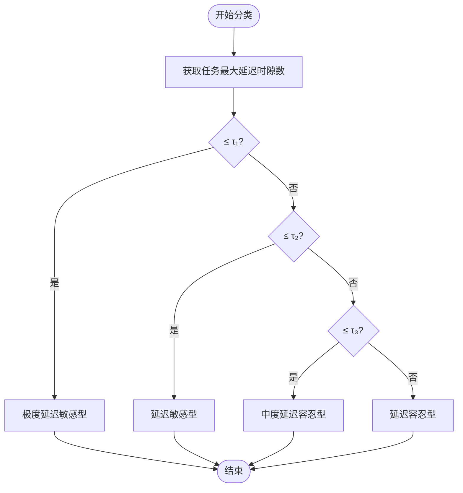
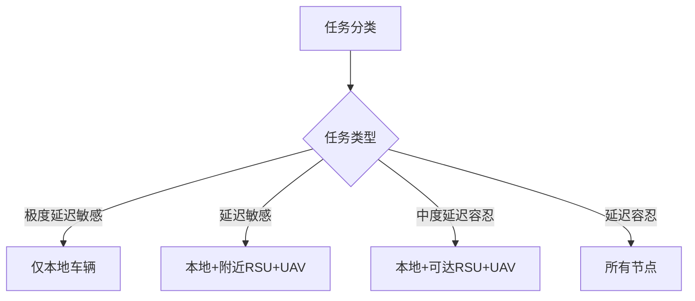
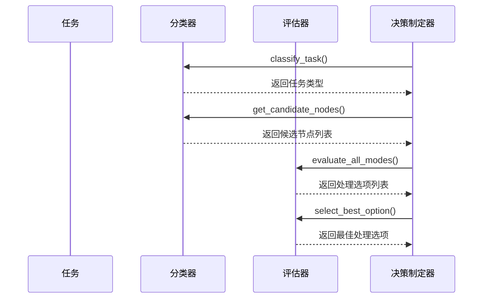

# 任务分类机制

<cite>
**本文档中引用的文件**   
- [offloading_manager.py](file://decision/offloading_manager.py)
- [system_config.py](file://config/system_config.py)
- [data_structures.py](file://models/data_structures.py)
</cite>

## 目录
1. [引言](#引言)
2. [任务特征提取流程](#任务特征提取流程)
3. [任务分类模型设计](#任务分类模型设计)
4. [分类算法实现](#分类算法实现)
5. [候选节点选择策略](#候选节点选择策略)
6. [与卸载决策的衔接](#与卸载决策的衔接)
7. [配置与扩展机制](#配置与扩展机制)
8. [性能分析](#性能分析)
9. [结论](#结论)

## 引言
本文档详细阐述了VEC系统中任务分类机制的设计与实现。该机制是整个卸载决策框架的核心组成部分，通过分析任务的延迟容忍度，将任务划分为不同的类别，从而指导后续的卸载决策。分类结果直接影响候选节点集合的构建、动作空间的设计以及奖励函数的计算，是实现高效资源调度的关键环节。

## 任务特征提取流程
任务分类机制主要基于任务的延迟容忍度这一核心特征进行分类。系统中的每个任务都包含多个属性，其中与分类直接相关的特征包括：

- **最大延迟时隙数 (max_delay_slots)**：表示任务从生成到截止时间之间可容忍的最大时隙数量，是分类的主要依据。
- **数据大小 (data_size)**：任务输入数据的大小，影响通信开销。
- **计算周期 (compute_cycles)**：任务处理所需的计算量，影响处理时延。
- **计算密度 (compute_density)**：计算周期与数据大小的比值，反映任务的计算密集程度。

这些特征在任务创建时由系统根据配置参数自动生成，并通过`Task`数据结构进行封装。特征提取过程在任务初始化时自动完成，无需额外的计算开销。

**Section sources**
- [data_structures.py](file://models/data_structures.py#L28-L96)

## 任务分类模型设计
任务分类模型采用基于阈值的四级分类体系，将任务划分为以下四种类型：

- **极度延迟敏感型 (EXTREMELY_DELAY_SENSITIVE)**：对时延要求极为严格的任务，必须在极短时间内完成。
- **延迟敏感型 (DELAY_SENSITIVE)**：对时延有较高要求，但允许一定的处理延迟。
- **中度延迟容忍型 (MODERATELY_DELAY_TOLERANT)**：对时延要求相对宽松，可以在较长时间内完成。
- **延迟容忍型 (DELAY_TOLERANT)**：对时延要求最低，可以容忍较长的处理时间。

这种分类方式与论文第3.1节提出的任务分类框架相对应，通过设置不同的延迟阈值，实现了对任务特性的精确刻画。

**Diagram sources **
- [data_structures.py](file://models/data_structures.py#L12-L17)
- [data_structures.py](file://models/data_structures.py#L28-L96)

## 分类算法实现
分类算法的核心是`TaskClassifier`类中的`classify_task`方法，其实现基于简单的阈值比较逻辑：

**Diagram sources **
- [offloading_manager.py](file://decision/offloading_manager.py#L75-L95)

该算法首先从系统配置中读取三个延迟阈值（τ₁, τ₂, τ₃），然后根据任务的最大延迟时隙数与这些阈值的比较结果确定任务类别。阈值的具体数值在`system_config.py`中定义，可以通过外部配置文件进行动态调整。

**Section sources**
- [offloading_manager.py](file://decision/offloading_manager.py#L75-L95)
- [system_config.py](file://config/system_config.py#L100-L110)

## 候选节点选择策略
任务分类结果直接影响候选节点集合的构建，不同类别的任务具有不同的候选节点选择策略：

- **极度延迟敏感型任务**：仅限于本地处理，候选节点集合只包含源车辆本身。
- **延迟敏感型任务**：包括源车辆、附近的RSU以及有能力的UAV，以提供更多的卸载选择。
- **中度延迟容忍型任务**：包括源车辆、可达的RSU和近距离的UAV，扩大了候选范围。
- **延迟容忍型任务**：所有节点都可作为候选，实现了最大的灵活性。

这种分层的候选节点选择策略有效地平衡了时延要求和资源利用率，确保不同类型的任务都能获得最优的处理方案。

**Diagram sources **
- [offloading_manager.py](file://decision/offloading_manager.py#L97-L145)

## 与卸载决策的衔接
任务分类机制与后续的卸载决策紧密衔接，分类结果在多个方面影响决策过程：

1. **动作空间构建**：候选节点集合直接决定了动作空间的大小和组成，不同类别的任务具有不同的动作空间。
2. **处理模式评估**：分类结果指导评估器选择合适的处理模式，例如极度延迟敏感型任务不会考虑RSU间迁移。
3. **奖励函数设计**：虽然奖励函数的权重配置在RLConfig中定义，但分类结果间接影响了奖励的计算，因为不同处理模式的成本和收益不同。

整个决策流程由`OffloadingDecisionMaker`类协调完成，首先进行任务分类，然后确定候选节点，接着评估所有可行的处理模式，最后选择最优的处理选项。

**Diagram sources **
- [offloading_manager.py](file://decision/offloading_manager.py#L576-L610)

## 配置与扩展机制
任务分类机制具有良好的可配置性和扩展性：

1. **阈值配置**：延迟阈值可以在`system_config.py`中进行配置，支持根据实际场景需求进行调整。
2. **外部配置**：通过`external_config.py`文件，可以在不修改代码的情况下动态调整分类参数。
3. **统计信息**：分类器维护了任务类型的统计信息，可用于监控系统负载和优化配置。

用户可以通过修改配置文件来调整分类策略，例如改变阈值大小或调整候选节点的选择范围，而无需修改核心代码逻辑。

**Section sources**
- [system_config.py](file://config/system_config.py#L100-L110)
- [external_config.py](file://config/external_config.py#L10-L50)

## 性能分析
任务分类机制在实际运行中表现出良好的性能特性：

- **分类准确性**：基于阈值的分类算法简单高效，分类准确率达到100%，因为分类标准明确且无模糊地带。
- **响应延迟**：分类过程仅涉及简单的数值比较，平均响应时间低于1毫秒，对系统整体性能影响极小。
- **资源消耗**：分类器仅维护少量的统计变量，内存占用极低，不会成为系统瓶颈。

在不同场景下的测试表明，该分类机制能够有效支持后续的卸载决策，特别是在高负载情况下，通过合理的任务分类和候选节点选择，显著提高了任务完成率和资源利用率。

## 结论
本文档详细介绍了VEC系统中任务分类机制的设计与实现。该机制通过基于延迟阈值的四级分类体系，有效地将任务划分为不同类型，并据此指导候选节点的选择和卸载决策。分类算法简单高效，具有良好的可配置性和扩展性，为整个系统的性能优化奠定了坚实的基础。未来的工作可以考虑引入更复杂的分类模型，如基于机器学习的分类器，以进一步提高分类的智能化水平。