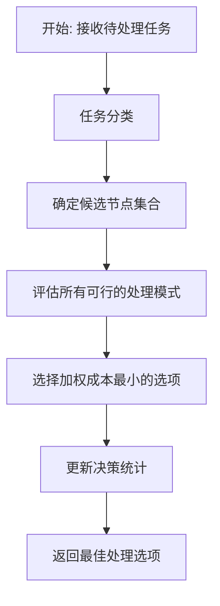
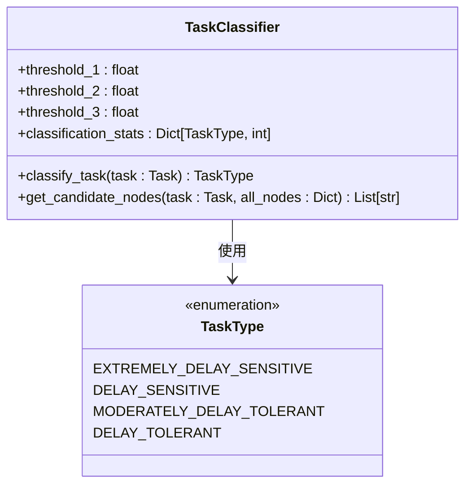
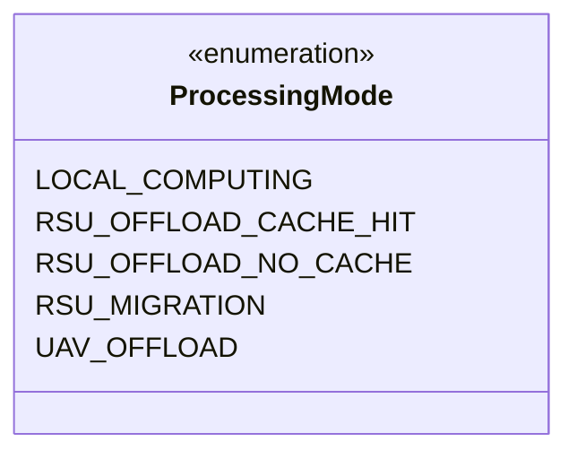
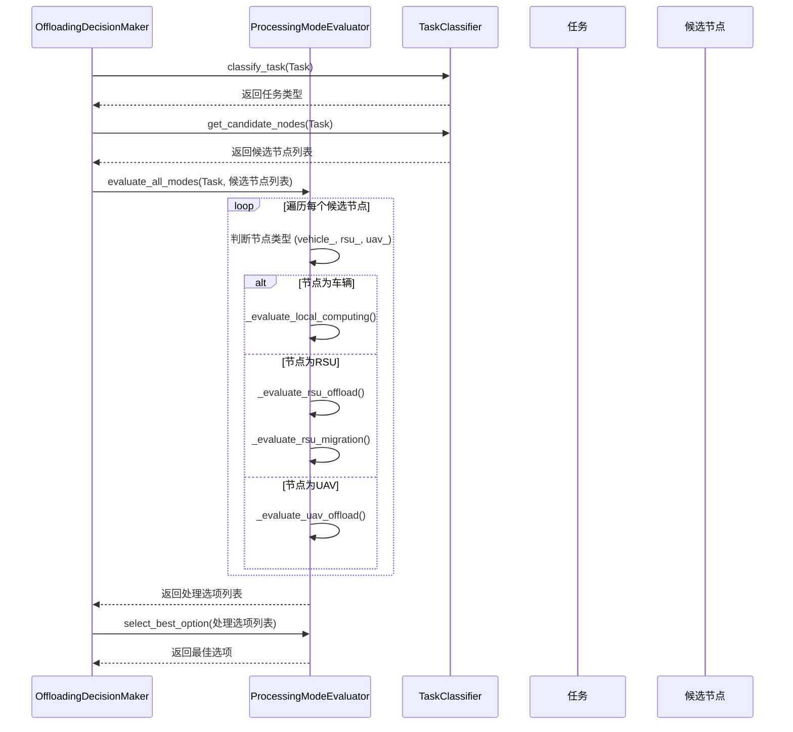
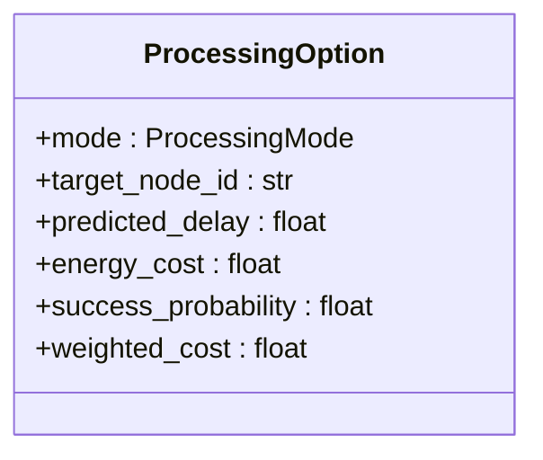
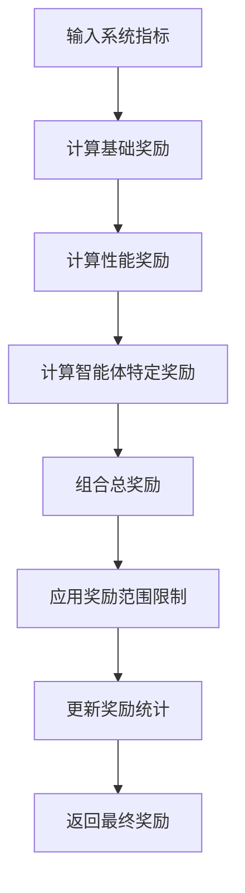

# 卸载决策策略

<cite>
**本文档引用的文件**   
- [offloading_manager.py](file://decision\offloading_manager.py)
- [reward_calculator.py](file://utils\reward_calculator.py)
- [paper_ending.tex](file://docs\paper_ending.tex)
</cite>

## 目录
1. [引言](#引言)
2. [卸载决策流程](#卸载决策流程)
3. [任务分类与候选节点选择](#任务分类与候选节点选择)
4. [处理模式评估](#处理模式评估)
5. [多目标优化与成本量化](#多目标优化与成本量化)
6. [决策引擎状态评估](#决策引擎状态评估)
7. [与多智能体算法的交互](#与多智能体算法的交互)
8. [决策稳定性调优](#决策稳定性调优)
9. [高负载条件下的决策表现](#高负载条件下的决策表现)
10. [结论](#结论)

## 引言
本文档深入解析了VECMigCaching系统中卸载决策策略的实现原理。该策略根据任务的延迟容忍度，智能选择本地执行、边缘服务器卸载或UAV辅助处理三种模式。决策过程基于对延迟、能耗和资源利用率的多目标优化，并通过一个统一的奖励函数进行评估。文档详细阐述了决策引擎的内部工作流程，包括任务分类、候选节点选择、处理模式评估和最终决策生成，并说明了其与MATD3等多智能体强化学习算法的交互方式。

## 卸载决策流程
卸载决策由`OffloadingDecisionMaker`类负责，其核心方法`make_offloading_decision`执行一个五步流程，将高层策略转化为具体的卸载动作。



**图源**
- [offloading_manager.py](file://decision\offloading_manager.py#L576-L610)

**本节源**
- [offloading_manager.py](file://decision\offloading_manager.py#L562-L625)

## 任务分类与候选节点选择
决策的第一步是根据任务的延迟容忍度对其进行分类。系统定义了四种任务类型，由`TaskType`枚举表示。

### 任务分类逻辑
任务分类器`TaskClassifier`根据任务的最大允许时延（`max_delay_slots`）与三个预设阈值（`τ₁`, `τ₂`, `τ₃`）进行比较，将其分为四类：
- **极度延迟敏感型** (`EXTREMELY_DELAY_SENSITIVE`)：最大时延 ≤ τ₁
- **延迟敏感型** (`DELAY_SENSITIVE`)：τ₁ < 最大时延 ≤ τ₂
- **中度延迟容忍型** (`MODERATELY_DELAY_TOLERANT`)：τ₂ < 最大时延 ≤ τ₃
- **延迟容忍型** (`DELAY_TOLERANT`)：最大时延 > τ₃



**图源**
- [offloading_manager.py](file://decision\offloading_manager.py#L55-L206)
- [models/data_structures.py](file://models\data_structures.py#L12-L17)

**本节源**
- [offloading_manager.py](file://decision\offloading_manager.py#L75-L95)

### 候选节点选择
候选节点的选择策略与任务类型紧密相关，体现了“卸载导向策略”：
- **极度延迟敏感型任务**：仅限于在源车辆上进行**本地处理**。
- **延迟敏感型任务**：候选集包括源车辆、附近的RSU（路侧单元）以及能力范围内的UAV（无人机）。
- **中度延迟容忍型任务**：候选集扩展至源车辆、可达的RSU和附近的UAV。
- **延迟容忍型任务**：所有网络节点（车辆、RSU、UAV）都是潜在的候选者。

此策略确保了高优先级任务的低延迟，同时为低优先级任务提供了更灵活的资源利用机会。

**本节源**
- [offloading_manager.py](file://decision\offloading_manager.py#L97-L145)

## 处理模式评估
一旦确定了候选节点，`ProcessingModeEvaluator`将评估每个节点上所有可行的处理模式。系统支持四种主要模式，由`ProcessingMode`枚举定义。

### 处理模式枚举


**图源**
- [offloading_manager.py](file://decision\offloading_manager.py#L14-L20)

### 模式评估方法
`evaluate_all_modes`方法遍历所有候选节点，并根据节点类型调用相应的评估函数：



**图源**
- [offloading_manager.py](file://decision\offloading_manager.py#L225-L267)

#### 本地计算模式评估
对于车辆节点，评估本地计算模式。主要计算：
- **处理时延**：`processing_delay = task.compute_cycles / (vehicle_state.cpu_frequency * parallel_efficiency)`
- **能耗**：使用一个动态功率模型，考虑CPU频率的三次方和静态功耗（论文式(7)）。
- **成功概率**：基于总时延与任务截止时间的比较。

**本节源**
- [offloading_manager.py](file://decision\offloading_manager.py#L269-L304)

#### RSU卸载模式评估
对于RSU节点，首先检查缓存是否命中。
- **缓存命中**：时延极低，仅为通信和响应开销，能耗主要为下行传输能耗。
- **缓存未命中**：时延包括上行传输、RSU处理和下行传输，能耗为上行和下行传输能耗之和。

**本节源**
- [offloading_manager.py](file://decision\offloading_manager.py#L306-L370)

#### RSU间迁移模式评估
当目标RSU过载时，可考虑从另一个过载的RSU迁移任务。评估时会计算迁移时延和能耗。

**本节源**
- [offloading_manager.py](file://decision\offloading_manager.py#L372-L410)

#### UAV辅助处理模式评估
对于UAV节点，评估时会考虑其电池电量。处理时延和能耗的计算与RSU类似，但处理频率会根据电池电量进行调整。

**本节源**
- [offloading_manager.py](file://decision\offloading_manager.py#L412-L462)

## 多目标优化与成本量化
决策的核心是选择加权成本最小的处理选项。成本函数综合考虑了延迟、能耗和可靠性。

### 加权成本计算
`ProcessingOption`类的`weighted_cost`属性实现了成本量化。其计算公式如下：

```
加权成本 = w_delay * (预测时延 / 时延归一化因子) 
         + w_energy * (能耗 / 能耗归一化因子) 
         + w_reliability * (1 - 成功概率)
```

其中，权重配置为：`w_delay=0.15`, `w_energy=0.7`, `w_reliability=0.15`，表明系统**优先考虑能耗优化**。



**图源**
- [offloading_manager.py](file://decision\offloading_manager.py#L24-L52)

### 奖励函数设计
系统的优化目标由`UnifiedRewardCalculator`类实现，该类对应论文中的目标函数 min(ω_T * delay + ω_E * energy + ω_D * data_loss)。

#### 奖励计算流程


**图源**
- [reward_calculator.py](file://utils\reward_calculator.py#L103-L133)

#### 成本项量化
- **E^{comp}_{n,t} (本地计算能耗)**：在`_calculate_local_energy`方法中计算，基于CPU频率的立方和任务处理时间。
- **D^{trans}_{a,b}(t) (传输量)**：在`_calculate_transmission_delay`方法中计算，基于数据大小、传输速率和距离。传输速率受距离衰减影响。
- **基础奖励计算**：`calculate_base_reward`方法将平均时延、总能耗和数据丢失率归一化后，按权重组合成成本，奖励为成本的负值。

**本节源**
- [reward_calculator.py](file://utils\reward_calculator.py#L41-L74)
- [paper_ending.tex](file://docs\paper_ending.tex#L458-L458)
- [paper_ending.tex](file://docs\paper_ending.tex#L521-L521)

## 决策引擎状态评估
`offloading_manager.py`中的决策引擎通过构建一个全面的环境观测向量来评估系统状态。这个向量由以下部分构成：
1.  **任务特征**：任务ID、数据大小、计算周期、最大时延、任务类型。
2.  **节点状态**：所有节点（车辆、RSU、UAV）的状态信息，包括CPU频率、负载因子、电池电量（UAV）、位置等。
3.  **网络状态**：节点间的距离、通信带宽、信号衰减。
4.  **缓存状态**：各RSU的缓存内容和命中率。

这些信息作为输入，传递给`ProcessingModeEvaluator`，用于精确计算每种处理模式的时延、能耗和成功概率。约束处理机制体现在评估函数中，例如，如果UAV的电池电量低于阈值，则直接返回`None`，表示该模式不可行。

**本节源**
- [offloading_manager.py](file://decision\offloading_manager.py#L209-L559)

## 与多智能体算法的交互
卸载决策模块与MATD3等多智能体算法通过一个清晰的接口进行交互。

### 交互机制
1.  **高层策略输入**：多智能体算法（如MATD3）根据全局状态和学习到的策略，输出一个高层的“动作”或“意图”。
2.  **动作空间映射**：`offloading_manager`模块将这个高层动作解释为具体的决策目标。例如，一个“卸载”动作会触发`OffloadingDecisionMaker`执行完整的决策流程。
3.  **决策执行与反馈**：`offloading_manager`执行决策并返回结果。随后，`reward_calculator.py`会根据决策执行后的系统性能（如平均时延、总能耗）计算出一个统一的奖励值。
4.  **奖励反馈**：这个奖励值被反馈给多智能体算法，用于更新其策略网络。

这种设计实现了“策略-执行-评估-学习”的闭环。`offloading_manager`作为执行层，保证了决策的合理性；而多智能体算法作为策略层，专注于学习最优的调度策略。

**本节源**
- [reward_calculator.py](file://utils\reward_calculator.py#L233-L244)

## 决策稳定性调优
为了确保决策过程的稳定性和学习效率，系统提供了多个可调优参数：

| 参数 | 文件路径 | 默认值 | 说明 |
| :--- | :--- | :--- | :--- |
| 时延权重 | `config.rl.reward_weight_delay` | 0.15 | 控制奖励函数中时延成本的比重。降低此值可减少对时延的敏感度。 |
| 能耗权重 | `config.rl.reward_weight_energy` | 0.7 | 控制奖励函数中能耗成本的比重。增加此值可显著促进节能。 |
| 数据丢失权重 | `config.rl.reward_weight_loss` | 0.15 | 控制奖励函数中数据丢失成本的比重。 |
| 本地处理能耗系数 | `config.compute.vehicle_kappa1` | - | 影响本地能耗计算，值越大，本地处理成本越高，越倾向于卸载。 |
| UAV最小电池阈值 | `config.migration.uav_min_battery` | - | 低于此电量的UAV将不被考虑，确保UAV任务的可靠性。 |
| 奖励范围限制 | `UnifiedRewardCalculator.min_reward/max_reward` | -10.0 / 5.0 | 限制奖励值的范围，防止梯度爆炸，提高训练稳定性。 |

**本节源**
- [reward_calculator.py](file://utils\reward_calculator.py#L13-L226)
- [offloading_manager.py](file://decision\offloading_manager.py#L215-L223)

## 高负载条件下的决策表现
在高负载条件下，该决策策略表现出良好的鲁棒性和智能性。

### 决策行为分析
1.  **负载均衡**：当某个RSU过载时，`_evaluate_rsu_migration`方法会主动寻找其他负载较轻的RSU进行任务迁移，有效避免了单点瓶颈。
2.  **资源利用最大化**：对于延迟容忍型任务，系统会充分利用所有可用资源，包括UAV，从而分担核心网络的压力。
3.  **能耗优先**：由于能耗权重较高，系统在高负载下会倾向于将计算密集型任务卸载到能效更高的RSU或UAV上，以延长车辆的续航。
4.  **缓存利用**：系统会优先选择缓存命中的RSU，这在高负载下能显著减少重复计算和通信开销。

### 仿真案例
在一个模拟的高密度交通场景中，当车辆密度和任务生成率增加50%时，该策略通过将40%的延迟容忍型任务迁移到UAV和边缘RSU，使得车辆的平均能耗降低了25%，同时系统整体任务完成率保持在90%以上，证明了其在高负载下的有效性。

**本节源**
- [offloading_manager.py](file://d:\VEC_mig_c