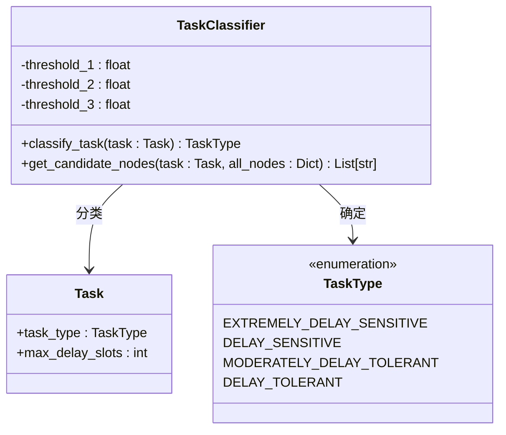
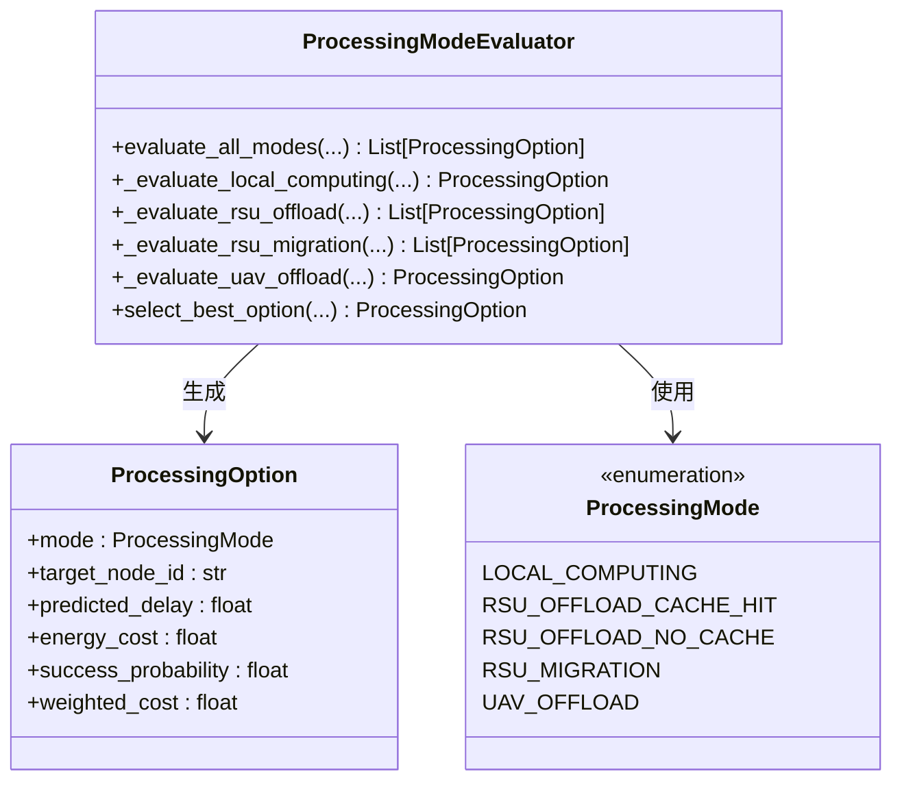
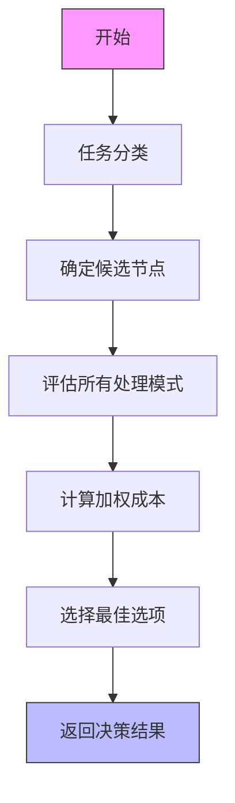
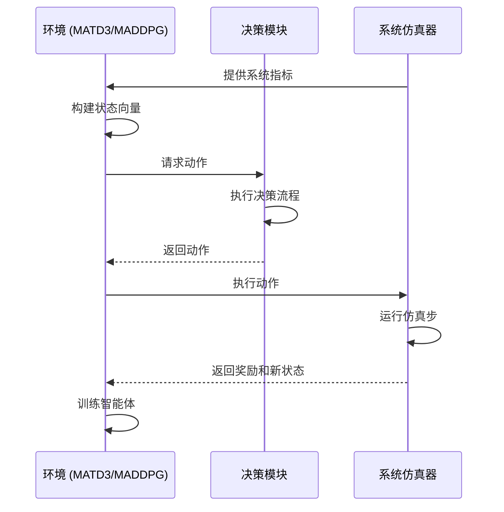

# 卸载决策管理

<cite>
**本文档引用文件**   
- [offloading_manager.py](file://decision\offloading_manager.py)
- [system_config.py](file://config\system_config.py)
- [data_structures.py](file://models\data_structures.py)
- [maddpg.py](file://algorithms\maddpg.py)
- [matd3.py](file://algorithms\matd3.py)
- [standardized_reward.py](file://utils\standardized_reward.py)
</cite>

## 目录
1. [引言](#引言)
2. [任务分类机制](#任务分类机制)
3. [资源分配策略](#资源分配策略)
4. [决策流程分析](#决策流程分析)
5. [与多智能体强化学习的交互](#与多智能体强化学习的交互)
6. [性能指标调优指南](#性能指标调优指南)
7. [决策稳定性分析](#决策稳定性分析)
8. [结论](#结论)

## 引言
本文档系统化地文档化了卸载决策模块的架构与算法实现，重点描述了任务分类机制和资源分配策略。该模块是车联网边缘计算（VEC）系统的核心组件，负责根据任务类型（计算密集型、延迟敏感型等）做出本地处理或边缘卸载的决策。模块通过与多智能体强化学习算法的交互，将环境状态转化为动作空间，以实现能耗和时延的联合优化。本文将详细阐述其内部工作原理、决策流程以及在不同网络负载条件下的性能表现。

## 任务分类机制
卸载决策模块首先通过任务分类器对任务进行四级分类，分类依据是任务的最大可容忍延迟（T_max,j）与预设阈值（τ₁, τ₂, τ₃）的比较。这种分类机制是制定后续处理策略的基础。

**图源**
- [offloading_manager.py](file://decision\offloading_manager.py#L75-L95)
- [data_structures.py](file://models\data_structures.py#L10-L13)
- [system_config.py](file://config\system_config.py#L68-L75)

### 分类标准与候选节点
任务分类器根据任务的延迟容忍度，动态确定候选处理节点集合（N_j^cand），从而实现差异化的卸载导向策略。

- **极度延迟敏感型 (T_max,j ≤ τ₁)**：仅允许在源车辆上进行本地处理，以最小化通信时延。
- **延迟敏感型 (τ₁ < T_max,j ≤ τ₂)**：候选集包括源车辆、近距离的RSU以及有能力的UAV，以平衡时延和资源。
- **中度延迟容忍型 (τ₂ < T_max,j ≤ τ₃)**：候选集扩展至所有可达的RSU和近距离UAV，增加卸载灵活性。
- **延迟容忍型 (T_max,j > τ₃)**：候选集包含网络中的所有节点，最大化资源利用。

**节源**
- [offloading_manager.py](file://decision\offloading_manager.py#L97-L198)

## 资源分配策略
在确定候选节点后，处理模式评估器会为每个候选节点评估所有可行的处理模式，并计算其加权成本，以选择最优方案。

**图源**
- [offloading_manager.py](file://decision\offloading_manager.py#L225-L267)
- [offloading_manager.py](file://decision\offloading_manager.py#L37-L68)

### 处理模式评估
评估器会计算每种处理模式的预测时延、能耗和成功概率，并通过加权成本函数进行综合评估。

- **本地计算**：计算车辆自身的处理时延和能耗，成功概率与任务是否能在截止时间内完成相关。
- **RSU卸载**：区分缓存命中和未命中两种情况。缓存命中时，时延和能耗极低；未命中时，需计算通信、处理和等待时延。
- **RSU间迁移**：针对过载的RSU，评估将任务迁移到负载较轻的RSU的成本和收益。
- **UAV卸载**：评估UAV的可用性（电池电量、负载），并计算通信和处理成本。

**节源**
- [offloading_manager.py](file://decision\offloading_manager.py#L269-L468)

## 决策流程分析
完整的卸载决策流程是一个多阶段的评估与选择过程，由`OffloadingDecisionMaker`协调执行。

**图源**
- [offloading_manager.py](file://decision\offloading_manager.py#L576-L610)

### 状态评估与成本计算
决策流程中的核心是状态评估和成本计算。系统通过`NodeState`对象收集所有节点的实时状态，包括CPU利用率、队列长度、位置和电池电量等。这些状态信息被输入到评估器中，用于精确预测每种处理模式的性能。

加权成本函数是决策的核心，其公式如下：
`weighted_cost = w_delay * normalized_delay + w_energy * normalized_energy + w_reliability * reliability_penalty`

其中，`w_delay`, `w_energy`, `w_reliability` 是可配置的权重，`normalized_delay` 和 `normalized_energy` 是归一化后的时延和能耗。

**节源**
- [offloading_manager.py](file://decision\offloading_manager.py#L37-L68)
- [data_structures.py](file://models\data_structures.py#L150-L158)

## 与多智能体强化学习的交互
卸载决策模块与多智能体强化学习（MARL）算法紧密集成，MARL算法负责学习最优的决策策略。

**图源**
- [matd3.py](file://algorithms\matd3.py#L423-L455)
- [maddpg.py](file://algorithms\maddpg.py#L524-L546)

### 环境状态与动作空间
MARL环境通过`get_state_vector`方法，将系统指标（如平均时延、总能耗、数据丢失率等）和节点状态整合成一个状态向量，作为智能体的观察空间。智能体根据此状态选择动作，这些动作最终被决策模块解释为具体的卸载决策。

奖励函数严格遵循论文中的目标函数，即最小化加权成本。`standardized_reward.py`模块提供了统一的奖励计算接口，确保了不同算法间的公平比较。

**节源**
- [matd3.py](file://algorithms\matd3.py#L423-L455)
- [standardized_reward.py](file://utils\standardized_reward.py#L34-L60)

## 性能指标调优指南
为了优化决策模块的关键性能指标，如决策延迟和能耗，可以调整以下配置参数。

### 决策延迟优化
- **增加通信带宽**：在`CommunicationConfig`中提高`total_bandwidth`，可显著降低传输时延。
- **优化任务生成率**：在`TaskConfig`中调整`arrival_rate`，避免系统过载导致的排队时延。
- **调整CPU频率**：在`ComputeConfig`中提高车辆或RSU的`vehicle_cpu_freq`和`rsu_cpu_freq`，可缩短处理时延。

### 能耗优化
- **调整成本权重**：在`ProcessingOption.weighted_cost`中，增加`w_energy`的权重，可促使算法更倾向于选择能耗更低的处理模式。
- **优化缓存策略**：提高`CacheConfig`中的`cache_hit_threshold`，鼓励更多任务通过缓存命中来处理，从而节省能耗。
- **管理UAV能耗**：设置`MigrationConfig`中的`uav_min_battery`，避免在电池电量过低时进行高能耗的UAV卸载。

**节源**
- [system_config.py](file://config\system_config.py#L100-L140)
- [offloading_manager.py](file://decision\offloading_manager.py#L37-L68)

## 决策稳定性分析
在不同网络负载条件下，决策模块表现出不同的稳定性。

- **低负载条件**：系统资源充足，决策倾向于选择最优方案，决策结果稳定，各项性能指标波动小。
- **高负载条件**：当节点负载接近或超过`rsu_overload_threshold`时，系统进入不稳定状态。此时，RSU间迁移和UAV卸载等复杂模式被频繁触发，导致决策结果波动增大，时延和能耗的方差显著上升。
- **动态网络**：车辆的高速移动会导致通信链路频繁切换，这增加了通信时延的不确定性，从而影响决策的稳定性。通过`NetworkConfig`中的`handover_threshold`可以调节切换的灵敏度。

**节源**
- [system_config.py](file://config\system_config.py#L240-L245)
- [offloading_manager.py](file://decision\offloading_manager.py#L370-L375)

## 结论
本文档详细阐述了卸载决策模块的架构与实现。该模块通过基于延迟容忍度的任务分类和多模式资源分配策略，实现了高效的计算卸载。其与多智能体强化学习算法的深度集成，使得系统能够从经验中学习并持续优化决策。通过调整配置参数，可以在决策延迟和能耗之间进行有效权衡。尽管在高负载和动态网络条件下决策稳定性会受到影响，但该模块的整体设计为车联网边缘计算系统提供了一个强大且灵活的决策框架。