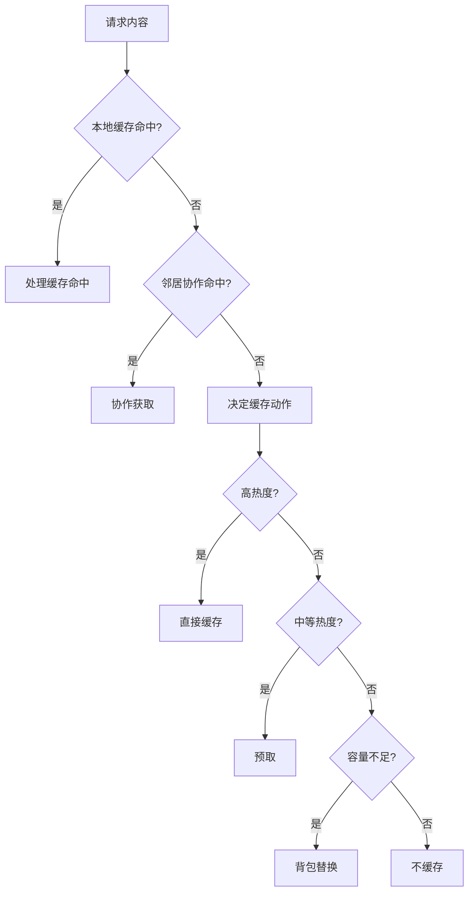
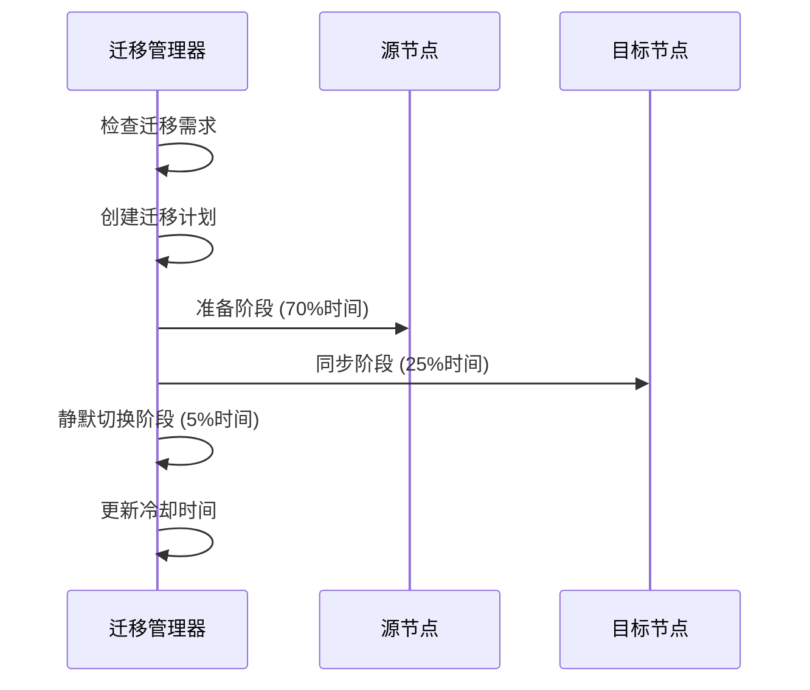
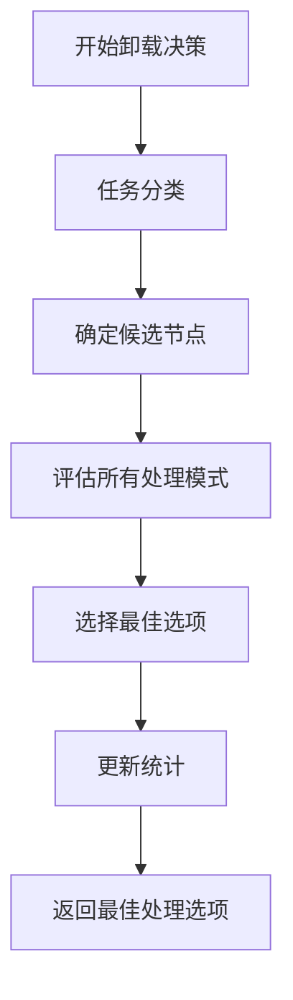
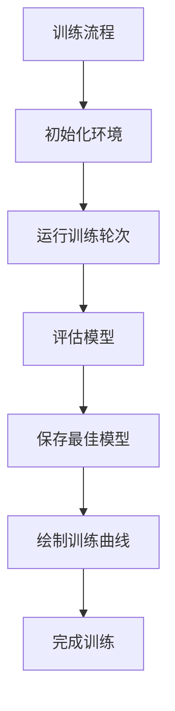

# 核心服务模块

<cite>
**本文档引用的文件**   
- [cache_manager.py](file://caching/cache_manager.py)
- [migration_manager.py](file://migration/migration_manager.py)
- [offloading_manager.py](file://decision/offloading_manager.py)
</cite>

## 目录
1. [引言](#引言)
2. [缓存管理服务](#缓存管理服务)
3. [迁移管理服务](#迁移管理服务)
4. [卸载决策服务](#卸载决策服务)
5. [服务协作与训练流程](#服务协作与训练流程)
6. [结论](#结论)

## 引言
本文档全面文档化系统中的三大核心服务组件：缓存管理、迁移管理和卸载决策。这些服务模块共同构成了一个智能的边缘计算系统，旨在优化任务处理效率、资源利用率和系统性能。文档将详细解释每个服务在整体系统中的角色和责任，深入分析其内部实现机制，并阐述它们之间的协作关系。

## 缓存管理服务

缓存管理服务负责实现智能的缓存策略，以最大化缓存命中率并优化资源使用。该服务的核心是`CollaborativeCacheManager`类，它实现了多种缓存替换策略，包括LRU（最近最少使用）、LFU（最不经常使用）、FIFO（先进先出）和混合策略。

### LRU/LFU策略实现
缓存管理器根据配置选择相应的替换策略。当使用LRU策略时，系统会根据内容的最后访问时间来决定替换顺序，最近最少使用的项目将被优先移除。对于LFU策略，系统则根据内容的访问频率进行替换，访问次数最少的项目将被移除。混合策略综合考虑了访问频率、最近性和缓存价值，通过计算一个综合分数来决定替换顺序。

**Section sources**
- [cache_manager.py](file://caching/cache_manager.py#L150-L197)

### 协作缓存与背包优化
除了基本的替换策略，缓存管理器还实现了协作缓存和背包优化算法。协作缓存允许节点之间共享缓存状态，当本地缓存未命中时，可以检查邻居节点的缓存状态，从而提高整体命中率。背包优化算法在缓存容量不足时，通过贪心算法选择价值密度最低的项目进行替换，以最大化缓存的整体价值。

**Diagram sources **
- [cache_manager.py](file://caching/cache_manager.py#L199-L245)

## 迁移管理服务

迁移管理服务负责在系统过载或资源不足时，将任务从一个节点迁移到另一个节点，以平衡负载并提高系统稳定性。该服务的核心是`TaskMigrationManager`类，它实现了Keep-Before-Break机制，确保迁移过程中的服务连续性。

### Keep-Before-Break机制
Keep-Before-Break机制通过三个阶段完成迁移：准备阶段、同步阶段和静默切换阶段。在准备阶段，目标节点开始准备接收任务；在同步阶段，源节点和目标节点同步任务状态；在静默切换阶段，系统短暂中断，将任务从源节点切换到目标节点。这种机制最大限度地减少了迁移过程中的服务中断时间。

**Section sources**
- [migration_manager.py](file://migration/migration_manager.py#L174-L205)

### 迁移决策与执行
迁移管理器定期检查节点状态，当发现RSU过载或UAV电池电量不足时，会触发迁移计划。系统会寻找最佳的迁移目标，考虑目标节点的负载、电池电量和距离等因素。迁移计划创建后，系统会计算迁移成本、时延和成功概率，并执行迁移操作。

**Diagram sources **
- [migration_manager.py](file://migration/migration_manager.py#L66-L96)

## 卸载决策服务

卸载决策服务负责根据任务特性和系统状态，决定任务的最佳处理模式。该服务的核心是`OffloadingDecisionMaker`类，它整合了任务分类和处理模式评估功能。

### 任务分类与资源分配
卸载决策器首先根据任务的最大可容忍延迟对任务进行分类，分为极度延迟敏感型、延迟敏感型、中度延迟容忍型和延迟容忍型四类。然后，系统会确定候选节点集合，根据任务类型选择本地处理、RSU卸载、UAV卸载或任务迁移等不同处理模式。

**Section sources**
- [offloading_manager.py](file://decision/offloading_manager.py#L568-L574)

### 处理模式评估
系统会评估所有可行的处理模式，计算每种模式的加权成本，包括时延、能耗和可靠性等因素。最终，系统会选择加权成本最小的处理模式作为最佳决策。这种评估机制确保了任务处理的高效性和可靠性。

**Diagram sources **
- [offloading_manager.py](file://decision/offloading_manager.py#L576-L610)

## 服务协作与训练流程

三大核心服务模块在系统中紧密协作，共同完成任务处理和资源管理。训练和评估流程通过多智能体算法（如MATD3、MADDPG等）对这些服务进行优化，以提高系统整体性能。

### 服务协作关系
缓存管理器为卸载决策器提供缓存状态信息，帮助其评估RSU卸载模式的可行性。迁移管理器在RSU过载时触发任务迁移，卸载决策器则根据迁移计划调整任务处理策略。这种协作关系确保了系统在不同负载条件下的稳定运行。

**Section sources**
- [offloading_manager.py](file://decision/offloading_manager.py#L562-L625)
- [migration_manager.py](file://migration/migration_manager.py#L38-L251)
- [cache_manager.py](file://caching/cache_manager.py#L144-L527)

### 训练与评估流程
系统通过多智能体算法对核心服务进行训练，优化其决策策略。训练过程中，系统会模拟不同场景下的任务生成和处理，评估各服务的性能指标，如平均时延、总能耗和任务完成率。评估结果用于调整算法参数，进一步提升系统性能。

**Diagram sources **
- [train_multi_agent.py](file://train_multi_agent.py#L0-L1169)

## 结论
本文档详细介绍了系统中的三大核心服务模块：缓存管理、迁移管理和卸载决策。这些服务通过智能算法和协作机制，共同实现了高效的资源管理和任务处理。未来的工作可以进一步优化这些服务的决策策略，提高系统在复杂场景下的适应性和鲁棒性。