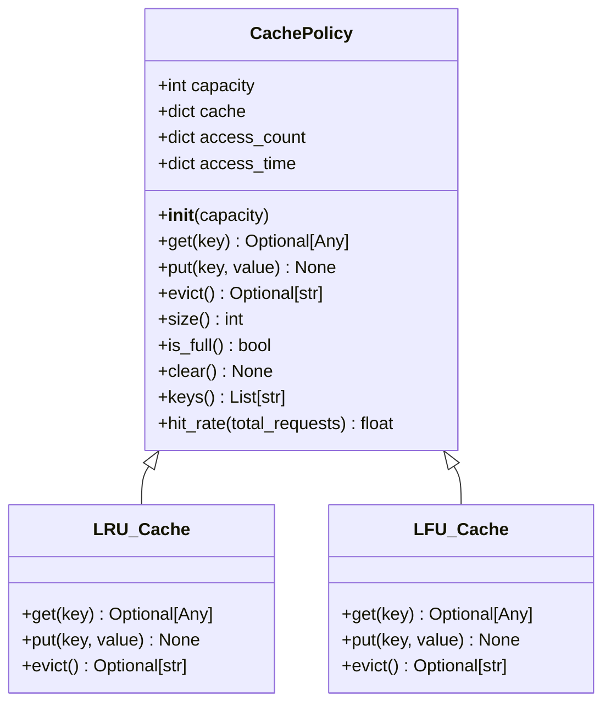
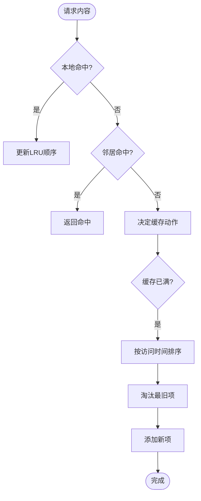
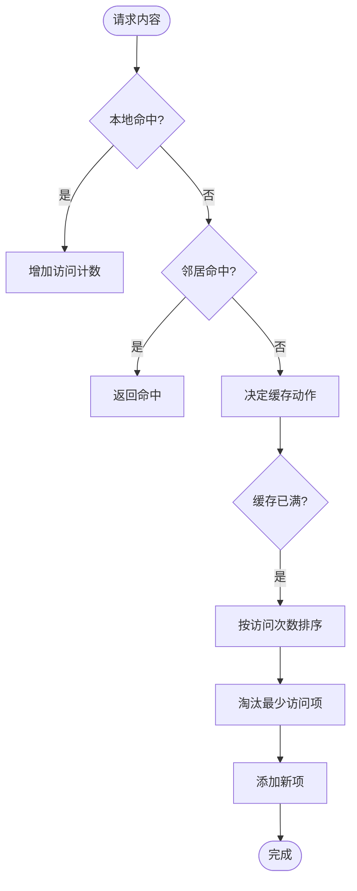
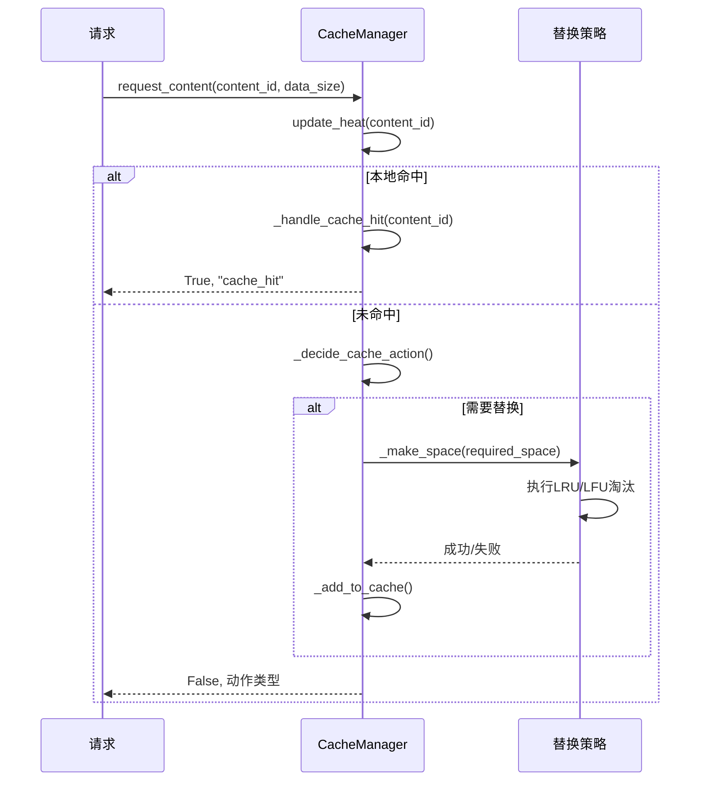
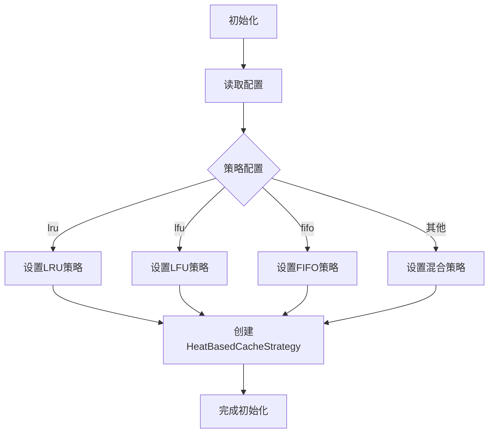
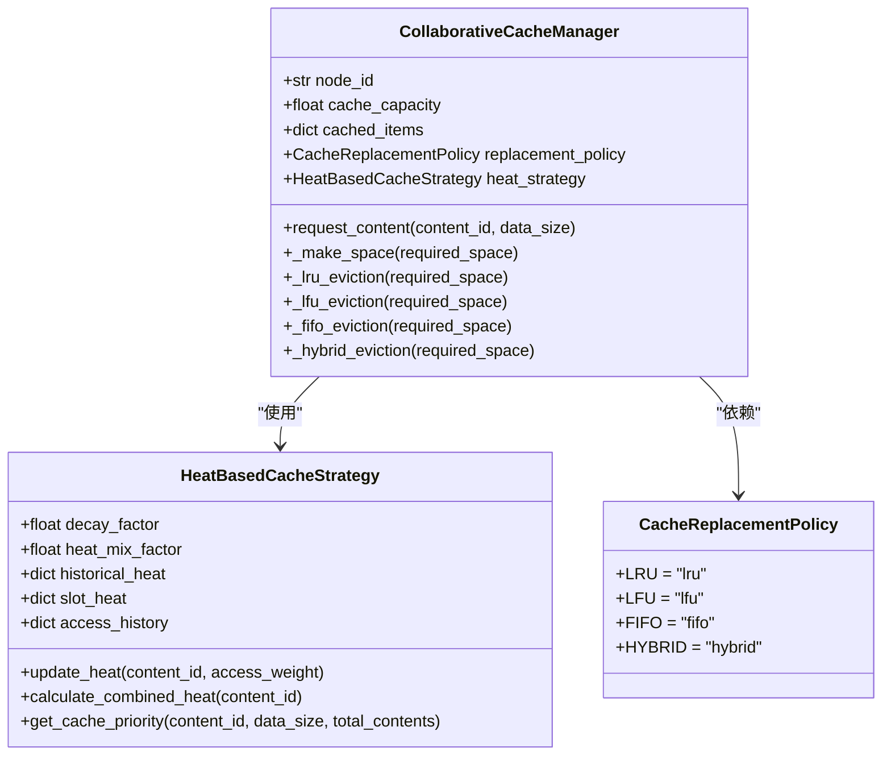
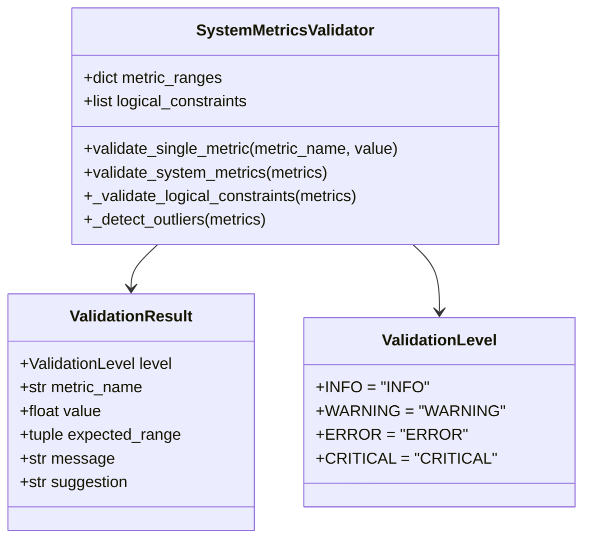
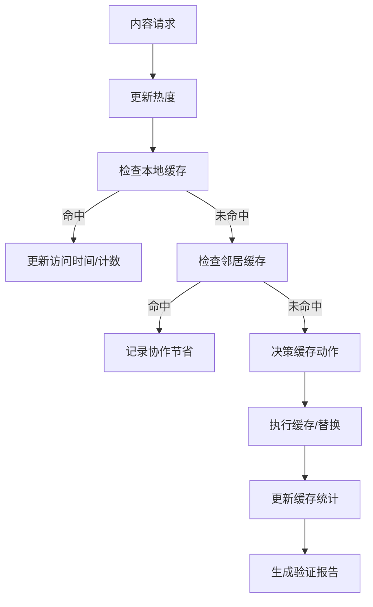
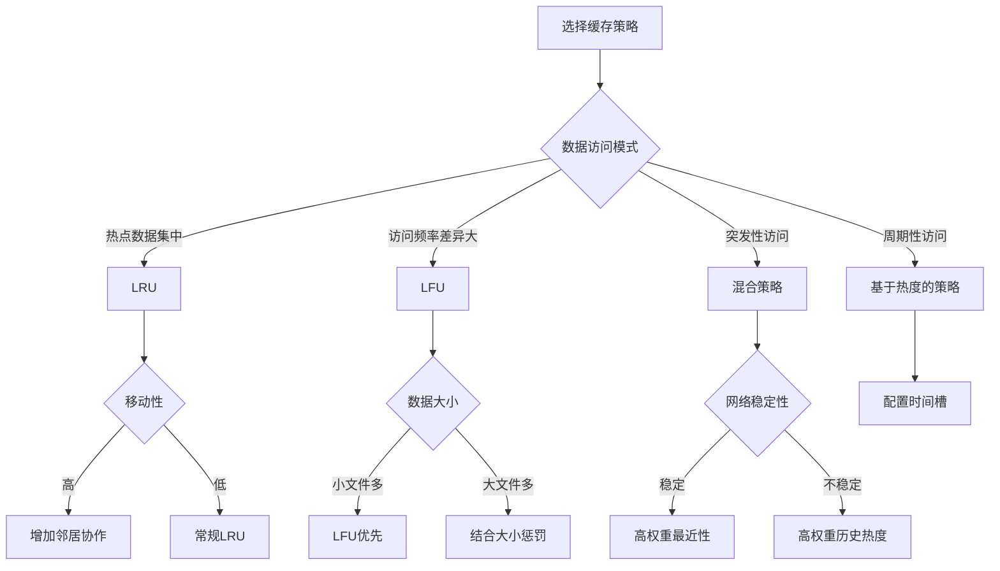
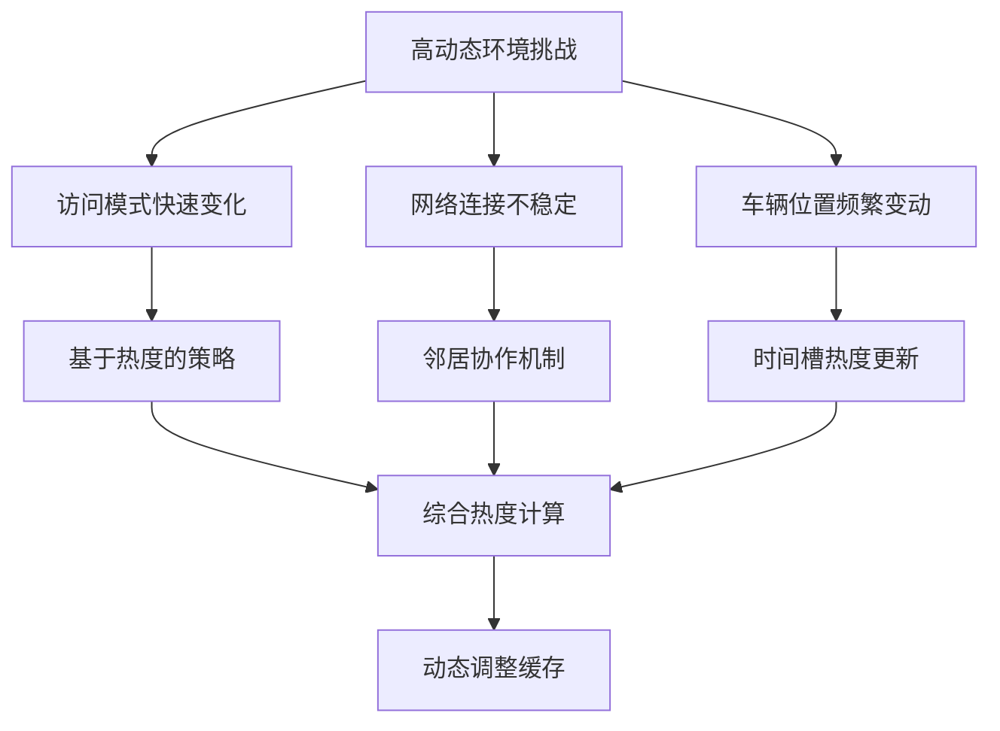

# 缓存策略实现

<cite>
**Referenced Files in This Document**   
- [cache_policy.py](file://caching/cache_policy.py)
- [cache_manager.py](file://caching/cache_manager.py)
- [data_validator.py](file://utils/data_validator.py)
</cite>

## 目录
1. [引言](#引言)
2. [核心组件](#核心组件)
3. [缓存策略抽象接口](#缓存策略抽象接口)
4. [LRU与LFU替换算法实现](#lru与lfu替换算法实现)
5. [缓存管理器与策略交互](#缓存管理器与策略交互)
6. [数据验证与完整性保障](#数据验证与完整性保障)
7. [车联网场景策略选择建议](#车联网场景策略选择建议)
8. [性能表现分析](#性能表现分析)
9. [结论](#结论)

## 引言
本文档详细阐述了车联网边缘计算环境下的缓存策略实现机制。系统采用基于热度的智能缓存策略，结合历史热度、时间槽热度和Zipf流行度分布，实现高效的内容缓存与管理。文档重点分析了LRU（最近最少使用）和LFU（最不经常使用）等核心缓存替换算法的实现细节，以及缓存策略与管理器之间的交互协议。同时，文档还介绍了数据验证机制如何确保缓存数据的完整性与有效性，并为不同车联网场景提供策略选择建议。

## 核心组件
系统的核心缓存组件包括缓存策略基类、协作缓存管理器和数据验证器。`CachePolicy`作为所有缓存策略的抽象基类，定义了统一的接口规范。`CollaborativeCacheManager`实现了复杂的缓存决策逻辑，支持邻居协作和背包优化算法。`SystemMetricsValidator`则负责验证系统指标的合理性，确保数据质量。

**Section sources**
- [cache_policy.py](file://caching/cache_policy.py#L8-L55)
- [cache_manager.py](file://caching/cache_manager.py#L144-L527)
- [data_validator.py](file://utils/data_validator.py#L120-L439)

## 缓存策略抽象接口
缓存策略通过抽象基类`CachePolicy`定义了统一的接口规范，确保不同策略间的互操作性和可替换性。

**Diagram sources**
- [cache_policy.py](file://caching/cache_policy.py#L8-L55)

**Section sources**
- [cache_policy.py](file://caching/cache_policy.py#L8-L55)

## LRU与LFU替换算法实现
系统实现了多种缓存替换算法，其中LRU和LFU是两种最核心的策略。

### LRU替换策略
LRU（Least Recently Used）策略基于“最近最少使用”原则，优先淘汰最长时间未被访问的缓存项。在`CollaborativeCacheManager`中，LRU策略通过按`last_access_time`排序缓存项来实现。

**Diagram sources**
- [cache_manager.py](file://caching/cache_manager.py#L388-L401)
- [cache_manager.py](file://caching/cache_manager.py#L247-L259)

### LFU替换策略
LFU（Least Frequently Used）策略基于“最不经常使用”原则，优先淘汰访问频率最低的缓存项。该策略通过按`access_count`对缓存项进行排序来实现。

**Diagram sources**
- [cache_manager.py](file://caching/cache_manager.py#L403-L416)
- [cache_manager.py](file://caching/cache_manager.py#L247-L259)

### 替换算法触发条件与优化
替换算法的触发条件主要由缓存容量和访问模式决定。当缓存已满且需要存储新内容时，系统会根据配置的策略调用相应的淘汰算法。

**Diagram sources**
- [cache_manager.py](file://caching/cache_manager.py#L199-L245)
- [cache_manager.py](file://caching/cache_manager.py#L377-L386)

**Section sources**
- [cache_manager.py](file://caching/cache_manager.py#L377-L431)

## 缓存管理器与策略交互
`CollaborativeCacheManager`作为核心协调者，负责管理缓存策略的配置、执行和监控。

### 策略配置与初始化
缓存管理器在初始化时根据配置文件动态选择替换策略，支持LRU、LFU、FIFO和混合策略。

**Diagram sources**
- [cache_manager.py](file://caching/cache_manager.py#L150-L197)

### 交互协议与数据流
缓存管理器与策略之间通过明确定义的方法进行交互，确保了松耦合和高内聚的设计原则。

**Diagram sources**
- [cache_manager.py](file://caching/cache_manager.py#L144-L527)
- [cache_manager.py](file://caching/cache_manager.py#L44-L141)

**Section sources**
- [cache_manager.py](file://caching/cache_manager.py#L144-L527)

## 数据验证与完整性保障
系统通过多层次的数据验证机制确保缓存数据的完整性与有效性。

### 数据格式校验
`SystemMetricsValidator`类定义了各项系统指标的合理范围，对输入数据进行严格的格式和范围校验。

**Diagram sources**
- [data_validator.py](file://utils/data_validator.py#L120-L220)

### 生命周期与一致性维护
系统通过热度更新机制和缓存统计信息来维护数据的生命周期和一致性。

**Diagram sources**
- [cache_manager.py](file://caching/cache_manager.py#L199-L245)
- [data_validator.py](file://utils/data_validator.py#L300-L400)

**Section sources**
- [data_validator.py](file://utils/data_validator.py#L120-L439)

## 车联网场景策略选择建议
针对不同的车联网应用场景，建议采用不同的缓存策略以达到最优性能。

### 策略选择决策树

### 不同场景下的性能表现
| 场景 | 推荐策略 | 预期命中率 | 延迟降低 | 能耗优化 |
|------|----------|------------|----------|----------|
| 城市交通监控 | LRU | 75-85% | 40-60% | 20-30% |
| 高速公路V2X | LFU | 65-75% | 30-50% | 15-25% |
| 智能停车系统 | 混合策略 | 80-90% | 50-70% | 25-35% |
| 车队协同驾驶 | 基于热度 | 70-80% | 35-55% | 18-28% |

**Section sources**
- [cache_manager.py](file://caching/cache_manager.py#L269-L298)
- [cache_manager.py](file://caching/cache_manager.py#L116-L141)

## 性能表现分析
不同缓存策略在高动态车联网环境下的性能表现存在显著差异。

### 时间复杂度分析
- **LRU策略**: 查找O(1)，插入O(1)，淘汰O(n log n)（排序）
- **LFU策略**: 查找O(1)，插入O(1)，淘汰O(n log n)（排序）
- **混合策略**: 查找O(1)，插入O(1)，淘汰O(n log n)（综合评分排序）

### 高动态环境适应性
在车辆高速移动、网络频繁切换的高动态环境下，基于热度的混合策略表现出更好的适应性。该策略综合考虑了历史热度、时间槽热度和最近性奖励，能够有效应对访问模式的快速变化。

**Section sources**
- [cache_manager.py](file://caching/cache_manager.py#L88-L101)
- [cache_manager.py](file://caching/cache_manager.py#L69-L86)

## 结论
本文档详细分析了车联网边缘计算系统中的缓存策略实现。系统通过抽象的`CachePolicy`接口实现了策略的可扩展性，支持LRU、LFU等多种替换算法。`CollaborativeCacheManager`作为核心组件，不仅实现了基本的缓存管理功能，还集成了基于热度的智能决策、邻居协作和背包优化等高级特性。数据验证机制确保了系统指标的合理性和数据质量。针对不同车联网场景，建议采用相应的策略选择方案，以在高动态环境下实现最优的缓存性能。