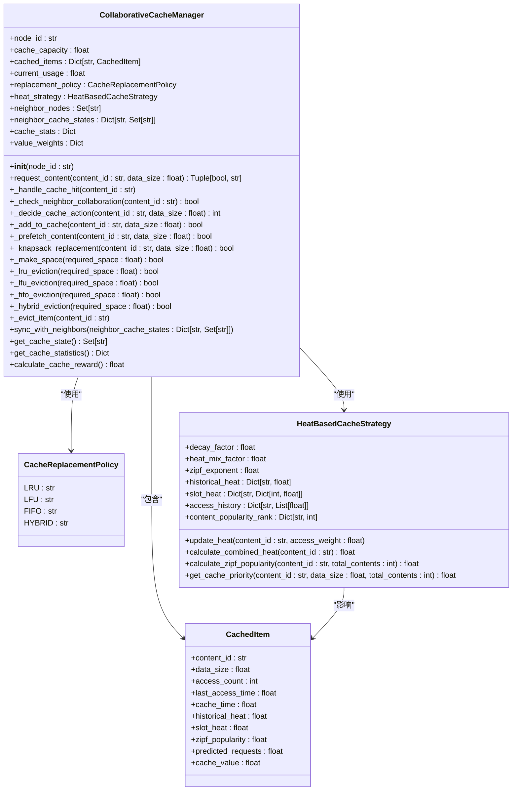
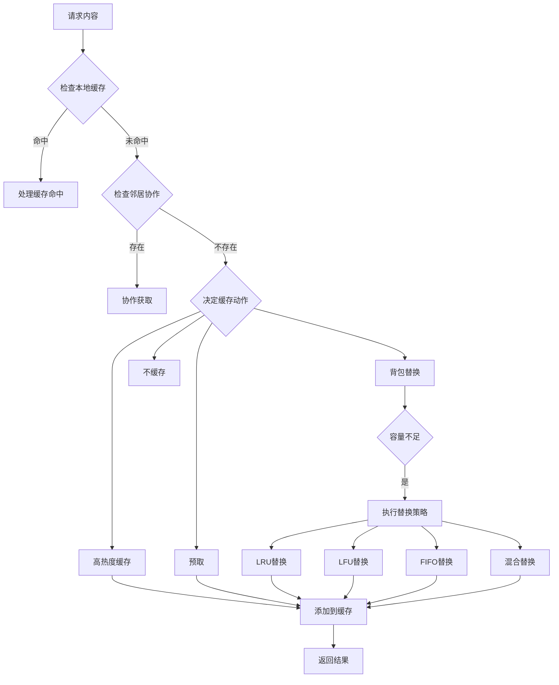
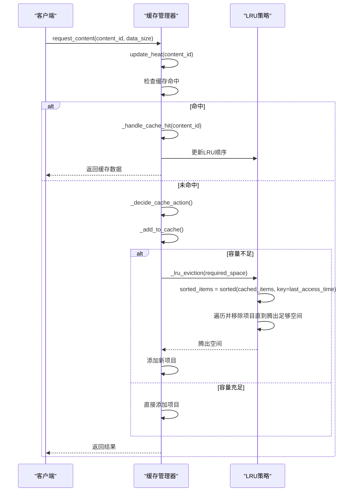
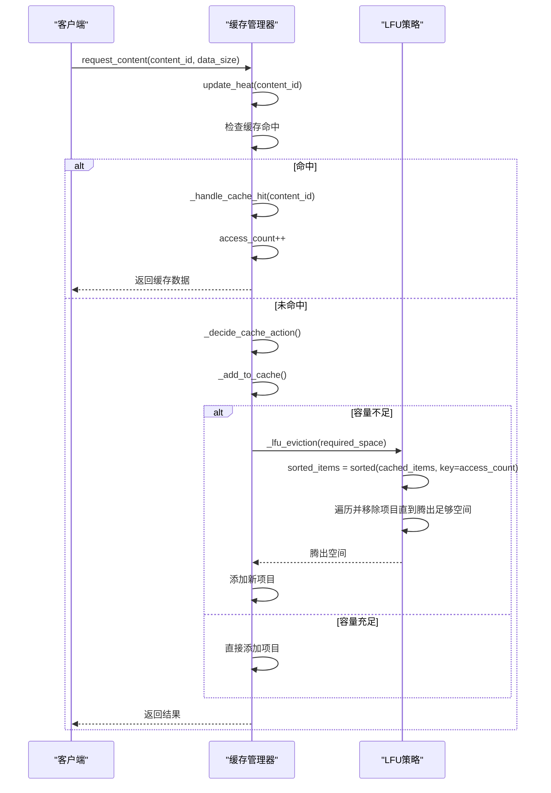
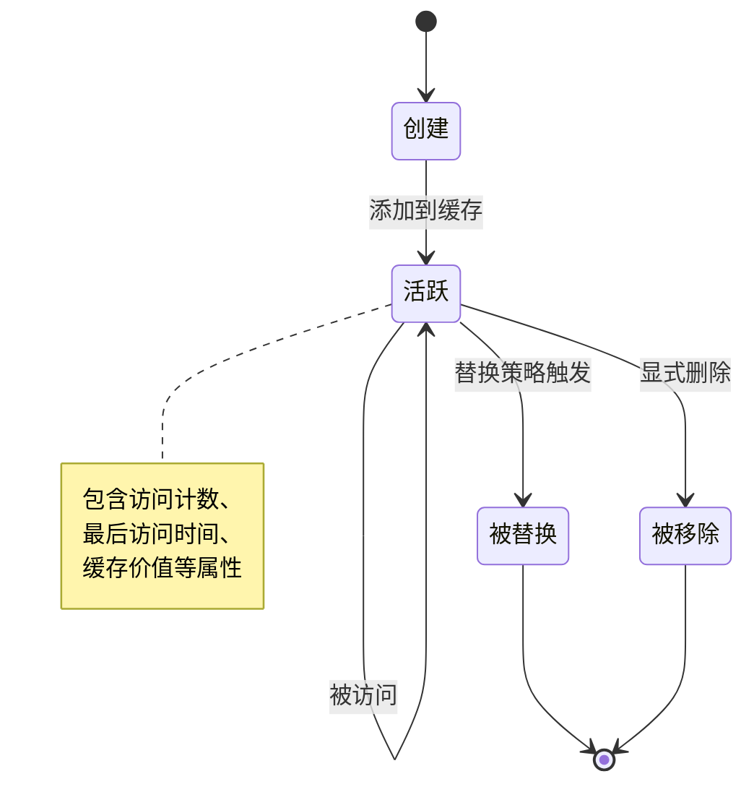
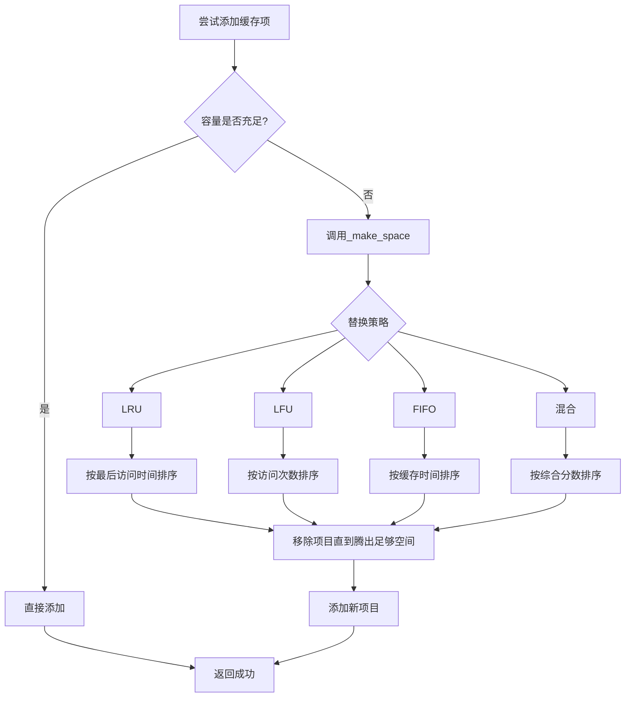
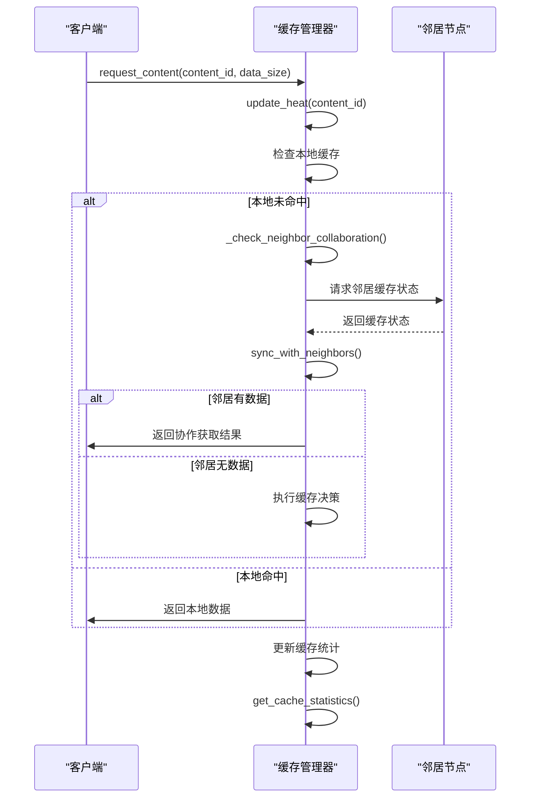
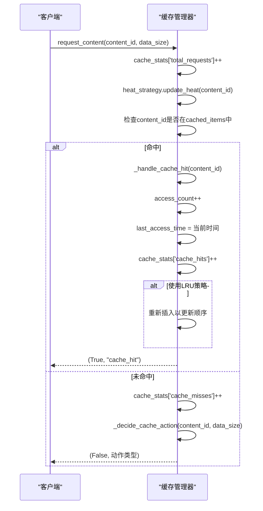
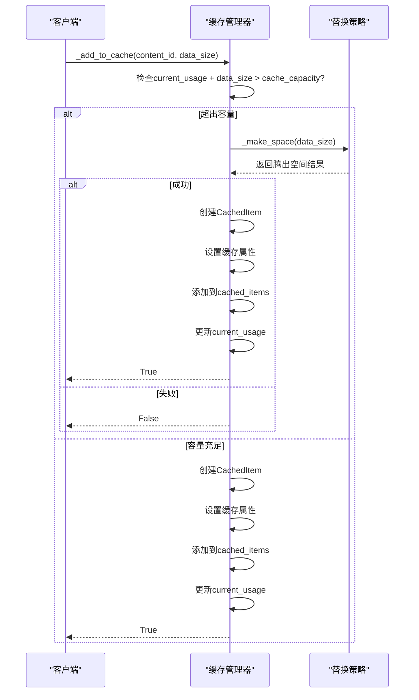

# 缓存管理

<cite>
**Referenced Files in This Document**   
- [cache_manager.py](file://caching\cache_manager.py)
- [cache_policy.py](file://caching\cache_policy.py)
</cite>

## 目录
1. [引言](#引言)
2. [核心组件分析](#核心组件分析)
3. [缓存策略实现机制](#缓存策略实现机制)
4. [缓存生命周期管理](#缓存生命周期管理)
5. [缓存读写流程](#缓存读写流程)
6. [与任务卸载决策的集成](#与任务卸载决策的集成)
7. [性能优化建议](#性能优化建议)
8. [高并发场景下的线程安全机制](#高并发场景下的线程安全机制)
9. [结论](#结论)

## 引言

本文档深入分析了边缘计算环境中的缓存管理模块实现机制。该模块通过策略模式集成了多种缓存替换策略，包括LRU（最近最少使用）、LFU（最不经常使用）等，旨在为边缘节点提供低延迟的数据访问支持。系统采用基于热度的缓存策略，结合历史热度、时间槽热度和Zipf流行度分布，实现智能的缓存决策。模块还支持邻居协作和背包优化算法，通过协作缓存和价值最大化替换策略，提高整体缓存效率。

## 核心组件分析

### CollaborativeCacheManager 类分析



**Diagram sources**
- [cache_manager.py](file://caching\cache_manager.py#L144-L527)

**Section sources**
- [cache_manager.py](file://caching\cache_manager.py#L144-L527)

## 缓存策略实现机制

### 策略模式集成

缓存管理模块通过`CacheReplacementPolicy`枚举类实现了策略模式，支持多种缓存替换策略的动态切换。系统根据配置文件中的`cache_replacement_policy`参数决定使用哪种策略。



**Diagram sources**
- [cache_manager.py](file://caching\cache_manager.py#L199-L245)
- [cache_manager.py](file://caching\cache_manager.py#L377-L386)

**Section sources**
- [cache_manager.py](file://caching\cache_manager.py#L167-L167)
- [cache_manager.py](file://caching\cache_manager.py#L377-L386)

### LRU 缓存替换策略

LRU（Least Recently Used）策略通过维护最近访问时间来决定替换顺序。当需要腾出空间时，系统会按最近访问时间排序，优先替换最久未访问的项目。



**Diagram sources**
- [cache_manager.py](file://caching\cache_manager.py#L388-L401)
- [cache_manager.py](file://caching\cache_manager.py#L247-L259)

**Section sources**
- [cache_manager.py](file://caching\cache_manager.py#L388-L401)

### LFU 缓存替换策略

LFU（Least Frequently Used）策略基于访问频率进行替换决策。系统会统计每个缓存项的访问次数，优先替换访问频率最低的项目。



**Diagram sources**
- [cache_manager.py](file://caching\cache_manager.py#L403-L416)
- [cache_manager.py](file://caching\cache_manager.py#L247-L259)

**Section sources**
- [cache_manager.py](file://caching\cache_manager.py#L403-L416)

### 混合替换策略

混合替换策略综合考虑访问频率、最近性和缓存价值三个因素，通过加权计算综合分数来决定替换顺序。分数越低的项目越容易被替换。

```mermaid
flowchart TD
A[混合替换策略] --> B[计算综合分数]
B --> C[最近性分数 = (当前时间 - 最后访问时间) / 3600]
B --> D[频率分数 = 1 / max(1, 访问次数)]
B --> E[价值分数 = 1 / max(0.1, 缓存价值)]
C --> F[总分数 = 0.4 * 最近性分数 + 0.3 * 频率分数 + 0.3 * 价值分数]
F --> G[按分数排序]
G --> H[优先替换分数高的项目]
H --> I[腾出足够空间]
I --> J[执行替换]
```

**Diagram sources**
- [cache_manager.py](file://caching\cache_manager.py#L433-L458)

**Section sources**
- [cache_manager.py](file://caching\cache_manager.py#L433-L458)

## 缓存生命周期管理

### 缓存项生命周期

缓存项的生命周期从创建到被替换或移除，经历多个阶段。系统通过`CachedItem`数据结构管理每个缓存项的完整生命周期。



**Diagram sources**
- [cache_manager.py](file://caching\cache_manager.py#L26-L41)

**Section sources**
- [cache_manager.py](file://caching\cache_manager.py#L26-L41)

### 容量限制处理

系统通过`_make_space`方法处理容量限制问题。当缓存容量不足时，会根据配置的替换策略腾出所需空间。



**Diagram sources**
- [cache_manager.py](file://caching\cache_manager.py#L377-L386)
- [cache_manager.py](file://caching\cache_manager.py#L300-L322)

**Section sources**
- [cache_manager.py](file://caching\cache_manager.py#L377-L386)

### 数据一致性保障

系统通过多种机制保障数据一致性，包括热度更新、邻居状态同步和缓存统计信息维护。



**Diagram sources**
- [cache_manager.py](file://caching\cache_manager.py#L69-L86)
- [cache_manager.py](file://caching\cache_manager.py#L467-L478)
- [cache_manager.py](file://caching\cache_manager.py#L484-L501)

**Section sources**
- [cache_manager.py](file://caching\cache_manager.py#L69-L86)
- [cache_manager.py](file://caching\cache_manager.py#L467-L478)

## 缓存读写流程

### 缓存读取流程

缓存读取流程从客户端请求开始，经过多个决策步骤，最终返回结果。



**Diagram sources**
- [cache_manager.py](file://caching\cache_manager.py#L199-L245)
- [cache_manager.py](file://caching\cache_manager.py#L247-L259)

**Section sources**
- [cache_manager.py](file://caching\cache_manager.py#L199-L245)

### 缓存写入流程

缓存写入流程涉及容量检查、空间腾出和项目添加等多个步骤。



**Diagram sources**
- [cache_manager.py](file://caching\cache_manager.py#L300-L322)
- [cache_manager.py](file://caching\cache_manager.py#L377-L386)

**Section sources**
- [cache_manager.py](file://caching\cache_manager.py#L300-L322)

### 命中率统计

系统通过维护详细的统计信息来计算缓存命中率和其他性能指标。

```mermaid
erDiagram
  CACHE_STATS {
    int total_requests
    int cache_hits
    int cache_misses
    int evictions
    int prefetch_hits
    int collaboration_saves
  }
  
  CACHE_USAGE {
    float current_usage
    float cache_capacity
    float usage_ratio
  }
  
  CACHE_ITEMS {
    int cached_items_count
    float avg_item