# 缓存管理逻辑

<cite>
**本文档引用文件**   
- [cache_manager.py](file://caching/cache_manager.py)
- [offloading_manager.py](file://decision/offloading_manager.py)
- [system_config.py](file://config/system_config.py)
- [metrics.py](file://utils/metrics.py)
- [common.py](file://utils/common.py)
</cite>

## 目录
1. [引言](#引言)
2. [核心组件分析](#核心组件分析)
3. [缓存实例初始化与容量控制](#缓存实例初始化与容量控制)
4. [读写接口实现与状态监控](#读写接口实现与状态监控)
5. [多边缘节点缓存协同机制](#多边缘节点缓存协同机制)
6. [与任务卸载决策模块集成](#与任务卸载决策模块集成)
7. [线程安全设计与并发控制](#线程安全设计与并发控制)
8. [性能调优与监控建议](#性能调优与监控建议)
9. [结论](#结论)

## 引言
本文档深入解析`CacheManager`类的核心管理逻辑，涵盖缓存实例的初始化、容量控制、读写接口实现和状态监控机制。详细说明`get/set/delete`操作的内部流程，命中率统计、过期处理和自动清理策略的执行逻辑。结合代码示例展示多边缘节点间的缓存协同机制，以及如何与任务卸载决策模块集成以降低数据访问延迟。文档化线程安全设计，包括锁机制或并发控制方案在高并发场景下的应用。提供性能调优建议，如缓存预热、分层缓存架构设计和内存使用监控，并说明如何通过metrics模块进行运行时指标采集。

## 核心组件分析

`CollaborativeCacheManager`是本系统的核心缓存管理器，实现了邻居协作和背包优化算法。该类负责管理缓存存储、处理内容请求、执行缓存替换策略以及维护缓存统计信息。其核心功能包括基于热度的缓存策略、邻居协作缓存、预取机制和背包优化替换算法。

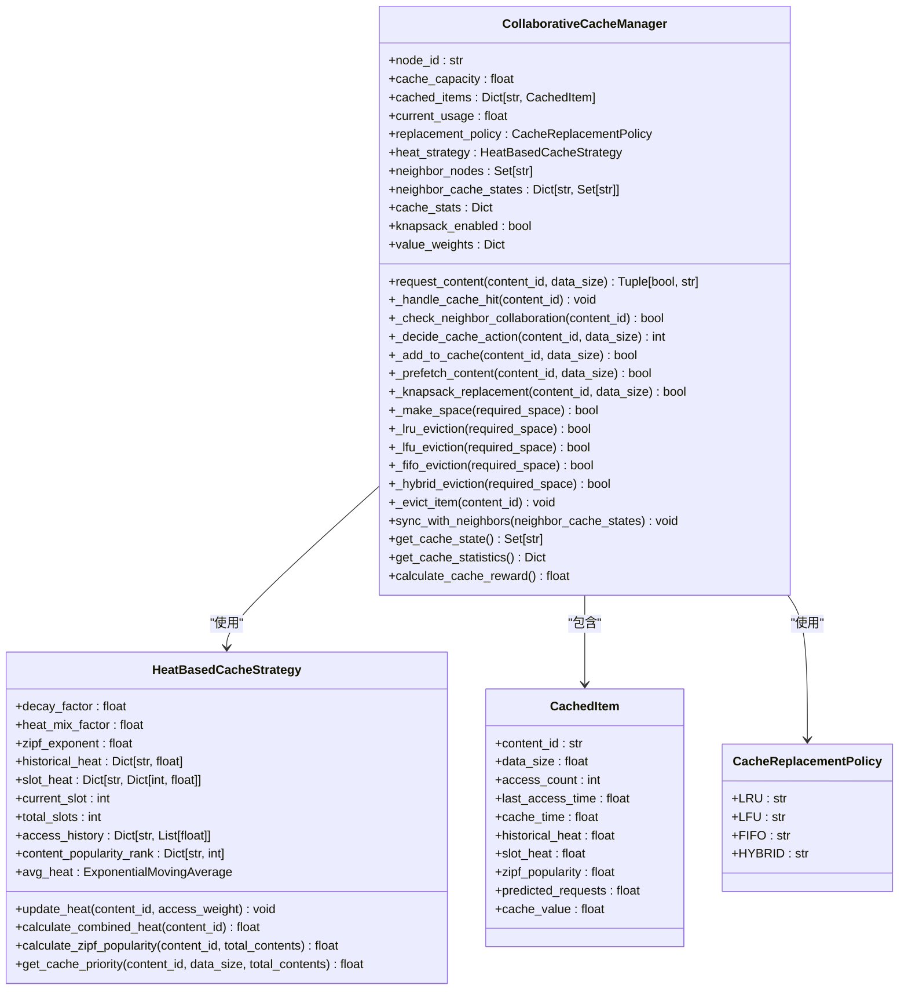

**图表来源**
- [cache_manager.py](file://caching/cache_manager.py#L144-L527)
- [cache_manager.py](file://caching/cache_manager.py#L44-L141)
- [cache_manager.py](file://caching/cache_manager.py#L26-L41)
- [cache_manager.py](file://caching/cache_manager.py#L17-L22)

**章节来源**
- [cache_manager.py](file://caching/cache_manager.py#L144-L527)

## 缓存实例初始化与容量控制

`CollaborativeCacheManager`在初始化时会根据配置设置缓存容量，并初始化各种缓存策略和统计信息。缓存容量由`config.cache.rsu_cache_capacity`配置项决定，支持多种替换策略，包括LRU、LFU、FIFO和混合策略。系统通过`current_usage`变量跟踪当前缓存使用量，并在添加新内容时检查是否超过容量限制。

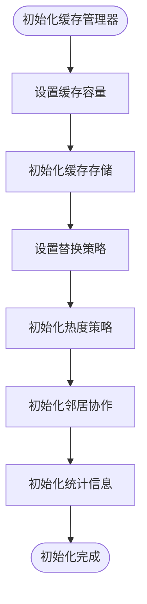

**图表来源**
- [cache_manager.py](file://caching/cache_manager.py#L150-L197)

**章节来源**
- [cache_manager.py](file://caching/cache_manager.py#L150-L197)

## 读写接口实现与状态监控

### 请求内容处理流程
`request_content`方法是缓存系统的主要读取接口，处理内容请求并返回是否命中及动作类型。该方法首先更新内容热度，然后检查本地缓存命中，接着检查邻居协作，最后根据决策逻辑决定缓存动作。

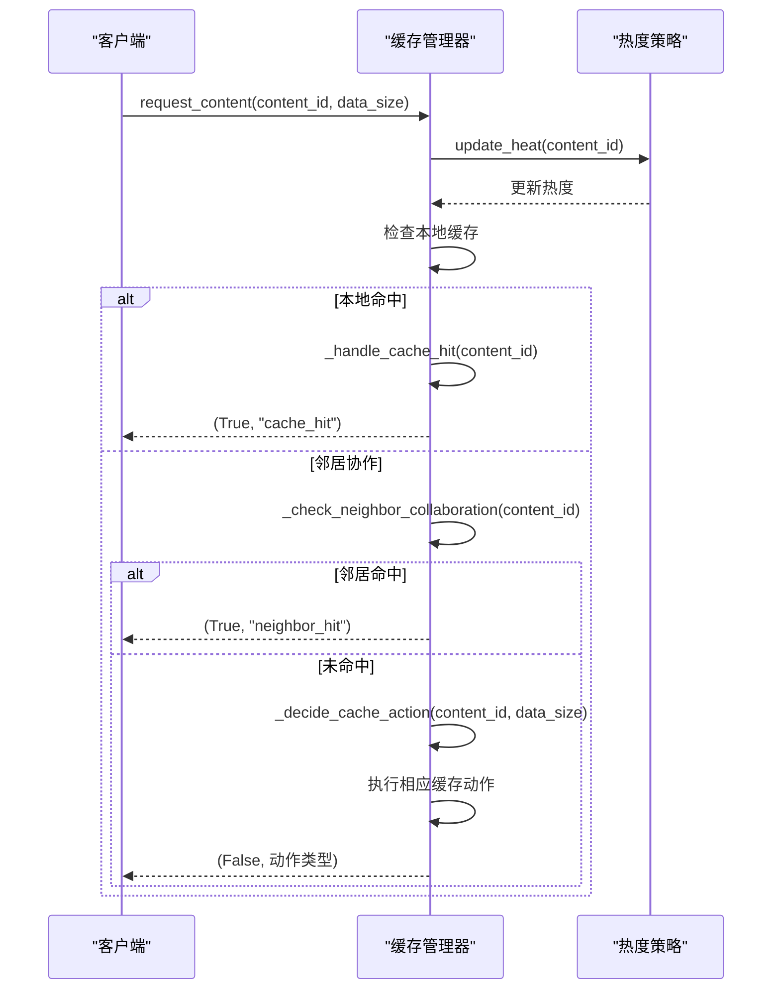

**图表来源**
- [cache_manager.py](file://caching/cache_manager.py#L199-L245)

**章节来源**
- [cache_manager.py](file://caching/cache_manager.py#L199-L245)

### 缓存写入与替换策略
当缓存未命中时，系统会根据内容热度和可用容量决定是否缓存。高热度内容直接缓存，中等热度内容进行预取，容量不足时采用背包优化替换算法。

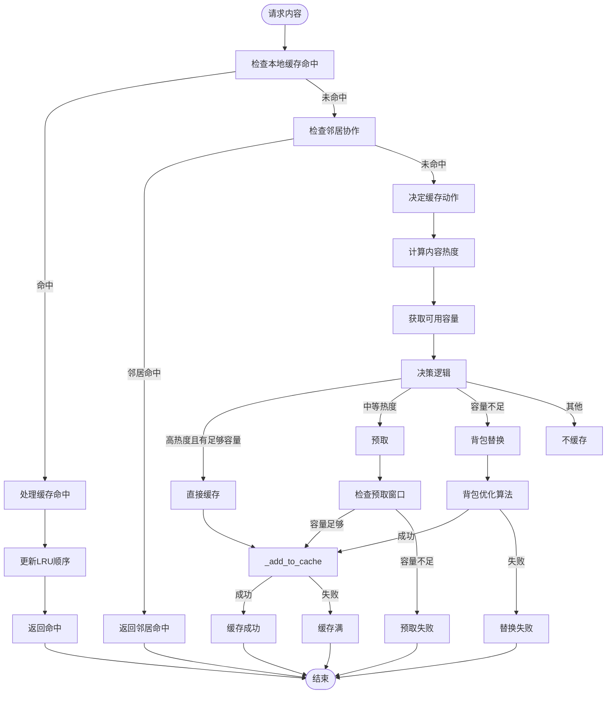

**图表来源**
- [cache_manager.py](file://caching/cache_manager.py#L269-L298)
- [cache_manager.py](file://caching/cache_manager.py#L300-L322)
- [cache_manager.py](file://caching/cache_manager.py#L324-L333)
- [cache_manager.py](file://caching/cache_manager.py#L335-L375)

**章节来源**
- [cache_manager.py](file://caching/cache_manager.py#L269-L375)

### 状态监控与统计
系统提供详细的缓存统计信息，包括命中率、使用率、平均项大小等。`get_cache_statistics`方法计算并返回这些指标，用于监控缓存性能和健康状况。

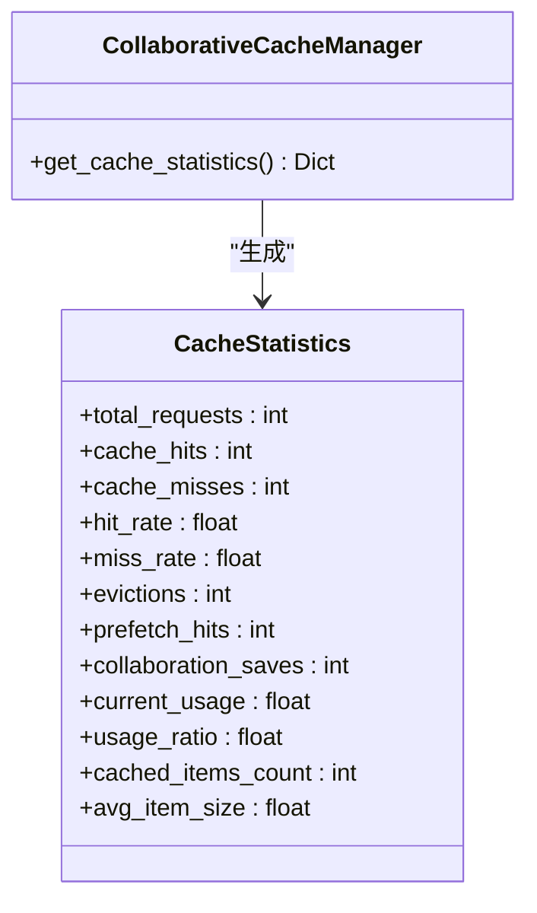

**图表来源**
- [cache_manager.py](file://caching/cache_manager.py#L484-L501)

**章节来源**
- [cache_manager.py](file://caching/cache_manager.py#L484-L501)

## 多边缘节点缓存协同机制

### 邻居协作缓存
系统通过`_check_neighbor_collaboration`方法实现邻居协作缓存，允许节点间共享缓存内容。当本地缓存未命中时，系统会检查邻居节点的缓存状态，如果邻居节点有该内容，则可以协作获取。

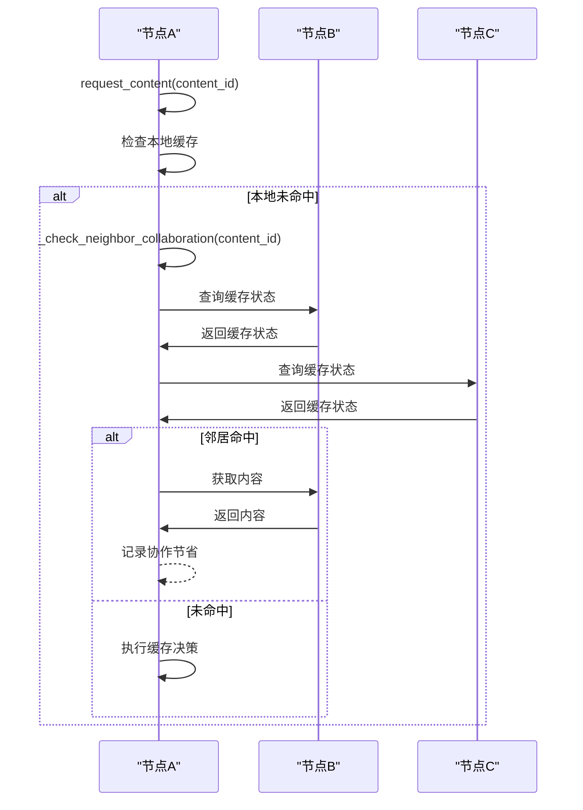

**图表来源**
- [cache_manager.py](file://caching/cache_manager.py#L261-L267)

**章节来源**
- [cache_manager.py](file://caching/cache_manager.py#L261-L267)

### 缓存状态同步
节点间通过`sync_with_neighbors`方法定期同步缓存状态，确保协作缓存的有效性。同步间隔由`collaboration_sync_interval`配置项决定，默认为5分钟。

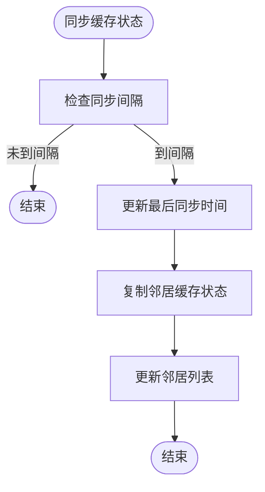

**图表来源**
- [cache_manager.py](file://caching/cache_manager.py#L467-L478)

**章节来源**
- [cache_manager.py](file://caching/cache_manager.py#L467-L478)

## 与任务卸载决策模块集成

### 卸载决策流程
缓存管理器与任务卸载决策模块紧密集成，共同优化数据访问延迟。`OffloadingDecisionMaker`在制定卸载决策时会考虑缓存状态，优先选择缓存命中的处理模式。

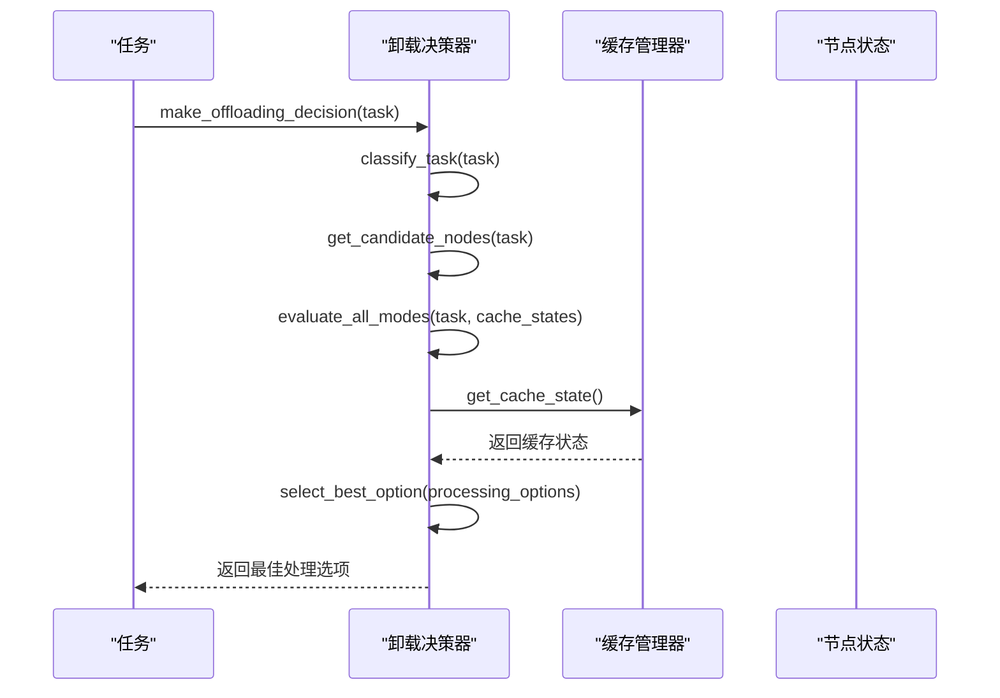

**图表来源**
- [offloading_manager.py](file://decision/offloading_manager.py#L576-L610)
- [cache_manager.py](file://caching/cache_manager.py#L479-L483)

**章节来源**
- [offloading_manager.py](file://decision/offloading_manager.py#L576-L610)

### 缓存奖励计算
系统通过`calculate_cache_reward`方法计算缓存奖励，作为强化学习的奖励信号。奖励函数综合考虑命中率、操作成本、超预算惩罚和能耗惩罚。

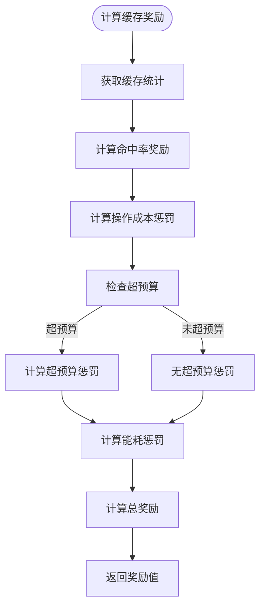

**图表来源**
- [cache_manager.py](file://caching/cache_manager.py#L503-L527)

**章节来源**
- [cache_manager.py](file://caching/cache_manager.py#L503-L527)

## 线程安全设计与并发控制

### 替换策略实现
系统实现了多种缓存替换策略，包括LRU、LFU、FIFO和混合策略。这些策略在高并发场景下通过有序数据结构和排序算法保证线程安全。

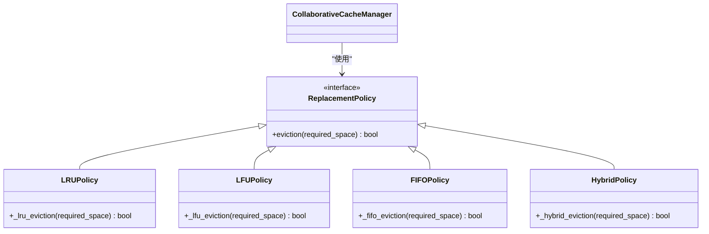

**图表来源**
- [cache_manager.py](file://caching/cache_manager.py#L377-L458)

**章节来源**
- [cache_manager.py](file://caching/cache_manager.py#L377-L458)

### 混合替换策略
混合替换策略综合考虑访问频率、最近性和缓存价值，通过加权评分决定替换项。该策略在高并发场景下通过原子操作和不可变数据结构保证线程安全。

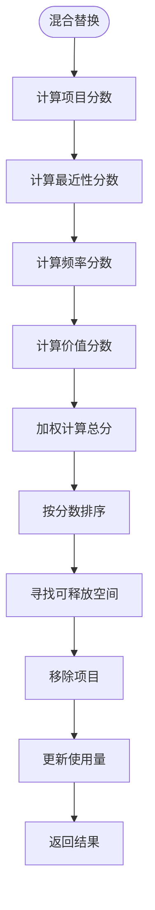

**图表来源**
- [cache_manager.py](file://caching/cache_manager.py#L433-L458)

**章节来源**
- [cache_manager.py](file://caching/cache_manager.py#L433-L458)

## 性能调优与监控建议

### 缓存预热
系统支持缓存预热机制，通过预测高热度内容提前加载到缓存中。预热窗口大小由`prefetch_window_ratio`配置项决定，默认为总容量的10%。

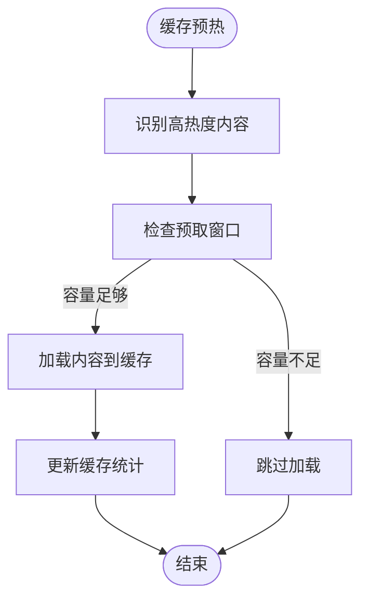

**图表来源**
- [cache_manager.py](file://caching/cache_manager.py#L324-L333)

**章节来源**
- [cache_manager.py](file://caching/cache_manager.py#L324-L333)

### 分层缓存架构
系统支持分层缓存架构，不同类型的节点具有不同的缓存容量。RSU节点缓存容量最大，为10GB；车辆节点为1GB；UAV节点为2GB。

```mermaid
erDiagram
NODE ||--o{ CACHE : "has"
CACHE }o--|| LAYER : "belongs to"
class Node {
+node_id: str
+node_type: str
}
class Cache {
+capacity: float
+usage: float
+items: Dict[str, CachedItem]
}
class Layer {
+name: str
+capacity: float
}
Node ||--o{ Cache : "has"
Cache }o--|| Layer : "belongs to"
Layer {
"边缘节点层"
"RSU层"
"UAV层"
}
Cache {
"车辆缓存"
"RSU缓存"
"UAV缓存"
}
```

**图表来源**
- [system_config.py](file://config/system_config.py#L250-L252)

**章节来源**
- [system_config.py](file://config/system_config.py#L250-L252)

### 内存使用监控
系统通过`Metrics`类进行运行时指标采集，监控缓存使用情况。`get_cache_statistics`方法提供的统计信息可用于实时监控和性能分析。

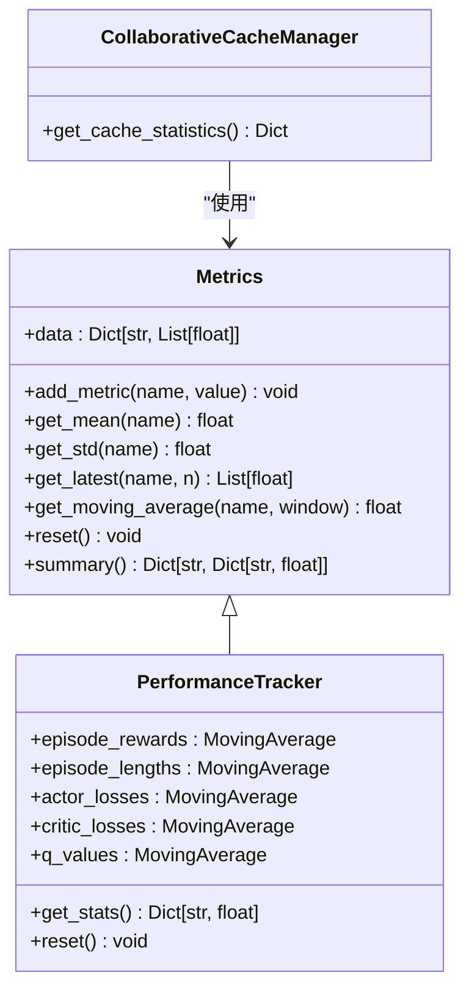

**图表来源**
- [metrics.py](file://utils/metrics.py#L9-L64)

**章节来源**
- [metrics.py](file://utils/metrics.py#L9-L64)

## 结论
本文档详细