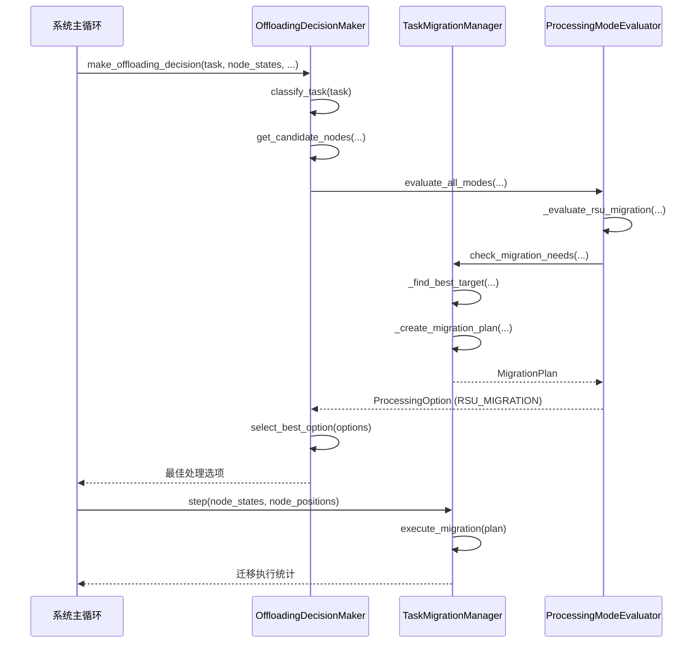
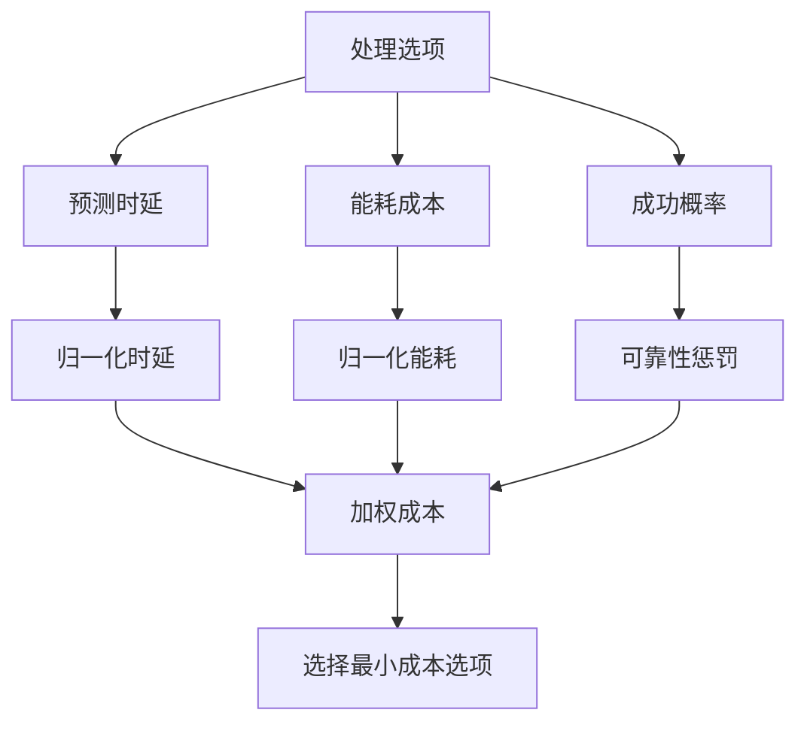
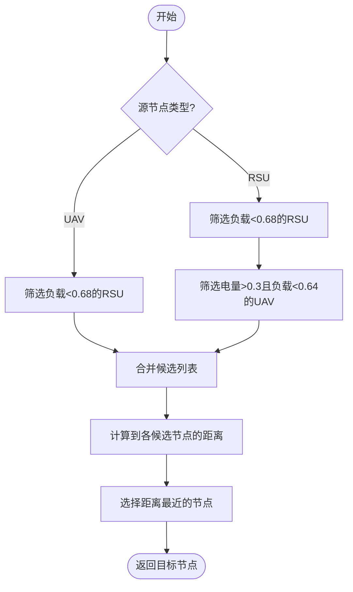

# 迁移决策机制

<cite>
**本文档引用的文件**  
- [migration_manager.py](file://migration/migration_manager.py)
- [offloading_manager.py](file://decision/offloading_manager.py)
- [vec_system_config.json](file://vec_system_config.json)
</cite>

## 目录
1. [引言](#引言)
2. [迁移触发逻辑与决策流程](#迁移触发逻辑与决策流程)
3. [多维度决策模型分析](#多维度决策模型分析)
4. [目标节点选择算法](#目标节点选择算法)
5. [Keep-Before-Break迁移执行机制](#keep-before-break迁移执行机制)
6. [迁移与卸载决策协同逻辑](#迁移与卸载决策协同逻辑)
7. [典型场景决策示例](#典型场景决策示例)
8. [系统参数配置](#系统参数配置)
9. [性能统计与优化策略](#性能统计与优化策略)

## 引言
本文档深入解析车联网环境中任务迁移决策的触发逻辑与目标节点选择算法。基于代码实现，详细阐述了融合任务负载、链路稳定性与资源可用性的多维度决策模型。文档重点说明了如何通过强化学习状态反馈动态调整迁移阈值，并分析在高动态环境下保障决策实时性与准确性的机制。同时，提供了紧急迁移与预防性迁移的判断条件，并揭示了迁移决策与任务卸载、缓存管理等模块的协同工作逻辑。

## 迁移触发逻辑与决策流程
迁移决策由 `TaskMigrationManager` 类驱动，其核心方法 `check_migration_needs` 在每个系统时间步被调用，以评估是否需要执行迁移。该流程与 `OffloadingDecisionMaker` 的卸载决策流程紧密耦合。

**图示来源**
- [offloading_manager.py](file://decision/offloading_manager.py#L576-L610)
- [migration_manager.py](file://migration/migration_manager.py#L66-L96)

**本节来源**
- [offloading_manager.py](file://decision/offloading_manager.py#L562-L625)
- [migration_manager.py](file://migration/migration_manager.py#L38-L251)

## 多维度决策模型分析
迁移决策模型是一个多维度的评估框架，综合考量了任务负载、资源可用性和链路稳定性。

### 决策维度与权重
决策模型通过 `ProcessingOption.weighted_cost` 属性进行量化评估，该成本函数综合了三个关键维度：
- **时延成本 (w_delay = 0.15)**：归一化后的预测总时延。
- **能耗成本 (w_energy = 0.7)**：归一化后的总能耗，权重最高，优先促进卸载。
- **可靠性成本 (w_reliability = 0.15)**：成功概率的惩罚项。

**图示来源**
- [offloading_manager.py](file://decision/offloading_manager.py#L24-L52)

### 迁移触发条件
迁移的触发基于严格的阈值判断，由 `TaskMigrationManager.check_migration_needs` 方法实现：
- **RSU过载**：当RSU节点的负载因子超过 `rsu_overload_threshold`（默认0.85）时，触发迁移。
- **UAV低电量或过载**：当UAV的电池电量低于 `uav_min_battery` 或负载因子超过 `uav_overload_threshold`（默认0.8）时，触发迁移。
- **冷却期机制**：为防止频繁迁移，每个节点在成功迁移后会进入 `cooldown_period`（默认8秒）的冷却期。

**本节来源**
- [migration_manager.py](file://migration/migration_manager.py#L66-L96)

## 目标节点选择算法
目标节点的选择算法是迁移决策的核心，旨在为源节点找到最优的迁移目标。

### 候选节点筛选
`_find_best_target` 方法根据源节点类型筛选候选目标：
- **RSU迁移**：候选目标包括其他负载低于阈值80%的RSU，以及电量充足（>1.5倍阈值）且负载较低的UAV。
- **UAV迁移**：主要候选目标为负载低于阈值80%的RSU。

### 最优目标选择
在筛选出的候选节点中，算法采用**最近距离优先**的策略：
- 计算源节点与每个候选节点之间的欧氏距离。
- 选择距离最近的候选节点作为最终目标。
- 该策略旨在最小化迁移过程中的通信开销和时延。

**图示来源**
- [migration_manager.py](file://migration/migration_manager.py#L98-L129)

**本节来源**
- [migration_manager.py](file://migration/migration_manager.py#L98-L129)

## Keep-Before-Break迁移执行机制
系统采用 **Keep-Before-Break (KBB)** 机制来执行迁移，以最小化服务中断时间。

### 迁移计划创建
`_create_migration_plan` 方法创建 `MigrationPlan` 对象，包含以下关键信息：
- **迁移成本**：由计算成本、传输成本和延迟成本加权求和得出。
- **迁移时延**：主要由数据传输时间决定，与距离成正比。
- **成功概率**：与迁移距离成反比，距离越远成功率越低。

### KBB过程模拟
`execute_migration` 方法模拟了KBB的三阶段过程：
1. **准备阶段 (70%)**：在目标节点上预配置环境。
2. **同步阶段 (25%)**：在源节点和目标节点间同步任务状态和数据。
3. **静默切换阶段 (5%)**：这是实际的 `downtime`，系统将服务从源节点切换到目标节点。

**本节来源**
- [migration_manager.py](file://migration/migration_manager.py#L131-L172)
- [migration_manager.py](file://migration/migration_manager.py#L174-L205)

## 迁移与卸载决策协同逻辑
迁移决策并非孤立存在，而是作为整体卸载决策框架的一部分，与任务分类、缓存管理等模块深度协同。

### 协同决策流程
1.  **任务分类**：`TaskClassifier` 根据任务的最大容忍时延将其分为四类。
2.  **候选节点生成**：不同类别的任务有不同的候选节点集合，例如极度延迟敏感任务仅限本地处理。
3.  **模式评估**：`ProcessingModeEvaluator` 评估所有可行的处理模式，其中 `RSU_MIGRATION` 模式会调用 `TaskMigrationManager` 来检查迁移可行性。
4.  **最终决策**：系统选择加权成本最低的处理模式，可能是本地计算、RSU卸载、UAV卸载或RSU间迁移。

这种协同确保了迁移仅在作为最优解时才被采纳，避免了不必要的资源开销。

**本节来源**
- [offloading_manager.py](file://decision/offloading_manager.py#L209-L559)

## 典型场景决策示例
### 紧急迁移场景
当一个RSU因突发流量导致负载因子瞬间飙升至0.9（超过0.85阈值）时，系统会立即触发紧急迁移。`check_migration_needs` 会检测到此过载状态，并启动迁移流程，将部分任务迁移到邻近的、负载较低的RSU或UAV上，以防止服务崩溃。

### 预防性迁移场景
对于一个电量逐渐下降的UAV，当其电池电量降至 `uav_min_battery` 阈值以下时，系统会启动预防性迁移。这允许UAV在电量耗尽前，将其承载的任务平稳地迁移到地面RSU上，确保服务的连续性。

## 系统参数配置
系统的关键迁移参数在 `vec_system_config.json` 文件中定义，实现了配置与代码的分离。

| 参数 | 配置项 | 默认值 | 说明 |
| :--- | :--- | :--- | :--- |
| RSU过载阈值 | migration_parameters.rsu_overload_threshold | 0.85 | 触发RSU迁移的负载阈值 |
| UAV过载阈值 | migration_parameters.uav_overload_threshold | 0.8 | 触发UAV迁移的负载阈值 |
| UAV最低电量 | migration_parameters.uav_min_battery | 0.2 | 触发UAV迁移的电量阈值 |
| 冷却期 | migration_parameters.cooldown_period | 8.0 | 迁移成功后的冷却时间（秒） |
| 迁移带宽 | migration_parameters.migration_bandwidth | 50e6 | 迁移过程的传输带宽（bps） |

**本节来源**
- [vec_system_config.json](file://vec_system_config.json#L57-L68)

## 性能统计与优化策略
系统内置了详细的性能统计和优化机制，以持续改进迁移决策。

### 迁移性能统计
`TaskMigrationManager` 维护了一个 `migration_stats` 字典，用于跟踪关键指标：
- **总尝试次数** (`total_attempts`)
- **成功迁移次数** (`successful_migrations`)
- **总中断时间** (`total_downtime`)
- **平均迁移成本** (`avg_cost`)

这些统计数据可通过 `get_migration_statistics` 方法获取，为系统调优提供依据。

### 成本动态更新
系统采用**移动平均法**更新平均迁移成本，以适应动态环境：
- 新的平均成本 = α * 新成本 + (1-α) * 旧平均成本
- 其中 α (alpha) 为平滑系数（默认0.1），使得平均成本能平滑地反映近期迁移的开销。

**本节来源**
- [migration_manager.py](file://migration/migration_manager.py#L207-L217)
- [migration_manager.py](file://migration/migration_manager.py#L25-L35)