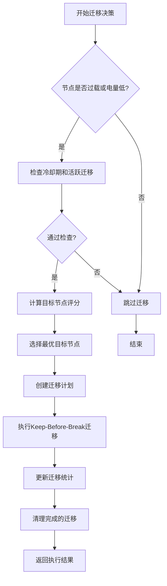
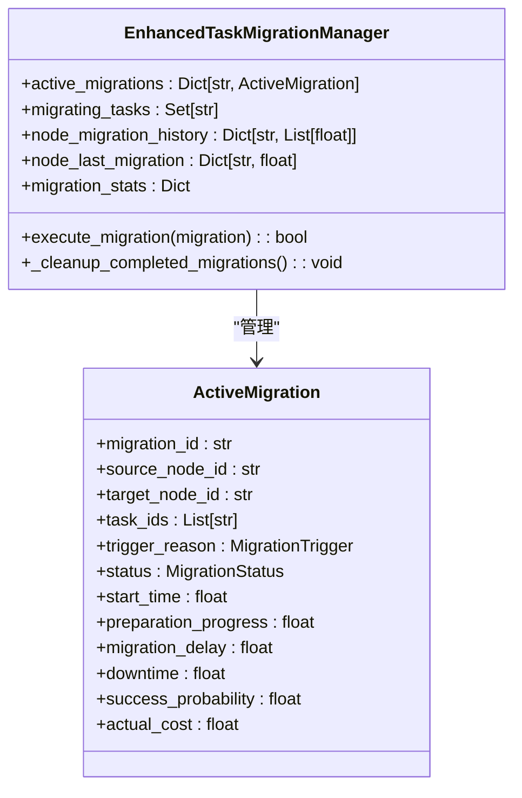

# 迁移执行流程

<cite>
**本文档引用文件**  
- [migration_manager.py](file://migration/migration_manager.py)
- [enhanced_migration.py](file://utils/enhanced_migration.py)
- [system_config.py](file://config/system_config.py)
- [data_structures.py](file://models/data_structures.py)
- [metrics.py](file://utils/metrics.py)
</cite>

## 目录
1. [会话保持与迁移触发机制](#会话保持与迁移触发机制)  
2. [状态同步与数据传输阶段](#状态同步与数据传输阶段)  
3. [通信模型切换与QoS保障](#通信模型切换与qos保障)  
4. [断开旧连接的时机控制](#断开旧连接的时机控制)  
5. [迁移上下文传递与故障回滚](#迁移上下文传递与故障回滚)  
6. [性能指标测量与优化建议](#性能指标测量与优化建议)

## 会话保持与迁移触发机制

会话保持机制通过`EnhancedTaskMigrationManager`类实现，采用多维度触发策略确保服务连续性。系统在初始化时加载迁移配置参数，包括RSU过载阈值（0.8）、UAV过载阈值（0.7）和最低电量阈值（0.2），并设置10秒的冷却期以避免频繁迁移。

迁移触发机制支持五种触发原因：RSU过载、UAV电量低、UAV过载、车辆移动性和网络拥塞。系统通过`_analyze_migration_needs`方法对节点状态进行综合评估，计算触发紧急度。例如，当RSU负载因子超过动态阈值时，紧急度计算公式为：
```
urgency = (state.load_factor - dynamic_threshold) / (1.0 - dynamic_threshold)
```
对于UAV节点，还需考虑电池电量因素。系统采用动态阈值调整策略，当区域内RSU平均负载超过0.7时，将过载阈值降低至原值的90%，以更积极地触发迁移。

在执行迁移前，系统会检查源节点是否处于冷却期，并验证是否存在活跃迁移，确保迁移操作的有序性。每个节点在同一时刻仅允许一个迁移计划执行，避免资源冲突。

**本节来源**  
- [enhanced_migration.py](file://utils/enhanced_migration.py#L61-L99)  
- [enhanced_migration.py](file://utils/enhanced_migration.py#L101-L134)  
- [system_config.py](file://config/system_config.py#L250-L260)

## 状态同步与数据传输阶段

状态同步与数据传输阶段采用Keep-Before-Break机制，将整个迁移过程划分为三个时序阶段：准备阶段（70%时间）、同步阶段（25%时间）和切换阶段（5%时间）。该比例设计在保证数据完整性的同时，最大限度减少服务中断时间。

迁移计划创建过程中，系统首先通过`_find_optimal_target`方法选择最优目标节点。选择策略采用加权评分模型，综合考虑目标节点的容量得分（1-负载因子）和距离得分（1/(1+距离/1000)）。对于RSU到RSU的迁移，容量得分权重为0.7，距离得分权重为0.3；对于UAV到RSU的迁移，容量得分权重提升至0.8，体现对计算资源的优先考虑。

数据传输量的计算基于任务数据大小和传输带宽。系统配置的迁移带宽为100 Mbps，传输延迟计算公式为：
```
base_delay = distance / migration_bandwidth * 1e-6
migration_delay = base_delay * num_tasks * 0.5
```
其中0.5的系数考虑了并行传输优化。迁移成本采用加权和模型计算：
```
total_cost = alpha_comp * computation_cost + 
             alpha_tx * transmission_cost + 
             alpha_lat * latency_cost
```
各权重参数（alpha_comp=0.4, alpha_tx=0.3, alpha_lat=0.3）在配置文件中定义，可根据网络环境调整。

**本节来源**  
- [enhanced_migration.py](file://utils/enhanced_migration.py#L180-L224)  
- [enhanced_migration.py](file://utils/enhanced_migration.py#L226-L263)  
- [enhanced_migration.py](file://utils/enhanced_migration.py#L421-L440)  
- [system_config.py](file://config/system_config.py#L255-L258)

## 通信模型切换与QoS保障

通信模型切换策略通过双连接机制保障QoS连续性。在准备阶段，系统建立源节点与目标节点之间的新连接，同时保持原有服务连接。此期间，控制信令通过新连接进行同步，而数据流量仍通过原连接传输，实现会话的无缝保持。

QoS保障机制体现在多个层面：首先，迁移成功概率动态计算，基础成功率为0.9，减去距离惩罚项（distance/10000.0，上限0.3）和目标节点负载惩罚项（load_factor*0.1），加上紧急度奖励项（urgency*0.05）。该模型确保在距离较远或目标节点负载较高时降低迁移尝试概率，维护系统稳定性。

其次，系统采用任务优先级调度策略，在`_select_tasks_for_migration`方法中，任务优先级由迁移紧急度和剩余时间共同决定：
```
task_priority = urgency * 0.5 + (1.0 / max(1.0, remaining_time)) * 0.5
```
优先迁移紧急度高且截止时间临近的任务，最大化系统效用。每次迁移最多选择3个任务，避免单次迁移开销过大。

为应对任务状态数据缺失的特殊情况，系统设计了虚拟任务生成机制。当`task_states`为空时，基于节点负载紧急度生成1-3个虚拟任务ID，确保迁移统计的完整性。



**图示来源**  
- [enhanced_migration.py](file://utils/enhanced_migration.py#L265-L295)  
- [enhanced_migration.py](file://utils/enhanced_migration.py#L442-L458)

**本节来源**  
- [enhanced_migration.py](file://utils/enhanced_migration.py#L265-L295)  
- [enhanced_migration.py](file://utils/enhanced_migration.py#L442-L458)  
- [migration_manager.py](file://migration/migration_manager.py#L174-L205)

## 断开旧连接的时机控制

断开旧连接的时机控制是Keep-Before-Break机制的关键环节。系统将实际中断时间（downtime）控制在总迁移延迟的5%，通过精确的时序管理确保服务质量。在同步阶段完成后，系统进行最终状态验证，仅当新连接的SINR值稳定且缓冲数据同步完成后，才执行连接切换。

切换过程包含以下步骤：首先，暂停源节点的任务处理；其次，将剩余缓冲数据转发至目标节点；然后，更新任务分配状态，将`assigned_node_id`指向新节点；最后，断开源节点连接并释放相关资源。这一过程在`execute_migration`方法中实现，通过状态机管理迁移的各个阶段（PLANNED → PREPARING → EXECUTING → COMPLETED）。

系统还实现了迁移历史跟踪机制，通过`_update_migration_history`方法记录每个节点的迁移时间戳。当节点在冷却期内再次触发迁移需求时，系统将拒绝新的迁移请求，防止节点频繁切换导致的震荡问题。

**本节来源**  
- [enhanced_migration.py](file://utils/enhanced_migration.py#L297-L355)  
- [enhanced_migration.py](file://utils/enhanced_migration.py#L516-L525)  
- [data_structures.py](file://models/data_structures.py#L150-L155)

## 迁移上下文传递与故障回滚

迁移上下文传递通过`ActiveMigration`数据结构实现，包含迁移ID、源节点、目标节点、任务列表、触发原因、状态、开始时间、准备进度、迁移延迟、中断时间、成功概率和实际成本等字段。该结构确保迁移过程中的所有关键信息能够完整传递和跟踪。

故障回滚机制在迁移失败时自动触发。当随机数大于成功概率时，迁移状态被标记为FAILED，系统记录失败统计，并立即启动恢复流程：保持源节点连接，继续处理任务，同时根据任务剩余生命周期决定是否重新规划迁移。对于高优先级任务，系统可能降低目标节点选择标准，提高迁移尝试频率。

上下文清理在`_cleanup_completed_migrations`方法中实现，定期扫描活跃迁移列表，清除已完成（COMPLETED）、失败（FAILED）或取消（CANCELLED）的迁移记录，防止内存泄漏。清理过程确保每个迁移任务ID从`migrating_tasks`集合中移除，释放相关资源。



**图示来源**  
- [enhanced_migration.py](file://utils/enhanced_migration.py#L31-L55)  
- [enhanced_migration.py](file://utils/enhanced_migration.py#L297-L355)

**本节来源**  
- [enhanced_migration.py](file://utils/enhanced_migration.py#L31-L55)  
- [enhanced_migration.py](file://utils/enhanced_migration.py#L297-L355)  
- [enhanced_migration.py](file://utils/enhanced_migration.py#L516-L525)

## 性能指标测量与优化建议

性能指标测量通过`get_enhanced_statistics`方法提供全面的迁移统计信息，包括计划迁移数、执行迁移数、成功迁移数、失败迁移数、各类成功率（规划成功率、执行成功率、总体成功率）、总中断时间、平均每次迁移中断时间、平均成本、活跃迁移数、触发原因分布和动态阈值等。

关键性能指标中，迁移延迟主要由传输延迟和处理延迟构成，丢包率与信道质量、距离和干扰相关。系统通过动态成功率计算函数`get_dynamic_migration_success_rate`模拟真实环境波动，结合正弦函数引入±5%的时间相关波动，使仿真结果更贴近实际。

优化建议包括：
1. **预同步策略**：在准备阶段提前建立安全上下文和路由表，减少同步时间
2. **带宽自适应调整**：根据信道质量动态调整传输参数，高SINR时采用高阶调制
3. **预测性迁移**：基于车辆移动轨迹预测未来负载，提前规划迁移
4. **分批迁移**：将大任务拆分为子任务分批迁移，降低单次中断影响

系统还实现了移动平均成本更新算法，采用指数加权移动平均（EWMA）：
```
avg_cost = alpha * new_cost + (1 - alpha) * current_avg
```
其中alpha=0.1，使成本统计对近期迁移结果更敏感，及时反映网络条件变化。

**本节来源**  
- [enhanced_migration.py](file://utils/enhanced_migration.py#L527-L551)  
- [enhanced_migration.py](file://utils/enhanced_migration.py#L357-L381)  
- [metrics.py](file://utils/metrics.py#L1-L147)  
- [system_config.py](file://config/system_config.py#L250-L260)