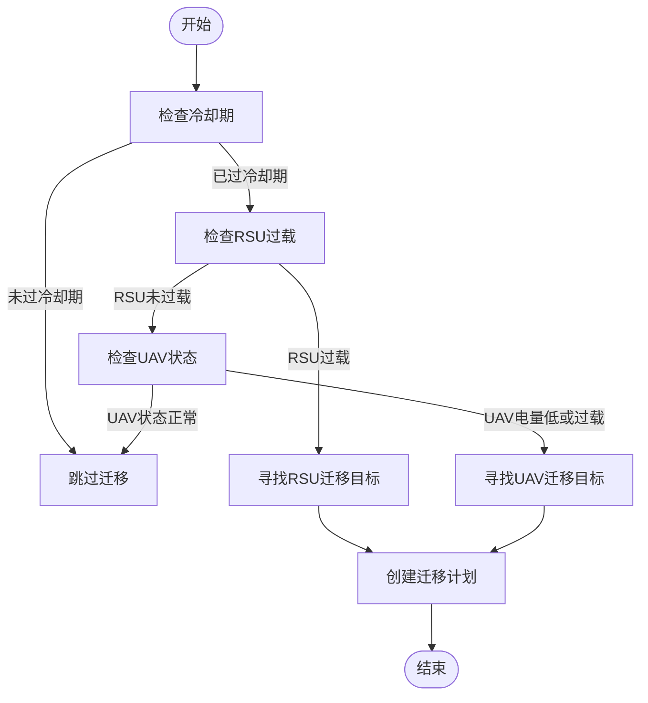
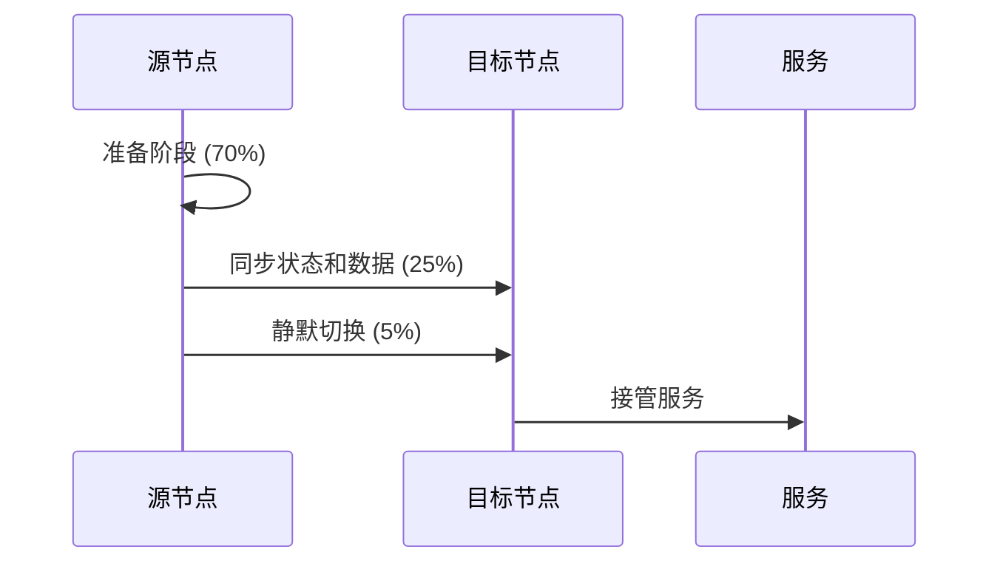
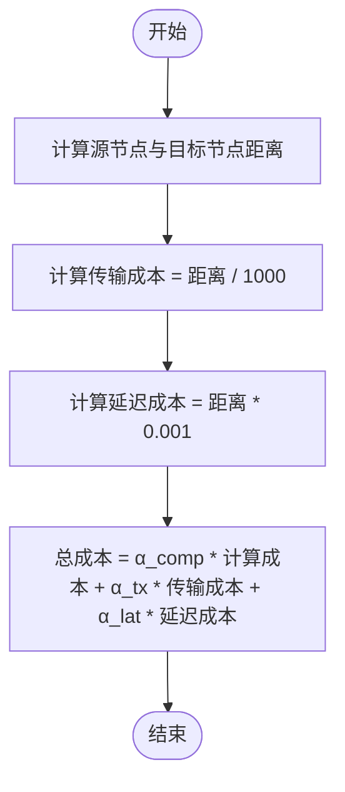

# 迁移管理

<cite>
**本文档中引用的文件**   
- [migration_manager.py](file://migration/migration_manager.py)
- [system_config.py](file://config/system_config.py)
- [models.py](file://communication/models.py)
- [data_structures.py](file://models/data_structures.py)
- [enhanced_migration.py](file://utils/enhanced_migration.py)
</cite>

## 目录
1. [引言](#引言)
2. [迁移决策机制](#迁移决策机制)
3. [Keep-Before-Break迁移流程](#keep-before-break迁移流程)
4. [状态同步与数据传输](#状态同步与数据传输)
5. [与通信模型的协同](#与通信模型的协同)
6. [性能优化策略](#性能优化策略)
7. [动态环境适应性](#动态环境适应性)
8. [故障恢复机制](#故障恢复机制)
9. [结论](#结论)

## 引言

迁移管理模块是车联网边缘计算（VEC）系统中的关键组件，负责在动态网络环境中实现任务的无缝迁移。该模块通过Keep-Before-Break机制确保迁移过程中的服务质量（QoS）连续性，有效应对RSU过载、UAV电量不足等挑战。本文档深入解析迁移管理器的设计与实现，重点阐述其工作原理、决策机制和优化策略。

## 迁移决策机制

迁移决策机制是迁移管理的核心，负责确定何时以及如何进行任务迁移。该机制基于多种触发条件和目标节点选择算法，确保迁移决策的合理性和高效性。

### 触发条件

迁移决策的触发条件主要包括节点过载和资源不足。对于RSU，当负载因子超过配置的过载阈值（`rsu_overload_threshold`）时，触发迁移。对于UAV，当电池电量低于最低阈值（`uav_min_battery`）或负载因子超过UAV过载阈值（`uav_overload_threshold`）时，触发迁移。此外，系统还实现了冷却期管理，防止节点在短时间内频繁迁移，冷却期由`cooldown_period`参数控制。

**图源**
- [migration_manager.py](file://migration/migration_manager.py#L66-L96)

### 目标节点选择算法

目标节点选择算法旨在为源节点找到最佳的迁移目标。对于RSU，候选目标包括其他负载较低的RSU和电量充足、负载较低的UAV。对于UAV，主要迁移到负载较低的RSU。选择过程中，优先考虑距离最近的候选节点，以最小化迁移成本和延迟。

**迁移决策机制**
- [migration_manager.py](file://migration/migration_manager.py#L98-L129)

## Keep-Before-Break迁移流程

Keep-Before-Break迁移流程是确保迁移过程中服务连续性的关键机制。该流程通过三个阶段实现平滑切换，最大限度地减少服务中断时间。

### 三阶段迁移过程

1. **准备阶段**：占迁移总时延的70%，在此阶段，源节点和目标节点进行必要的准备工作，如资源预留和状态同步。
2. **同步阶段**：占迁移总时延的25%，在此阶段，源节点将任务状态和数据同步到目标节点。
3. **静默切换阶段**：占迁移总时延的5%，这是实际的中断时间（downtime），在此阶段，服务从源节点切换到目标节点。

**图源**
- [migration_manager.py](file://migration/migration_manager.py#L174-L205)

### 会话保持策略

会话保持策略通过最小化静默切换阶段的时长来确保QoS的连续性。迁移计划中的`downtime`字段明确指定了中断时间，系统通过优化迁移时延和成功率来进一步减少中断。

**Keep-Before-Break迁移流程**
- [migration_manager.py](file://migration/migration_manager.py#L174-L205)

## 状态同步与数据传输

状态同步与数据传输是迁移过程中的核心环节，确保任务在目标节点上能够无缝继续执行。

### 状态同步机制

状态同步机制在同步阶段执行，源节点将任务的执行状态（如计算进度、内存状态等）传输到目标节点。该过程依赖于通信模型提供的可靠传输通道，确保状态信息的完整性和一致性。

### 数据传输优化

数据传输优化通过计算迁移成本来实现。迁移成本由计算成本、传输成本和延迟成本加权求和得到，权重由`migration_alpha_comp`、`migration_alpha_tx`和`migration_alpha_lat`参数控制。系统优先选择成本最低的迁移路径。

**图源**
- [migration_manager.py](file://migration/migration_manager.py#L131-L172)

**状态同步与数据传输**
- [migration_manager.py](file://migration/migration_manager.py#L131-L172)

## 与通信模型的协同

迁移管理模块与通信模型紧密协同，确保迁移过程中的数据传输高效可靠。

### 通信模型集成

迁移管理器利用通信模型计算信道状态、SINR和数据速率，从而准确评估迁移时延和成功率。通信模型提供的`calculate_transmission_delay`方法用于计算数据传输的总时延，包括传输时延、传播时延和处理时延。

### QoS连续性保障

通过与通信模型的协同，迁移管理器能够动态调整迁移策略，以适应信道条件的变化。例如，当信道质量较差时，系统可能选择更可靠的迁移路径或推迟迁移，以保障QoS的连续性。

**与通信模型的协同**
- [models.py](file://communication/models.py#L25-L226)
- [migration_manager.py](file://migration/migration_manager.py#L131-L172)

## 性能优化策略

性能优化策略旨在降低迁移延迟、减少丢包率，并提高整体系统效率。

### 迁移延迟优化

迁移延迟优化通过选择最优目标节点和优化数据传输路径实现。系统优先选择距离近、负载低的节点作为迁移目标，并利用高带宽信道进行数据传输。

### 丢包率优化

丢包率优化依赖于通信模型的可靠性评估。迁移管理器选择成功率高的迁移路径，成功率由距离和目标节点负载共同决定，计算公式为`max(0.5, 0.9 - distance / 10000.0)`。

**性能优化策略**
- [system_config.py](file://config/system_config.py#L209-L236)
- [migration_manager.py](file://migration/migration_manager.py#L131-L172)

## 动态环境适应性

动态环境适应性使迁移管理器能够应对车联网环境中的快速变化。

### 动态阈值调整

系统实现了动态阈值调整机制，根据网络负载情况动态调整迁移触发阈值。例如，当平均RSU负载较高时，降低`rsu_overload_threshold`以更积极地触发迁移。

### 多触发条件支持

除了负载和电量，系统还支持基于网络拥塞和主动优化的迁移触发条件，提高了迁移决策的灵活性和适应性。

**动态环境适应性**
- [enhanced_migration.py](file://utils/enhanced_migration.py#L136-L178)

## 故障恢复机制

故障恢复机制确保在迁移失败时系统能够快速恢复并重新尝试迁移。

### 成功概率评估

迁移管理器在执行迁移前评估成功率，成功率受距离和目标节点负载影响。如果成功率低于阈值，系统可能选择其他目标节点或推迟迁移。

### 冷却期管理

冷却期管理防止节点在迁移失败后立即再次尝试迁移，给系统留出恢复时间。冷却期结束后，系统重新评估迁移需求。

**故障恢复机制**
- [migration_manager.py](file://migration/migration_manager.py#L174-L205)
- [enhanced_migration.py](file://utils/enhanced_migration.py#L434-L467)

## 结论

迁移管理模块通过Keep-Before-Break机制和智能决策算法，有效实现了车联网边缘计算环境中的任务无缝迁移。该模块与通信模型紧密协同，确保了迁移过程中的QoS连续性，并通过多种优化策略提高了系统性能和适应性。未来的工作可以进一步优化动态阈值调整算法，以更好地应对复杂多变的车联网环境。