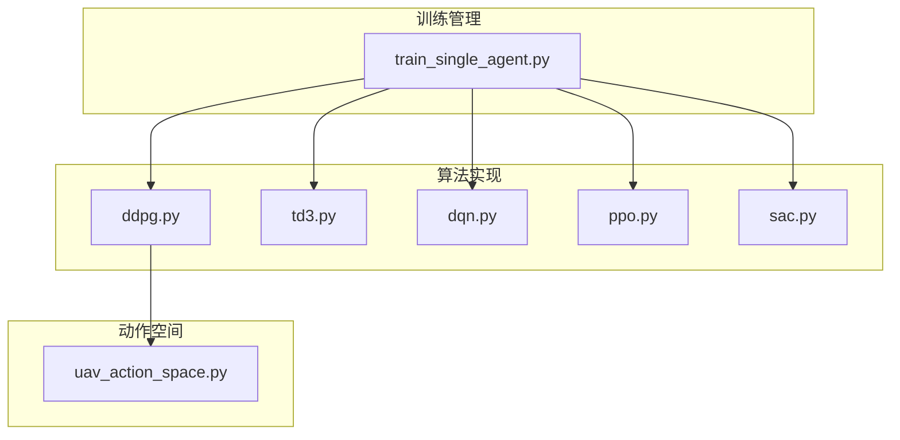
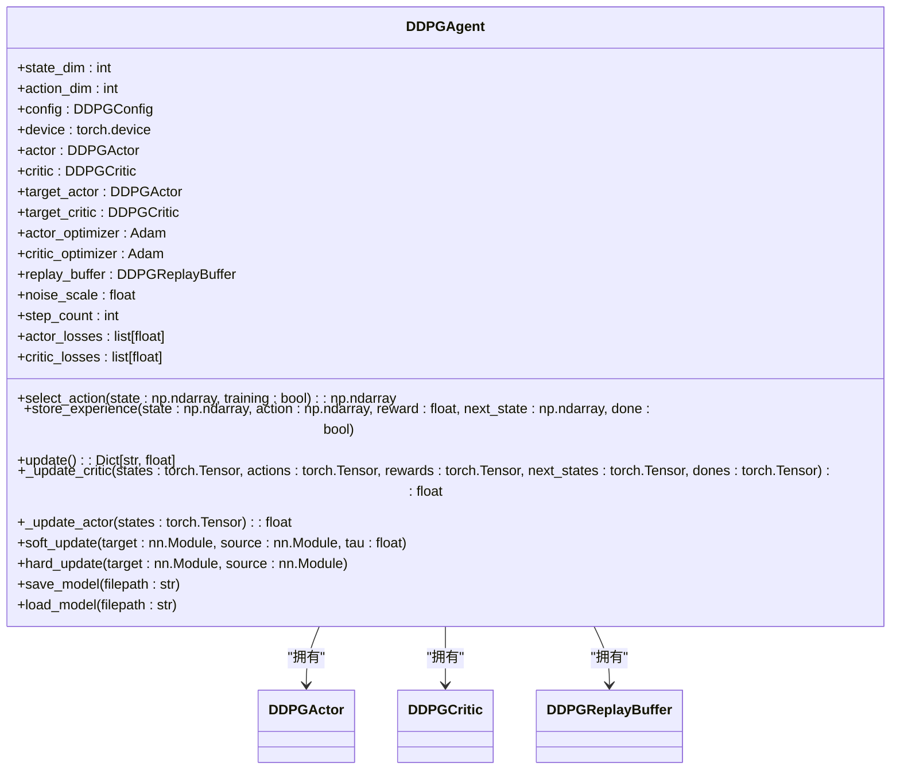
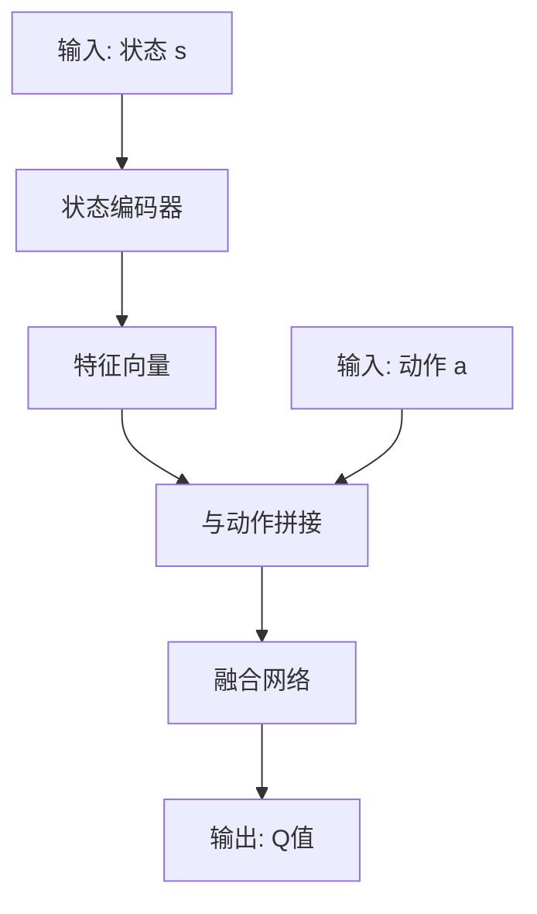
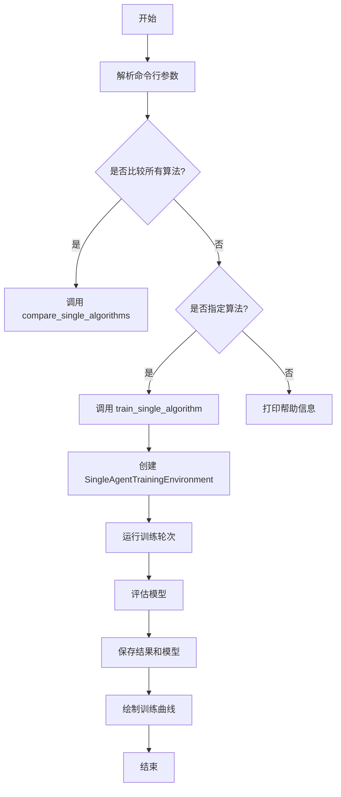
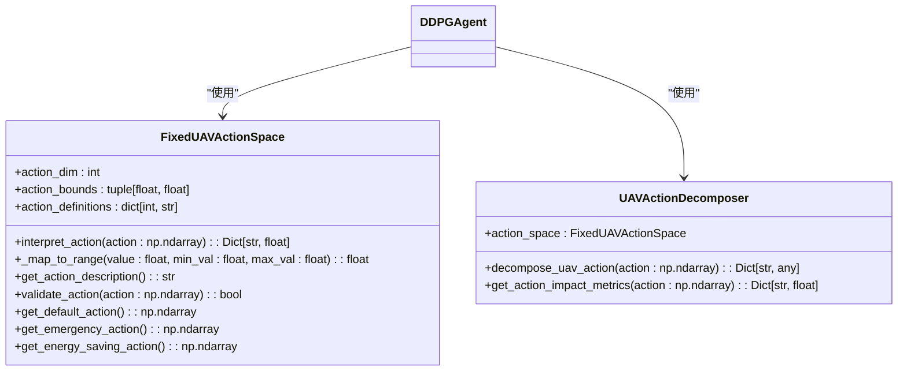
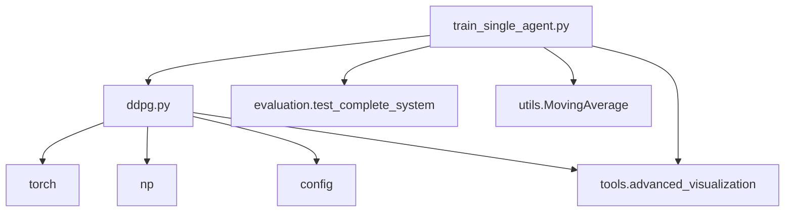

# DDPG算法

<cite>
**本文档引用的文件**   
- [ddpg.py](file://single_agent/ddpg.py)
- [train_single_agent.py](file://train_single_agent.py)
- [uav_action_space.py](file://algorithms/uav_action_space.py)
</cite>

## 目录
1. [引言](#引言)
2. [项目结构](#项目结构)
3. [核心组件](#核心组件)
4. [架构概述](#架构概述)
5. [详细组件分析](#详细组件分析)
6. [依赖分析](#依赖分析)
7. [性能考量](#性能考量)
8. [故障排除指南](#故障排除指南)
9. [结论](#结论)

## 引言
DDPG（Deep Deterministic Policy Gradient）是一种基于Actor-Critic框架的深度强化学习算法，专为连续动作空间设计。本文档详细分析了该算法在车联网边缘计算（VEC）环境中的实现，重点阐述其在`single_agent/ddpg.py`中的具体实现，包括经验回放、目标网络软更新机制、探索噪声策略及其与`uav_action_space.py`中定义的动作空间集成方式。同时，结合`train_single_agent.py`说明训练配置流程，并讨论其在高动态节点环境下的性能局限性及收敛技巧。

## 项目结构
项目采用模块化设计，将算法、训练、环境模拟和工具分离。DDPG算法实现在`single_agent/`目录下，而训练流程由`train_single_agent.py`统一管理。UAV的专用动作空间定义在`algorithms/`目录中，体现了功能的清晰划分。



**Diagram sources**
- [ddpg.py](file://single_agent/ddpg.py)
- [train_single_agent.py](file://train_single_agent.py)
- [uav_action_space.py](file://algorithms/uav_action_space.py)

**Section sources**
- [ddpg.py](file://single_agent/ddpg.py)
- [train_single_agent.py](file://train_single_agent.py)
- [uav_action_space.py](file://algorithms/uav_action_space.py)

## 核心组件
DDPG算法的核心组件包括`DDPGAgent`、`DDPGActor`、`DDPGCritic`、`DDPGReplayBuffer`和`DDPGEnvironment`。这些组件协同工作，实现了Actor-Critic框架下的确定性策略梯度方法。

**Section sources**
- [ddpg.py](file://single_agent/ddpg.py#L175-L458)

## 架构概述
DDPG算法采用经典的Actor-Critic双网络架构。Actor网络负责生成确定性策略，输出连续动作；Critic网络则评估该动作的Q值。通过引入目标网络（Target Network）和经验回放（Experience Replay）机制，有效提升了训练的稳定性。

```mermaid
graph LR
A[状态 s] --> B[Actor网络]
B --> C[动作 a]
C --> D[Critic网络]
D --> E[Q值 Q(s,a)]
A --> D
F[经验回放缓冲区] --> D
G[目标网络] --> D
H[探索噪声] --> C
```

**Diagram sources**
- [ddpg.py](file://single_agent/ddpg.py#L55-L129)
- [ddpg.py](file://single_agent/ddpg.py#L132-L172)

## 详细组件分析

### DDPG智能体分析
`DDPGAgent`是算法的核心，负责协调Actor、Critic、目标网络和经验回放缓冲区。

#### 类图


**Diagram sources**
- [ddpg.py](file://single_agent/ddpg.py#L175-L344)

#### 更新流程序列图
```mermaid
sequenceDiagram
participant Agent as DDPGAgent
participant Buffer as ReplayBuffer
participant Critic as Critic网络
participant Actor as Actor网络
participant TargetCritic as 目标Critic
participant TargetActor as 目标Actor
Agent->>Buffer : 采样批次
Buffer-->>Agent : batch_states, batch_actions, ...
loop 更新Critic
Agent->>TargetActor : 计算 next_actions
TargetActor-->>Agent : next_actions
Agent->>TargetCritic : 计算 target_q
TargetCritic-->>Agent : target_q
Agent->>Critic : 计算 current_q
Critic-->>Agent : current_q
Agent->>Critic : 计算 critic_loss 并反向传播
end
loop 更新Actor
Agent->>Actor : 计算 actions
Actor-->>Agent : actions
Agent->>Critic : 计算 Q值
Critic-->>Agent : Q值
Agent->>Actor : 计算 actor_loss 并反向传播
end
Agent->>TargetActor : soft_update
Agent->>TargetCritic : soft_update
Agent->>Agent : 衰减 noise_scale
```

**Diagram sources**
- [ddpg.py](file://single_agent/ddpg.py#L235-L275)
- [ddpg.py](file://single_agent/ddpg.py#L277-L295)
- [ddpg.py](file://single_agent/ddpg.py#L310-L313)

**Section sources**
- [ddpg.py](file://single_agent/ddpg.py#L175-L344)

### 网络结构分析
DDPG的网络结构设计简洁高效，Actor和Critic网络均采用全连接层。

#### Actor网络
```mermaid
flowchart TD
A[输入: 状态 s] --> B[线性层 (state_dim -> hidden_dim)]
B --> C[ReLU]
C --> D[线性层 (hidden_dim -> hidden_dim)]
D --> E[ReLU]
E --> F[线性层 (hidden_dim -> action_dim)]
F --> G[Tanh]
G --> H[输出: 动作 a]
```

**Diagram sources**
- [ddpg.py](file://single_agent/ddpg.py#L55-L87)

#### Critic网络


**Diagram sources**
- [ddpg.py](file://single_agent/ddpg.py#L90-L129)

**Section sources**
- [ddpg.py](file://single_agent/ddpg.py#L55-L129)

### 训练配置流程分析
`train_single_agent.py`文件定义了DDPG算法的训练流程，从环境初始化到模型评估的完整过程。

#### 训练流程


**Diagram sources**
- [train_single_agent.py](file://train_single_agent.py#L545-L645)

**Section sources**
- [train_single_agent.py](file://train_single_agent.py#L545-L645)

### UAV动作空间集成分析
DDPG算法通过`uav_action_space.py`文件与UAV的专用动作空间进行集成，实现了对UAV的精细化控制。

#### 动作空间集成


**Diagram sources**
- [uav_action_space.py](file://algorithms/uav_action_space.py#L22-L74)
- [uav_action_space.py](file://algorithms/uav_action_space.py#L111-L145)

**Section sources**
- [uav_action_space.py](file://algorithms/uav_action_space.py#L22-L145)

## 依赖分析
DDPG算法的实现依赖于多个模块和外部库。核心依赖包括PyTorch用于神经网络计算，NumPy用于数值处理，以及项目内部的配置、仿真和工具模块。



**Diagram sources**
- [ddpg.py](file://single_agent/ddpg.py#L1-L44)
- [train_single_agent.py](file://train_single_agent.py#L1-L79)

## 性能考量
DDPG算法在VEC环境中面临高动态节点的挑战。其性能受探索噪声、学习率、缓冲区大小等超参数影响显著。在高动态环境下，策略可能因环境变化过快而失效，导致收敛困难。

**Section sources**
- [ddpg.py](file://single_agent/ddpg.py#L43-L82)

## 故障排除指南
DDPG训练中常见的问题包括过度估计偏差、训练不稳定和收敛缓慢。解决技巧包括：
1. **调整超参数**：适当减小`gamma`以关注短期奖励，增加`tau`以加快目标网络更新。
2. **噪声管理**：合理设置`noise_scale`和`noise_decay`，确保充分探索。
3. **梯度裁剪**：代码中已使用`torch.nn.utils.clip_grad_norm_`防止梯度爆炸。
4. **奖励设计**：使用`utils.standardized_reward`进行奖励标准化，避免奖励尺度问题。

**Section sources**
- [ddpg.py](file://single_agent/ddpg.py#L402-L405)
- [ddpg.py](file://single_agent/ddpg.py#L277-L295)

## 结论
本文档全面分析了DDPG算法在VEC环境中的实现。该实现基于Actor-Critic框架，利用经验回放和目标网络软更新机制，在连续动作空间中表现出色。通过与`uav_action_space.py`的集成，实现了对UAV的精细化控制。尽管存在过度估计偏差等局限性，但通过合理的超参数调整和训练技巧，可以有效提升其性能和稳定性。